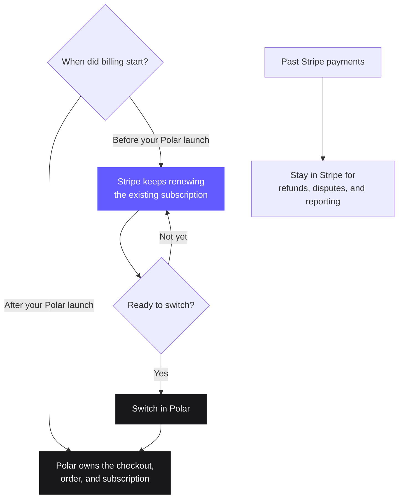

You do not need to move everything on one cutover day. Start by using Polar for
new sales while Stripe continues to renew existing subscriptions. Then prepare
and switch those subscriptions when they are ready.

The key idea is simple: **each subscription has one system responsible for its
next renewal**.

<Info>
Stripe migrations are rolling out gradually. If **Migrations** is not
available in your organization settings, [contact Polar support](/support).
</Info>

## Before you begin

The automated migration is designed for standalone Stripe accounts outside
India. Your Polar organization must be under review or active, and the mode of
your Stripe key must match the Polar environment: live for production or test
for sandbox.

You should also have:

- A complete Polar purchase tested from checkout through access and cancellation
- Access to the Stripe account that owns the subscriptions
- The Stripe account owner available to start the saved-card copy

Stripe Connect platform accounts and Stripe accounts in India cannot connect to
the automated flow. [Contact Polar support](/support) to discuss a different
migration path.

## How coexistence works

During the migration, new and existing customers can follow different billing
paths:



<Warning>
**Never let the same subscription renew in both systems.** Use the switch in
Polar to coordinate the change. Do not manually activate a matching Polar
subscription while the Stripe subscription can still renew.
</Warning>

## Plan your migration

The first and last stages happen in your application. The four stages in the
middle match the journey under **Settings → Migrations** in Polar.

<Steps>
  <Step title="Move new sales to Polar">
    **Goal:** Make Polar the billing system for every new customer.

    **What happens:** Integrate [Polar Checkout](/features/checkout/links),
    [webhooks](/integrate/webhooks/endpoints), and
    [customer state](/integrate/customer-state) into your application. New
    checkouts create their orders and subscriptions in Polar. Existing Stripe
    subscriptions continue renewing in Stripe.

    **Continue when:** You have tested a complete purchase, including access
    provisioning, renewal, and cancellation behavior.
  </Step>

  <Step title="Connect your Stripe account">
    **Goal:** Give Polar only the access needed to prepare and perform the
    migration.

    **What happens:** Create a restricted API key in Stripe and add it to your
    migration. Polar validates the account and permissions before reading any
    billing data.

    **Continue when:** Polar shows the Stripe account as connected. Nothing has
    moved and Stripe still owns every existing subscription.
  </Step>

  <Step title="Assess and import your catalog">
    **Goal:** Decide what can move and prepare the records those subscriptions
    need in Polar.

    **What happens:** Polar assesses your recurring products, prices, customers,
    and subscriptions. You review what is ready and what needs attention, then
    import your selection. Polar creates the required **products** and creates or
    reuses the required **customers**. It does not create Polar subscriptions or
    change Stripe billing yet.

    **Continue when:** Every subscription you plan to switch has its product and
    customer prepared in Polar. Leave unsupported subscriptions on Stripe until
    you resolve them or choose another path.
  </Step>

  <Step title="Move saved cards">
    **Goal:** Give Polar a payment method for the subscriptions it will renew.

    **What happens:** Follow the checklist in Polar to start an account-to-account
    copy in Stripe. Stripe sends saved card details directly to Polar's payment
    processor; they never pass through your application or the migration
    interface. Polar then checks which subscriptions have a usable card.

    **Continue when:** You have handled every subscription without a copied card.
    Ask those customers to add payment details again, leave them on Stripe, or
    run another copy before switching.
  </Step>

  <Step title="Switch billing to Polar">
    **Goal:** Make Polar responsible for future renewals of the subscriptions you
    select.

    **What happens:** Polar rechecks each selected subscription, prepares its
    matching Polar subscription, stops it on Stripe, and activates it in Polar
    with the same paid period. The next renewal happens in Polar; the customer is
    not charged again for time they already paid for.

    If a subscription renews within 24 hours, Polar leaves it on Stripe to avoid
    a billing conflict. A subscription already scheduled to end also stays there
    because there is no future renewal to take over.

    **Continue when:** Every selected subscription shows as moved, skipped, or
    failed, and every subscription left on Stripe has a clear next action.

    <Warning>
    Switching is not reversible. Review your selection before confirming it.
    </Warning>
  </Step>

  <Step title="Reconcile and clean up">
    **Goal:** Remove the old billing paths without losing access to historical
    records.

    **What happens:** Compare the migration result with your own customer and
    access records. Once every subscription has exactly one billing owner, remove
    old Stripe checkout paths, subscription webhooks, scheduled billing jobs, and
    unused secrets.

    **Done when:** New sales and moved subscriptions are managed in Polar, any
    exceptions are intentionally managed in Stripe, and your team knows where to
    handle support, refunds, and reporting.

    Keep your Stripe account available for past transactions. Historical Stripe
    payments do not become Polar orders.
  </Step>
</Steps>

## Plan your technical integration

Give this prompt to a coding assistant that can inspect your application. It
will propose an identity map, endpoint and webhook plan, reconciliation model,
and phased implementation before changing code.

Review its proposed identity map and cutover gates before asking it to
implement anything. Never paste Stripe or Polar secrets into a conversation.

````markdown title="Migration assistant prompt" icon="wand-magic-sparkles" expandable
# Plan a safe Stripe-to-Polar migration

You are a senior payments integration engineer helping migrate this
application from Stripe to Polar. Work from the codebase in the current
directory and current Polar documentation. Do not rely on memory for Polar
API details.

First produce a migration plan and reconciliation contract. Do not change
code, create resources, cancel subscriptions, or start a cutover until the
user reviews and approves that plan.

## Objective

Design a progressive migration in which:

1. New sales use Polar first.
2. Existing Stripe subscriptions keep renewing in Stripe while products and
   customers are imported into Polar.
3. Saved cards move through Stripe's secure account-to-account process.
4. Selected subscriptions switch through Polar's migration flow.
5. Each subscription has exactly one system responsible for its next renewal.
6. The application can reconcile customers, subscriptions, orders, access,
   and historical transactions across both systems.

## Sources of truth

Before recommending an endpoint, SDK method, webhook, field, or scope:

1. Read https://polar.sh/docs/migrate.
2. For JavaScript or TypeScript, read:
   https://raw.githubusercontent.com/polarsource/skills/main/skills/polar-integration/SKILL.md
   For other languages, use the current language SDK and OpenAPI docs.
3. Use https://polar.sh/docs/llms.txt to find the current API reference page
   for every Polar operation you recommend.
4. Inspect installed Polar SDK types when available.

Current documentation and generated SDK types override this prompt and your
training data. If you cannot verify an API detail, label it as unverified and
ask for the missing context. Never invent IDs, URLs, fields, event names, or
capabilities.

Merchant migration REST endpoints exist under `/v1/merchant-migrations`, but
are excluded from Polar's public OpenAPI schema, SDKs, and API reference. They
are dashboard-internal, not a merchant integration API. Use **Settings →
Migrations** for assessment, card transfer, and cutover.

## Safety rules

- Never expose, print, log, or commit Stripe or Polar secrets.
- Never ask the user to paste secrets into chat.
- Never handle raw card data.
- Never stop, cancel, or pause Stripe billing, or activate a migrated Polar
  subscription, outside Polar's switch. Refuse DIY cutover scripts.
- Never treat webhooks as exactly-once delivery. Verify signatures, persist
  the Standard Webhooks `webhook-id`, and make handlers idempotent.
- Never use email as the durable cross-system identity.
- Never overwrite a Polar Customer `external_id`. It is unique within an
  organization and cannot be changed once set.
- Never store card details, secrets, or sensitive personal data in metadata.
- Historical Stripe payments remain in Stripe. Never manufacture Polar orders
  for transactions Polar did not process.
- Polar must enable Migrations for the organization.
- Stripe Connect platform accounts and Stripe accounts in India cannot use
  the automated flow. Direct those merchants to Polar support.
- Switching is irreversible. Subscriptions renewing within about 24 hours
  stay on Stripe to avoid a billing conflict.
- Real card copies require live Stripe accounts. Sandbox verifies application
  behavior but cannot copy real cards.
- The Stripe key mode must match Polar: live for production, test for sandbox.
  Use only the restricted permissions in the current migration guide.

## Phase 1: discover the current integration

Inspect and report:

- Framework, language, package manager, apps, and deployment boundaries
- Authentication and the canonical user, account, workspace, or tenant ID
- Whether billing belongs to a person, a team, or both
- Stripe checkout, portal, customer, subscription, product, price, webhook,
  scheduled-job, and entitlement code
- Database tables that store Stripe IDs or billing state
- Webhook verification, deduplication, retries, and dead-letter behavior
- How the application grants and revokes access
- Which system owns refunds, disputes, cancellations, invoices, and support
- Trials, discounts, quantities, multiple items, manual invoices, metered
  prices, pauses, non-card methods, or Connect accounts

Search for Stripe SDK calls, environment variables, webhook event strings,
provider IDs, and access checks. Ask only what the repository cannot answer.

Resolve these questions before proposing changes:

1. What immutable internal ID represents the billable customer?
2. Can one customer have multiple Stripe customers or subscriptions?
3. Must access continue when either Stripe or Polar owns the subscription?
4. Which subscriptions should remain on Stripe?
5. Is this Polar sandbox or production?

## Phase 2: define the identity contract

Use the application's immutable billable-customer ID as the Polar Customer
`external_id`. For new Checkout Sessions, pass that value as
`external_customer_id`; the resulting Customer exposes it as `external_id`.
Do not use a Stripe customer ID unless it is already the application's
canonical identity.

For new Polar checkouts:

- Send `external_customer_id`.
- Use checkout `metadata` only for values belonging on the resulting order or
  subscription.
- Use `customer_metadata` only for values belonging on the customer.
- Prefer stable keys such as `app_account_id`, `migration_batch_id`, and
  `source_system`.
- Keep canonical relationships in the application database. Metadata is
  context, not the primary relational store.

Imported customers do not automatically receive the application's external
ID, and Polar's public Customer API does not expose the imported Stripe
customer ID. Before import, capture each Stripe customer ID, normalized email,
and application customer ID. After import, use exact email only for a one-time
match when it is unique on both sides. Require review for missing, duplicate,
or changed emails.

For a Polar Customer whose `external_id` is null, verify the current API and
set it to the application's canonical ID through
`PATCH /v1/customers/{id}`. Then use the external-ID lookup and state
endpoints. Never overwrite an existing external ID.

Treat skipped customers and Stripe-ID conflicts as unresolved. Never assume a
completed import mapped every selected customer.

Adapt the following mapping model to the existing database instead of creating
duplicate tables.

### Billing customer map

- Canonical application customer ID
- Stripe customer ID
- Polar customer ID and external ID
- Migration batch and mapping status
- Verification timestamp and actor

### Billing catalog map

- Canonical internal plan or SKU
- Stripe product and price IDs
- Polar product and price IDs
- Interval, currency, and amount used for verification
- Migration batch, mapping status, and verification timestamp

Imported Polar products do not publicly expose their source Stripe product or
price IDs. Never join catalogs by name alone.

### Billing subscription map

- Canonical internal subscription or entitlement ID
- Stripe and Polar subscription IDs
- `billing_owner`: stripe or polar
- Migration status: pending, ready, switching, moved, skipped, or failed
- Current period boundaries, last verification, batch, and last error

### Webhook receipt

- Provider and environment
- Standard Webhooks `webhook-id` with a unique constraint
- Event type and object ID
- Received, processed, and failed timestamps
- Attempt count and last error

Never deduplicate on `data.id`; it identifies the resource, so legitimate
updates can share it.

## Phase 3: recommend Polar integration points

Verify exact paths, SDK methods, and scopes in current docs before generating
code. Recommend only what the application needs.

### New checkout path

- Create Polar Checkout Sessions through the current Checkout API or SDK.
- Pass `external_customer_id`, checkout `metadata`, and `customer_metadata`
  according to the identity contract.
- Redirect to Polar's hosted checkout URL.

### Customer lookup and access

- Get Customer and Customer State by external ID after mapping.
- Update by Polar ID only when assigning an external ID for the first time.
- Expect `customers:read` for lookup and `customers:write` for mapping, but
  verify current scopes.

### Webhooks

Select the smallest event set that fits the access model:

- `customer.state_changed` for consolidated subscriptions and benefits
- `order.paid` for successful fulfillment
- `order.refunded` for refund-driven behavior
- `subscription.updated` as a catch-all, or narrower lifecycle events when
  distinct transitions matter
- `benefit_grant.created`, `benefit_grant.updated`, and
  `benefit_grant.revoked` only when Polar benefits directly drive access

Never treat `checkout.created` or `order.created` as proof of payment. Avoid
granting the same entitlement from several events unless one idempotent domain
operation owns the decision.

Every handler needs signature verification, `webhook-id` deduplication,
object-level idempotency, out-of-order handling, retries, dead-letter behavior,
safe logging, and an API reconciliation fallback.

At migration cutover, expect:

- `subscription.updated` when the imported subscription activates
- `customer.state_changed` asynchronously after activation
- Relevant `benefit_grant.*` events
- `order.paid` when the first Polar renewal succeeds

Do not expect `subscription.created`, `subscription.active`,
`product.created`, or `customer.created` from migration, and do not invent a
`merchant_migration.*` webhook.

## Phase 4: design coexistence and reconciliation

Model billing ownership explicitly. Never infer it only from non-null IDs.

Before cutover:

- New customers use Polar.
- Existing subscriptions remain owned by Stripe.
- Access can accept a valid entitlement from either provider.
- Cancel, pause, resume, and plan changes route to the current billing owner.

During cutover:

- Freeze conflicting writes for the selected subscription.
- Use Polar's migration UI.
- Never mark `billing_owner = polar` from intent alone.
- Confirm the dashboard result, then reconcile with the public Subscriptions
  API.
- Match using the Polar ID or `metadata.stripe_subscription_id` when present.
- Compare status and current period boundaries before atomically changing
  ownership.
- Keep skipped or failed subscriptions owned by Stripe.

After cutover:

- Reconcile counts and IDs across the application, Stripe, and Polar.
- Verify no moved subscription can renew in Stripe.
- Verify every Polar subscription maps to one customer and entitlement.
- Verify paid periods, trial ends, and payment-method coverage.

Polar has no public migration-completed webhook. Treat the migration dashboard
as cutover truth and use documented public APIs and webhooks for application
state.

## Phase 5: define cleanup gates

Do not delete Stripe code because the first batch moved. Require:

- No new Stripe Checkout Sessions
- Exactly one recorded billing owner per subscription
- No moved Stripe subscription still renewable
- Both providers' webhooks understood during coexistence
- Scheduled jobs routed by owner or safely retired
- Support able to find transactions from either era
- Historical Stripe refunds and disputes still routed to Stripe
- Stripe history retained for accounting
- Credentials revoked only after final reconciliation

## Required output

Return:

1. Current architecture with file paths
2. Unknowns and blockers
3. Identity and catalog maps
4. Metadata contract
5. Endpoint plan with verified reference, scope, call site, and purpose
6. Webhook plan with local transition, idempotency key, and recovery
7. Phased implementation and cutover gates
8. Schema changes, backfills, uniqueness constraints, and rollback
9. Automated, sandbox, reconciliation, and failure testing
10. Risks: double billing, duplicate access, conflicts, missing cards, stale
    events, and premature cleanup

Label every recommendation as:

- **Observed** in this repository
- **Documented** in current Polar docs or SDK types
- **Proposed**

End with the smallest safe implementation slice. Wait for approval before
editing code or changing billing state.
````

## What customers experience

Most customers do not need to take action. Their current paid period remains
unchanged, and their next renewal happens in Polar after the switch.

For a subscription in a trial, Polar keeps the trial end date and takes over
billing when the trial ends.

Customers whose card cannot be copied need to add payment details again before
you switch them. A copied card can still fail on a future charge for the same
reasons as any other card. Polar identifies subscriptions without a usable card
so you can decide how to handle them.

Customers continue to find receipts, refunds, and disputes for past Stripe
payments through the experience you already provide. Polar only creates orders
for payments it processes.

## Migration details

<AccordionGroup>
  <Accordion title="Restricted Stripe key permissions">
    Create the restricted key for the Stripe account that owns the subscriptions
    you want to move. Use a live key for a production migration and a test key
    for a sandbox migration.

    Grant exactly these permissions:

    | Stripe resource | Access |
    | --- | --- |
    | Customers | Read |
    | Products | Read |
    | Prices | Read |
    | Subscriptions | Write |
    | Payment methods | Read |

    Set everything else to **None**. Subscription write access allows Polar to
    stop billing on Stripe during the switch.
  </Accordion>

  <Accordion title="Subscriptions that need attention">
    Polar shows why a record cannot move automatically. Common examples include:

    - Multiple subscription items or a quantity greater than one
    - Discounts
    - Manual invoice collection
    - Products without a supported recurring price in your organization's
      default currency, or with ambiguous prices
    - Past-due, unpaid, or paused subscriptions
    - Payment methods that cannot be copied

    A subscription that is not ready stays on Stripe. Resolve the issue and retry
    it later, or keep it on Stripe with a clear owner.

    Polar also rechecks subscriptions during the switch. Subscriptions renewing
    within 24 hours or already scheduled to end remain on Stripe at that point.
  </Accordion>

  <Accordion title="Saved card transfer">
    Only the owner of your Stripe account can start the account-to-account copy.
    In Polar, download the customer mapping file and copy the provided destination
    account ID into Stripe. After starting the copy, paste the Stripe migration
    ID (`migreq_…`) into Polar.

    Polar usually accepts the request within one business day. Stripe then moves
    the card data, usually within a few hours and sometimes up to 72 hours. Polar
    verifies the result and identifies subscriptions without a copied card.

  </Accordion>

  <Accordion title="Checklist for your application">
    Every integration is different. Before removing your Stripe code, confirm:

    - Which internal user or account maps to each Polar customer
    - Which webhook grants, changes, and revokes access
    - Where support looks up purchases made before and after the migration
    - Which system handles refunds and disputes for each transaction
    - Whether any job still creates Stripe Checkout Sessions, invoices, or
      subscriptions
    - How you monitor subscriptions intentionally left on Stripe

    Your application remains responsible for mapping customers and translating
    billing events into access to your product.
  </Accordion>
</AccordionGroup>

Need help planning the migration? [Contact Polar support](/support).
