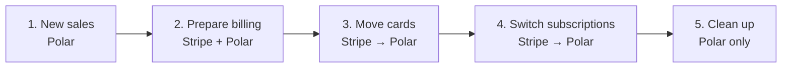
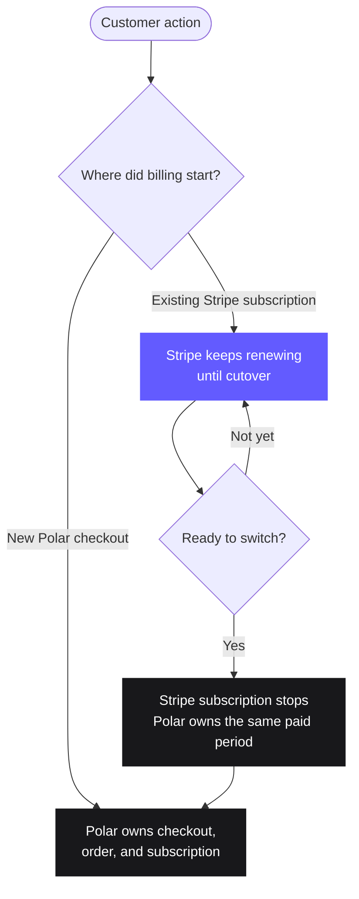

You do not need to move your entire billing system at once. A migration can run
in phases: send new business through Polar first, prepare your existing billing
in the background, and switch subscriptions only when they are ready.

<CardGroup cols={2}>
  <Card title="Migrating from Stripe" icon="arrow-right-arrow-left" href="#migrate-from-stripe">
    Move new sales first, then bring eligible recurring subscriptions to Polar.
  </Card>
  <Card title="Migrating from Lemon Squeezy" icon="store" href="#lemon-squeezy">
    Import supported store data with the `polar-migrate` CLI.
  </Card>
</CardGroup>

## Migrate from Stripe

The safest model is a **progressive migration**. Polar and your Stripe
integration coexist for a while, but each transaction has one system responsible
for it.

The five phases are described in detail below:



<Info>
Stripe migrations are being rolled out gradually. If **Migrations** is not
available in your organization settings, [contact Polar support](/support).
</Info>

### What moves, and what stays where

| Data | During coexistence | After cutover |
| --- | --- | --- |
| New checkouts and orders | Created in Polar from the moment you route new sales to Polar | Managed in Polar |
| Existing recurring products and prices | Read from Stripe and matched to the subscriptions that use them | Eligible records are represented in Polar |
| Existing customers | Read from Stripe and reconciled with Polar customers | Eligible customers are available in Polar |
| Existing subscriptions | Assessed and staged, but keep renewing on Stripe | Polar takes over future renewals for the subscriptions you switch |
| Saved card details | Stay in your Stripe account while the catalog is prepared | Copied securely to Polar's payment processor, which is also Stripe |
| Historical payments and order records | Stay in Stripe | Stay in Stripe for reporting, refunds, and disputes |

<Note>
**Historical Stripe payments do not become Polar orders.** Polar creates orders
for transactions it processes. Keep Stripe available for the history that Stripe
processed.
</Note>

### The migration in five phases

<Steps>
  <Step title="Route new sales through Polar">
    Integrate [Polar Checkout](/features/checkout/links),
    [webhooks](/integrate/webhooks/endpoints), and
    [customer state](/integrate/customer-state) into your application. From this
    point, every new checkout should create its order and any new subscription
    in Polar.

    Your existing Stripe subscriptions continue renewing in Stripe. This creates
    a deliberate coexistence period: Polar owns new business, while Stripe still
    owns the subscriptions that started there.

    Before continuing, verify at least one end-to-end purchase in Polar,
    including access provisioning and cancellation handling.
  </Step>

  <Step title="Assess and prepare existing billing">
    Connect your Stripe account with a restricted API key. Polar reads the
    recurring products and prices, customers, and subscriptions needed for the
    migration, then shows what can move and what needs attention.

    Review the proposed records, then import. Polar creates the **products and
    customers** that eligible subscriptions need. It does not create Polar
    subscriptions or change Stripe billing yet.

    Subscriptions with unsupported configurations remain on Stripe until you
    change them or handle them outside this flow. These include subscriptions
    with multiple items, discounts, manual invoice collection, unsupported
    prices, and some payment methods.
  </Step>

  <Step title="Move saved cards">
    In the Stripe Dashboard, start a secure account-to-account copy to Polar's
    Stripe account. Only the owner of your Stripe account can start the copy.
    Paste the Stripe migration ID into Polar so Polar can accept it.

    Stripe moves the card data after Polar accepts the request. This usually
    takes a few hours and can take up to 72 hours. Card details move directly
    between Stripe accounts; they never pass through your application or Polar's
    migration interface.

    Polar then checks which imported customers have a copied card. Ask customers
    without one to enter their payment details again, or run another copy before
    the switch.
  </Step>

  <Step title="Switch subscriptions">
    Review the result and choose the subscriptions to switch. For each successful
    switch, Polar prepares a matching Polar subscription, stops the Stripe
    subscription, and activates the Polar subscription with the same paid period.
    Its next renewal happens in Polar, and the customer is not charged again for
    the current period.

    Polar leaves a subscription on Stripe if switching it could be unsafe. For
    example, a subscription renewing within 24 hours or already scheduled to end
    stays on Stripe. Resolve the issue and retry it later.
  </Step>

  <Step title="After cutover: clean up your integration">
    Reconcile the result before removing code or credentials. Confirm that every
    subscription is owned by exactly one billing system and that nothing remains
    active in both.

    Once the remaining exceptions have a clear owner, remove the old Stripe
    checkout paths, subscription webhooks, scheduled billing jobs, and unused
    secrets. Keep the Stripe account and historical records available for
    refunds, disputes, and accounting related to past Stripe transactions.
  </Step>
</Steps>

### How coexistence works

The source of truth depends on when the customer entered your billing system:



This split avoids a big-bang change. It also creates one strict rule:

<Warning>
**Never let the same subscription renew in both systems.** Do not manually
activate a migrated subscription in Polar while its Stripe subscription is still
scheduled to renew. Use the migration switch to coordinate both changes and
report any subscription that needs attention.
</Warning>

### Before you start the Stripe cutover

- Confirm your Polar organization can create checkouts and renew subscriptions.
- Confirm new checkouts already create orders and subscriptions in Polar.
- Create a restricted key for the Stripe account that owns the existing
  customers and subscriptions. It needs read access to customers, products,
  prices, and payment methods, plus write access to subscriptions.
- Review custom Stripe behavior such as multiple subscription items, manual
  invoices, discounts, usage-based prices, or non-card payment methods.
- Decide which system your team should use for support, refunds, cancellations,
  and reporting during each phase.

<Note>
Stripe platform accounts with connected accounts, and Stripe accounts in India,
cannot use the automated card-copy path. [Contact Polar support](/support) to
discuss your migration.
</Note>

### What customers experience

Most customers do not need to take action. Their current paid period remains
unchanged, and their next renewal happens in Polar after the switch.

Some payment methods cannot be copied, and a copied card is not guaranteed to
succeed on its next charge. Polar identifies subscriptions without a copied card
so you can ask those customers to enter their payment details again before
switching them.

### Questions to answer for your implementation

Every billing integration is different. Before removing your Stripe code, make
sure you can answer:

- Which internal user or account ID maps to each Polar customer?
- Which webhook grants, changes, and revokes access?
- Where will support look up purchases made before and after the migration?
- Which system handles refunds and disputes for each historical transaction?
- Are any scheduled jobs still creating Stripe Checkout Sessions, invoices, or
  subscriptions?
- How will you monitor subscriptions that remain on Stripe after the first
  switch?

## Lemon Squeezy

Use the `polar-migrate` CLI to import supported data from an existing Lemon
Squeezy store.

### Get started

```bash Terminal
npx polar-migrate@latest
```

### Supported data

* Products & Variants
* License Keys
* Associated Files
* Discount Codes
* Customers

The tool cannot move **active subscriptions** from your Lemon Squeezy store.

### Open source

The CLI is [open source on GitHub](https://github.com/polarsource/polar-migrate).
