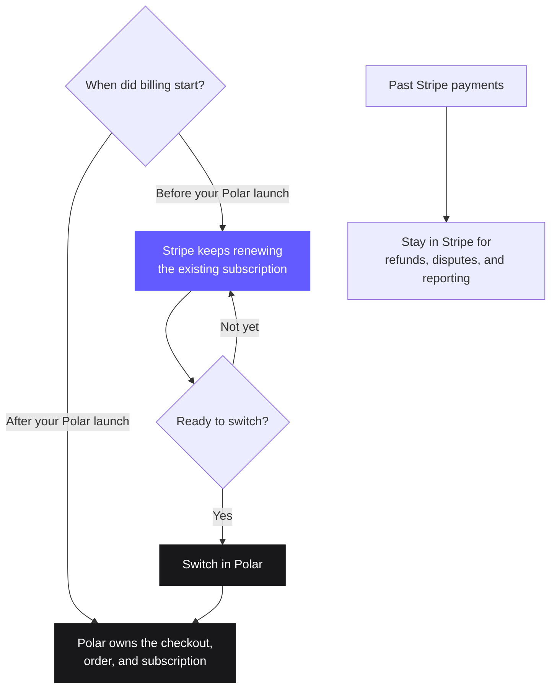

You do not need to move everything on one cutover day. Start by using Polar for
new sales while Stripe continues to renew existing subscriptions. Then prepare
and switch those subscriptions when they are ready.

The key idea is simple: **each subscription has one system responsible for its
next renewal**.

<Info>
Stripe migrations are rolling out gradually. If **Migrations** is not
available in your organization settings, [contact Polar support](/support).
</Info>

## Before you begin

The automated migration is designed for standalone Stripe accounts outside
India. Your Polar organization must be under review or active, and the mode of
your Stripe key must match the Polar environment: live for production or test
for sandbox.

You should also have:

- A complete Polar purchase tested from checkout through access and cancellation
- Access to the Stripe account that owns the subscriptions
- The Stripe account owner available to start the saved-card copy

Stripe Connect platform accounts and Stripe accounts in India cannot connect to
the automated flow. [Contact Polar support](/support) to discuss a different
migration path.

## How coexistence works

During the migration, new and existing customers can follow different billing
paths:

<Warning>
**Never let the same subscription renew in both systems.** Use the switch in
Polar to coordinate the change. Do not manually activate a matching Polar
subscription while the Stripe subscription can still renew.
</Warning>

## Plan your migration

The first and last stages happen in your application. The four stages in the
middle match the journey under **Settings → Migrations** in Polar.

<Steps>
  <Step title="Move new sales to Polar">
    **Goal:** Make Polar the billing system for every new customer.

    **What happens:** Integrate [Polar Checkout](/features/checkout/links),
    [webhooks](/integrate/webhooks/endpoints), and
    [customer state](/integrate/customer-state) into your application. New
    checkouts create their orders and subscriptions in Polar. Existing Stripe
    subscriptions continue renewing in Stripe.

    **Continue when:** You have tested a complete purchase, including access
    provisioning, renewal, and cancellation behavior.
  </Step>

  <Step title="Connect your Stripe account">
    **Goal:** Give Polar only the access needed to prepare and perform the
    migration.

    **What happens:** Create a restricted API key in Stripe and add it to your
    migration. Polar validates the account and permissions before reading any
    billing data.

    **Continue when:** Polar shows the Stripe account as connected. Nothing has
    moved and Stripe still owns every existing subscription.
  </Step>

  <Step title="Assess and import your catalog">
    **Goal:** Decide what can move and prepare the records those subscriptions
    need in Polar.

    **What happens:** Polar assesses your recurring products, prices, customers,
    and subscriptions. You review what is ready and what needs attention, then
    import your selection. Polar creates the required **products** and creates or
    reuses the required **customers**. It does not create Polar subscriptions or
    change Stripe billing yet.

    **Continue when:** Every subscription you plan to switch has its product and
    customer prepared in Polar. Leave unsupported subscriptions on Stripe until
    you resolve them or choose another path.
  </Step>

  <Step title="Move saved cards">
    **Goal:** Give Polar a payment method for the subscriptions it will renew.

    **What happens:** Follow the checklist in Polar to start an account-to-account
    copy in Stripe. Stripe sends saved card details directly to Polar's payment
    processor; they never pass through your application or the migration
    interface. Polar then checks which subscriptions have a usable card.

    **Continue when:** You have handled every subscription without a copied card.
    Ask those customers to add payment details again, leave them on Stripe, or
    run another copy before switching.
  </Step>

  <Step title="Switch billing to Polar">
    **Goal:** Make Polar responsible for future renewals of the subscriptions you
    select.

    **What happens:** Polar rechecks each selected subscription, prepares its
    matching Polar subscription, stops it on Stripe, and activates it in Polar
    with the same paid period. The next renewal happens in Polar; the customer is
    not charged again for time they already paid for.

    If a subscription renews within 24 hours, Polar leaves it on Stripe to avoid
    a billing conflict. A subscription already scheduled to end also stays there
    because there is no future renewal to take over.

    **Continue when:** Every selected subscription shows as moved, skipped, or
    failed, and every subscription left on Stripe has a clear next action.

    <Warning>
    Switching is not reversible. Review your selection before confirming it.
    </Warning>
  </Step>

  <Step title="Reconcile and clean up">
    **Goal:** Remove the old billing paths without losing access to historical
    records.

    **What happens:** Compare the migration result with your own customer and
    access records. Once every subscription has exactly one billing owner, remove
    old Stripe checkout paths, subscription webhooks, scheduled billing jobs, and
    unused secrets.

    **Done when:** New sales and moved subscriptions are managed in Polar, any
    exceptions are intentionally managed in Stripe, and your team knows where to
    handle support, refunds, and reporting.

    Keep your Stripe account available for past transactions. Historical Stripe
    payments do not become Polar orders.
  </Step>
</Steps>

## What customers experience

Most customers do not need to take action. Their current paid period remains
unchanged, and their next renewal happens in Polar after the switch.

For a subscription in a trial, Polar keeps the trial end date and takes over
billing when the trial ends.

Customers whose card cannot be copied need to add payment details again before
you switch them. A copied card can still fail on a future charge for the same
reasons as any other card. Polar identifies subscriptions without a usable card
so you can decide how to handle them.

Customers continue to find receipts, refunds, and disputes for past Stripe
payments through the experience you already provide. Polar only creates orders
for payments it processes.

## Migration details

<AccordionGroup>
  <Accordion title="Restricted Stripe key permissions">
    Create the restricted key for the Stripe account that owns the subscriptions
    you want to move. Use a live key for a production migration and a test key
    for a sandbox migration.

    Grant exactly these permissions:

    | Stripe resource | Access |
    | --- | --- |
    | Customers | Read |
    | Products | Read |
    | Prices | Read |
    | Subscriptions | Write |
    | Payment methods | Read |

    Set everything else to **None**. Subscription write access allows Polar to
    stop billing on Stripe during the switch.
  </Accordion>

  <Accordion title="Subscriptions that need attention">
    Polar shows why a record cannot move automatically. Common examples include:

    - Multiple subscription items or a quantity greater than one
    - Discounts
    - Manual invoice collection
    - Products without a supported recurring price in your organization's
      default currency, or with ambiguous prices
    - Past-due, unpaid, or paused subscriptions
    - Payment methods that cannot be copied

    A subscription that is not ready stays on Stripe. Resolve the issue and retry
    it later, or keep it on Stripe with a clear owner.

    Polar also rechecks subscriptions during the switch. Subscriptions renewing
    within 24 hours or already scheduled to end remain on Stripe at that point.
  </Accordion>

  <Accordion title="Saved card transfer">
    Only the owner of your Stripe account can start the account-to-account copy.
    In Polar, download the customer mapping file and copy the provided destination
    account ID into Stripe. After starting the copy, paste the Stripe migration
    ID (`migreq_…`) into Polar.

    Polar usually accepts the request within one business day. Stripe then moves
    the card data, usually within a few hours and sometimes up to 72 hours. Polar
    verifies the result and identifies subscriptions without a copied card.

  </Accordion>

  <Accordion title="Checklist for your application">
    Every integration is different. Before removing your Stripe code, confirm:

    - Which internal user or account maps to each Polar customer
    - Which webhook grants, changes, and revokes access
    - Where support looks up purchases made before and after the migration
    - Which system handles refunds and disputes for each transaction
    - Whether any job still creates Stripe Checkout Sessions, invoices, or
      subscriptions
    - How you monitor subscriptions intentionally left on Stripe

    Your application remains responsible for mapping customers and translating
    billing events into access to your product.
  </Accordion>
</AccordionGroup>

Need help planning the migration? [Contact Polar support](/support).
