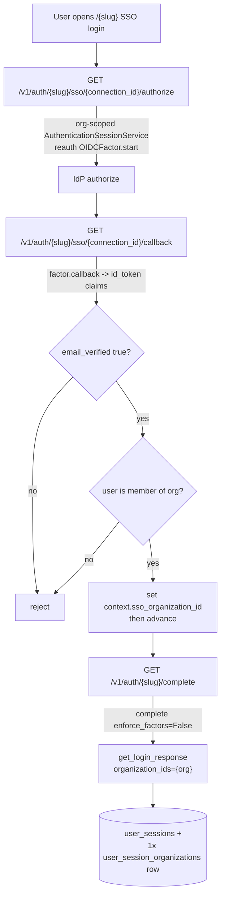

# Plan v2: Enterprise SSO with single-organization session scope

> Revised after @frankie567's review of #12591. The core change: org-slug-prefixed
> auth routes replace the "inject a dynamic factor into the global `get_factors`
> set" mechanism. That dissolves the fragile FastAPI-dependency-caching trick from
> v1 and naturally scopes everything to one organization.

## Context

Enterprise customers want their team to sign in through their own OIDC identity
provider and land **scoped to that one organization** — a contractor who also
belongs to other orgs must not be able to act on them from an SSO session.

The **read-path groundwork already shipped**: a `UserSession` can be down-scoped
via `user_session_organizations` rows; the auth middleware
(`polar/auth/middlewares.py:178`) turns those rows into
`AuthSubject.organization_ids`; every org-scoped query enforces it through
`select_user_org_ids(scoped_to=...)` (`polar/authz/repository.py:12`). **Nothing
writes scope rows yet.**

This plan is the **producer**: an OIDC SSO login that authenticates a user against
the org's IdP and mints a `UserSession` scoped to exactly that one org.

## What changed from v1 (review resolutions)

| v1 design | v2 resolution | Source |
| --- | --- | --- |
| Inject per-connection factor into static `get_factors` via FastAPI per-request dependency-identity caching | **Org-slug-prefixed routes** `/v1/auth/{slug}/...`; a dedicated `AuthenticationSessionService` is built per-org with that org's factors | review #1; lines 38, 163, 195 |
| `get_optional_sso_factor` for non-SSO requests | **Deleted.** On a slug route the context is always present | line 163 |
| Flat OIDC columns (`oidc_issuer`, `client_id`, `client_secret`) | Generic `type` enum (`oidc` only for now) + typed JSONB `configuration` | line 106 |
| One connection per org (unique FK) | **Multiple connections per org** — no unique constraint; each is its own factor | line 55 |
| `client_secret` plain column, only auth method | `auth_method` in `configuration`: `client_secret` **and** `private_key_jwt` (Okta pilot). `private_key_jwt` support added **upstream in reauth by @frankie567** | lines 23, 153 |
| Static factor `identifier = "sso"` | `identifier = {connection_id}` (dynamic; required for multiple-per-org) | line 149 |
| JIT provisioning (Phase 5) | **Cut from v1.** Out of scope; separate spec. v1 contract: user **must already be a member** — reject otherwise | review #2; line 110 |
| Domain table + DNS TXT verification + email-domain discovery (`POST /auth/sso`) | **Cut from v1.** Existed to power discovery + gate JIT, both gone. Entry point is the per-org slug URL | line 185 |
| `context` not persisted in `update()` | **Independent bug fix**, not part of this spec | line 44 |

**Identity binding (v1 contract, confirmed with Maxime):** an SSO-authenticated
user who is **not** a member of the org is **rejected**. JIT will ship before SSO
is advertised, so the "must pre-exist as a member" window never reaches GA.

## Flow

The org slug in the URL is the single source of org context across every request
(authorize → IdP → callback → complete), so nothing needs to be "remembered"
between the redirect hops.

---

## Phase 0 — Independent prerequisite (separate PR)

Persist `context` in `AuthenticationSessionService.update()`
(`polar/auth/authentication_session.py:78`) — add `context=authentication_session.context`
to `.values(...)`. @frankie567 flagged the v1 omission as a standalone bug; it ships
on its own so the SSO flow can carry `sso_organization_id` across the redirect.

**Blocked-on-upstream:** `private_key_jwt` auth method in `reauth` (@frankie567).
Phase 3's factor reads `auth_method` from `configuration` and delegates to reauth;
the `client_secret` path can ship without waiting, `private_key_jwt` lands when
reauth does.

## Phase 1 — Data model (migration-only PR, ships first)

Per repo convention, the migration lands before consuming code.

- **`polar/models/organization_sso_connection.py`** — `OrganizationSSOConnection(RecordModel)`:
  - `organization_id` (FK → `organizations.id`, **not unique**), `relationship(Organization)`.
  - `type: OrganizationSSOConnectionType` — enum, `oidc` only for now.
  - `configuration: <typed JSONB>` — Pydantic-validated, discriminated on `type`.
    For `oidc`: `issuer`, `client_id`, `auth_method` (`client_secret` | `private_key_jwt`),
    and `client_secret` **only when** `auth_method == client_secret` (plain string,
    per decision; encryption is a follow-up). `private_key_jwt` stores no secret —
    signing uses Polar's existing JWKS.
  - `enabled: bool`.
- Register in `polar/models/__init__.py` (import + `__all__`, mirroring
  `UserSessionOrganization` at lines 101/212).
- Autogenerate: `uv run alembic revision --autogenerate -m "add organization SSO connection"`,
  review, `uv run alembic upgrade head`. **No code reads this model yet.**

No `OrganizationSSODomain`, no `SSOAccount` — both were JIT/discovery scaffolding,
cut from v1.

## Phase 2 — Connection config CRUD (`polar/sso/`)

New module following the repository/service/endpoints/schemas pattern
(`server/AGENTS.md`).

- **`repository.py`** — `OrganizationSSOConnectionRepository`:
  `list_by_organization`, `get_by_id`, `get_enabled_by_id` (for the login path).
- **`service.py`** — singleton `organization_sso_connection`: CRUD over connections.
  Validate `configuration` against the `type` on write. Never `session.commit()`.
- **`endpoints.py`** — routes under the **org id** path param so `AuthorizeOrgManage`
  (`polar/authz/dependencies.py:152`) applies directly:
  - `GET /v1/organizations/{id}/sso-connections` (list)
  - `POST /v1/organizations/{id}/sso-connections` (**User-only** write — `AuthorizeOrgManageUser`)
  - `GET|PATCH|DELETE /v1/organizations/{id}/sso-connections/{connection_id}`
  - Return ORM models via `response_model`; **never echo `client_secret`** (exclude
    from the read schema).
- **`schemas.py`** — create/update/read; typed `configuration` per `type`; read
  schema omits `client_secret`.
- Mount the router alongside the other org routers.
- **Feature gate** is implicit: SSO is reachable only if an `enabled` connection
  row exists for the org. No separate flag for v1.

## Phase 3 — Generic OIDC factor + org-scoped session service + login routes

### Factor

- **`polar/auth/oauth2/sso.py`** — `SSOFactor(OIDCFactorBase)`:
  - `identifier = str(connection.id)` (**dynamic**, per connection — lets one org
    carry several SSO factors and lets `advance` match by identity).
  - `__init__(self, session, state_service, connection)`: store `connection`; set
    `self.DISCOVERY_ENDPOINT = f"{connection.configuration.issuer}/.well-known/openid-configuration"`;
    `super().__init__(identifier=str(connection.id), client_id=connection.configuration.client_id, state_service=...)`.
  - Auth method dispatch from `connection.configuration.auth_method`:
    `client_secret` → `get_client_secret()` returns the stored secret;
    `private_key_jwt` → delegate to reauth's upstream asymmetric signing (Polar JWKS).
  - `get_profile` defers to the inherited OIDC userinfo impl.
  - **No storage/enrollment abstracts** (those backed `sso_account`, cut with JIT).

### Org-scoped factor set + session service

This is the heart of the v2 change. Fork the two static dependencies into
slug-scoped variants:

- **`get_org_factors(slug, ...)`** — resolve the org from `{slug}`; build the factor
  set = the existing static factors (`email_otp`, `totp`, `backup_codes`, `apple`,
  `github`, `google`) **∪** one `SSOFactor` per **enabled** connection on that org.
  Mirrors `get_factors` (`polar/auth/factors.py:277`) but org-aware.
- **`get_org_authentication_session_service(slug, session, factors=Depends(get_org_factors))`**
  — `return AuthenticationSessionService(session, factors)`. `__init__` already
  takes `factors` (`authentication_session.py:38`), so no reauth change needed — the
  service simply knows the org's SSO factors because we fed them in.

That's what makes `advance` accept the SSO factor natively: it's a real member of
the service's `factors` set, no per-request-identity caching trick.

### Login router (slug-prefixed)

New module modeled on `get_oauth_login_router` (`router.py`), mounted under
`/v1/auth/{slug}/`:

- `GET /v1/auth/{slug}/sso/{connection_id}/authorize` — load the enabled connection
  (404 via `ResourceNotFound` if missing/disabled/not on this org), build `SSOFactor`,
  `factor.start(...)` with state/PKCE/nonce (`OAuth2StateService`), set state cookie,
  redirect to the IdP.
- `GET /v1/auth/{slug}/sso/{connection_id}/callback` — `factor.callback(...)`; decode
  via `factor.get_id_token_claims(id_token)`:
  - require `email_verified is True`, else `PolarAuthRedirectionError`;
  - resolve the user by asserted email (`user_service.get_by_email`); if the user
    doesn't exist **or is not a member** of the org → **reject** (no JIT in v1);
  - set `context.sso_organization_id` then `advance` (Phase 4).
- Add `"sso"` to the `Factor` literal in `polar/auth/schemas.py:13` (used for the
  `polar_last_login_method` cookie in `complete`).
- Mount the SSO login router in `polar/auth/endpoints.py`.

> Note: `complete` must also resolve under the slug (`/v1/auth/{slug}/complete`) so
> it uses `get_org_authentication_session_service`. Either add a slug-scoped
> `complete` route or have the existing `complete` accept the slug — decide during
> implementation; the constraint is that `complete` sees the org's factor set.

## Phase 4 — Scoped session minting

- **`polar/auth/authentication_session.py`** — override `complete` to accept
  `enforce_factors: bool = True`; when `False`, skip the `get_available_factors` /
  `FactorsRemainingException` check (still require `identity_id`, still `delete`).
  Implements "SSO alone completes login" even for TOTP-enrolled users.
  (`context` persistence handled in Phase 0.)
- **SSO callback**, before `advance`:
  `authentication_session.context = {**(authentication_session.context or {}),
  "sso_organization_id": str(connection.organization_id)}`, then
  `advance(authentication_session, identity_id, factor)`.
- **`polar/auth/service.py`** — extend `_create_user_session` and
  `get_login_response` with `organization_ids: frozenset[UUID] | None = None`; when
  provided, create one `UserSessionOrganization` per id via
  `UserSession.organization_scopes`. Email/social logins pass nothing → unrestricted
  (unchanged).
- **`complete`** — read `context.get("sso_organization_id")`; when present, call
  `complete(..., enforce_factors=False)` and
  `get_login_response(..., organization_ids=frozenset({UUID(org_id)}))`. Assert
  exactly one scope row.

---

## Files

**Add:** `polar/models/organization_sso_connection.py`;
`polar/sso/{repository,service,endpoints,schemas}.py`; `polar/auth/oauth2/sso.py`;
the slug-prefixed SSO login router; Phase-1 Alembic revision.

**Modify:** `polar/models/__init__.py` (register model); `polar/auth/factors.py`
(`get_org_factors`); `polar/auth/authentication_session.py`
(`get_org_authentication_session_service`; `complete` `enforce_factors` flag);
`polar/auth/service.py` (`organization_ids` on session minting);
`polar/auth/endpoints.py` (mount router; slug-scoped `complete`);
`polar/auth/schemas.py` (`"sso"` in `Factor`).

**Independent PR (Phase 0):** `polar/auth/authentication_session.py` `update()`
persists `context`.

**Reuse as-is:** `OIDCFactor`/`OIDCFactorBase` (reauth), `OAuth2StateService`
(`polar/auth/oauth2/state.py`), `user_service.get_by_email`,
`AuthorizeOrgManage(User)`, the `user_session_organizations` read-path groundwork.

**Upstream dependency:** `private_key_jwt` auth method in `reauth` (@frankie567).

## Security

- Reject any SSO login where the user is not already a member (no JIT in v1).
- Require `email_verified` on the asserted identity.
- Reuse reauth state/nonce/PKCE replay protection (`OAuth2StateService`).
- Minted session scoped to exactly the connection's org (assert single scope row).
- `client_secret` plain column per decision; `private_key_jwt` stores no secret
  (encryption of secrets = follow-up).

## Non-goals (explicit follow-ups)

JIT provisioning, domain verification + email-domain discovery, `sso_enforced`
(making an org unreachable from non-SSO sessions), SAML, SCIM, multi-org SSO
sessions, the admin frontend, `client_secret` encryption, a "remember last org"
discovery mechanism.

## Verification

- **Unit** (`tests/sso/`): connection CRUD; `configuration` validation per `type`;
  `SSOFactor` discovery-URL construction + `id_token` validation against a **mock
  OIDC IdP** (local JWKS, signed `id_token` fixtures) for both `client_secret` and
  (once reauth lands) `private_key_jwt`.
- **Integration** (`tests/auth/`): full `/v1/auth/{slug}/sso/{connection_id}/authorize`
  → callback → `/v1/auth/{slug}/complete` against the mock IdP. Assert the resulting
  `UserSession` has **exactly one** `organization_scopes` row, and a second org the
  user belongs to is **not** accessible (extend `tests/auth/test_middlewares.py`).
  Assert a TOTP-enrolled member still completes via SSO alone (`enforce_factors=False`).
- **Negative:** non-member identity → rejected; `email_verified=false` → rejected;
  disabled/missing connection → 404; connection from a different org under this slug
  → 404.
- `uv run task test`, `uv run task lint && uv run task lint_types`,
  `uv run task lint_org_scope`.
