# Plan: Enterprise SSO with single-organization session scope

## Context

Enterprise customers want their team to sign in to Polar through their own
OIDC identity provider and land **scoped to that one organization** — a
contractor who also belongs to other orgs must not be able to act on them from
an SSO session.

The **read-path groundwork already shipped**: a `UserSession` can be down-scoped
via `user_session_organizations` rows; the auth middleware
(`polar/auth/middlewares.py:178`) turns those rows into
`AuthSubject.organization_ids`; and every org-scoped query enforces it through
`select_user_org_ids(scoped_to=...)` (`polar/authz/repository.py:12`). **Nothing
writes scope rows yet** — every session is currently unrestricted.

This plan is the **producer**: an OIDC SSO login that authenticates a user
against the org's IdP and mints a `UserSession` scoped to exactly that one org
(one `user_session_organizations` row).

## Key findings from exploration (these de-risk the design)

1. **`reauth` already ships a generic OIDC factor.** `reauth.factors.oauth2.oidc`
   provides `OIDCFactor` (and `OIDCFactorBase`): full discovery-doc + JWKS +
   `id_token` validation, parametrized only by `client_id`, `client_secret`, and
   `DISCOVERY_ENDPOINT`. `GoogleOAuth2Factor` is just `OIDCFactor` with a
   hardcoded discovery URL. **We do not build OIDC primitives** — we subclass
   `OIDCFactorBase`/`OIDCFactor` and feed it the connection's issuer.

2. **The "dynamic factor in a static set" problem is solvable without touching
   reauth.** `reauth`'s `advance()` (`reauth/authentication_session.py`) checks
   `factor in self.factors` by **object identity** (no `__eq__` on `FactorBase`),
   and `self.factors` comes from Polar's `get_factors` dependency
   (`polar/auth/factors.py:277`). FastAPI **caches dependency results per
   request**, so if both `get_factors` and the SSO router resolve the *same*
   `get_sso_factor` dependency, they share one instance and `advance` accepts it.
   We key the SSO factor off a `{connection_id}` path param so `get_factors` can
   conditionally include it (see Phase 3).

3. **One real groundwork gap:** Polar's `AuthenticationSessionService.update()`
   (`polar/auth/authentication_session.py:78`) does **not** persist `context`.
   We must add `context` to its `.values(...)` so we can carry
   `sso_organization_id` across the redirect to `GET /auth/complete` (which runs
   in a separate request and reloads the session from the DB).

4. **No at-rest encryption helper exists.** `slack_app.client_secret` and
   `oauth2_client.client_secret` are plain `String` columns.

## Decisions (confirmed with Maxime)

- **client_secret storage:** plain `String` column, matching existing precedent.
  Encryption is a hardening follow-up.
- **2FA interaction:** **SSO alone completes login** — after the SSO factor we
  bypass remaining-factor enforcement (see Phase 4), even if the user has TOTP.
- **Connections per org:** **one** — unique FK on `organization_id`, managed as a
  singleton at `/organizations/{id}/sso-connection`.
- **Identity binding:** match by IdP-asserted verified email, **plus** a small
  `sso_account` link table (`connection_id`, `idp_sub` → `user_id`) for stable
  binding + audit (reauth's enrollment path supports this naturally).
- **JIT role:** `member`.

## Flow & dependency shape

```mermaid
flowchart TD
    subgraph Config["Phase 1+2 (org admin)"]
      A[OrganizationSSOConnection<br/>+ verified domains] -->|AuthorizeOrgManage| B[CRUD + domain verify]
    end

    subgraph Login["Phase 3 login (per request)"]
      C[POST /auth/sso<br/>email -> resolve conn by domain] --> D[/auth/sso/&#123;conn&#125;/authorize/]
      D -->|reauth OIDCFactor.start| E[IdP authorize]
      E --> F[/auth/sso/&#123;conn&#125;/callback/]
      F -->|factor.callback -> id_token| G{email in verified domain?}
      G -- no --> X[reject]
      G -- yes --> H[JIT: get_by_email_or_create<br/>+ add_user role=member<br/>+ upsert sso_account]
      H -->|set context.sso_organization_id<br/>then advance| I[(authentication_sessions)]
    end

    subgraph Complete["Phase 4 mint scoped session"]
      I --> J[GET /auth/complete]
      J -->|complete enforce_factors=False| K[get_login_response<br/>organization_ids=&#123;org&#125;]
      K --> L[(user_sessions +<br/>1x user_session_organizations row)]
    end

    M[get_sso_factor dep<br/>reads &#123;conn&#125; path param] -.shared cached instance.-> D
    M -.included in.-> N[get_factors set]
    N -.-> F
```

`get_sso_factor` is the single dependency shared (via FastAPI per-request caching)
between `get_factors` and the SSO router — this is what makes `advance` accept the
per-connection factor.

---

## Phase 1 — Data model (migration-only PR, ships first)

Per repo convention, the migration lands before consuming code.

- **`polar/models/organization_sso_connection.py`** — `OrganizationSSOConnection(RecordModel)`:
  - `organization_id` (FK → `organizations.id`, **unique**, one per org),
    `relationship(Organization)`.
  - `oidc_issuer: str` (discovery built as `{issuer}/.well-known/openid-configuration`),
    `client_id: str`, `client_secret: str` (plain `String`, per decision),
    `enabled: bool`.
- **`polar/models/organization_sso_domain.py`** — `OrganizationSSODomain(Model)`:
  `(sso_connection_id, domain)` PK, `verification_token: str`,
  `verified_at: datetime | None`. A domain is usable for JIT only when
  `verified_at` is set.
- **`polar/models/sso_account.py`** — `SSOAccount(RecordModel)`:
  `sso_connection_id` (FK), `account_id: str` (IdP `sub`), `user_id` (FK),
  unique `(sso_connection_id, account_id)`. Stable identity binding + audit.
- Register all three in `polar/models/__init__.py` (import + `__all__`, mirroring
  `UserSessionOrganization` at lines 101/212).
- Autogenerate: `uv run alembic revision --autogenerate -m "add organization SSO models"`,
  review, `uv run alembic upgrade head`. **No code reads these models yet.**

## Phase 2 — Connection config + domain verification (`polar/sso/`)

New module following the repository/service/endpoints/schemas pattern
(`server/AGENTS.md`).

- **`repository.py`** — `OrganizationSSOConnectionRepository` (`get_by_organization`,
  `get_by_verified_domain(domain)` joining verified `OrganizationSSODomain`),
  `SSOAccountRepository` (`get_by_connection_and_account_id`, upsert).
- **`service.py`** — singleton `organization_sso_connection`: CRUD; domain add
  (issue `verification_token`), `verify_domain` (DNS TXT lookup → set
  `verified_at`). Use `enqueue_job` for any async work; never `session.commit()`.
- **`endpoints.py`** — singleton routes under the **org id** path param so
  `AuthorizeOrgManage` (`polar/authz/dependencies.py:152`, resolves `{id}`,
  enforces `org_policy.can_manage` = admin-only) applies directly:
  - `GET /v1/organizations/{id}/sso-connection`
  - `PUT /v1/organizations/{id}/sso-connection` (upsert; **User-only** write —
    use `AuthorizeOrgManageUser`)
  - `DELETE /v1/organizations/{id}/sso-connection`
  - `POST /v1/organizations/{id}/sso-connection/domains` + verify endpoint.
  Return ORM models via `response_model`; never echo `client_secret` back
  (exclude from the read schema).
- **`schemas.py`** — create/update/read schemas; read schema omits `client_secret`.
- Mount the router where other API routers are registered (alongside
  `polar/organization/endpoints.py` registration).
- **Feature gate** is implicit: SSO is reachable only if a connection row exists
  and is `enabled`; no separate flag needed for v1.

## Phase 3 — Generic OIDC factor + login endpoints

- **`polar/auth/oauth2/sso.py`** — `SSOFactor(OIDCFactorBase)`:
  - `identifier = "sso"`, inherits `AMR = OAUTH2`, `step = 0`.
  - `__init__(self, session, state_service, connection)`: store `connection`; set
    instance attr `self.DISCOVERY_ENDPOINT = f"{connection.oidc_issuer}/.well-known/openid-configuration"`;
    `super().__init__(identifier="sso", client_id=connection.client_id, state_service=...)`.
  - `get_client_secret()` → `self.connection.client_secret`.
  - Implement the storage abstracts against `sso_account` keyed by
    `self.connection.id` (mirror `OAuth2FactorMixin` in `factor.py`, but use
    `SSOAccount`/connection_id instead of `OAuthAccount`/platform enum):
    `get_enrollment`, `insert`, `update`, `get_enrollment_by_provider_and_account`.
    `get_profile` may defer to the inherited OIDC userinfo impl.
  - `get_sso_factor(request, session, state_service)` dependency: read
    `request.path_params["connection_id"]`, load the enabled connection (404 via
    `ResourceNotFound` if missing/disabled), construct `SSOFactor`. Add an
    `get_optional_sso_factor` variant returning `None` when no `connection_id` in
    `path_params`.
- **`polar/auth/factors.py`** — add `sso_factor: SSOFactor | None =
  Depends(get_optional_sso_factor)` to `get_factors` and include it in the set
  when not `None`. (On non-SSO requests `path_params` has no `connection_id` →
  `None` → set unchanged.)
- **New SSO router** (own module, modeled on `get_oauth_login_router` in
  `router.py`, but with `{connection_id}` in the authorize/callback paths so the
  shared factor instance resolves):
  - `POST /auth/sso` — body `{email}`: resolve connection by verified email
    domain (`get_by_verified_domain`); 404 if none; redirect (303) to
    `/auth/sso/{connection_id}/authorize`. (Discovery-by-domain = the one-click UX.)
  - `GET /auth/sso/{connection_id}/authorize` — `_check_factor` + `factor.start(...)`
    with state/PKCE/nonce (reuse `OAuth2StateService`), set state cookie, redirect.
  - `GET /auth/sso/{connection_id}/callback` — `factor.callback(...)`; on the
    signup branch decode claims via `factor.get_id_token_claims(id_token)`:
    - require `email_verified is True`;
    - require the email's domain is **verified** for this connection — else
      `PolarAuthRedirectionError` (no JIT, no link);
    - resolve user: `sso_account` by `sub` → else
      `user_service.get_by_email_or_create`;
    - **JIT (Phase 5)**, then set context + `advance` (below).
- Add `"sso"` to the `Factor` literal in `polar/auth/schemas.py:13` (used for the
  `polar_last_login_method` cookie value in `complete`).
- Mount the SSO login router in `polar/auth/endpoints.py` next to the existing
  `get_oauth_login_router(...)` includes.

## Phase 4 — Scoped session minting

- **`polar/auth/authentication_session.py`** — add `context=...` to the
  `.values(...)` in `update()` (line ~78) so context survives `advance`. Override
  `complete` to accept `enforce_factors: bool = True`; when `False`, skip the
  `get_available_factors` / `FactorsRemainingException` check (still require
  `identity_id`, still `delete`). This implements "SSO alone completes login".
- **In the SSO callback**, before `advance`, set
  `authentication_session.context = {**(authentication_session.context or {}),
  "sso_organization_id": str(connection.organization_id)}`, then
  `authentication_session_service.advance(authentication_session, identity_id, factor)`.
  (`advance` calls `get_available_factors` while `identity_id` is still `None`, so
  no enrollment check runs and the shared SSO factor is present — verified against
  reauth source.)
- **`polar/auth/service.py`** — extend `_create_user_session` and
  `get_login_response` with `organization_ids: frozenset[UUID] | None = None`;
  when provided, create one `UserSessionOrganization` per id via
  `UserSession.organization_scopes` (the existing relationship,
  `polar/models/user_session.py`). Email/social logins pass nothing → unrestricted
  (unchanged).
- **`polar/auth/endpoints.py` `complete`** — read
  `context.get("sso_organization_id")`; when present, call
  `complete(..., enforce_factors=False)` and
  `get_login_response(..., organization_ids=frozenset({UUID(org_id)}))`. Assert
  exactly one scope row.

## Phase 5 — JIT provisioning

In the SSO callback, after the domain check and user resolution:
- `user.email_verified = True` (IdP asserted a verified email).
- If not already a member, `organization_service.add_user(session, organization,
  user, role=OrganizationRole.member)` (`polar/organization/service.py:833`).
- Upsert the `sso_account` link (`connection_id`, `sub`, `user_id`) so subsequent
  logins resolve by `sub`.

---

## Files

**Add:** `polar/models/organization_sso_connection.py`,
`polar/models/organization_sso_domain.py`, `polar/models/sso_account.py`;
`polar/sso/{repository,service,endpoints,schemas}.py`;
`polar/auth/oauth2/sso.py`; the SSO login router; Phase-1 Alembic revision.

**Modify:** `polar/models/__init__.py` (register models);
`polar/auth/factors.py` (optional SSO factor in `get_factors`);
`polar/auth/authentication_session.py` (persist `context`; `complete` flag);
`polar/auth/service.py` (`organization_ids` on session minting);
`polar/auth/endpoints.py` (mount router; scoped `complete`);
`polar/auth/schemas.py` (`"sso"` in `Factor`).

**Reuse as-is:** `OIDCFactor`/`OIDCFactorBase` (reauth), `OAuth2StateService`
(`polar/auth/oauth2/state.py`), `user_service.get_by_email_or_create`,
`organization_service.add_user`, `AuthorizeOrgManage(User)`, the
`user_session_organizations` read-path groundwork.

## Security

- JIT/link only when `email_verified` **and** the email domain is verified for the
  connection; otherwise reject (prevents IdP-asserted account takeover).
- Reuse reauth state/nonce/PKCE replay protection (`OAuth2StateService`).
- Minted session scoped to exactly the connection's org (assert single row).
- `client_secret` plain column per decision (encryption = follow-up).

## Non-goals (explicit follow-ups)

`sso_enforced` (making an org unreachable from non-SSO sessions — a separate
*enforcement* change), SAML, SCIM, multi-org SSO sessions, multiple connections
per org, the admin frontend, and `client_secret` encryption.

## Verification

- **Unit** (`tests/sso/`): connection CRUD + domain verification; `SSOFactor`
  discovery-URL construction + `id_token` validation against a **mock OIDC IdP**
  (local JWKS, signed `id_token` fixtures).
- **Integration** (`tests/auth/`): full `POST /auth/sso` → authorize → callback →
  `GET /auth/complete` against the mock IdP. Assert the resulting `UserSession`
  has **exactly one** `organization_scopes` row for the connection's org, and that
  a second org the user belongs to is **not** accessible (extend the scoped-session
  assertions in `tests/auth/test_middlewares.py`). Assert TOTP-enrolled user still
  completes via SSO alone (`enforce_factors=False`).
- **Negative:** email outside verified domain → rejected; `email_verified=false`
  → rejected; disabled/missing connection → 404.
- `uv run task test`, `uv run task lint && uv run task lint_types`,
  `uv run task lint_org_scope`.
