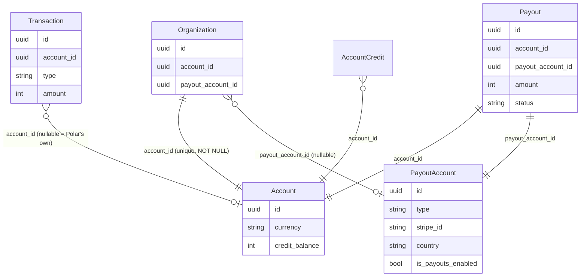
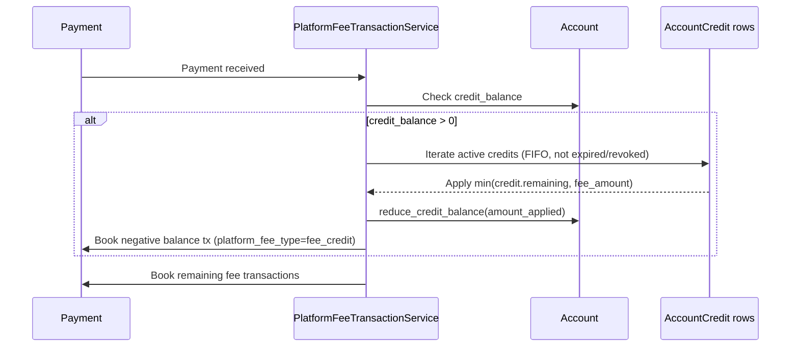
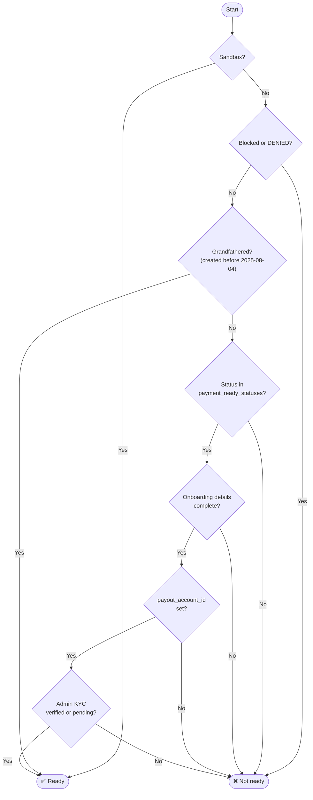
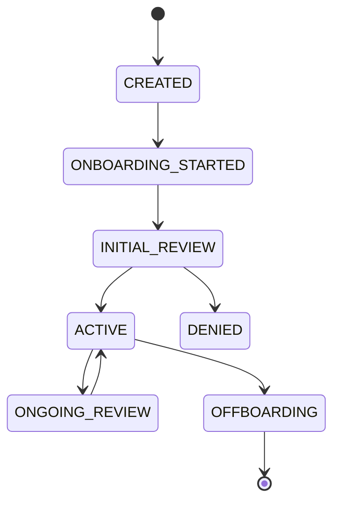
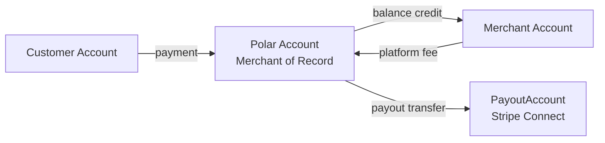
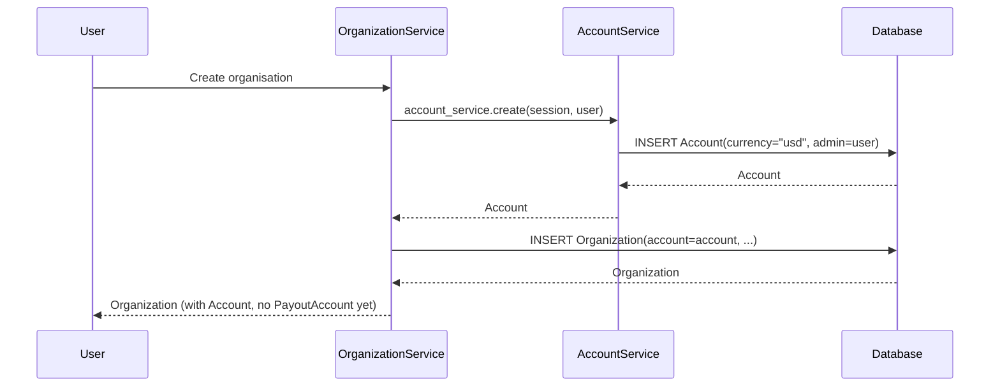
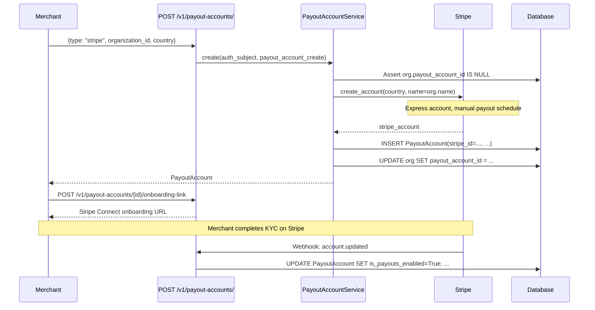
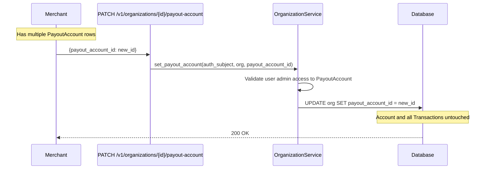

## Overview

Polar's financial architecture is split across two distinct entities:

| Entity | Table | Purpose | Required? |
|--------|-------|---------|-----------|
| `Account` | `accounts` | Financial ledger — holds all transactions for an entity | **Mandatory** — every org has exactly one |
| `PayoutAccount` | `payout_accounts` | Payout configuration — holds Stripe Connect or manual bank details | **Optional** — created when the merchant is ready to receive payouts |



This separation means:
- **Transaction history is never lost** when a merchant changes their payout processor.
- **Multiple organisations** can share a single `PayoutAccount` (e.g. a company with several Polar orgs pointing to one Stripe Connect account).
- **Accounts are created immediately** on org creation — no held balances, no pending state.

---

## `Account` Model

**`server/polar/models/account.py` · table `accounts`**

The `Account` is a pure financial ledger. It has no Stripe credentials and no payout configuration. Its only job is to track money flowing in and out.

### Key fields

```python
currency: str              # Always "usd" (Polar's settlement currency)
credit_balance: int        # Denormalized sum of active promotional fee credits (cents)

# Platform fee overrides — None falls back to global settings
platform_fee_percent: int | None   # Basis points
platform_fee_fixed: int | None     # Fixed cents

processor_fees_applicable: bool    # False for manual/backoffice accounts

# Billing details for reverse invoices
billing_name: str | None
billing_address: Address | None    # JSONB-backed AddressType
billing_additional_info: str | None
billing_notes: str | None

admin_id: UUID             # FK → users.id
```

### Fee calculation

```python
def calculate_fee_in_cents(self, amount_in_cents: int) -> int:
    # (amount * basis_points / 10_000) + fixed_cents, rounded
```

Falls back to `settings.PLATFORM_FEE_BASIS_POINTS` / `settings.PLATFORM_FEE_FIXED` when the per-account overrides are `None`.

### Credit balance

`credit_balance` is **not** the merchant's earned revenue balance. It tracks **promotional fee credits** explicitly granted by Polar (manually by an admin, or via a campaign). Each credit is stored as an `AccountCredit` row; `credit_balance` is a denormalized running sum for fast reads.

Credits are consumed against **platform fees at payment time** (not at payout):



Credits are reduced in two cases:
- **Applied to a fee** — `account.reduce_credit_balance(amount_applied)` after consuming `AccountCredit` rows
- **Revoked by admin** — `account.reduce_credit_balance(credit.amount)` immediately

`reduce_credit_balance(amount)` subtracts `min(amount, credit_balance)`, flooring at zero.

---

## `PayoutAccount` Model

**`server/polar/models/payout_account.py` · table `payout_accounts`**

The `PayoutAccount` holds all payout processor configuration. It is decoupled from the financial ledger so it can be swapped independently.

### Types

| Type | Description |
|------|-------------|
| `stripe` | Stripe Connect Express account |
| `manual` | Backoffice-managed; always considered payout-ready |

### Key fields

```python
type: PayoutAccountType        # "stripe" | "manual"

stripe_id: str | None          # Stripe Connect account ID ("acct_...")
country: str                   # ISO-2; drives Stripe's regulatory requirements
currency: str                  # Stripe's default_currency
email: str | None              # Synced from Stripe

# Capability flags (always True for manual accounts)
is_details_submitted: bool
is_charges_enabled: bool
is_payouts_enabled: bool

business_type: str | None      # "individual" | "company" | etc.
data: dict                     # Full raw Stripe Account object (JSONB)

admin_id: UUID                 # FK → users.id
```

### Payout readiness

```python
@property
def is_payout_ready(self) -> bool:
    return self.type != PayoutAccountType.stripe or (
        self.is_payouts_enabled and self.stripe_id is not None
    )
```

Manual accounts are always ready. Stripe accounts require `is_payouts_enabled=True`.

---

## `Organization` Relationships

**`server/polar/models/organization.py`**

```python
# Mandatory — set at org creation, never NULL
account_id: UUID = mapped_column(
    ForeignKey("accounts.id", ondelete="restrict"),
    nullable=False,
    unique=True,        # enforces 1-to-1 at DB level
)

# Optional — set when merchant completes Stripe Connect onboarding
payout_account_id: UUID | None = mapped_column(
    ForeignKey("payout_accounts.id", ondelete="set null"),
    nullable=True,
)
```

`unique=True` on `account_id` enforces the 1-to-1 constraint at the DB level. `payout_account_id` has no `unique` constraint — **multiple orgs can share a single `PayoutAccount`**.

### Payment readiness check

`OrganizationService.is_organization_ready_for_payment()` evaluates in order:



Where `payment_ready_statuses = {ACTIVE, OFFBOARDING, INITIAL_REVIEW, ONGOING_REVIEW}`.

<Note>
An org can _receive_ transactions (write to its `Account`) before passing this check. The check gates _accepting payments from customers_, not internal bookkeeping.
</Note>

### Organisation status flow



---

## `Transaction` Model

**`server/polar/models/transaction.py` · table `transactions`**

```python
account_id: UUID | None    # NULL → Polar's own transaction; NOT NULL → merchant/seller
payout_id: UUID | None     # Set when this transaction is swept in a Payout
```

- `account_id IS NOT NULL` → transaction belongs to a specific merchant `Account`
- `account_id IS NULL` → transaction is Polar's own (e.g. collected fees, outgoing transfers)

**Transaction types:** `payment`, `processor_fee`, `refund`, `refund_reversal`, `dispute`, `dispute_reversal`, `balance`, `payout`, `payout_reversal`

The future goal is to extend `Account` to represent customers and Polar subsidiaries too, enabling the full money trail to be traced in a single table:



---

## `Payout` Model

**`server/polar/models/payout.py` · table `payouts`**

A `Payout` links both entities, representing the transfer of funds from the merchant's ledger to their payout processor.

```python
account_id: UUID           # Source: merchant Account (NOT NULL)
payout_account_id: UUID    # Destination: PayoutAccount (NOT NULL)

currency: str              # "usd" (Polar's side)
amount: int                # cents
fees_amount: int           # cents

account_currency: str      # merchant's currency (may differ, e.g. "eur")
account_amount: int        # amount in merchant's currency

status: PayoutStatus       # pending | in_transit | succeeded | failed | canceled
processor: PayoutAccountType

invoice_number: str
invoice_path: str | None   # storage path; None until PDF is generated
```

---

## Key Flows

### Organisation creation



No Stripe call, no KYC — just a bare ledger row. The org can receive internal transactions immediately.

### Merchant onboarding for payouts



### Switching payout accounts

A user can have multiple `PayoutAccount` rows and switch which one is active on a given org.



### Deleting a payout account

Two guards are evaluated before deletion:

1. **`PayoutAccountLinkedToOrganization`** (422) — raised if any org still has `payout_account_id` pointing to this account. Switch the org to another `PayoutAccount` first.
2. **`PayoutAccountNonZeroBalance`** (422) — raised if the Stripe account has a non-zero pending balance.

If both guards pass, the row is soft-deleted and `stripe.delete_account()` is called.

<Warning>
Active payout accounts cannot be deleted directly. Use `PATCH /v1/organizations/{id}/payout-account` to move the org to a different account first.
</Warning>

### Payout triggered

`POST /v1/payouts/` with `{ organization_id }`:

1. Resolves `organization.account` and `organization.get_ready_payout_account()`
2. Aggregates all un-swept transactions on the `Account`
3. Applies `credit_balance` against fees, then deducts remaining fees
4. Calls Stripe Transfers API targeting `payout_account.stripe_id`
5. Creates `Payout` row linking `account_id` + `payout_account_id`
6. Marks contributing `Transaction` rows with `payout_id`

---

## API Reference

### Account

| Method | Path | Description |
|--------|------|-------------|
| `GET` | `/v1/organizations/{id}/account` | Get the org's Account (admin only) |
| `PATCH` | `/v1/accounts/{id}` | Update billing fields |
| `GET` | `/v1/accounts/{id}/credits` | List fee credits |

### PayoutAccount

| Method | Path | Description |
|--------|------|-------------|
| `GET` | `/v1/payout-accounts/` | List all PayoutAccounts accessible to the user |
| `POST` | `/v1/payout-accounts/` | Create a Stripe PayoutAccount |
| `GET` | `/v1/payout-accounts/{id}` | Get PayoutAccount details |
| `DELETE` | `/v1/payout-accounts/{id}` | Delete (must not be linked to any org; Stripe balance must be zero) |
| `POST` | `/v1/payout-accounts/{id}/onboarding-link` | Get Stripe Connect onboarding URL |
| `POST` | `/v1/payout-accounts/{id}/dashboard-link` | Get Stripe Express dashboard URL |
| `PATCH` | `/v1/organizations/{id}/payout-account` | Switch the active PayoutAccount for an org |

### Payouts

| Method | Path | Description |
|--------|------|-------------|
| `GET` | `/v1/payouts/estimate?organization_id=` | Estimate available payout amount |
| `POST` | `/v1/payouts/` | Trigger a payout |
