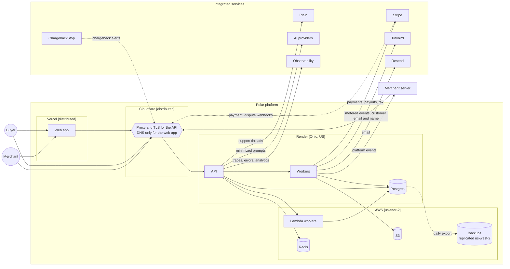
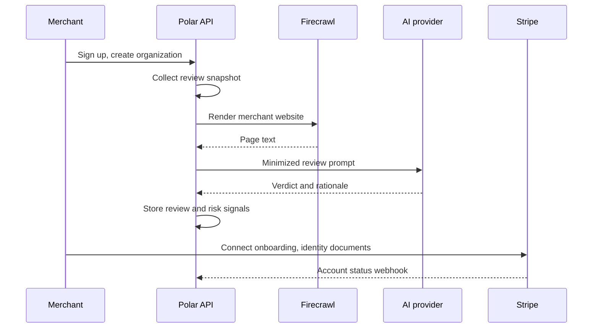
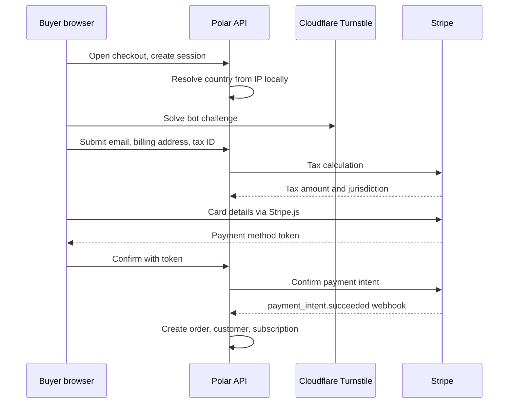

<Info>
**Status**: Active · **Owner**: Engineering · **Last Updated**: September 2026

**Review**: annually, and on any change to the systems, sub-processors or flows below
</Info>

## Overall flows

The diagram is production. Sandbox holds **real merchant data**: identities, organizations and
product configuration, but no real payments or end-customer data. It lives in its own
`polar_sandbox` database on the same Render instance.

## Where data is processed

One row per provider. The flows below say what reaches each one.

| Provider | Region | Processes |
| --- | --- | --- |
| Cloudflare | Distributed edge | DNS for Polar's domains. Proxy and TLS termination for **API traffic only**: source IP, headers and URLs for every API, SDK and inbound-webhook request. Web app hostnames run DNS-only, so that traffic goes straight to Vercel and Cloudflare sees the lookup, not the request. Turnstile challenge signals; product video via Stream |
| Render | Ohio, USA | API, workers, and the Postgres instance holding all core platform data |
| AWS | `us-east-2`; backups replicated to `us-west-2` | S3 for invoices, receipts, payout invoices, downloadable files, product media and the span archive; Lambda and SQS for background jobs; ElastiCache Redis for sessions, rate limits and job payloads; the backup buckets |
| Vercel | Distributed edge | Web app and checkout rendering. No persistent store |
| Stripe | USA | Card credentials, payments, payouts, tax calculation, identity verification |
| Tinybird | USA | Metered events and derived metrics, including customer email and name |
| Resend | USA | Transactional email: recipient address, subject, rendered body |
| Plain | UK | Support threads, chat transcripts, attachments; context cards looked up by email address |
| ChargebackStop | UK | Card transaction identifiers in pre-dispute alerts |
| OpenAI | USA | Inference on minimized prompts, via the Pydantic AI Gateway |
| Anthropic | USA | Inference on minimized prompts, via the Pydantic AI Gateway |
| Sentry | USA | Error reports from the API, workers and browser |
| PostHog | USA | Product analytics and feature flags |
| Pydantic Logfire | USA | Traces, logs and metrics. 30-day retention |
| Grafana | USA | Metrics dashboards via Grafana Cloud Prometheus |
| Firecrawl | Not verified | Renders merchant websites during organization review |
| GitHub | USA | Source hosting and CI; end-customer GitHub identity for repository benefits |
| Discord | Not verified | End-customer Discord identity for guild benefits |
| Google | USA | Maps address autocomplete in the browser; the acceptable-use policy document fetched from Drive |
| Stilla | Belgium | Meeting transcripts, calendar, and content from connected internal systems |

## Product flows

### Merchant onboarding and review

A merchant signs up with an email OTP, or through GitHub, Google or Apple. Creating an
organization then triggers an automated review that decides whether they may sell on the
platform.

Review prompts are built from a named field list rather than a serialized object, so only those
fields reach the provider ([ADR-0012](/engineering/decisions/0012-minimize-data-in-ai-api-calls)).

### Checkout and payment

## Remaining flows

| Flow | Source | Data | Processed by | Controls |
| --- | --- | --- | --- | --- |
| Fulfillment: invoices and receipts | Paid order | Financial records, personal data | S3 | Dedicated bucket per document class; presigned URLs, 1-hour TTL |
| Fulfillment: file benefits | Merchant upload | Merchant content | S3 | Presigned URLs, 1-hour TTL |
| Fulfillment: Discord and GitHub benefits | Benefit grant | End-customer OAuth identity, including access and refresh tokens | Postgres, Discord, GitHub | Scoped to the granting organization |
| Fulfillment: license keys | Benefit grant | Key, per-device activations | Postgres | Scoped to the granting organization |
| Fulfillment: email | Platform event | Recipient address, subject, rendered body | Resend | Sends recorded in `email_logs`; marketing audience keyed by `users.resend_id` |
| Usage events and metering | Merchant API or SDK | Customer and member references plus **arbitrary merchant-supplied metadata**; the Tinybird row also carries customer email and name | Postgres, Tinybird | Scoped to the ingesting organization; per-environment Tinybird tokens; metadata treated as untrusted |
| Outbound webhooks | Platform event | The same objects the API returns, including customer email and billing address | Merchant endpoint | Payload signing; 10 retries; failing endpoints disabled; events deleted after **90 days** |
| Payouts | Paid orders | Balance transactions, payout records and payout invoice PDFs. Bank details live in Stripe; Polar holds the Connect account ID, country, currency and capability flags | Postgres, S3, Stripe | Held until a minimum balance and delay elapse; reviews triggered on risk signals; payout invoices in a separate bucket from customer invoices |
| Disputes and chargebacks | Stripe, ChargebackStop | Card transaction identifiers, dispute records | Postgres | Both signature-verified; payloads stored raw in `external_events` and processed asynchronously |
| Support | Buyer or merchant | Support threads, chat transcripts, attachments; context cards looked up **by email address** | Plain | Plain's requests signature-verified; cards return only triage fields |
| Telemetry | API, workers, browser | Traces, metrics, product analytics, error reports | Logfire, Sentry, PostHog, Grafana, S3 | Browser analytics and errors proxied through polar.sh; session replay disabled; health-check and token-usage spans dropped at the sampler |
| Audit logs and span archive | Trace spans | Gzipped JSONL, the **Audit Logs** asset | S3 | Sensitive attribute keys redacted before the object is written |
| Backups | Render Postgres | **Everything in this document, in one object** | S3 | Object Lock in COMPLIANCE mode means a backup **cannot be deleted before retention elapses, by anyone, including root**; deletion reaches backups by expiry rather than erasure |
| Staff access | Polar admin via backoffice | Any production record; impersonation renders the merchant dashboard | Postgres | Impersonation restricted to `READ_ONLY_SCOPES` and one organization |
| AI features | Organization review, Compass, Plain subject lines | Review: products, website and webhook-host text, Stripe-verified identity (**name, date of birth, address country**), payout-account business details and capabilities, payment totals and risk scores, user history and prior decisions. Compass: merchant metrics, buyer personal data only when asked about that person in that turn. Plain: the customer's own message | Pydantic AI Gateway → OpenAI, Anthropic | [ADR-0012](/engineering/decisions/0012-minimize-data-in-ai-api-calls) |
| Workspace assistant | Meetings, calendar, Slack, Google Workspace, GitHub | Meeting audio and transcripts, internal communications, documents, source code | Stilla | Zero-data-retention agreements with the underlying LLM providers and a contractual bar on training, which stops the flow continuing to a fourth party |
