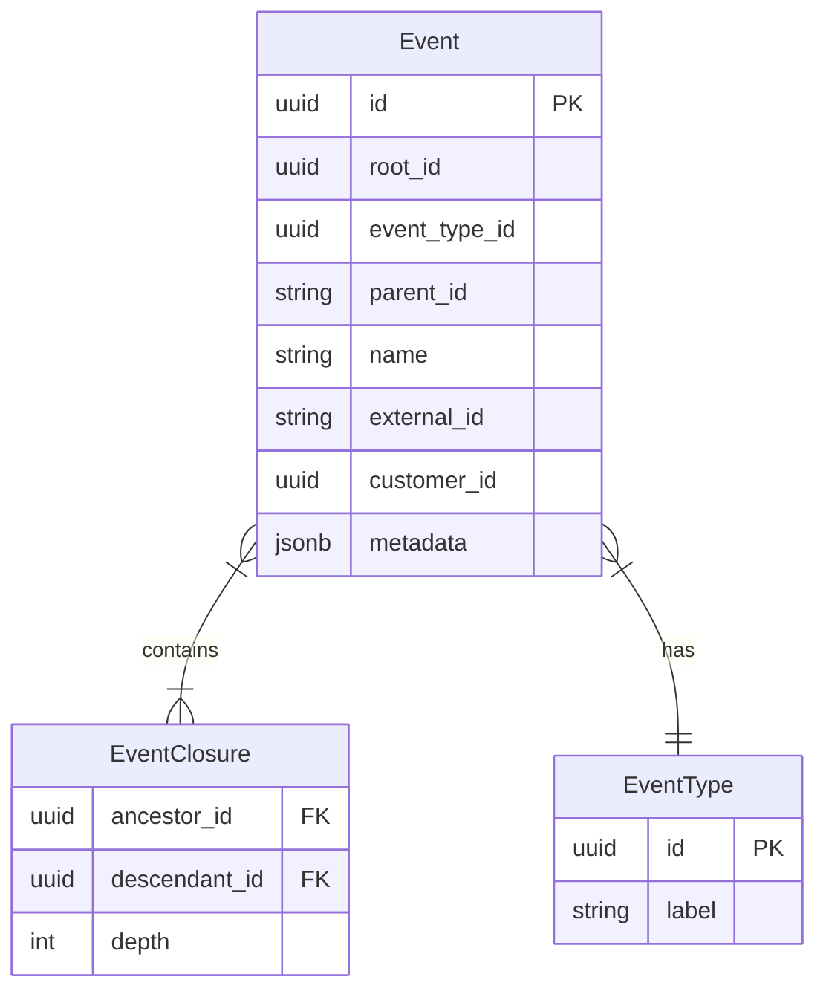
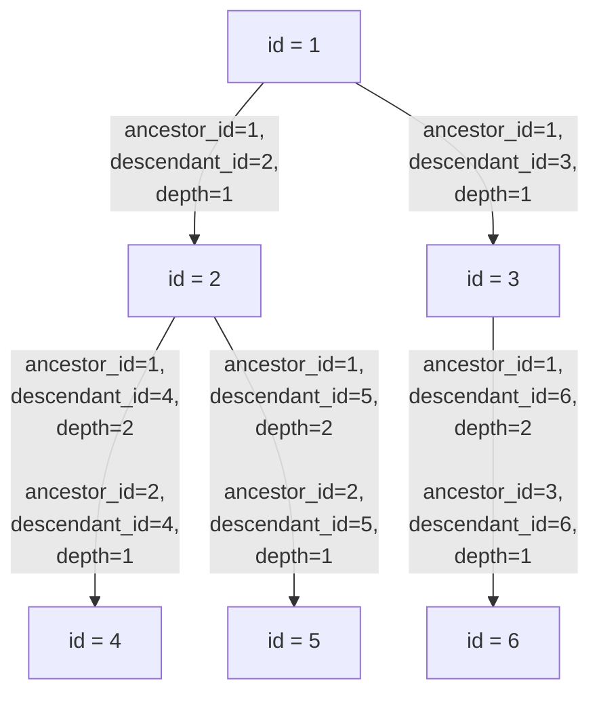

import { OpenQuestion } from "/snippets/open-question.jsx";

<Info>
**Status**: Active
**Created**: November 2025
**Last Updated**: November 2025
</Info>

## Summary

To position Polar for ingesting an increased number of events (100-1000x current number of events), and to minimize the number of data migrations that we will need to do the ambition of this document is to outline three alternatives for storing event data based on the current and imagined future query patterns.

## Goals

* List and filter events speedily (\<200 ms) independent on number of events associated with organization.
    * Filter should be on arbitrary hierarchies of events.
    * Aggregate arbitrary fields in event hierarchies, such as duration or cost.
* Generate metrics from event lists
    * Window events over time
    * Group events by arbitrary properties of events (name, description)

The workload we have fullfils the following aspects:
* Events are immutable
* Events can be ingested at any point in time (not only realtime)
* We want to be able add more metrics and query patterns in the future
* We want our users to be able to ingest a lot of metadata that they can query in the future

## Current state

### Events

Events are stored in an `events` table. The relationship / hierarchy between events are stored via the self referencing `parent_id` field, which refers to the ID of a different event in the same table. To allow for speedier lookups of events in an hierarchy there is a separate `events_closure` table which stores the relationship between two events (`ancestor` and `descendant` as well as the `depth` of which that relationship is.).

The `event_types` table exists to allow us to group events that are of the same type and to assign a customizable label to them. If you ingest two events that are called "Support Request", they are semantically identical even though they are separate events that have happened at different points in time (potentially to different customers).




#### Event Closure



What the diagram above aims to show is that the further down the hierarchy you go, the more entries into the closure table you will get, since each corresponding parent (or ancestral) relationship will be represented. This means that when you select all of an event which where `ancestor_id = 1` you will get itself and all of its children, no mater which generation, as well as the depth from the parent they have.

#### Query patterns

The events are queried by joining the three tables:

```sql
SELECT
	parent.id AS parent_id,
	parent.name AS parent_name,
	child.id AS child_id,
	child.name AS child_name,
    et.label
	ec.depth
FROM
	events parent
	JOIN events_closure ec ON ec.ancestor_id = parent.id
	JOIN events child ON child.id = ec.descendant_id
    JOIN event_types et ON et.id=child.type_id
WHERE
	parent.id = '5b300e94-498c-4a94-a85d-2d1b9b218354'
ORDER BY
	ec.depth,
	child.timestamp;
```

And if you wish to only get the direct children you would query for `depth = 1`, etc.

### Metrics

Metrics are queried by building up a `series` of intervals based on the queried interval. Additionally we build a number of common table expressions (`CTE`s) all of which are then queried together.

<CodeGroup>

```sql Timeseries
WITH timestamp_series AS (
    SELECT generate_series(
        date_trunc('day', '2025-01-01'::timestamptz),
        date_trunc('day', '2025-12-31'::timestamptz),
        '1 day'::interval
    ) AS timestamp
),
```

```sql Historical baseline
historical_baseline AS (
    SELECT
        COALESCE(SUM(orders.subtotal_amount - orders.discount_amount), 0) AS hist_cumulative_revenue,
        COALESCE(SUM((orders.subtotal_amount - orders.discount_amount) - orders.platform_fee_amount - orders.refunded_amount), 0) AS hist_net_cumulative_revenue
    FROM orders
    WHERE orders.status IN ('paid', 'refunded', 'partially_refunded')
    AND orders.created_at < '2025-01-01 00:00:00'
),
```

```sql Daily metrics
daily_metrics AS (
    SELECT
        date_trunc('day', orders.created_at) AS day,
        -- Example metrics:
        COALESCE(COUNT(orders.id), 0) AS orders,
        COALESCE(SUM(orders.subtotal_amount - orders.discount_amount), 0) AS revenue,
        COALESCE(SUM((orders.subtotal_amount - orders.discount_amount) - orders.platform_fee_amount - orders.refunded_amount), 0) AS net_revenue,
        COALESCE(SUM(orders.subtotal_amount - orders.discount_amount), 0) AS cumulative_revenue,
        COALESCE(SUM((orders.subtotal_amount - orders.discount_amount) - orders.platform_fee_amount - orders.refunded_amount), 0) AS net_cumulative_revenue,
        COALESCE(CAST(CEIL(AVG(orders.subtotal_amount - orders.discount_amount)) AS INTEGER), 0) AS average_order_value,
        COALESCE(COUNT(orders.id) FILTER (WHERE orders.subscription_id IS NULL), 0) AS one_time_products,
        COALESCE(SUM(orders.subtotal_amount - orders.discount_amount) FILTER (WHERE orders.subscription_id IS NULL), 0) AS one_time_products_revenue,
        COALESCE(SUM(orders.subtotal_amount - orders.discount_amount) FILTER (WHERE date_trunc('day', subscriptions.started_at) = date_trunc('day', orders.created_at)), 0) AS new_subscriptions_revenue,
        COALESCE(SUM(orders.subtotal_amount - orders.discount_amount) FILTER (WHERE date_trunc('day', subscriptions.started_at) != date_trunc('day', orders.created_at)), 0) AS
renewed_subscriptions_revenue
    FROM orders
    LEFT OUTER JOIN subscriptions ON orders.subscription_id = subscriptions.id
    WHERE orders.status IN ('paid', 'refunded', 'partially_refunded')
    AND orders.created_at >= '2025-01-01 00:00:00'
    AND orders.created_at <= '2025-12-31 00:00:00'
    GROUP BY date_trunc('day', orders.created_at)
),
  ```

  ```sql Order metrics
orders_metrics_cte AS (
    SELECT
        timestamp_series.timestamp,
        COALESCE(daily_metrics.orders, 0) AS orders,
        COALESCE(daily_metrics.revenue, 0) AS revenue,
        COALESCE(SUM(daily_metrics.cumulative_revenue) OVER (ORDER BY timestamp_series.timestamp), 0)
            + historical_baseline.hist_cumulative_revenue AS cumulative_revenue,
        COALESCE(SUM(daily_metrics.net_cumulative_revenue) OVER (ORDER BY timestamp_series.timestamp), 0)
            + historical_baseline.hist_net_cumulative_revenue AS net_cumulative_revenue,
        COALESCE(daily_metrics.average_order_value, 0) AS average_order_value,
        COALESCE(daily_metrics.one_time_products, 0) AS one_time_products
    FROM timestamp_series
    LEFT OUTER JOIN daily_metrics ON daily_metrics.day = timestamp_series.timestamp
    CROSS JOIN historical_baseline
    ORDER BY timestamp_series.timestamp ASC
),
```

```sql Active subscriptions
active_subscriptions_cte AS (
    SELECT
        timestamp_series.timestamp,
        COALESCE(COUNT(subscriptions.id), 0) AS active_subscriptions,
        COALESCE(COUNT(subscriptions.id) FILTER (
            WHERE date_trunc('day', subscriptions.started_at) = date_trunc('day', timestamp_series.timestamp)
        ), 0) AS new_subscriptions,
        COALESCE(SUM(
            CASE
                WHEN subscriptions.recurring_interval = 'year' THEN ROUND(subscriptions.amount / 12)
                WHEN subscriptions.recurring_interval = 'month' THEN subscriptions.amount
                WHEN subscriptions.recurring_interval = 'week' THEN ROUND(subscriptions.amount * 4)
                WHEN subscriptions.recurring_interval = 'day' THEN ROUND(subscriptions.amount * 30)
            END
        ), 0) AS monthly_recurring_revenue,
        COALESCE(CAST(
            CASE
                WHEN COUNT(DISTINCT subscriptions.customer_id) = 0 THEN 0
                ELSE SUM(
                    CASE
                        WHEN subscriptions.recurring_interval = 'year' THEN ROUND(subscriptions.amount / 12)
                        WHEN subscriptions.recurring_interval = 'month' THEN subscriptions.amount
                        WHEN subscriptions.recurring_interval = 'week' THEN ROUND(subscriptions.amount * 4)
                        WHEN subscriptions.recurring_interval = 'day' THEN ROUND(subscriptions.amount * 30)
                    END
                ) / COUNT(DISTINCT subscriptions.customer_id)
            END AS INTEGER
        ), 0) AS average_revenue_per_user
    FROM timestamp_series
    LEFT OUTER JOIN subscriptions ON (
        (subscriptions.started_at IS NULL
        OR date_trunc('day', subscriptions.started_at) <= date_trunc('day', timestamp_series.timestamp))
        AND (COALESCE(subscriptions.ended_at, subscriptions.ends_at) IS NULL
            OR date_trunc('day', COALESCE(subscriptions.ended_at, subscriptions.ends_at)) > date_trunc('day', timestamp_series.timestamp))
    )
    GROUP BY timestamp_series.timestamp
    ORDER BY timestamp_series.timestamp ASC
),
```

```sql Checkouts
checkouts_cte AS (
    SELECT
        timestamp_series.timestamp,
        COALESCE(COUNT(checkouts.id), 0) AS checkouts,
        COALESCE(COUNT(checkouts.id) FILTER (WHERE checkouts.status = 'succeeded'), 0) AS succeeded_checkouts,
        COALESCE(
            CASE
                WHEN COUNT(checkouts.id) = 0 THEN 0
                ELSE CAST(COUNT(checkouts.id) FILTER (WHERE checkouts.status = 'succeeded') AS FLOAT) / COUNT(checkouts.id)
            END,
            0
        ) AS checkouts_conversion
    FROM timestamp_series
    LEFT OUTER JOIN checkouts ON (
        date_trunc('day', checkouts.created_at) = date_trunc('day', timestamp_series.timestamp)
        AND checkouts.created_at >= '2025-01-01 00:00:00'
        AND checkouts.created_at <= '2025-12-31 00:00:00'
    )
    GROUP BY timestamp_series.timestamp
    ORDER BY timestamp_series.timestamp ASC
),
```

```sql Canceled subscriptions
canceled_subscriptions_cte AS (
    SELECT
        timestamp_series.timestamp,
        COALESCE(COUNT(subscriptions.id), 0) AS canceled_subscriptions,
        COALESCE(COUNT(subscriptions.id) FILTER (
            WHERE subscriptions.customer_cancellation_reason = 'too_expensive'
        ), 0) AS canceled_subscriptions_too_expensive,
        COALESCE(COUNT(subscriptions.id) FILTER (
            WHERE subscriptions.customer_cancellation_reason = 'missing_features'
        ), 0) AS canceled_subscriptions_missing_features,
        COALESCE(COUNT(subscriptions.id) FILTER (
            WHERE subscriptions.customer_cancellation_reason = 'low_quality'
        ), 0) AS canceled_subscriptions_low_quality,
        COALESCE(COUNT(subscriptions.id) FILTER (
            WHERE subscriptions.customer_cancellation_reason = 'unused'
        ), 0) AS canceled_subscriptions_unused
        -- ... other cancellation reasons
    FROM timestamp_series
    LEFT OUTER JOIN subscriptions ON (
        subscriptions.canceled_at IS NOT NULL
        AND date_trunc('day', subscriptions.canceled_at) = date_trunc('day', timestamp_series.timestamp)
        AND subscriptions.canceled_at >= '2025-01-01 00:00:00'
        AND subscriptions.canceled_at <= '2025-12-31 00:00:00'
    )
    GROUP BY timestamp_series.timestamp
    ORDER BY timestamp_series.timestamp ASC
),
```

```sql Churned subscriptions
churned_subscriptions_cte AS (
    SELECT
        timestamp_series.timestamp,
        COALESCE(COUNT(subscriptions.id), 0) AS churned_subscriptions
    FROM timestamp_series
    LEFT OUTER JOIN subscriptions ON (
        COALESCE(subscriptions.ended_at, subscriptions.ends_at) IS NOT NULL
        AND date_trunc('day', COALESCE(subscriptions.ended_at, subscriptions.ends_at)) = date_trunc('day', timestamp_series.timestamp)
        AND COALESCE(subscriptions.ended_at, subscriptions.ends_at) >= '2025-01-01 00:00:00'
        AND COALESCE(subscriptions.ended_at, subscriptions.ends_at) <= '2025-12-31 00:00:00'
    )
    GROUP BY timestamp_series.timestamp
    ORDER BY timestamp_series.timestamp ASC
),
```

```sql Events daily
events_daily_metrics AS (
    SELECT
        date_trunc('day', events.timestamp) AS day,
        COALESCE(SUM((events.user_metadata->'_cost'->>'amount')::numeric(17,12)) FILTER (
            WHERE events.user_metadata->'_cost' IS NOT NULL
        ), 0) AS costs,
        COALESCE(SUM((events.user_metadata->'_cost'->>'amount')::numeric(17,12)) FILTER (
            WHERE events.user_metadata->'_cost' IS NOT NULL
        ), 0) AS cumulative_costs,
        COALESCE(
            COUNT(DISTINCT events.customer_id) + COUNT(DISTINCT events.external_customer_id),
            0
        ) AS active_user_by_event,
        COALESCE(
            CASE
                WHEN (COUNT(DISTINCT events.customer_id) + COUNT(DISTINCT events.external_customer_id)) = 0 THEN 0
                ELSE SUM(COALESCE((events.user_metadata->'_cost'->>'amount')::numeric(17,12), 0))
                    / (COUNT(DISTINCT events.customer_id) + COUNT(DISTINCT events.external_customer_id))
            END,
            0
        ) AS cost_per_user
    FROM events
    WHERE events.timestamp >= '2025-01-01 00:00:00'
    AND events.timestamp <= '2025-12-31 00:00:00'
    GROUP BY date_trunc('day', events.timestamp)
),
```

```sql Events windowed
events_metrics_cte AS (
    SELECT
        timestamp_series.timestamp,
        COALESCE(events_daily_metrics.costs, 0) AS costs,
        -- Cumulative costs using window function
        COALESCE(
            SUM(events_daily_metrics.cumulative_costs) OVER (ORDER BY timestamp_series.timestamp),
            0
        ) AS cumulative_costs,
        COALESCE(events_daily_metrics.active_user_by_event, 0) AS active_user_by_event,
        COALESCE(events_daily_metrics.cost_per_user, 0) AS cost_per_user
    FROM timestamp_series
    LEFT OUTER JOIN events_daily_metrics ON events_daily_metrics.day = timestamp_series.timestamp
    ORDER BY timestamp_series.timestamp ASC
)
```
</CodeGroup>

Finally, all of these CTEs are then queried in a JOIN query:

```sql
  SELECT
      timestamp_series.timestamp,

      orders_metrics_cte.orders,
      orders_metrics_cte.revenue,
      orders_metrics_cte.cumulative_revenue,
      orders_metrics_cte.net_cumulative_revenue,
      orders_metrics_cte.average_order_value,
      orders_metrics_cte.one_time_products,

      active_subscriptions_cte.active_subscriptions,
      active_subscriptions_cte.new_subscriptions,
      active_subscriptions_cte.monthly_recurring_revenue,
      active_subscriptions_cte.average_revenue_per_user,

      checkouts_cte.checkouts,
      checkouts_cte.succeeded_checkouts,
      checkouts_cte.checkouts_conversion,

      canceled_subscriptions_cte.canceled_subscriptions,
      canceled_subscriptions_cte.canceled_subscriptions_too_expensive,
      canceled_subscriptions_cte.canceled_subscriptions_missing_features,
      canceled_subscriptions_cte.canceled_subscriptions_low_quality,
      canceled_subscriptions_cte.canceled_subscriptions_unused,

      churned_subscriptions_cte.churned_subscriptions,

      events_metrics_cte.costs,
      events_metrics_cte.cumulative_costs,
      events_metrics_cte.active_user_by_event,
      events_metrics_cte.cost_per_user
  FROM timestamp_series
  JOIN orders_metrics_cte ON orders_metrics_cte.timestamp = timestamp_series.timestamp
  JOIN active_subscriptions_cte ON active_subscriptions_cte.timestamp = timestamp_series.timestamp
  JOIN checkouts_cte ON checkouts_cte.timestamp = timestamp_series.timestamp
  JOIN canceled_subscriptions_cte ON canceled_subscriptions_cte.timestamp = timestamp_series.timestamp
  JOIN churned_subscriptions_cte ON churned_subscriptions_cte.timestamp = timestamp_series.timestamp
  JOIN events_metrics_cte ON events_metrics_cte.timestamp = timestamp_series.timestamp
  ORDER BY timestamp_series.timestamp ASC;
```

The metrics today are a combination of querying the different tables that contain state, as well as summing up data from historical events.

## Alternatives

### 1. Keep Postgres and current event, metric structures

The current setup will hold up for some time forward. Since we are using a combination of querying the state tables as well as the events, and that we are always filtering by `organization_id` in the events filtering, we will most likely not have an entirely unmanageable growth. Some response times will start to creep up but we might be able to be smarter with the way we query data.

### 2. Expand events to include all data necessary to generate metrics

Today we are lacking some specific events, and some data in the events to be able to build out the full (or almost full) metrics from purely the events. We would need to add some information to the system events, and probably backfill the existing events so that we can move forward without having to consider before-and-after this migration.

#### Events

Enriching `order.paid`
- `currency`
- total_amount information
  - `net_amount`,  `tax_amount`, `applied_balance_amount`
- discount information
  - `discount_amount`, `discount_id`
- `platform_fee`
- subscription information
  - `subscription_id`, `subscription_type` (one time, monthly, yearly)

Adding `subscription.created`
- `amount`
- `recurring_interval`, `recurring_interval_count`
- `started_at`, `product_id`

Adding `subscription.canceled`
- To abe able to differnate churn and cancelation metrics.
- `cancellation_reason`, `cancellation_comment`
- `canceled_at`, `ends_at`

Enriching `subscription.revoked`
- `amount` to keep track of the amount reduction
- `recurring_interval`, `recurring_interval_count`

Adding `checkout.created`

Adding `checkout.updated`

#### Metrics

Given the new events we have added, we should be able to migrate to a fully event-based metrics generation if we wish. Certain metrics might be more involved than others. A metrics query that only looks as events could look something like the following:

<Expandable title="query">

```sql
WITH timestamp_series AS (
      SELECT generate_series(
          date_trunc('hour', '2025-01-01'::timestamptz),
          date_trunc('hour', '2025-12-31'::timestamptz),
          '1 hour'::interval
      ) AS timestamp
  ),

  system_metrics AS (
      SELECT
          date_trunc('hour', timestamp) AS period,
          timestamp < '2025-01-01 00:00:00' AS is_historical,

          -- Order metrics
          COUNT(*) FILTER (WHERE name = 'order.paid') AS orders,
          COALESCE(SUM(
              (user_metadata->>'subtotal_amount')::int - (user_metadata->>'discount_amount')::int
          ) FILTER (WHERE name = 'order.paid'), 0) AS revenue,
          COALESCE(SUM(
              (user_metadata->>'subtotal_amount')::int
              - (user_metadata->>'discount_amount')::int
              - (user_metadata->>'platform_fee_amount')::int
          ) FILTER (WHERE name = 'order.paid'), 0)
          - COALESCE(SUM((user_metadata->>'refunded_amount')::int) FILTER (WHERE name = 'order.refunded'), 0) AS net_revenue,
          COALESCE(CAST(CEIL(AVG(
              (user_metadata->>'subtotal_amount')::int - (user_metadata->>'discount_amount')::int
          ) FILTER (WHERE name = 'order.paid')) AS INTEGER), 0) AS average_order_value,
          COALESCE(CAST(CEIL(AVG(
              (user_metadata->>'subtotal_amount')::int
              - (user_metadata->>'discount_amount')::int
              - (user_metadata->>'platform_fee_amount')::int
          ) FILTER (WHERE name = 'order.paid')) AS INTEGER), 0) AS net_average_order_value,

          -- One-time products
          COUNT(*) FILTER (WHERE name = 'order.paid' AND user_metadata->>'subscription_id' IS NULL) AS one_time_products,
          COALESCE(SUM(
              (user_metadata->>'subtotal_amount')::int - (user_metadata->>'discount_amount')::int
          ) FILTER (WHERE name = 'order.paid' AND user_metadata->>'subscription_id' IS NULL), 0) AS one_time_products_revenue,
          COALESCE(SUM(
              (user_metadata->>'subtotal_amount')::int
              - (user_metadata->>'discount_amount')::int
              - (user_metadata->>'platform_fee_amount')::int
          ) FILTER (WHERE name = 'order.paid' AND user_metadata->>'subscription_id' IS NULL), 0) AS one_time_products_net_revenue,

          -- New subscriptions revenue
          COALESCE(SUM(
              (user_metadata->>'subtotal_amount')::int - (user_metadata->>'discount_amount')::int
          ) FILTER (WHERE name = 'order.paid' AND user_metadata->>'billing_reason' = 'subscription_create'), 0) AS new_subscriptions_revenue,
          COALESCE(SUM(
              (user_metadata->>'subtotal_amount')::int
              - (user_metadata->>'discount_amount')::int
              - (user_metadata->>'platform_fee_amount')::int
          ) FILTER (WHERE name = 'order.paid' AND user_metadata->>'billing_reason' = 'subscription_create'), 0) AS new_subscriptions_net_revenue,

          -- Renewed subscriptions
          COUNT(DISTINCT user_metadata->>'subscription_id') FILTER (
              WHERE name = 'order.paid' AND user_metadata->>'billing_reason' = 'subscription_cycle'
          ) AS renewed_subscriptions,
          COALESCE(SUM(
              (user_metadata->>'subtotal_amount')::int - (user_metadata->>'discount_amount')::int
          ) FILTER (WHERE name = 'order.paid' AND user_metadata->>'billing_reason' = 'subscription_cycle'), 0) AS renewed_subscriptions_revenue,
          COALESCE(SUM(
              (user_metadata->>'subtotal_amount')::int
              - (user_metadata->>'discount_amount')::int
              - (user_metadata->>'platform_fee_amount')::int
          ) FILTER (WHERE name = 'order.paid' AND user_metadata->>'billing_reason' = 'subscription_cycle'), 0) AS renewed_subscriptions_net_revenue,

          -- Subscription deltas
          SUM(CASE
              WHEN name = 'subscription.created' THEN 1
              WHEN name = 'subscription.revoked' THEN -1
              ELSE 0
          END) AS subscription_delta,
          COUNT(*) FILTER (WHERE name = 'subscription.created') AS new_subscriptions,

          -- MRR delta
          SUM(CASE
              WHEN name IN ('subscription.created', 'subscription.revoked') THEN
                  CASE WHEN name = 'subscription.created' THEN 1 ELSE -1 END
                  * CASE (user_metadata->>'recurring_interval')
                      WHEN 'year' THEN ROUND((user_metadata->>'amount')::int / 12.0)
                      WHEN 'month' THEN (user_metadata->>'amount')::int
                      WHEN 'week' THEN ROUND((user_metadata->>'amount')::int * 4.0)
                      WHEN 'day' THEN ROUND((user_metadata->>'amount')::int * 30.0)
                  END
              ELSE 0
          END) AS mrr_delta,

          -- Committed MRR delta
          SUM(CASE
              WHEN name IN ('subscription.created', 'subscription.canceled') THEN
                  CASE WHEN name = 'subscription.created' THEN 1 ELSE -1 END
                  * CASE (user_metadata->>'recurring_interval')
                      WHEN 'year' THEN ROUND((user_metadata->>'amount')::int / 12.0)
                      WHEN 'month' THEN (user_metadata->>'amount')::int
                      WHEN 'week' THEN ROUND((user_metadata->>'amount')::int * 4.0)
                      WHEN 'day' THEN ROUND((user_metadata->>'amount')::int * 30.0)
                  END
              ELSE 0
          END) AS committed_mrr_delta,

          -- Canceled metrics
          COUNT(*) FILTER (WHERE name = 'subscription.canceled') AS canceled_subscriptions,
          COUNT(*) FILTER (WHERE name = 'subscription.canceled' AND user_metadata->>'customer_cancellation_reason' = 'customer_service') AS canceled_subscriptions_customer_service,
          COUNT(*) FILTER (WHERE name = 'subscription.canceled' AND user_metadata->>'customer_cancellation_reason' = 'low_quality') AS canceled_subscriptions_low_quality,
          COUNT(*) FILTER (WHERE name = 'subscription.canceled' AND user_metadata->>'customer_cancellation_reason' = 'missing_features') AS canceled_subscriptions_missing_features,
          COUNT(*) FILTER (WHERE name = 'subscription.canceled' AND user_metadata->>'customer_cancellation_reason' = 'switched_service') AS canceled_subscriptions_switched_service,
          COUNT(*) FILTER (WHERE name = 'subscription.canceled' AND user_metadata->>'customer_cancellation_reason' = 'too_complex') AS canceled_subscriptions_too_complex,
          COUNT(*) FILTER (WHERE name = 'subscription.canceled' AND user_metadata->>'customer_cancellation_reason' = 'too_expensive') AS canceled_subscriptions_too_expensive,
          COUNT(*) FILTER (WHERE name = 'subscription.canceled' AND user_metadata->>'customer_cancellation_reason' = 'unused') AS canceled_subscriptions_unused,
          COUNT(*) FILTER (WHERE name = 'subscription.canceled' AND (user_metadata->>'customer_cancellation_reason' = 'other' OR user_metadata->>'customer_cancellation_reason' IS NULL)) AS
  canceled_subscriptions_other,

          -- Churned
          COUNT(*) FILTER (WHERE name = 'subscription.revoked') AS churned_subscriptions,

          -- Checkout metrics
          COUNT(*) FILTER (WHERE name = 'checkout.created') AS checkouts,
          COUNT(*) FILTER (WHERE name = 'checkout.updated' AND user_metadata->>'status' = 'succeeded') AS succeeded_checkouts

      FROM events
      WHERE source = 'system'
        AND organization_id = '00000000-0000-0000-0000-000000000000'
        AND name IN (
            'order.paid', 'order.refunded',
            'subscription.created', 'subscription.canceled', 'subscription.revoked',
            'checkout.created', 'checkout.updated'
        )
      GROUP BY date_trunc('hour', timestamp), timestamp < '2025-01-01 00:00:00'
  ),

  user_metrics AS (
      SELECT
          date_trunc('hour', timestamp) AS period,
          timestamp < '2025-01-01 00:00:00' AS is_historical,
          COALESCE(SUM((user_metadata->'_cost'->>'amount')::numeric(17,12)), 0) AS costs,
          COUNT(DISTINCT COALESCE(customer_id::text, external_customer_id)) AS active_user_by_event
      FROM events
      WHERE source = 'user'
        AND organization_id = '00000000-0000-0000-0000-000000000000'
      GROUP BY date_trunc('hour', timestamp), timestamp < '2025-01-01 00:00:00'
  ),

  historical_system AS (
      SELECT
          COALESCE(SUM(revenue), 0) AS hist_revenue,
          COALESCE(SUM(net_revenue), 0) AS hist_net_revenue,
          COALESCE(SUM(subscription_delta), 0) AS hist_active_subscriptions,
          COALESCE(SUM(mrr_delta), 0) AS hist_mrr,
          COALESCE(SUM(committed_mrr_delta), 0) AS hist_committed_mrr
      FROM system_metrics
      WHERE is_historical
  ),

  historical_user AS (
      SELECT COALESCE(SUM(costs), 0) AS hist_costs
      FROM user_metrics
      WHERE is_historical
  ),

  period_system AS (
      SELECT * FROM system_metrics WHERE NOT is_historical
  ),

  period_user AS (
      SELECT * FROM user_metrics WHERE NOT is_historical
  )

  SELECT
      ts.timestamp,

      -- Order metrics
      COALESCE(ps.orders, 0) AS orders,
      COALESCE(ps.revenue, 0) AS revenue,
      COALESCE(ps.net_revenue, 0) AS net_revenue,
      COALESCE(SUM(ps.revenue) OVER w, 0) + hs.hist_revenue AS cumulative_revenue,
      COALESCE(SUM(ps.net_revenue) OVER w, 0) + hs.hist_net_revenue AS net_cumulative_revenue,
      COALESCE(ps.average_order_value, 0) AS average_order_value,
      COALESCE(ps.net_average_order_value, 0) AS net_average_order_value,

      -- One-time products
      COALESCE(ps.one_time_products, 0) AS one_time_products,
      COALESCE(ps.one_time_products_revenue, 0) AS one_time_products_revenue,
      COALESCE(ps.one_time_products_net_revenue, 0) AS one_time_products_net_revenue,

      -- New subscriptions
      COALESCE(ps.new_subscriptions, 0) AS new_subscriptions,
      COALESCE(ps.new_subscriptions_revenue, 0) AS new_subscriptions_revenue,
      COALESCE(ps.new_subscriptions_net_revenue, 0) AS new_subscriptions_net_revenue,

      -- Renewed subscriptions
      COALESCE(ps.renewed_subscriptions, 0) AS renewed_subscriptions,
      COALESCE(ps.renewed_subscriptions_revenue, 0) AS renewed_subscriptions_revenue,
      COALESCE(ps.renewed_subscriptions_net_revenue, 0) AS renewed_subscriptions_net_revenue,

      -- Active subscriptions & MRR
      hs.hist_active_subscriptions + COALESCE(SUM(ps.subscription_delta) OVER w, 0) AS active_subscriptions,
      hs.hist_mrr + COALESCE(SUM(ps.mrr_delta) OVER w, 0) AS monthly_recurring_revenue,
      hs.hist_committed_mrr + COALESCE(SUM(ps.committed_mrr_delta) OVER w, 0) AS committed_monthly_recurring_revenue,

      -- ARPU
      CASE
          WHEN hs.hist_active_subscriptions + COALESCE(SUM(ps.subscription_delta) OVER w, 0) = 0 THEN 0.0
          ELSE (hs.hist_mrr + COALESCE(SUM(ps.mrr_delta) OVER w, 0))::float
              / (hs.hist_active_subscriptions + COALESCE(SUM(ps.subscription_delta) OVER w, 0))
      END AS average_revenue_per_user,

      -- Checkouts
      COALESCE(ps.checkouts, 0) AS checkouts,
      COALESCE(ps.succeeded_checkouts, 0) AS succeeded_checkouts,
      CASE WHEN COALESCE(ps.checkouts, 0) = 0 THEN 0.0 ELSE ps.succeeded_checkouts::float / ps.checkouts END AS checkouts_conversion,

      -- Cancellations
      COALESCE(ps.canceled_subscriptions, 0) AS canceled_subscriptions,
      COALESCE(ps.canceled_subscriptions_customer_service, 0) AS canceled_subscriptions_customer_service,
      COALESCE(ps.canceled_subscriptions_low_quality, 0) AS canceled_subscriptions_low_quality,
      COALESCE(ps.canceled_subscriptions_missing_features, 0) AS canceled_subscriptions_missing_features,
      COALESCE(ps.canceled_subscriptions_switched_service, 0) AS canceled_subscriptions_switched_service,
      COALESCE(ps.canceled_subscriptions_too_complex, 0) AS canceled_subscriptions_too_complex,
      COALESCE(ps.canceled_subscriptions_too_expensive, 0) AS canceled_subscriptions_too_expensive,
      COALESCE(ps.canceled_subscriptions_unused, 0) AS canceled_subscriptions_unused,
      COALESCE(ps.canceled_subscriptions_other, 0) AS canceled_subscriptions_other,

      -- Churn
      COALESCE(ps.churned_subscriptions, 0) AS churned_subscriptions,

      -- Costs
      COALESCE(pu.costs, 0) AS costs,
      COALESCE(SUM(pu.costs) OVER w, 0) + hu.hist_costs AS cumulative_costs,
      COALESCE(pu.active_user_by_event, 0) AS active_user_by_event,
      CASE WHEN COALESCE(pu.active_user_by_event, 0) = 0 THEN 0.0 ELSE pu.costs / pu.active_user_by_event END AS cost_per_user,

      -- Meta metrics
      (COALESCE(SUM(ps.revenue) OVER w, 0) + hs.hist_revenue)
          - (COALESCE(SUM(pu.costs) OVER w, 0) + hu.hist_costs) AS gross_margin,
      CASE
          WHEN (COALESCE(SUM(ps.revenue) OVER w, 0) + hs.hist_revenue) = 0 THEN 0.0
          ELSE ((COALESCE(SUM(ps.revenue) OVER w, 0) + hs.hist_revenue) - (COALESCE(SUM(pu.costs) OVER w, 0) + hu.hist_costs))::float
              / (COALESCE(SUM(ps.revenue) OVER w, 0) + hs.hist_revenue)
      END AS gross_margin_percentage,
      COALESCE(ps.revenue, 0) - COALESCE(pu.costs, 0) AS cashflow,

      -- Churn rate
      CASE
          WHEN (hs.hist_active_subscriptions + COALESCE(SUM(ps.subscription_delta) OVER w, 0)
                - COALESCE(ps.new_subscriptions, 0) + COALESCE(ps.churned_subscriptions, 0)) = 0 THEN 0.0
          ELSE COALESCE(ps.canceled_subscriptions, 0)::float
              / (hs.hist_active_subscriptions + COALESCE(SUM(ps.subscription_delta) OVER w, 0)
                 - COALESCE(ps.new_subscriptions, 0) + COALESCE(ps.churned_subscriptions, 0))
      END AS churn_rate

  FROM timestamp_series ts
  CROSS JOIN historical_system hs
  CROSS JOIN historical_user hu
  LEFT JOIN period_system ps ON ps.period = ts.timestamp
  LEFT JOIN period_user pu ON pu.period = ts.timestamp
  WINDOW w AS (ORDER BY ts.timestamp)
  ORDER BY ts.timestamp ASC;
```

</Expandable>

### 2A Enabling TimescaleDB


#### Metrics

Building on the work for alternative 2, we can enable `TimescaleDB` as an extension in postgres. Then we can set up materialized views with time buckets, such as:

```sql System metrics

CREATE MATERIALIZED VIEW system_metrics_hourly
WITH (TimescaleDB.continuous) AS
SELECT
    time_bucket('1 hour', timestamp) AS bucket,
    organization_id,

    -- Order metrics
    COUNT(*) FILTER (WHERE name = 'order.paid') AS orders,
    SUM((user_metadata->>'subtotal_amount')::int
      - (user_metadata->>'discount_amount')::int
    ) FILTER (WHERE name = 'order.paid') AS revenue,

    SUM((user_metadata->>'subtotal_amount')::int
      - (user_metadata->>'discount_amount')::int
      - (user_metadata->>'platform_fee_amount')::int
    ) FILTER (WHERE name = 'order.paid') AS net_revenue,

    -- Subscription deltas
    SUM(CASE
        WHEN name = 'subscription.created' THEN 1
        WHEN name = 'subscription.revoked' THEN -1
        ELSE 0
    END) AS subscription_delta,

    -- MRR delta (with proper ELSE clause!)
    SUM(CASE
        WHEN name IN ('subscription.created', 'subscription.revoked') THEN
            (CASE WHEN name = 'subscription.created' THEN 1 ELSE -1 END)
            * CASE (user_metadata->>'recurring_interval')
                WHEN 'year' THEN ROUND((user_metadata->>'amount')::int / 12.0)
                WHEN 'month' THEN (user_metadata->>'amount')::int
                WHEN 'week' THEN ROUND((user_metadata->>'amount')::int * 4.0)
                WHEN 'day' THEN ROUND((user_metadata->>'amount')::int * 30.0)
                ELSE 0  -- Fixed: handle unknown intervals
            END
        ELSE 0
    END) AS mrr_delta,

    -- Pre-aggregate cancellation reasons
    COUNT(*) FILTER (WHERE name = 'subscription.canceled') AS canceled_subscriptions,
    COUNT(*) FILTER (
        WHERE name = 'subscription.canceled'
        AND user_metadata->>'customer_cancellation_reason' = 'too_expensive'
    ) AS canceled_too_expensive,
    -- ... other cancellation reasons ...

    COUNT(*) FILTER (WHERE name = 'checkout.created') AS checkouts,
    COUNT(*) FILTER (
        WHERE name = 'checkout.updated' AND user_metadata->>'status' = 'succeeded'
    ) AS succeeded_checkouts

FROM events
WHERE source = 'system'
  AND name IN ('order.paid', 'order.refunded', 'subscription.created',
               'subscription.canceled', 'subscription.revoked',
               'checkout.created', 'checkout.updated')
GROUP BY time_bucket('1 hour', timestamp), organization_id
```

```sql User metrics

CREATE MATERIALIZED VIEW user_metrics_hourly
WITH (TimescaleDB.continuous) AS
SELECT
    time_bucket('1 hour', timestamp) AS bucket,
    organization_id,
    SUM((user_metadata->'_cost'->>'amount')::numeric(17,12)) AS costs,
    COUNT(DISTINCT COALESCE(customer_id::text, external_customer_id))
        FILTER (WHERE customer_id IS NOT NULL OR external_customer_id IS NOT NULL) AS active_users
FROM events
WHERE source = 'user'
GROUP BY time_bucket('1 hour', timestamp), organization_id
```

These would then be possible to query easily:

```sql

SELECT
    time_bucket_gapfill('1 hour', bucket) AS timestamp,

    -- Simple column reads instead of complex aggregations
    COALESCE(s.orders, 0) AS orders,
    COALESCE(s.revenue, 0) AS revenue,
    COALESCE(s.net_revenue, 0) AS net_revenue,

    -- Cumulative values with gapfill
    SUM(COALESCE(s.revenue, 0)) OVER w AS cumulative_revenue,
    SUM(COALESCE(s.subscription_delta, 0)) OVER w AS active_subscriptions,
    SUM(COALESCE(s.mrr_delta, 0)) OVER w AS monthly_recurring_revenue,

    -- Costs
    COALESCE(u.costs, 0) AS costs,
    SUM(COALESCE(u.costs, 0)) OVER w AS cumulative_costs,

    -- Derived metrics
    SUM(COALESCE(s.revenue, 0)) OVER w - SUM(COALESCE(u.costs, 0)) OVER w AS gross_margin

FROM system_metrics_hourly s
FULL OUTER JOIN user_metrics_hourly u
    ON s.bucket = u.bucket AND s.organization_id = u.organization_id
WHERE s.organization_id = '00000000-0000-0000-0000-000000000000'
  AND s.bucket >= '2025-01-01' AND s.bucket < '2026-01-01'
WINDOW w AS (ORDER BY COALESCE(s.bucket, u.bucket))
ORDER BY 1;
```

The difference between plain Postgres and Postgres with TimescaleDB is the (easy / simple) pre-aggregation into materialized views that we can query windowed. Inserting data into events would trigger the need to refresh the materialized hourly view. If we want to have full support for :15 and :30 minute timezones, we might need to do 15-minute materialized views. For performance reasons we could determine which view we are querying.

#### Events

The querying of events will take a slight hit with TimescaleDB. The following applies to hypertables in TimescaleDB:
- Foreign key constraints from a hypertable referencing a regular table
- Foreign key constraints from a regular table referencing a hypertable
- Foreign keys from a hypertable referencing another hypertable are not supported.

So we will not be able to have the self referencing `parent_id` and `root_id` foreign keys on the `events` table if we convert it to a TimescaleDB hypertable.

However we will be able to have a foreign key relationship between `events` and `events_closure`. We probably will want to introduce timestamps on the events closure table since that is where TimescaleDB also shines:

```sql
ALTER TABLE events_closure
    ADD COLUMN ancestor_timestamp timestamptz,
    ADD COLUMN descendant_timestamp timestamptz;

ALTER TABLE events_closure
    ADD CONSTRAINT events_closure_ancestor_fkey
    FOREIGN KEY (ancestor_id, ancestor_timestamp)
    REFERENCES events(id, timestamp) ON DELETE CASCADE;

ALTER TABLE events_closure
    ADD CONSTRAINT events_closure_descendant_fkey
    FOREIGN KEY (descendant_id, descendant_timestamp)
    REFERENCES events(id, timestamp) ON DELETE CASCADE;
```

These can then be queried via:

```sql

SELECT
    parent.id AS parent_id,
    parent.name AS parent_name,
    child.id AS child_id,
    child.name AS child_name,
    et.label,
    ec.depth
FROM events parent
JOIN events_closure ec ON ec.ancestor_id = parent.id
    AND ec.ancestor_timestamp = parent.timestamp
JOIN events child ON child.id = ec.descendant_id
    AND child.timestamp = ec.descendant_timestamp
JOIN event_types et ON et.id = child.event_type_id
WHERE parent.id = '5b300e94-498c-4a94-a85d-2d1b9b218354'
  AND parent.timestamp = '2024-01-15T10:30:00Z'  -- Known timestamp helps chunk pruning
  AND parent.organization_id = 'YOUR_ORG_ID'
ORDER BY ec.depth, child.timestamp;
```


### 2B Moving over to Clickhouse

Based on us having full event coverage, we could denormalize (or just expand the JSONB metadata column into its own columns). Additionally we would denormalize the event_closure table. The Clickhouse event table would then look something similar to:

```sql

CREATE TABLE events (
    id UUID,
    external_id Nullable(String),
    timestamp DateTime64(3),
    name LowCardinality(String),
    source LowCardinality(String),
    customer_id Nullable(UUID),
    external_customer_id Nullable(String),
    organization_id UUID,
    ingested_at DateTime64(3),

    parent_id Nullable(UUID),
    root_id Nullable(UUID),
    depth UInt8,
    ancestor_path Array(UUID),  -- [root_id, ..., parent_id] - full path to this event

    -- JSONB fields extracted at insert time
    subtotal_amount Nullable(Int64),
    discount_amount Nullable(Int64),
    platform_fee_amount Nullable(Int64),
    subscription_id Nullable(String),
    billing_reason LowCardinality(Nullable(String)),
    recurring_interval LowCardinality(Nullable(String)),
    amount Nullable(Int64),
    customer_cancellation_reason LowCardinality(Nullable(String)),
    refunded_amount Nullable(Int64),
    checkout_status LowCardinality(Nullable(String)),

    -- Keep raw JSON for flexibility
    user_metadata JSON  -- or JSON type in newer versions

    -- For deduplication
    INDEX idx_external_id external_id TYPE bloom_filter GRANULARITY 4
)
ENGINE = MergeTree()
PARTITION BY toYYYYMM(timestamp)
ORDER BY (organization_id, timestamp, id);
```

#### Events

Selecting an event and all of its children would look like:

```sql
SELECT
    id,
    name,
    event_type_label,
    depth,
    timestamp
FROM events
WHERE organization_id = 'YOUR_ORG_ID'
  AND has(ancestor_path, toUUID('5b300e94-498c-4a94-a85d-2d1b9b218354'))
ORDER BY depth, timestamp;
```

Selecting an event and all of its parents would look like:
```sql

SELECT * FROM events
WHERE organization_id = 'YOUR_ORG_ID'
  AND id IN (
    SELECT arrayJoin(ancestor_path)
    FROM events
    WHERE id = '5b300e94-498c-4a94-a85d-2d1b9b218354'
  )
ORDER BY depth;
```

#### Metrics

Querying metric data from Clickhouse could look something similar to:

```sql

SELECT
    toStartOfHour(timestamp) AS period,

    countIf(name = 'order.paid') AS orders,
    sumIf(subtotal_amount - discount_amount, name = 'order.paid') AS revenue,
    sumIf(
        subtotal_amount - discount_amount - platform_fee_amount,
        name = 'order.paid'
    ) AS net_revenue,

    sum(revenue) OVER (ORDER BY period) AS cumulative_revenue,

    sumIf(1, name = 'subscription.created')
      - sumIf(1, name = 'subscription.revoked') AS subscription_delta,

    sumIf(
        multiIf(
            recurring_interval = 'year', round(amount / 12.0),
            recurring_interval = 'month', amount,
            recurring_interval = 'week', round(amount * 4.0),
            recurring_interval = 'day', round(amount * 30.0),
            0
        ),
        name = 'subscription.created'
    ) - sumIf(
        multiIf(
            recurring_interval = 'year', round(amount / 12.0),
            recurring_interval = 'month', amount,
            recurring_interval = 'week', round(amount * 4.0),
            recurring_interval = 'day', round(amount * 30.0),
            0
        ),
        name = 'subscription.revoked'
    ) AS mrr_delta,

    sum(subscription_delta) OVER (ORDER BY period) AS active_subscriptions,
    sum(mrr_delta) OVER (ORDER BY period) AS monthly_recurring_revenue

FROM events
WHERE organization_id = '00000000-0000-0000-0000-000000000000'
  AND timestamp >= '2025-01-01'
  AND timestamp < '2026-01-01'
GROUP BY period
ORDER BY period
```

However there are a few caveats to moving events out from Postgres.

1. More limited SQLAlchemy ORM magic in Clickhouse. There is support to use SQLAlchemy with Clickhouse, but it does not support everything.
2. We can no longer join events and other tables in the same query. Independent on if we continue to store events in Postgres or if we fully migrate them to Clickhouse, we can't join the data in the same query.
3. Dual infrastructure / Operations. We will need to maintain two databases, ensure that they are kept up-to-date, etc. It will add some complexity to our operations.


## Comparison

For certain organizations we are at >5-10 seconds response times for metrics queries today. Similarly for some organizations we are at >2s for event listing today. This hints that the current set up will not continue to scale with our customers for a lot longer, and we will not be able to onboard even larger customers that are ingesting more event data.

Clickhouse is well understood in the industry to be _extremely_ performant, albeit at a cost of heavier operations. Cloudflare<sup>1</sup> has been using it for a long time. Posthog<sup>2</sup> are also using it and are very happy about it<sup>3</sup>:

> Using ClickHouse is one of the best decisions we've made here at PostHog. It has allowed us to scale performance all while allowing us to build more products on the same set of data.

There are different comparisons and benchmarks to find. Tiger Data<sup>4</sup> and Tinybird<sup>5</sup> have done different benchmarks.

 [link](https://rtabench.com/#eyJzeXN0ZW0iOnsiQ2xpY2tIb3VzZSBDbG91ZCAoYXdzKSI6ZmFsc2UsIkRvcmlzIjpmYWxzZSwiVGltZXNjYWxlIENsb3VkIjpmYWxzZSwiRHVja0RCIjpmYWxzZSwiTW9uZ29EQiI6ZmFsc2UsIlBvc3RncmVzIjp0cnVlLCJUaW1lc2NhbGVEQiI6dHJ1ZSwiTXlTUUwiOmZhbHNlLCJDbGlja0hvdXNlIjp0cnVlfSwidHlwZSI6eyJSZWFsLXRpbWUgQW5hbHl0aWNzIjp0cnVlLCJCYXRjaCBBbmFseXRpY3MiOnRydWUsIkdlbmVyYWwgUHVycG9zZSI6dHJ1ZSwidW5kZWZpbmVkIjp0cnVlfSwibWFjaGluZSI6eyIyNCB2Q1BVIDk2IEdCICgzeDogOHZDUFUgMzJHQikiOmZhbHNlLCJtNS40eGxhcmdlLCA1MDBnYiBncDIiOnRydWUsIjE2IHZDUFUgNjRHQiI6ZmFsc2UsImM2YS40eGxhcmdlLCA1MDBnYiBncDIiOmZhbHNlLCI0IHZDUFUgMTZHQiI6ZmFsc2UsIjYgdkNQVSAyNCBHQiAoM3g6IDJ2Q1BVIDhHQikiOmZhbHNlLCI4IHZDUFUgMzJHQiI6ZmFsc2UsIjEyIHZDUFUgNDggR0IgKDN4OiA0dkNQVSAxNkdCKSI6ZmFsc2V9LCJjbHVzdGVyX3NpemUiOnsiMSI6dHJ1ZSwiMyI6dHJ1ZX0sIm1ldHJpYyI6ImhvdCIsInF1ZXJpZXMiOlt0cnVlLHRydWUsdHJ1ZSx0cnVlLHRydWUsdHJ1ZSx0cnVlLHRydWUsdHJ1ZSx0cnVlLHRydWUsdHJ1ZSx0cnVlLHRydWUsdHJ1ZSx0cnVlLHRydWUsdHJ1ZSx0cnVlLHRydWUsdHJ1ZSx0cnVlLHRydWUsdHJ1ZSx0cnVlLHRydWUsdHJ1ZSx0cnVlLHRydWUsdHJ1ZSx0cnVlXX0=).

> * TimescaleDB is 1.9x faster than ClickHouse on RTABench, even though it’s 6.8x slower on ClickBench. This is likely because TimescaleDB is optimized for real-time analytics applications, which often rely on normalized schemas and selective aggregations, while ClickHouse shines in denormalized, columnar analytics with large-scale aggregations.
> * Incremental materialized views offer massive speedups. They deliver up to hundreds or even thousands of times faster performance than querying the raw data (from seconds to a few milliseconds), demonstrating their value for real-time analytics. However, among the databases tested, only ClickHouse and TimescaleDB support them.
> * ClickHouse is the leader in data loading and storage efficiency. It’s 4.8x faster at loading data and uses 1.7x less disk than the next best database.

Quoted from TigerDatas<sup>4</sup> comparison, leads us to think about what the main patterns of querying we will be doing. We know that we will want to generate metrics from our events (i.e. aggregate and group a lot of events), and we know that we will want to ingest a lot of events from customers externally.

<sub>1. [Cloudflare](https://blog.cloudflare.com/http-analytics-for-6m-requests-per-second-using-clickhouse)</sub>
<sub>2. [Posthog](https://clickhouse.com/blog/london-meetup-report-scaling-analytics-with-posthog-and-introducing-housewatch)</sub>
<sub>3. [Posthog on HackerNews](https://news.ycombinator.com/item?id=41917231)</sub>
<sub>4. [TigerData](https://www.tigerdata.com/blog/benchmarking-databases-for-real-time-analytics-applications)</sub>
<sub>5. [Tinybird](https://www.tinybird.co/blog/clickhouse-vs-TimescaleDB)</sub>

## Proposal and decision

1. We enable TimescaleDB and start migrating our events to TimescaleDB hypertables.
2. We move to generate all of our metrics from events (system and user events).
3. After this has been completed we set up and start double writing to a hosted Clickhouse variant: Tinybird or Clickhouse cloud.
4. At a certain point when we have tuned in our Clickhouse usage, we drop the PostgreSQL +/ TimescaleDB events tables and migrate to use only Clickhouse.
