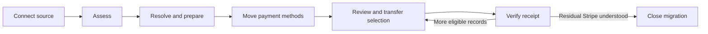

<Info>
**Status**: Draft

**Created**: 2026-09-08

**Last Updated**: 2026-09-08
</Info>

# Merchant migrations product experience

## Summary

Polar's migration engine already has the right safety primitive: it decides and moves one
subscription at a time, leaves unsupported subscriptions on the source, and records the outcome.
The product experience should expose that model without asking merchants to understand the
implementation.

This document proposes three end-to-end product directions and recommends an evolution of the
current **guided path**:

- keep one primary next action and the existing four-step navigation;
- introduce decisions only where the engine currently makes unsafe assumptions;
- keep exceptions and partial outcomes reachable inside their relevant step;
- bulk API and CSV operations for larger migrations;
- Polar Ops involvement only where access or recovery requires it.

The core change is conceptual. A migration is not a wizard that eventually turns entirely green.
It is a controlled transfer of billing ownership, with a permanent receipt for what moved, what
stayed, and what needs attention.

This document complements [Merchant Migrations to Polar](merchant-migrations.mdx). That document
defines the migration engine and PAN transfer. This one defines the merchant experience,
information architecture, API/UI/Ops boundaries, and rollout.

## Current system and problem

The current dashboard presents four visible steps:

1. Connect
2. Assessment
3. Card movement
4. Switch

This is clear at a glance. The problem is not merely that Assessment compresses several
decisions: most of those decisions do not exist yet. The current importer creates products and
reuses customers by email after the merchant selects subscriptions to prepare.

The system currently supports:

- background source assessment with persisted progress and retry;
- a subscription review table with importability and action-required filters;
- selection of which subscriptions to prepare;
- import of the products and customers needed by that selection;
- a multi-owner PAN transfer checklist;
- selection and per-subscription cutover;
- moved, skipped, and failed ledger outcomes with reasons.

The following capabilities do not exist and require backend work before corresponding UI can
ship:

- whether a Stripe product should map to an existing Polar product or create a new one;
- whether a Stripe customer is the same person as an existing Polar customer;
- which stable external identity Polar should retain;
- how tax and missing billing country should be handled;
- whether the merchant has reviewed the event contract required for two billing providers;
- which unsupported subscriptions will remain on Stripe.

The last item is partially supported: unsupported records and reasons exist, but residual billing
ownership is not summarized across the migration.

Today the record review is primarily read-only. Preparing a subscription implicitly imports the
customer and product it needs. That is convenient when Polar is empty, but unsafe for an
organization that already sells new subscriptions through Polar: a duplicate product can carry
different benefits and a customer matched by email can be the wrong account.

The card checklist is appropriately asynchronous, but "ready to charge" currently means Polar
found a matching copied payment method, not that a future renewal is guaranteed to succeed.

The final switch supports selecting records, but it does not summarize the exact financial and
ownership impact, pause future records, or leave a durable merchant-facing receipt.

There are also two sources of design drift that this proposal must not treat as shipped behavior:

- subscriptions are created during cutover, not as paused subscriptions during catalog import;
- zero-amount SetupIntent validation and the tax policy described in the engine design document
  are not implemented in the current migration flow.

### Capability notation

The recommended design labels capabilities as:

- **Current** — available in the existing API and UI;
- **Change** — an incremental change to an existing screen or resource;
- **New** — a new domain capability that must be designed backend-first.

## Product vision

> Move billing ownership without making the merchant reason about migration internals, and never
> hide uncertainty behind a completed step.

The merchant should always be able to answer five questions:

1. What can move?
2. What must I decide or fix?
3. What is Polar or Stripe doing now?
4. Who owns billing for each subscription?
5. What happened, and what should I do next?

## Product principles

### Outcome before machinery

Lead with customer and billing outcomes: "832 subscriptions can move" rather than "pre-check
completed". PAN copy IDs, ledger states, and provider details remain available in context.

### Progressive disclosure, not hidden complexity

The default path shows aggregate decisions and exceptions. Record-level detail, source IDs, and
raw reasons are one click away. Large merchants can use the same model through API or CSV.

### One irreversible boundary

Connecting, assessing, mapping, preparing, and copying cards do not transfer billing ownership.
The UI should use neutral actions for those stages. Only the final switch uses an irreversible
confirmation.

### Partial completion is a first-class outcome

"738 moved, 82 remain on Stripe, 12 need attention" can be a healthy migration. The UI must not
call the migration complete while silently hiding residual Stripe ownership.

### Evidence over confidence language

Use "Matching card found" instead of "Ready to charge". Use "Test webhook acknowledged at 14:32"
instead of "Your integration looks good". Every evidence label says what was checked and when.

### Safe defaults, explicit overrides

Polar can suggest product, identity, and tax mappings. It must not silently resolve ambiguous
matches or unknown products. Bulk confirmation is allowed only for homogeneous groups with a
preview of impact.

### One model at every scale

The dashboard, CSV, API, backoffice, and support tooling operate on the same concepts: mappings,
transfer selections, records, owners, and receipts. The large-merchant path should not be a
separate migration product.

## Product operating lens

The design vision is set before optimizing individual screens: known billing ownership matters
more than step completion, and explainable exceptions matter more than a perfect conversion
number.

Product development should alternate between divergence and convergence:

1. Observe pilot merchants completing the current path and classify where they need support.
2. Test multiple ways to explain one decision at a time—product mapping, identity, payment
   evidence, and residual Stripe ownership.
3. Converge on the smallest change that improves an outcome or removes a safety risk.
4. Expand from assisted pilots to self-service only when telemetry and support cases show that
   the underlying decision is understood.

Use qualitative evidence for comprehension and quantitative evidence for scale. Useful pilot
questions include:

- Can the merchant predict who bills a customer after each action?
- Can they explain why a subscription remains on Stripe?
- Do they understand that a copied payment method is not a successful payment?
- Can they reconcile a transfer without asking Polar for database information?

Do not A/B test irreversible-action comprehension by weakening safeguards. Test copy and
information hierarchy before cutover, then compare completion, exception resolution, and support
contact rates.

## Users and jobs

### Technical founder or small merchant

Has tens or hundreds of subscriptions, knows the product catalog, and wants Polar to recommend
the next path with the fewest unresolved risks. Needs concise explanations and a default canary.

### Billing operator

Has thousands of subscriptions, multiple prices, discounts, and customer exceptions. Needs bulk
mapping, filters, exports, resumability, audit logs, and deterministic APIs.

### Integration engineer

Owns webhook and entitlement behavior. Needs stable source-to-target mapping, event semantics,
test payloads, and delivery evidence before billing changes.

### Polar Ops and Support

Coordinates PAN transfer and repairs exceptional states. Needs the same customer-facing status
plus private provider references, logs, and recovery actions.

## Safety invariants

The product must treat these as invariants, not success metrics:

- A moved subscription is not live on both providers.
- A source subscription is not canceled without a corresponding active or trialing Polar
  subscription, except during a bounded and alerted recovery window.
- A subscription left on Stripe is never presented as moved.
- Unknown products do not receive a default entitlement.
- Ambiguous customer identity is never resolved automatically.
- The amount, currency, cadence, quantity, and period end shown at confirmation match the values
  used at cutover. Once billing-policy migration ships, the same invariant includes tax behavior
  and country; until then, tax-uncertain records are not eligible for transfer.
- Every destructive action is attributable to an actor, selection snapshot, and idempotency key.

## Three product directions

### Alternative A: Guided resolution wizard

#### Mental model

"Polar found what can move. Resolve the important exceptions, then follow the guided path."

#### Journey

1. Connect Stripe.
2. See an assessment summary.
3. Resolve three sequential queues: products, customers, billing policy.
4. Move cards using the existing checklist.
5. Review the event contract and optionally send a test webhook.
6. Switch an exact, reviewed canary selection.
7. Review the receipt and continue with the remainder or close with acknowledged Stripe-owned
   records.

#### Main screen

```text
Migration from Stripe

[1 Connect ✓] [2 Assessment · 7 decisions] [3 Card movement] [4 Switch]

832 can move
  7 need a decision
 21 will remain on Stripe

Next: Match 2 Stripe products to Polar
[Resolve products]
```

#### Strengths

- Lowest cognitive load for Pepy-sized merchants.
- Strong sequencing and clear next action.
- Easy to write calm, contextual copy.
- Reuses the current stepper and checklist.

#### Trade-offs

- Makes non-linear work feel artificially blocked.
- Weak overview for multiple teams working concurrently.
- Large merchants will spend too much time paging through queues.
- Returning weeks later can make the wizard feel like it lost context.

### Alternative B: Migration control center

#### Mental model

"This is an operation with several workstreams. Make every workstream ready, then transfer
billing in controlled batches."

#### Journey

The migration opens on a persistent overview with four readiness cards:

```text
Stripe → Polar                                      Live source

Overall readiness: 3 of 4 ready

[Catalog & identity]  7 decisions     [Resolve]
[Payment methods]     Stripe copying  [View]
[Integration]         Not checked     [Run check]
[Billing policy]      12 countries    [Resolve]

Subscriptions
832 eligible · 21 remain on Stripe · 0 moved

[Create first batch]
```

Each card opens a dedicated work queue. Once required workstreams are ready, the merchant creates
a named cohort, previews it, and starts a transfer batch. The overview remains the home before,
during, and after cutover.

#### Strengths

- Truthful representation of parallel and partial work.
- Excellent for returning users and long-running transfers.
- Scales to thousands of records and multiple collaborators.
- Makes operational health and residual Stripe ownership persistent.

#### Trade-offs

- More intimidating for a small merchant.
- Requires careful hierarchy to avoid becoming an admin console.
- Encourages merchants to open every card even when Polar can safely resolve most records.

### Alternative C: Polar-assisted migration plan

#### Mental model

"Polar prepares and operates a migration plan. You provide decisions and approve each transfer."

#### Journey

1. Merchant connects Stripe and supplies an identity/catalog file or API mapping.
2. Polar generates a migration plan.
3. Merchant sees an inbox of requests:
   - confirm product mappings;
   - decide tax treatment;
   - start Stripe's card copy;
   - approve a canary.
4. Polar Ops and automation execute everything else.
5. Merchant reviews receipts and approves expansion.

#### Main screen

```text
Your migration plan

Waiting on you
  Confirm 2 product mappings
  Start card copy in Stripe

In progress
  Polar is checking 841 customer identities

Completed
  Stripe account connected

[Review next request]
```

#### Strengths

- Best experience for the first high-risk production migrations.
- Keeps provider coordination and recovery out of the merchant's way.
- Natural place for support communication and SLA expectations.

#### Trade-offs

- Operationally expensive and hard to scale.
- Ownership can become unclear when a merchant waits on Polar.
- API-first merchants still need direct controls.
- Risks encoding current manual operations into the permanent product.

#### Entry criteria

Use assisted mode for early-access pilots, non-Stripe provider coordination, or a recovery state
the merchant cannot resolve. Polar assigns a named owner and expected response window. Assisted
mode changes who performs an action, not the underlying dashboard state or API contract.

## Decision

Adopt **Alternative A: Guided resolution wizard** as the primary information architecture.

It is the closest evolution of the current product, fits the first target merchant, and can ship
truthful improvements before Polar builds a new orchestration domain. Keep one stepper and one
primary action. Do not add a second control-center navigation model.

Borrow two patterns from Alternative B without adopting its information architecture:

- a compact ownership summary at the top of the existing detail page;
- durable transfer receipts inside the Switch step.

Alternative C is an operating model for early access and exceptional recovery. It uses the same
screens, statuses, and records; it does not become a separate merchant-facing product.

The recommended path is:



## Recommended information architecture

### Migration list

Each migration card shows:

- source and live/test mode;
- current step: Connect, Assessment, Card movement, Switch, or Closed;
- one outcome line: `738 on Polar · 82 on Stripe · 12 need attention`;
- current owner of the next action: You, Polar, or Stripe;
- last activity.

"Closed" means no active operation and every remaining source-owned subscription has been
explicitly acknowledged. It does not mean every source subscription moved.

### Migration detail header

**Change.** Keep the current step-specific page body and stepper. Add a compact status summary
above it; do not make each status a navigational card.

```text
Stripe → Polar                                           Live
Last checked 4 minutes ago

Billing ownership
Polar 0        Stripe 841        Unknown 0

Next
Review 7 decisions before preparing subscriptions.
[Continue]
```

Keep the four current labels:

1. Connect
2. Assessment
3. Card movement
4. Switch

The status summary is informational. The step body owns the action.

### Assessment: summary before records

**Change.** After assessment, lead with outcomes before the table:

```text
841 subscriptions found
812 can be prepared
  7 need a decision
 22 will remain on Stripe

[Review 7 decisions]
```

Simple merchants can accept all unambiguous records. The table remains available for exact
selection and audit.

### Assessment: account-level blockers

**Current + Change.** Account blockers stop the record table and use a full-page explanation with
one next action. This includes source/test-mode mismatch, India/RBI restrictions, connected
accounts, missing API scopes, and an organization that cannot renew subscriptions.

```text
This Stripe account cannot use automated migration

It contains connected accounts. Polar can only copy payment methods owned by
the platform account.

Nothing has changed in Stripe.
[Contact Polar] [Back to migrations]
```

Do not mix account blockers into a count of record-level exceptions.

### Long-running operations

**Change.** Assessment, preparation, card movement, and transfer can outlive a browser session.
The step body shows:

- what is running;
- last progress time;
- whether the merchant can leave;
- who acts next;
- retry only after the operation is failed or stalled.

An Ops- or Stripe-owned wait includes an expected range and a support escalation date. Do not
simulate a percentage when Polar only knows that an external process is pending.

### Assessment: catalog and identity decisions

**New.** Add decisions only after the backend supports storing and applying them. Use top-level
tabs inside Assessment:

- Products
- Customers
- Unsupported

The default view shows unresolved records only. Resolved records remain available behind a
filter. If Polar finds no decision, the merchant never sees an empty Products or Customers queue.

#### Product mapping row

```text
Stripe                                      Polar
Pro · $19/month          →   [Choose a Polar product ▼]
124 active subscriptions

Possible match: Pro · $19/month
Cadence ✓  Currency ✓  Amount ✓  Benefits differ
[Confirm mapping]
```

The merchant can:

- map to an existing Polar product and compatible price;
- create a new product from Stripe;
- leave dependent subscriptions on Stripe.

Polar may rank possible matches only when amount, currency, cadence, interval count, and supported
pricing model are compatible, but it does not preselect one. A mismatch in those billing fields
makes the mapping unavailable. Stripe cannot prove entitlement or benefit parity. Product name is
supporting evidence, never sufficient by itself. If benefits differ, confirmation states the
exact entitlement change, for example: "124 customers will receive License Keys and Discord
access after transfer." The merchant may intentionally confirm that change or create a separate
Polar product.

#### Customer identity row

```text
Stripe customer                     Polar customer
alice@example.com · cus_123   →      Alice · usr_987

Matched by merchant external ID
[Confirm] [Choose another] [Leave on Stripe]
```

Automatic confirmation is allowed only when the merchant explicitly supplied a mapping from
their internal ID to the Stripe customer and that ID resolves to exactly one Polar customer.
Polar must not trust an arbitrary source metadata field as proof of identity. Exact Stripe
customer ID is the next strongest match. Email-only matches are suggestions and require
confirmation. Ambiguous or unmatched records never create an account in the merchant's
application.

#### Unsupported row

Each reason has:

- what Polar found;
- why it cannot move safely;
- who continues billing;
- whether the merchant can fix and refresh;
- a direct action where possible.

Example:

```text
Discounted subscription                           Stays on Stripe
Polar cannot preserve this discount yet. Stripe will continue billing it.
[Open in Stripe] [View details]
```

An existing live Polar subscription for the mapped customer and product is a distinct
high-attention state, not a generic skip:

```text
Customer already has this product on Polar
Stripe is still billing the legacy subscription. Review both subscriptions
before deciding which one should remain.
[Compare subscriptions]
```

The same check runs again at cutover because a customer can buy on Polar after assessment.

### Work queue: billing policy

**New.** This queue appears only when Polar cannot preserve tax behavior automatically or lacks a
reliable billing country. It cannot ship as UI over the current migration engine: extraction,
storage, and cutover must first carry the selected policy.

The first screen asks for a policy, not one answer per customer:

```text
How should Polar handle subscriptions where Stripe charged no tax?

( ) Keep the customer's total unchanged
    Tax is included in the current price. Your net revenue may decrease.

( ) Add applicable tax at renewal
    The customer's total may increase.

( ) Review each affected subscription

[Preview impact]
```

The preview groups affected subscriptions by country, price, and inferred source behavior. It
shows exact old total, new total, merchant net, and the number and recurring value of affected
customers. If Polar cannot calculate that impact from source data, those records remain blocked
or move through the Ops-assisted path; the UI must not ask the merchant to choose from incomplete
examples.

Missing countries form a separate queue. Polar may prefill from the strongest available evidence,
but issuer country is labeled as a suggestion requiring confirmation.

Bulk decisions are available in UI only for homogeneous groups with the same calculated impact,
and by CSV/API for record-specific overrides.

### Payment method transfer

**Change.** Keep the existing checklist; it successfully communicates multiple owners and long
waits. Move the subscription cutover out of the PAN checklist so card movement has one clear
finish.

The expanded current item carries owner, start time, expected range, and escalation:

```text
Stripe is copying the cards                               Waiting on Stripe
Started Sep 8 · Usually a few hours, up to 72 hours

You can leave this page. We will notify you when Stripe finishes.
[View request in Stripe]
```

The completion state shows coverage:

```text
Payment methods copied
806 matching cards found
 23 require customer action
 12 subscriptions do not use a supported card

A matching card has been copied to Polar. Chargeability is confirmed only
when a real payment succeeds.

[Review uncovered customers] [Continue]
```

Never use "valid card" or "ready to charge" based only on copied-card matching.

### Integration compatibility

**Change.** Before the first transfer, show the webhook contract and offer a test delivery.
Polar can verify endpoint configuration and delivery, but it cannot verify the merchant's
entitlement implementation. Do not turn merchant attestation into a green readiness check.

```text
Integration compatibility
✓ Webhook endpoint acknowledged a test delivery        Verified by Polar
! Review your Stripe cancellation handling

Last checked Sep 8 at 14:32 UTC
[Send another test] [View migration integration guide]
```

The guide states that cutover emits `subscription.updated` and `customer.state_changed`, not a new
sale event, and that a migration-marked Stripe cancellation must not directly revoke an active
Polar entitlement.

Delivery evidence is informative, not proof of correctness. It does not block cutover. The
irreversible review repeats the limitation in plain language. For API-only integrations, the same
test-event endpoint is available without a UI-specific integration.

### Transfer selection

**Current + Change.** Keep the current cross-page subscription selection. Rename the action from
"Switch subscriptions" to "Review transfer". The first release adds a recommended canary filter
without requiring a new batch resource.

For the first transfer, offer:

- Recommended canary
- Choose subscriptions

Upload IDs and API selection arrive with the bulk surface in Slice 4.

The recommended canary is deterministic and explainable. It includes only explicitly designated
merchant-owned/internal customers, matching cards, resolved identity and product mappings, no tax
uncertainty, and renewals outside the safety window. Polar must not infer that a customer is
internal or silently pick random customers.

```text
Review first transfer

Recommended canary                                      10 subscriptions
Eligible for transfer. Review the exact selection before continuing.

Next renewal: Sep 11–18
Monthly recurring value: $190

[Review 10 subscriptions]
```

Subsequent selection can use percentage filters, but confirmation always resolves them to an
exact record count and value. Durable named batches are a later evolution after the current
selection and receipt are proven.

### Transfer review and confirmation

**Change.** Replace the confirmation modal with a full review panel. A small destructive modal is
too compact for an action that changes the billing system of record.

```text
Review transfer

10 subscriptions · $190 monthly recurring value

✓ Product and customer mappings resolved
✓ Matching payment methods found
✓ No renewal within 24 hours

Tax and country: no unresolved impact [shown when billing-policy migration exists]

Integration information
Test webhook acknowledged 12 minutes ago. Polar cannot verify how your application
handles out-of-order Stripe and Polar events.

What happens
1. Polar checks each subscription again.
2. Polar stops it on Stripe.
3. Polar activates it without charging today.
4. Its next renewal is charged by Polar.

After Stripe is stopped, Polar cannot automatically undo the transfer.
Recovery may require creating a new subscription.

[Cancel] [Transfer 10 subscriptions]
```

The CTA is destructive in consequence, but should not use danger styling merely to create
anxiety. Danger styling is reserved for a blocked transfer or a record that needs recovery.

### Live transfer progress

**Change.** In the first release, keep progress inside the Switch step and make the current
aggregate report persistent:

```text
Transfer in progress
7 of 10 processed

Moved to Polar       6
Billing on Stripe      1
Needs recovery        0
Pending               3
```

**New, Slice 4.** Add a stop control to the cutover operation. It prevents the next record from
starting; it never interrupts a record between source cancellation and Polar activation. Durable
named transfers can later give this progress its own URL.

Do not optimistically mark a record moved from a client mutation. The server ledger remains the
source of truth.

### Transfer receipt

A transfer ends in one of three states:

- Verified
- Completed with exceptions
- Paused for recovery

```text
Transfer completed with 1 exception

9 moved to Polar
1 left on Stripe — renewed too recently
0 need recovery

Billing ownership is known for all 10 subscriptions.
[Export receipt] [Review exception] [Transfer more]
```

**Change.** The receipt extends the current record ledger. It includes the source and target
customer/subscription/product IDs, preserved period, payment-method matching result, source
cancellation marker, tax decision, and final owner.

### Monitor

**New, later.** First-renewal monitoring is valuable, but it should not delay the truthful
ownership and receipt changes. When available, show:

- first renewals attempted / succeeded / in dunning;
- unexpected amount or tax differences;
- webhook delivery failures;
- subscriptions with unknown ownership;
- residual subscriptions on Stripe.

Activation proves ownership transfer, not payment success. The first real renewal is the
strongest available payment-method and billing-policy validation. Monitoring appears within the
Switch step and receipt rather than adding a fifth navigation step.

### Closeout and residual Stripe ownership

**Change.** Replace the current generic "Completed" state with:

- `Moved to Polar` when no live subscription remains on Stripe;
- `Migration closed · some billing remains on Stripe` when residual records are explicitly
  acknowledged.

The merchant can close the migration only after:

- no subscription needs recovery;
- every remaining Stripe subscription has an explicit reason;
- the merchant acknowledges Stripe must remain operational for those subscriptions, or confirms
  a separate remediation plan;
- if first-renewal monitoring is enabled, it has no unresolved critical issue.

Cleanup guidance is conditional:

- If zero subscriptions remain on Stripe, remove Stripe billing integration and restricted keys.
- If subscriptions remain, keep the relevant webhooks, portal routing, and operational access.

## Three alternatives for each key decision

| Decision | Alternative 1 | Alternative 2 | Alternative 3 | Recommendation |
|---|---|---|---|---|
| Product mapping | Create a new Polar product | Choose an existing Polar product | Leave dependent subscriptions on Stripe | Explicit choice; possible matches are unselected |
| Customer identity | Apply a merchant-supplied stable-ID map | Choose an existing Polar customer | Leave dependent subscriptions on Stripe | Stable map first; review exceptions |
| Tax policy | Preserve source treatment when fully determinable | Confirm a group with exact impact preview | Leave uncertain records on Stripe | Preserve evidence-backed cases; block uncertainty |
| Payment handling | Use a matching copied card | Ask the customer to add a payment method | Leave the subscription on Stripe | Describe evidence honestly; merchant chooses uncovered cases |
| Integration support | Read the event contract | Send a test webhook | Use an SDK/provider adapter that handles customer state | Contract + optional test; never claim code correctness |
| Transfer selection | Select exact rows in UI | Upload/query exact IDs | Save a named transfer selection | Exact UI now; API and durable selection at scale |
| Progress | Aggregate current operation | Aggregate plus exception drill-down | Durable named transfer page | Aggregate + exceptions now; durable page later |
| Reconciliation | Dashboard receipt | CSV export | JSON API | Same receipt model on all three surfaces |
| Unsupported records | Leave on Stripe | Fix source data and reassess | Ops-assisted special handling | Persistent Stripe-owned queue with explicit path |
| Recovery | Retry while Stripe still owns billing | Resume automatically from migration marker | Pause expansion and escalate to Ops | Classify by owner; no generic rollback |
| Large catalogs | UI for policy and exceptions | CSV round trip for bulk mappings | API for deterministic automation | One data model, surface chosen by volume |

## UI, API, automation, and Ops boundary

| Capability | Dashboard | Public API / CSV | Automatic | Polar Ops |
|---|---|---|---|---|
| Connect source | Primary | API for approved programs | Validate scopes and mode | Diagnose provider access |
| Assess support | Summary + exceptions | Full records and reason codes | Classify and refresh | Improve adapter/support rules |
| Map products | Suggest, compare, confirm | Bulk upsert and export | Suggest compatible targets | Resolve unsupported edge cases |
| Map customers | Review ambiguous matches | Bulk stable-ID mapping | Exact stable-ID matches | Investigate conflicts |
| Set tax policy | Policy, preview, exceptions | Bulk overrides | Infer when evidence is sufficient | Advise on migration mechanics, not tax law |
| Transfer cards | Checklist and coverage | Read status | Link copied cards | Coordinate with Stripe/provider |
| Check integration | Contract and delivery evidence | Test endpoints/status | Send and observe test events | Help interpret failures |
| Build transfer selection | Recommended and manual | Query/upload exact IDs | Filter eligible records | No normal involvement |
| Start/stop transfer | Primary | Idempotent command | Recheck each record | Emergency stop/repair |
| Reconcile | Summary and exceptions | Complete receipt/export | Compare invariants | Repair stranded/ambiguous states |
| Finish | Guided acknowledgment | Readiness status | Block on unknown ownership | Approve exceptional closeout |

The dashboard owns decisions a person can understand and compare. API/CSV owns large mappings and
exact record manipulation. Automation owns deterministic classification and evidence gathering.
Ops owns access coordination and recovery actions that merchants cannot safely perform.

## Conceptual API additions

Merchant migration endpoints are currently private dashboard APIs protected by
`organizations_read` and `organizations_write`. Keep new writes private during the assisted
pilot. Stabilize them for public SDKs only after the resource semantics are proven.

### Required mapping contracts

```text
GET  /v1/merchant-migrations/{id}/product-mappings
PUT  /v1/merchant-migrations/{id}/product-mappings
GET  /v1/merchant-migrations/{id}/customer-mappings
PUT  /v1/merchant-migrations/{id}/customer-mappings
```

Each mapping returns source and target IDs, compatibility evidence, who confirmed it, and when.
Bulk writes require an idempotency key and return row-level results. The importer must consume
these mappings; adding forms before that contract would create false decisions.

### Required operation controls and receipt

```text
POST /v1/merchant-migrations/{id}/cutover/stop
GET  /v1/merchant-migrations/{id}/records.csv
```

Stop applies after the current record. The CSV is a representation of the same ledger returned by
the existing records endpoint, enriched with target IDs and billing owner.

### Optional delivery-test evidence

```text
POST /v1/merchant-migrations/{id}/test-event
```

The result reports delivery evidence only. It never returns a global "integration ready" boolean.

### Later: durable transfers

```text
POST /v1/merchant-migrations/{id}/transfers
GET  /v1/merchant-migrations/{id}/transfers/{transfer_id}
POST /v1/merchant-migrations/{id}/transfers/{transfer_id}/stop
```

A durable transfer stores the exact selection, initiator, expected recurring value, status
counts, and timestamps. This is an evolution of the current cutover operation and selection, not
a prerequisite for fixing the first experience.

### Event contract

The first version does not require a new `subscription.migrated` webhook. Document that cutover
emits `subscription.updated` and `customer.state_changed`, and guarantee migration context on the
subscription:

```text
migration_id
source_platform
source_customer_id
source_subscription_id
migrated_at
```

If lifecycle events are later added, they should represent the transfer operation and receipt rather
than masquerade as a new sale.

## Merchant-facing state model

Keep the existing migration step and operation status internally. Add one merchant-facing fact at
record level:

```text
stripe | polar | unknown
```

Every status is expressed as "Billing on Stripe", "Billing on Polar", or "Billing owner unknown".
The last is always critical and bounded by an alert. Existing `skipped` and `failed` outcomes are
interpreted using source state: a source recheck that intentionally leaves billing on Stripe is
not presented like a source-canceled, target-inactive record that needs immediate recovery.

## Language system

Use consistent verbs:

| Internal concept | Merchant language |
|---|---|
| Precheck | Assess |
| Import dependencies | Prepare |
| PAN copy/import | Move payment methods |
| Cutover | Transfer billing |
| Moved | Billing on Polar |
| Skipped | Left on Stripe |
| Failed before source stop | Left on Stripe; action needed |
| Failed after source stop | Needs recovery |
| Has payment method | Matching payment method found |

Avoid:

- "Ready to charge" before a successful payment.
- "Everything migrated" when records remain on Stripe.
- "Rollback" after source cancellation.
- "Sync" when the action transfers ownership.
- "Import subscriptions" during catalog preparation.
- "Success" for an operation with unknown ownership.

## Notifications

Send notifications only for state changes that can wait outside the page:

- action requested from merchant;
- Stripe or Polar completed an external checklist step;
- transfer completed;
- transfer stopped because a record needs recovery;
- first-renewal monitoring found a critical mismatch;
- migration is eligible to close.

Do not send one notification per moved subscription. Group them into a transfer receipt.

Every email links to the migration detail page and identifies the owner of the next action.

## Accessibility and responsive behavior

- Status is always represented by label and icon, never color alone.
- Live progress uses a polite live region for aggregate milestones, not every row.
- Tables support keyboard selection and preserve selection across pagination.
- "Select all" states the full cross-page count and scope.
- Modals do not contain the only copy of an irreversible consequence.
- Focus moves to the first blocking item after a failed review.
- Long IDs are copyable and have accessible labels.
- On small screens, record tables become summary rows opening a full detail page; destructive
  review is never compressed into a bottom sheet with hidden checks.
- Motion respects reduced-motion preferences.

## Security considerations

### Source credentials

Stripe restricted keys remain encrypted server-side and are never returned after submission.
The UI displays account identity, mode, scopes, and last successful access—not the secret.

### Authorization

Current reads accept `organizations_read` or `organizations_write`; current writes require
`organizations_write`, and both users and organization subjects are allowed. Mapping and export
can retain those scopes during the private pilot.

Before making cutover a public API, introduce an explicit policy for unattended organization
tokens. The default should deny irreversible cutover until the organization enables API cutover.
Interactive dashboard cutover should require a fresh user session and organization-level billing
authority.

### Audit

Record:

- source connection and scope validation;
- mapping and policy changes, including previous values;
- delivery-test evidence;
- exact transfer selection;
- transfer, stop, retry, and recovery actions;
- exports containing customer identifiers.

### Customer data

Exports contain provider IDs, email, and billing metadata. Generate them on demand, log access,
expire download URLs, and avoid storing redundant generated files.

### Trust boundaries

Provider state, merchant statements, and Polar observations have different trust levels. The UI
must preserve those distinctions. A successful webhook response proves delivery, not correct
merchant entitlement logic.

## Success measures

### Safety

- Zero double-billed subscriptions.
- Zero subscriptions with unknown billing ownership outside the recovery SLA.
- Zero unknown-product entitlement grants.
- No unacknowledged amount, cadence, currency, or tax-policy mismatch.

### Product

- Percentage of migrations completing assessment without support.
- Percentage of mappings confirmed without support after reviewing stable identity or compatible
  product evidence.
- Time from connection to first canary with no unresolved blocker.
- Percentage of exceptions with a clear next action.
- Support contacts per migration and per 1,000 subscriptions.
- Abandonment by migration step and decision type.

### Billing outcome

- First Polar renewal success rate versus the source baseline.
- Dunning delta for migrated selections.
- Amount/tax mismatch rate.
- Percentage and value intentionally remaining on Stripe.

Instrument transfer selection, blocked reviews, mapping choices, operation outcomes, exports, and
first-renewal outcomes. Do not optimize for the fastest possible cutover at the expense of these
safety measures.

## Delivery slices

### Slice 1: Make the current flow truthful

- Replace "Ready to charge" with "Matching payment method found".
- Separate card movement completion from subscription cutover.
- Fix copy that implies an immediate Polar charge; the first charge is at renewal.
- Add counts for billing on Polar, billing on Stripe, and unknown owner using the current ledger
  and a source recheck where needed.
- Replace the compact destructive modal with a full transfer review of the exact selection.
- Add a complete receipt export using the current ledger.

### Slice 2: Support organizations already selling on Polar

- Add product mapping to existing Polar products.
- Add merchant-supplied stable customer mappings and email-only exception handling.
- Make both mappings backend contracts consumed by import before adding their forms.
- Document webhook behavior and migration context.
- Keep unknown product and ambiguous identity records on Stripe.

This slice is required before migrating Pepy-like organizations with an existing Polar catalog.

### Slice 3: Billing policy

- Extract and persist the source evidence required for tax behavior and billing country.
- Add billing-country and tax-policy resolution with exact impact preview.
- Keep records on Stripe when Polar cannot calculate or preserve the selected policy.
- Add optional webhook test-delivery evidence without presenting it as proof of correct
  entitlement logic.
- Add deterministic recommended canary.

This slice is required before transferring any selection affected by tax or country uncertainty.

### Slice 4: Operational scale

- Add stop-after-current-record.
- Add durable transfer resource and receipts.
- Add first-renewal monitoring.
- Add migration closeout criteria and residual Stripe acknowledgment.
- Add bulk mapping API and CSV round trips.
- Add saved filters and transfer templates.
- Role separation and approval policy for cutover.
- Notification preferences and operational SLAs.

## Acceptance rubric

A design or implementation is ready when:

- A merchant with ten straightforward subscriptions can follow one obvious next action without
  opening record detail.
- Once the bulk surface ships, a merchant with ten thousand subscriptions can complete mappings
  and transfer selection without clicking every row.
- Returning after a two-week Stripe wait immediately reveals current owner and next action.
- Every record says whether Stripe or Polar bills it.
- Every exception says who currently bills, who acts next, and how.
- The UI never equates a copied card with a successful future charge.
- The first cutover cannot begin with unresolved product, identity, tax, or renewal blockers.
- The event contract and optional test delivery do not claim to verify merchant entitlement code.
- Once stop control ships, the merchant can stop expansion without interrupting an in-flight
  record.
- The receipt contains enough information to reconcile without querying Polar's database.
- A closed migration with residual Stripe subscriptions cannot lead the merchant to remove
  required Stripe infrastructure.

## Open questions

- How long should first-renewal monitoring remain part of the migration lifecycle?
- Should tax impact preview use exact Stripe invoice history or source configuration only?
- Which product differences should make an existing-product mapping impossible versus merely
  require acknowledgment?
- What is the recovery SLA and escalation path for a source-canceled, target-inactive record?
- What source recheck is affordable when calculating ownership counts and generating a receipt?

The following are decisions, not open questions:

- no unattended public-API cutover in the initial release;
- webhook delivery evidence does not prove correct merchant entitlement logic;
- a migration cannot close while any record has unknown ownership;
- it may close with known Stripe-owned records only after residual billing is acknowledged.
