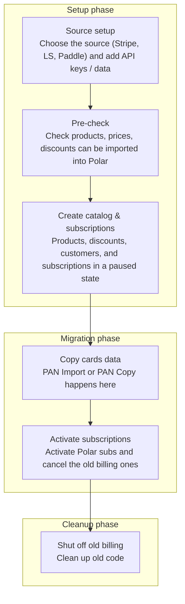

<Info>
**Status**: Draft

**Created**: 2026-06-15

**Last Updated**: 2026-06-15
</Info>

# Merchant Migrations to Polar

## Summary

We want merchants on Lemon Squeezy, Stripe, Paddle, and other providers to move their billing to Polar with minimal effort and minimal customer churn. This document proposes a new migration process.

A migration is divided into two things:
- **Catalog and data import**: products, benefits, discounts, and customers. This should be as automatic as possible.
- **Payment methods**: moving the payment methods is the hard part. We can use one of two Stripe mechanisms, PAN Copy or PAN Import; which one depends on the merchant's current billing provider.

## Background

### Acronyms
- PM: payment methods
- PAN: Primary Account Number (the raw card number); regulated information.

## Goals
- Migrate products, customers, subscriptions, and payment methods with minimal merchant effort.
- Surface incompatibility issues as an automatic precheck.
- Guarantee correct billing, pricing, trials, billing dates, etc.
- Minimize churn, e.g. avoid asking customers to re-enter their card details.

## Non-goals
- Introduce new billing methods as part of the subscription. If we cannot support the migration, we should flag it.

## Migration process

The migration is split into 3 phases. The **setup** phase, where the merchant creates a new migration, checks that everything is OK, and creates the catalog on the Polar side. The **migration** phase, where we copy the PAN information from the current billing provider to Polar's account, and Polar moves each subscription one by one. The **cleanup** phase: once enough subscriptions are moved, the merchant stops billing on the old provider and removes the old integration (code, keys).



## Moving cards: copy vs import

A saved card on the current billing provider needs to land on Polar's Stripe account. There are two options:

1. PAN Copy: the card already lives in the merchant's Stripe account, and Stripe provides a feature to copy Customers and Payment Methods from one Stripe account to another. This is self-served by the merchant and "fast", from a couple of hours to a few days depending on volume.
2. PAN Import: the card lives in another billing provider. The merchant, their current provider, Stripe, and us need to sync on what data moves and how. The copy is done between the provider and our Stripe; we don't see the data in flight. This usually takes weeks.

Most saved cards move, including Apple Pay. The exceptions: Google Pay can't be imported from a non-Stripe vault, and Bacs / legacy SEPA `source` objects don't copy (see Appendix D). For the ones that can't, we need customers to re-enter their billing details.

In this phase, some actions are done by the merchant, their billing provider, Stripe, or Polar. We should show the current status and where we're pending information.

## Switching subscriptions

Once we have the catalog and payment methods, we should be able to start moving subscriptions. Cutover only becomes available once the PAN checklist prep steps are complete; triggering it runs the final steps below.

Subscriptions keep their real status (`active`/`trialing`) but are held from billing with a `migration_billing_paused` flag, so the renewal scheduler skips them. The org must be in a renewal-enabled status (REVIEW or ACTIVE). Before activating each subscription we run some checks to prevent double charging the customer:

1. Check the subscription is still active on the current billing provider.
2. Confirm the renewal date is far enough out (24h safety window), so we don't clash with the old billing provider renewal.
3. Confirm the card is valid on Polar (with a SetupIntent).
4. Cancel the subscription on the old billing provider.
5. Clear the `migration_billing_paused` flag (the status stays as-is).

Polar will bill the next billing cycle. If for some reason the payment fails on the next billing cycle, the subscription will enter the normal dunning state where we send an email to the customer.

We import each subscription as tax-inclusive by setting its own `tax_behavior = inclusive`, leaving the org's `default_tax_behavior` untouched - renewal billing reads the per-subscription value and only falls back to the org default when it's null.

## The sources

We want to start with the following sources, and extend them to more if needed.

|                   | How we read it     | How cards move | Notes                           |
| ----------------- | ------------------ | -------------- | ------------------------------- |
| **Stripe**        | Restricted API key | PAN copy       |                                 |
| **Lemon Squeezy** | API key            | Not documented (likely re-enter) |                                 |
| **Paddle**        | API key            | PAN import     | They use Ixopay as a card vault |

## Implementation notes

### New module

The idea is to create a new `migration` module (I'm up for new name suggestions) with similar structure as we have now, with an `adapters` submodule.

### Main classes
- **`MigrationJob`** one row per migration run for an org. The root: source platform and current step.
- **`MigrationRecord`** one row per imported thing (customer, product, subscription, order, …), mapping `source_id → target_id` with a status. It's our idempotency layer, scoped per org, so we can trigger multiple migrations safely.
- **`SourceAdapter`** we will have one for every billing provider (e.g. `StripeAdapter`). Its main responsibility is to read the current billing provider API and provide a generic representation the migration service can work with. `extract()` must be incremental as customer data can be huge.
- **`PanTransferStep`** the checklist for moving cards (step, owner, status, kind, inputs - see Appendix B). Stored as a JSONB column on `MigrationJob`: a list of step objects.
- **`MigrationService`** the main orchestrator.
- **`CanonicalRecord`** to have everything normalized in memory first (variants: `CanonicalProduct` / `Customer` / `Subscription`). The precheck engine reads these and returns a `PrecheckReport` (Appendix A); Appendix C shows the flow end to end.

## Testing and rollout

We can't test this on sandbox: PAN Copy and PAN Import only run on Stripe live, so we validate against live production. (love the YOLO mode with money)

- Start with PAN Copy in live, using my own Stripe account (pepy.tech) as the source and migrating a small, real subscription set.
- Then add one more friendly merchant as a second case.
- Keep everything behind a feature flag, enabled only for those orgs during the testing phase and removed once we're confident.

## Open questions
1. Where and how should we store the API keys of Stripe, LS, Paddle? Do we have a convention to encrypt them?
2. Should we get notified when a migration is triggered?
3. How do we trigger the cutover on live? Resolved: a manual action via the checklist's cutover step (merchant; Ops can too), gated on checklist completion.
4. What happens with subscriptions we can't migrate? Resolved: the precheck flags them (`past_due`/`unpaid`/paused, uncopyable PMs); they stay on the old provider, staged as skipped, not imported.

(Decided: store the source subscription id in `user_metadata`; the customer keeps its Stripe id in `stripe_customer_id`.)

## Appendix A: Pre-checks

**Comments and suggestions welcome.**

Before importing, we should run the following checks.

- **Currency**
	- Blocker: there must be only one account currency. Multiple currencies can't be onboarded for now.
- **Pricing**
	- Blocker: only fixed prices are supported for now (tiered/dynamic pricing isn't - we can still import the rest).
- **Catalog**
	- Blocker: duplicate product names (in case of manual creation).
- **Customers**
	- Warning: duplicate emails (in case of manual creation), we will reuse the existing ones.
	- Warning: if we reuse a Polar customer by email but PAN copy preserves the source `cus_…`, the copied card lands under a different customer. We should reconcile `stripe_customer_id` on reuse.
- **Subscriptions**
	- Warning: mention subscriptions that are on trial.
- **Payments**
	- Warning: flag subscriptions with wallet, Bacs, or legacy SEPA `source` payments we need to ask the customer to re-enter the details.
- **Organization**
	- Blocker: organization must be in a renewal-enabled status (REVIEW or ACTIVE).

## Appendix B: The PAN transfer process

Moving cards can take weeks, so it's tracked as a checklist. Each migration has one or more `PanTransferSteps` showing what's done, in progress, and pending. Each step has an **owner** (merchant, Polar Ops, Polar App, Stripe, or the billing provider), a **status**, a **kind** (input / confirm / cutover / polar), a description, and typed **inputs**. Inputs we collect: source Stripe account ID (merchant), destination Stripe account ID (Polar/Ops; hardcoded in config for now), and maybe a csv files for PAN Imports. The steps depend on the transfer method:

### PAN copy (Stripe → Stripe)

| #   | Step                                                 | Owner     |
| --- | ---------------------------------------------------- | --------- |
| 1   | Share origin Stripe account                          | Merchant  |
| 2   | Share destination Stripe Id                          | Polar App |
| 3   | Trigger copy of PAN customers                        | Merchant  |
| 4   | Authorize the inbound copy onto Polar's account      | Polar Ops |
| 5   | Verify cards landed; link them back to subscriptions | Polar App |
| 6   | Trigger cutover                                      | Merchant  |
| 7   | Move subscriptions                                   | Polar App |

Some notes:
- Stripe Customer Ids are kept between Stripe accounts.
- Payment Method Ids are not kept (new `pm_…` id, same underlying card).

### PAN import (non-Stripe vault → Stripe)

| #   | Step                                                 | Owner                     |
| --- | ---------------------------------------------------- | ------------------------- |
| 1   | Exchange PCI information                             | Polar Ops                 |
| 2   | Request the data export from the old provider        | Merchant                  |
| 3   | File the Stripe migration request                    | Polar Ops                 |
| 4   | Send the PGP-encrypted vault to Stripe (transport TBC) | Billing provider        |
| 5   | Magic import happening                               | Stripe + Billing provider |
| 6   | Verify cards landed; link them back to subscriptions | Polar App                 |
| 7   | Trigger cutover                                      | Merchant                  |
| 8   | Move subscriptions                                   | Polar App                 |

Steps will advance depending on the owner:
1. Polar App: automatically.
2. Merchant: when filling information.
3. Polar Ops: manually from the backoffice.
4. Stripe / Billing Provider: by Polar Ops from the backoffice.

The merchant walks the checklist as a guided, one-step-at-a-time wizard and can only complete merchant-owned steps; Polar Ops-owned steps are completed by Ops in the backoffice. Values entered on one side are visible to the other.

## Appendix C: An implementation example

This shows how the classes communicate.

```python
# 1. read + normalize from the source
records = [r async for r in StripeAdapter(api_key="rk_live_…").extract()]
# records = [CanonicalProduct(...), CanonicalCustomer(...), CanonicalSubscription(...)]

# 2. precheck (no writes), then stage each record in the ledger
report = precheck.run(records, org)        # PrecheckReport(can_start=True, blockers=0, ...)
for r in records:
    repo.upsert(MigrationRecord(job_id=job.id, source_id=r.source_id, canonical=r))

# 3. import through the existing services (subscriptions created paused via the flag)
await product_service.import_from_canonical(canonical_product)
await subscription_service.import_from_canonical(canonical_subscription)
```

Card move (PAN copy) and the subscription migration are described under *Moving cards* and *Switching subscriptions*.

## Appendix D: Stripe → Polar

### Mapping

| Stripe | Polar | Notes |
|---|---|---|
| `cus_…` | new `Customer` + `stripe_customer_id` | PAN copy preserves `cus_…` (confirmed); `stripe_customer_id` is not DB-unique. |
| email / name / address / tax id | `Customer` fields | unique per org by lower-cased email. |
| Product + Price (`unit_amount`, `currency`) | `Product` + `ProductPriceFixed` | |
| `recurring.interval[_count]` | interval on the **`Product`** | recurrence lives on the product. |
| `sub_…` | `user_metadata['stripe_subscription_id']` | a `legacy_stripe_subscription_id` column exists, but we're not using it. |
| `items.data[].current_period_end`, `billing_cycle_anchor` | `current_period_end`, `anchor_day` | period moved onto the subscription **item** (API `2026-01-28.clover`); read it per item. `anchor_day` is day-of-month, so reduce the anchor timestamp. |
| `trial_*`, `cancel_at_period_end`, `default_payment_method` | same fields | |
| `discounts[]` (Coupon) | single `Discount` | not reliably on the sub object (came back empty on clover even when expanded). To be confirmed during implementation. |
| `pm_…` (card) | `PaymentMethod` (`processor_id`) | copied via PAN copy; new `pm_…` id, same underlying card. |
| Cards, ACH, SEPA `PaymentMethod` | `PaymentMethod` | copyable by PAN copy. |
| Apple Pay / Google Pay | `PaymentMethod` (`card`) | PAN copy: wallet-origin cards are `card` PMs and copy. PAN import: Apple Pay migrates can migrate as DPAN (but we need to ask Stripe and origin billing provider); Google Pay can't be imported. |
| Link / Bacs / legacy SEPA `source` | - | type `link`, Bacs, and legacy `src_` don't copy; Link-origin `card` PMs do. |
| Charges / refunds / disputes, Stripe Tax history | - | not copied; stay on Stripe. |

### Reading the account

We can't reuse Polar's platform Stripe service (it's bound to the global platform key). Read the merchant account with a dedicated `StripeClient(api_key="rk_…")`. Required restricted-key read and write scopes: Customers, Payment Methods, Products, Prices, (read and write)Subscriptions, Coupons (and Invoices / Charges for the refund/dispute precheck). Mention those scopes in the merchant UI.

### Stripe-specific prechecks

On top of the generic ones in Appendix A. What's unique to Stripe:

- **Manual:** source account is a Connect platform - only platform-account customers/PMs are copyable; anything on connected accounts is excluded.
- **Blocker:** India / RBI account - card data can't cross the border, so the PAN copy can't run (bidirectional).
- **Blocker:** tiered/graduated pricing (`billing_scheme=tiered`) can't be represented.
- **Blocker:** metered pricing (`usage_type=metered`) - to be implemented later (Stripe now requires a Billing Meter; legacy usage records are gone).
- **Blocker:** subscription with multiple line items - can't be represented.
- **Blocker:** `collection_method=send_invoice` - can't be handled.
- **Warning:** multiple discounts on a subscription - Polar supports one; keep one and flag the rest.
- **Warning:** `pause_collection` - no Polar paused subscriptions, don't import.
- **Warning:** `past_due` / `unpaid` - don't import.
- **Warning:** in-flight refunds / open disputes on an invoice - don't import, the money is still moving on Stripe.
