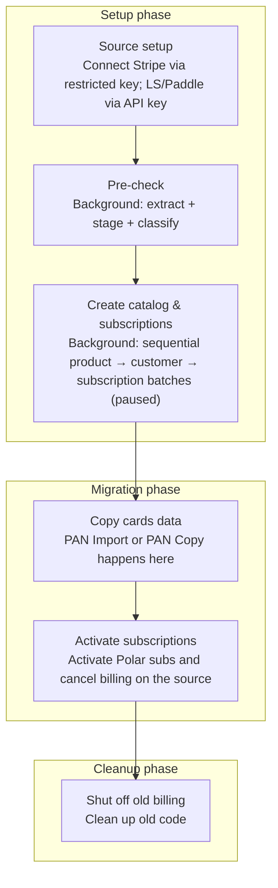
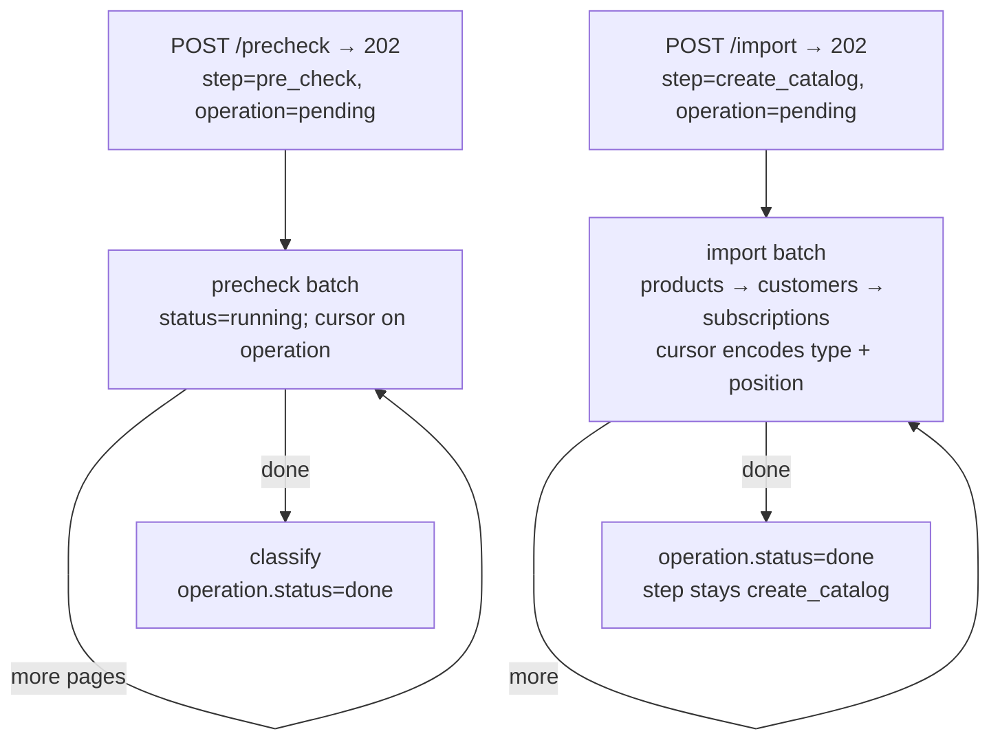

<Info>
**Status**: Draft

**Created**: 2026-06-15

**Last Updated**: 2026-08-12
</Info>

# Merchant Migrations to Polar

## Summary

We want merchants on Lemon Squeezy, Stripe, Paddle, and other providers to move their billing to Polar with minimal effort and minimal customer churn. This document proposes a new migration process.

A migration is divided into two things:
- **Catalog and data import**: products, benefits, discounts, and customers. This should be as automatic as possible.
- **Payment methods**: moving the payment methods is the hard part. We can use one of two Stripe mechanisms, PAN Copy or PAN Import; which one depends on the merchant's current billing provider.

## Background

### Acronyms
- PM: payment methods
- PAN: Primary Account Number (the raw card number); regulated information.

## Goals
- Migrate products, customers, subscriptions, and payment methods with minimal merchant effort.
- Surface incompatibility issues as an automatic precheck.
- Guarantee correct billing, pricing, trials, billing dates, etc.
- Minimize churn, e.g. avoid asking customers to re-enter their card details.

## Non-goals
- Introduce new billing methods as part of the subscription. If we cannot support the migration, we should flag it.

## Migration process

The migration is split into 3 phases. The **setup** phase, where the merchant creates a new migration, checks that everything is OK, and creates the catalog on the Polar side (precheck and catalog import run as background jobs — see *Background jobs: precheck & catalog import*). The **migration** phase, where we copy the PAN information from the current billing provider to Polar's account, and Polar moves each subscription one by one. The **cleanup** phase: once enough subscriptions are moved, the merchant stops billing on the old provider and removes the old integration (code, keys).


```mermaid
flowchart TB
  subgraph S["Setup phase"]
    A["Source setup<br/>Connect Stripe via restricted key; LS/Paddle via API key"]
    B["Pre-check<br/>Background: extract + stage + classify"]
    C["Create catalog & subscriptions<br/>Background: sequential product → customer → subscription batches (paused)"]
    A --> B --> C
  end
  subgraph M["Migration phase"]
    D["Copy cards data<br/>PAN Import or PAN Copy happens here"]
    E["Activate subscriptions<br/>Activate Polar subs and cancel billing on the source"]
    D --> E
  end
  subgraph CL["Cleanup phase"]
    F["Shut off old billing<br/>Clean up old code"]
  end
  C --> D
  E --> F
```

## Moving cards: copy vs import

A saved card on the current billing provider needs to land on Polar's Stripe account. There are two options:

1. PAN Copy: the card already lives in the merchant's Stripe account, and Stripe provides a feature to copy Customers and Payment Methods from one Stripe account to another. This is self-served by the merchant and "fast", from a couple of hours to a few days depending on volume.
2. PAN Import: the card lives in another billing provider. The merchant, their current provider, Stripe, and us need to sync on what data moves and how. The copy is done between the provider and our Stripe; we don't see the data in flight. This usually takes weeks.

Most saved cards move, including Apple Pay. The exceptions: Google Pay can't be imported from a non-Stripe vault, and Bacs / legacy SEPA `source` objects don't copy (see Appendix D). For the ones that can't, we need customers to re-enter their billing details.

In this phase, some actions are done by the merchant, their billing provider, Stripe, or Polar. We should show the current status and where we're pending information.

## Switching subscriptions

Once we have the catalog and payment methods, we should be able to start moving subscriptions. Cutover only becomes available once the PAN checklist prep steps are complete; triggering it runs the final steps below.

Imported subscriptions are created `paused` (we considered a separate `migration_billing_paused` flag alongside the real status, but reusing `paused` means the renewal scheduler already skips them for free). The org must be in a renewal-enabled status (REVIEW or ACTIVE). Weeks can pass between the import and the cutover, so every check reads the source again rather than trusting what was staged. Per subscription:

1. Re-read it on the source. It must still be `active`/`trialing`, on the same price, single line item, no coupon, still charged automatically, and not already set to cancel at period end.
2. Confirm the renewal date is far enough out (24h safety window), so we don't clash with the old billing provider renewal. The period we activate with is the one the source reports now, not the one captured at import.
3. Confirm the card is valid on Polar (a zero-amount `SetupIntent`, cards only — a bank debit needs a mandate the copy doesn't carry, so we accept it as-is).
4. Cancel the subscription on the old billing provider.
5. Activate on Polar, keeping the source's period so the first Polar charge lands on the renewal the customer already expects.

Only step 4 is irreversible, and every check is read-only, so a subscription that fails one is left billing on the source and paused on Polar, with a reason on its ledger row. A trial carries over as `trialing` until its end date.

**Retries.** One subscription per job, each in its own transaction (same one-task-one-transaction rule as import batches; see *Background jobs* and [ADR-0003](/engineering/decisions/0003-request-scoped-unit-of-work)). The cancellation is stamped with a marker (Stripe: `cancellation_details.comment`) so a run that dies between cancelling on the source and committing finishes the move on retry instead of reading its own cancellation as the customer having churned. `MerchantMigrationRecord.cutover_status` (`moved`/`skipped`/`failed`, null = not reached) is the ledger; retrying re-opens everything that isn't `moved`. When cutover workers are wired, reuse the import operation's `can_retry()` final-attempt write and stall-on-GET check for orchestration-level failure.

Polar will bill the next billing cycle. If for some reason the payment fails on the next billing cycle, the subscription will enter the normal dunning state where we send an email to the customer.

Before activating, we also decide each subscription's tax treatment and the customer's tax country. See the Taxes section below.

## Taxes

Migrating billing to Polar changes who computes tax. Many merchants on other providers don't charge tax at all; once on Polar, tax applies, either added on top or absorbed, depending on the tax behavior. Two things must be decided per subscription at import: the **tax behavior** (inclusive/exclusive) and the **customer's tax country**.

### Tax behavior

We mirror the source's tax treatment per subscription so the customer's total doesn't jump. Each subscription falls into one of these buckets:

- **Charges tax on top (exclusive):** import as exclusive, Polar keeps adding tax on top.
- **Tax included in the price (inclusive):** import as inclusive, keeping the customer's current total.
- **B2B reverse-charge / exempt:** the customer paid no tax because they're a VAT-registered business in another EU country (reverse charge) or are otherwise exempt, not because anyone absorbed it. Polar already supports reverse charge: it's not a stored flag but emergent from `Customer.tax_id` — Stripe Tax returns zero tax with `taxability_reason = reverse_charge` whenever a valid VAT ID from a different country is present. So the import action is just to **carry the source's VAT ID (Stripe `customer.tax_ids`, or `customer.tax_exempt = reverse`) onto `Customer.tax_id`**; reverse charge then re-derives itself at the first Polar renewal. Miss it and the customer gets re-taxed as B2C — a real new charge. (Note: Polar validates VAT ID format only, not VIES registry validity.)
- **No tax at all (merchant never charged it):** import as inclusive, keeping the customer's current total, so the merchant absorbs the tax on their end. This one is a **silent revenue cliff**: as merchant of record Polar is broadly tax-registered, so tax gets carved *out* of a price the merchant used to keep in full (a €10 sub at 20% VAT nets ~€8.33). We should surface the per-merchant impact and make this an explicit merchant opt-in, not a silent default.

Polar stores the resolved behavior on the subscription's `tax_behavior` (`inclusive`/`exclusive`), which overrides the product/price and org defaults, so a later change to those defaults doesn't shift an already-migrated subscription. (For reference, the org `location` default resolves to exclusive for `CA`/`IN`/`US` and inclusive elsewhere; we set the value explicitly rather than relying on it.)

Two caveats:

- **Inclusive/exclusive is an EU/VAT frame.** US sales tax is effectively always exclusive (added at checkout, destination-based with per-state nexus), so US customers should import as exclusive where there's nexus, not "inclusive, merchant absorbs".
- **Pre-registration grandfathering.** Customers who subscribed before the merchant was tax-registered may need to stay untaxed rather than be retroactively taxed. Polar already has `subscription.tax_exempted` for exactly this; decide the policy per migration.

Whatever the bucket, the change bites at the **first renewal on Polar**: an inclusive import lowers the merchant's net, an exclusive import raises the customer's charge (dunning/churn risk). Decide per bucket whether and how the customer is notified.

### Customer country

Polar computes tax **only** from `Customer.billing_address` — Stripe Tax is called with `address_source: "billing"`; the payment method and the customer IP are never consulted. `billing_address` is nullable, but when set, its `country` is required (the other lines are optional). So the minimum we need for correct tax is a country.

If a customer has no country when a renewal is billed, tax silently resolves to **zero**: the renewal path swallows the tax failure and bills the customer untaxed. That's a correctness and compliance risk, not a hard error, so we must resolve the country **at import** rather than discover it at the first renewal.

**The problem:** imported customers frequently arrive without a billing address. Merchants on other providers often never collected one, and PAN copy only carries the address that happened to be stored on the source (the customer's own `address`, or the card's `billing_details.address`); it's commonly null.

**Decision (from RFC discussion):** when a source customer has no billing address, we ask the **merchant to confirm the country**, pre-filled with the card country as a default they can change. Order of preference for the default:

1. Payment method `billing_details.address.country` (the cardholder's billing country) when present.
2. `card.country` (the card **issuer** country) as a fallback default only.

`card.country` is the issuer/bank country, not the cardholder's residence, and is a weak signal: a UK resident can hold a US-issued card. It is also not sufficient on its own for VAT place-of-supply (issuer country counts as at most one piece of evidence, and above €100k/year of cross-border B2C EU sales you need two non-contradictory pieces; below that, one suffices). We use it only as a pre-filled default the merchant reviews, never as a silent source of truth. Stripe itself only uses `card.country` to *supplement* an incomplete billing address, never alone.

During extraction we can also read Stripe's auto-derived `customer.tax.location` (with a `source` of `billing_address` / `payment_method` / `ip_address` / `shipping_destination`) to pre-fill a better default. This is opportunistic, not reliable: `tax.location` is only populated for merchants who enabled Stripe Tax, and many migrating merchants never did. When `customer.tax.automatic_tax` is `unrecognized_location`, `failed`, or `not_collecting`, we can't trust a derived location and should fall back to merchant (or customer) confirmation.

### Changing the country later

We want to let the country be edited for **future** orders. Polar's customer update already supports changing `billing_address` (used by the next renewal), with two constraints worth noting:

- Once a billing address is set, it can't be reset to null.
- An existing order's country/state is immutable; tax is locked at order-creation time.

So editing the country only affects renewals going forward, which is exactly the behavior we want.

## The sources

We want to start with the following sources, and extend them to more if needed.

|                   | How we read it     | How cards move | Notes                           |
| ----------------- | ------------------ | -------------- | ------------------------------- |
| **Stripe**        | Stripe App (OAuth) | PAN copy       | Read scopes + `subscription_write` for the cutover pause |
| **Lemon Squeezy** | API key            | (pending)      |                                 |
| **Paddle**        | API key            | PAN import     | They use Ixopay as a card vault |

## Implementation notes

### New module

The idea is to create a new `migration` module (I'm up for new name suggestions) with similar structure as we have now, with an `adapters` submodule.

### Main classes
- **`MigrationJob`** one row per migration run for an org. The root: source platform and current step.
- **`MigrationRecord`** one row per imported thing (customer, product, subscription, order, …), mapping `source_id → target_id` with a status. It's our idempotency layer, scoped per org, so we can trigger multiple migrations safely.
- **`SourceAdapter`** we will have one for every billing provider (e.g. `StripeAdapter`). Its main responsibility is to read the current billing provider API and provide a generic representation the migration service can work with. `extract()` must be incremental as customer data can be huge. It also stops billing on the source at cutover via `stop_source_subscription()`, the adapter's only write.
- **`PanTransferStep`** the checklist for moving cards (step, owner, status, kind, inputs - see Appendix B). Stored as a JSONB column on `MigrationJob`: a list of step objects.
- **`MigrationService`** the main orchestrator.
- **`CanonicalRecord`** to have everything normalized in memory first (variants: `CanonicalProduct` / `Customer` / `Subscription`). The precheck engine reads these and returns a `PrecheckReport` (Appendix A); Appendix C shows the flow end to end.

## Background jobs: precheck & catalog import

Precheck and catalog import must not run inside the HTTP request. Large Stripe catalogs time out at the gateway and violate [ADR-0003](/engineering/decisions/0003-request-scoped-unit-of-work) if a single task tries to import everything in one transaction. Both pipelines run as Dramatiq background jobs: batched self-reenqueue under the default ~60s worker time limit, same pattern as `meter.backfill_events`.

Cutover stays as specified under *Switching subscriptions* (one subscription per job). Reuse the thin operation status and `can_retry()` failure handling below when those workers are wired.

### Operation status JSON

No separate Job table. `MerchantMigration` holds a single JSONB **operation** (null only before any background work has started — typically while still on `source_setup`). `MerchantMigrationRecord` remains the per-entity ledger and source of progress counts.

| Field | Purpose |
| --- | --- |
| `status` | `pending` \| `running` \| `done` \| `failed` |
| `error` | Set when `failed` |
| `cursor` | Opaque resume point for the current chain (Stripe page cursor, or last processed record id / type phase). Persisted on the migration so a reenqueue only needs `migration_id`. Cleared or ignored once `done`. |
| `last_progress_at` | Bumped each successful batch; used to detect stalled ops |

**`step` names the phase; `operation.status` says where we are in that phase.** Starting an operation advances `step` to that phase immediately — they stay aligned. There is no separate `kind` on the operation (it would always duplicate `step`). Do **not** clear `operation` on success — set `status=done` so idle vs finished is explicit.

| `operation.status` | Meaning |
| --- | --- |
| `pending` | Enqueued; worker has not started (or not yet claimed) the first batch |
| `running` | A batch is in progress / chain is active |
| `done` | This step’s background work finished successfully |
| `failed` | Task exhausted retries or stall detected; merchant can retry |

| Moment | `step` | `operation` |
| --- | --- | --- |
| Connected, not started | `source_setup` | `null` |
| Precheck just enqueued | `pre_check` | `{status: pending, cursor: null}` |
| Precheck in flight | `pre_check` | `{status: running, cursor: …}` |
| Precheck finished — review records | `pre_check` | `{status: done}` |
| Precheck failed | `pre_check` | `{status: failed, error: …, cursor: …}` |
| Import just enqueued | `create_catalog` | `{status: pending, …}` |
| Import in flight | `create_catalog` | `{status: running, cursor: …}` |
| Import finished | `create_catalog` | `{status: done}` |
| Partial re-import | `create_catalog` | `{status: pending\|running}` again, then `done` |

Import selection (`record_ids` / `exclude_record_ids`) is applied when the import starts (mark or filter pending rows once). Workers then only process `pending` selected rows — no need to keep the full selection list on the operation.

### Two linear job chains

One Dramatiq task = one DB transaction. Prefer one self-reenqueuing actor per chain over a fan-out of named phase actors. Products then customers then subscriptions is sequential on purpose: products are few, and a barrier between parallel waves is more complexity than the wall-clock win.


```mermaid
flowchart TB
  StartPrecheck["POST /precheck → 202\nstep=pre_check, operation=pending"] --> Precheck["precheck batch\nstatus=running; cursor on operation"]
  Precheck -->|"more pages"| Precheck
  Precheck -->|"done"| Classify["classify\noperation.status=done"]

  StartImport["POST /import → 202\nstep=create_catalog, operation=pending"] --> Import["import batch\nproducts → customers → subscriptions\ncursor encodes type + position"]
  Import -->|"more"| Import
  Import -->|"done"| Finalize["operation.status=done\nstep stays create_catalog"]
```

**Precheck** — start endpoint locks the migration (`FOR UPDATE`), sets `step=pre_check` and `operation` (`status=pending`, empty cursor), enqueues the first batch. The first worker flips `status=running`, pages `adapter.extract()`, upserts ledger rows, writes the next `cursor` + `last_progress_at`, reenqueues. When extract is exhausted, classify with `PrecheckEngine`, set `operation.status=done` (step stays `pre_check` for review).

**Import** — same blockers as today; apply selection; set `step=create_catalog` and `operation` (`status=pending`); enqueue. Batches flip to `running` and import up to N pending selected records for the current type (products, then customers, then subscriptions — cursor carries which type and where). When nothing remains, set `operation.status=done` (step stays `create_catalog`). A later partial re-import sets `operation` back to `pending`/`running`, then `done` again, without changing `step`.

Actors live in `polar/merchant_migration/tasks.py`. Batch size ~25–50; tune later.

### Failures

| Layer | Behavior |
| --- | --- |
| **Record** | Mark ledger row `failed` + `error`; the batch continues. Does not fail the operation. |
| **Task** | On catchable errors: if `can_retry()`, re-raise; if not, set `operation.status=failed` + `error` in the same session, then re-raise/return. |
| **Stall** | On `GET` of the migration (while the client polls): if `operation.status` is `pending` or `running` and `last_progress_at` is older than a stall threshold (15–30 min; for `pending`, also use `started_at` / enqueue time if we store one), mark `failed`. Stale tasks that wake later no-op when they see `failed` or `done`. |

Unrecoverable start errors (blockers, wrong step, concurrent op) fail immediately with **409** / the existing status-coded errors — no enqueue.

### API

| Endpoint | Behavior |
| --- | --- |
| `POST /{id}/precheck` | Enqueue; **202** + migration (with `operation`). **409** if `operation.status` is already `pending` or `running`. |
| `POST /{id}/import` | Same; body still takes selection. |
| `GET /{id}` | Includes `operation`; may apply the stall check above. |
| `/records` + `/records/summary` | Unchanged; clients poll these for counts. |

Drop the sync import report as the mutation response body. Progress is the ledger + `operation`.

### UI (high level)

The dashboard should reflect that precheck/import are background work: the merchant can leave and come back. Poll the migration (and record summary) while `operation.status` is `pending` or `running`; within the current `step`, branch on `pending`/`running`/`done`/`failed` (+ retry). Detailed UI is out of scope for this design.

### Implementation follow-up

After acceptance, separate PR(s):

1. `operation` JSONB on `MerchantMigration` + Alembic.
2. `tasks.py` + start methods; endpoints return 202.
3. Batch APIs for extract/import (refactor today’s sync paths).
4. Thin dashboard wiring to poll and surface running/failed (not part of this design PR).
5. Tests: batching, cursor resume, concurrent start 409, final-retry failure, stall-on-GET.

## Testing and rollout

We can't test this on sandbox: PAN Copy and PAN Import only run on Stripe live, so we validate against live production. (love the YOLO mode with money)

- Start with PAN Copy in live, using my own Stripe account (pepy.tech) as the source and migrating a small, real subscription set.
- Then add one more friendly merchant as a second case.
- Keep everything behind a feature flag, enabled only for those orgs during the testing phase and removed once we're confident.

## Open questions
1. Where and how should we store the API keys of Stripe, LS, Paddle? **Resolved**: Use the secrets encryption pattern from `secrets-encryption.mdx` — wrap secrets in `EncryptedString` and map columns with `EncryptedStringType`.
2. Should we get notified when a migration is triggered?
3. How do we trigger the cutover on live? Resolved: a manual action via the checklist's cutover step (merchant; Ops can too), gated on checklist completion.
4. What happens with subscriptions we can't migrate? Resolved: the precheck flags them (`past_due`/`unpaid`/paused, uncopyable PMs); they stay on the old provider, staged as skipped, not imported.

(Decided: store the source subscription id in `user_metadata`; the customer keeps its Stripe id in `stripe_customer_id`.)

## Appendix A: Pre-checks

**Comments and suggestions welcome.**

Before importing, we should run the following checks.

- **Currency**
	- Blocker: there must be only one account currency. Multiple currencies can't be onboarded for now.
- **Pricing**
	- Blocker: only fixed prices are supported for now (tiered/dynamic pricing isn't - we can still import the rest).
- **Catalog**
	- Blocker: duplicate product names (in case of manual creation).
- **Customers**
	- Warning: duplicate emails (in case of manual creation), we will reuse the existing ones.
	- Warning: if we reuse a Polar customer by email but PAN copy preserves the source `cus_…`, the copied card lands under a different customer. We should reconcile `stripe_customer_id` on reuse.
	- Warning: no billing country (source had no address). We ask the merchant to confirm it; see *Taxes* for the defaults and why it matters.
- **Subscriptions**
	- Warning: mention subscriptions that are on trial.
- **Payments**
	- Warning: flag subscriptions with wallet, Bacs, or legacy SEPA `source` payments we need to ask the customer to re-enter the details.
- **Organization**
	- Blocker: organization must be in a renewal-enabled status (REVIEW or ACTIVE).

## Appendix B: The PAN transfer process

Moving cards can take weeks, so it's tracked as a checklist. Each migration has one or more `PanTransferSteps` showing what's done, in progress, and pending. Each step has an **owner** (merchant, Polar Ops, Polar App, Stripe, or the billing provider), a **status**, a **kind** (input / confirm / cutover / polar), a description, and typed **inputs**. Inputs we collect: source Stripe account ID (merchant), destination Stripe account ID (Polar/Ops; hardcoded in config for now), and maybe a csv files for PAN Imports. The steps depend on the transfer method:

### PAN copy (Stripe → Stripe)

| #   | Step                                                 | Owner     |
| --- | ---------------------------------------------------- | --------- |
| 1   | Share origin Stripe account                          | Merchant  |
| 2   | Share destination Stripe Id                          | Polar App |
| 3   | Trigger copy of PAN customers                        | Merchant  |
| 4   | Authorize the inbound copy onto Polar's account      | Polar Ops |
| 5   | Verify cards landed; link them back to subscriptions | Polar App |
| 6   | Trigger cutover                                      | Merchant  |
| 7   | Move subscriptions                                   | Polar App |

Some notes:
- Stripe Customer Ids are kept between Stripe accounts.
- Payment Method Ids are not kept (new `pm_…` id, same underlying card).

### PAN import (non-Stripe vault → Stripe)

| #   | Step                                                 | Owner                     |
| --- | ---------------------------------------------------- | ------------------------- |
| 1   | Exchange PCI information                             | Polar Ops                 |
| 2   | Request the data export from the old provider        | Merchant                  |
| 3   | File the Stripe migration request                    | Polar Ops                 |
| 4   | Send the PGP-encrypted vault to Stripe (transport TBC) | Billing provider        |
| 5   | Magic import happening                               | Stripe + Billing provider |
| 6   | Verify cards landed; link them back to subscriptions | Polar App                 |
| 7   | Trigger cutover                                      | Merchant                  |
| 8   | Move subscriptions                                   | Polar App                 |

Steps will advance depending on the owner:
1. Polar App: automatically.
2. Merchant: when filling information.
3. Polar Ops: manually from the backoffice.
4. Stripe / Billing Provider: by Polar Ops from the backoffice.

The merchant walks the checklist as a guided, one-step-at-a-time wizard and can only complete merchant-owned steps; Polar Ops-owned steps are completed by Ops in the backoffice. Values entered on one side are visible to the other.

## Appendix C: An implementation example

This shows how the classes communicate. Extraction and import are **batched in background workers** in production (see *Background jobs: precheck & catalog import*); the snippet below is the logical flow, not the HTTP request body.

```python
# 1. read + normalize from the source (incremental; each extract_batch pages + stages)
#    Stripe: mint a short-lived access token from the stored OAuth refresh token
token = await stripe_oauth.refresh(job.source_refresh_token)  # rotates; persist token.refresh_token
records = [r async for r in StripeAdapter(api_key=token.access_token).extract()]
# records = [CanonicalProduct(...), CanonicalCustomer(...), CanonicalSubscription(...)]

# 2. precheck against the staged ledger, then classify (precheck.classify task)
report = precheck.run(records, org)        # PrecheckReport(can_start=True, blockers=0, ...)
for r in records:
    repo.upsert(MigrationRecord(job_id=job.id, source_id=r.source_id, canonical=r))

# 3. import through the existing services in sequential type batches
#    (products → customers → subscriptions; cursor on the migration operation)
await product_service.import_from_canonical(canonical_product)
await subscription_service.import_from_canonical(canonical_subscription)
```

Card move (PAN copy) and the subscription migration are described under *Moving cards* and *Switching subscriptions*. Cutover workers follow the same one-entity-per-job and ledger patterns as the import batches.

## Appendix D: Stripe → Polar

### Mapping

| Stripe | Polar | Notes |
|---|---|---|
| `cus_…` | new `Customer` + `stripe_customer_id` | PAN copy preserves `cus_…` (confirmed); `stripe_customer_id` is not DB-unique. |
| email / name / address / tax id | `Customer` fields (`billing_address`, `tax_id`) | unique per org by lower-cased email. Carry over `tax_ids` / `tax_exempt` for B2B reverse-charge (see *Taxes*); default a missing country from the card. |
| Product + Price (`unit_amount`, `currency`) | `Product` + `ProductPriceFixed` | |
| `recurring.interval[_count]` | interval on the **`Product`** | recurrence lives on the product. |
| `sub_…` | `user_metadata['stripe_subscription_id']` | a `legacy_stripe_subscription_id` column exists, but we're not using it. |
| `items.data[].current_period_end`, `billing_cycle_anchor` | `current_period_end`, `anchor_day` | period moved onto the subscription **item** (API `2026-01-28.clover`); read it per item. `anchor_day` is day-of-month, so reduce the anchor timestamp. |
| `trial_*`, `cancel_at_period_end`, `default_payment_method` | same fields | |
| tax behavior (`default_tax_rates` / inclusive / none) | `subscription.tax_behavior` (+ `tax_exempted`) | set explicitly per source bucket at import (see *Taxes*). |
| `discounts[]` (Coupon) | single `Discount` | not reliably on the sub object (came back empty on clover even when expanded). To be confirmed during implementation. |
| `pm_…` (card) | `PaymentMethod` (`processor_id`) | copied via PAN copy; new `pm_…` id, same underlying card. |
| Cards, ACH, SEPA `PaymentMethod` | `PaymentMethod` | copyable by PAN copy. |
| Apple Pay / Google Pay | `PaymentMethod` (`card`) | PAN copy: wallet-origin cards are `card` PMs and copy. PAN import: Apple Pay migrates can migrate as DPAN (but we need to ask Stripe and origin billing provider); Google Pay can't be imported. |
| Link / Bacs / legacy SEPA `source` | - | type `link`, Bacs, and legacy `src_` don't copy; Link-origin `card` PMs do. |
| Charges / refunds / disputes, Stripe Tax history | - | not copied; stay on Stripe. |

### Reading the account

We can't reuse Polar's platform Stripe service (it's bound to the global platform key). Read the merchant account with a dedicated `StripeClient(api_key="rk_…")`. Required restricted-key read and write scopes: Customers, Payment Methods, Products, Prices, (read and write)Subscriptions, Coupons (and Invoices / Charges for the refund/dispute precheck). Mention those scopes in the merchant UI.

### Stripe-specific prechecks

On top of the generic ones in Appendix A. What's unique to Stripe:

- **Manual:** source account has Connect accounts - only platform-account customers/PMs are copyable; anything on connected accounts is excluded. A platform with no connected accounts is not flagged: Stripe answers the list call with an empty list for a non-platform, so the call succeeding proves nothing.
- **Blocker:** India / RBI account - card data can't cross the border, so the PAN copy can't run (bidirectional).
- **Blocker:** tiered/graduated pricing (`billing_scheme=tiered`) can't be represented.
- **Blocker:** metered pricing (`usage_type=metered`) - to be implemented later (Stripe now requires a Billing Meter; legacy usage records are gone).
- **Blocker:** subscription with multiple line items - can't be represented.
- **Blocker:** `collection_method=send_invoice` - can't be handled.
- **Warning:** multiple discounts on a subscription - Polar supports one; keep one and flag the rest.
- **Warning:** `pause_collection` - no Polar paused subscriptions, don't import.
- **Warning:** `past_due` / `unpaid` - don't import.
- **Warning:** in-flight refunds / open disputes on an invoice - don't import, the money is still moving on Stripe.

### Connecting the source (merchant-pasted restricted key)

The merchant pastes a Stripe **restricted API key** (`rk_…`) when creating the migration. We validate up front that it holds every required permission (by exercising each one — Stripe has no key-introspection endpoint), then store it encrypted (`EncryptedString`) and read the account with it directly. No OAuth, no Stripe App.

We originally built a Polar Stripe App (one-click OAuth), but Stripe does **not** let a Connect platform account (which Polar is) own the public app that external-merchant OAuth requires. So we fell back to the pasted-restricted-key approach this doc's Appendix D always contemplated.

Required permissions, validated before the migration is saved (matching what `extract()` reads plus the cutover pause): Customers, Products, Prices, Subscriptions (read **and write**), Payment methods. Coupons / promotion codes and charge / invoice reads will be added when discount import and the refund/dispute precheck land. Validation fails closed: a transient Stripe error rejects the key rather than accepting it unchecked.
