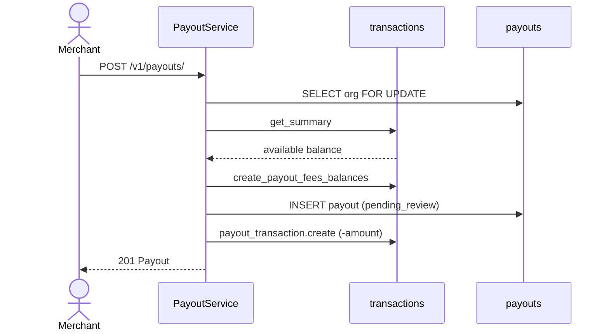
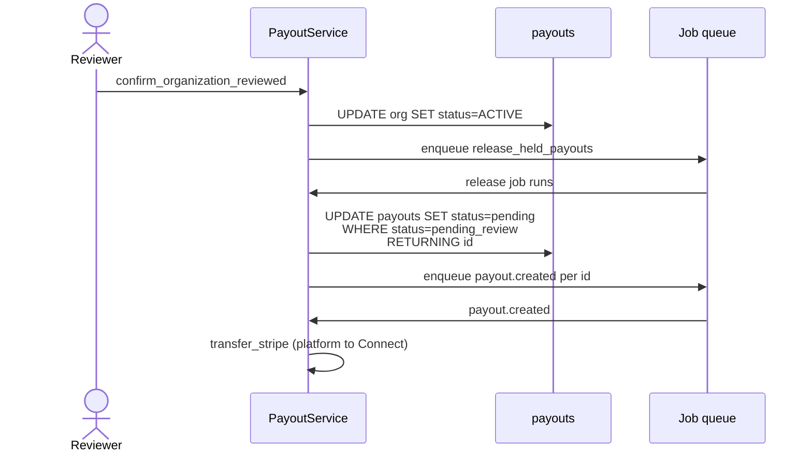
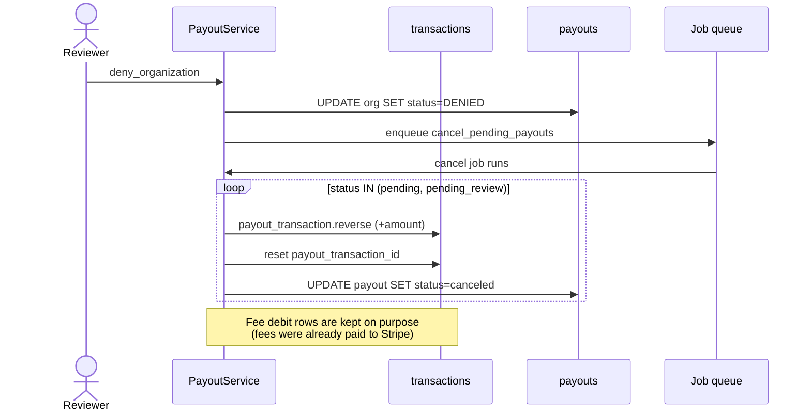

<Info>
  **Created**: 2026-05-27

  **Last Updated**: 2026-05-27
</Info>

## Summary

An organization under review cannot request a payout today. Merchants open Plain tickets to escalate the review just to access their money. This RFC removes the block. Orgs in `REVIEW` or `SNOOZED` can request payouts, which are held as `pending_review` until the org is approved, then released automatically. Held payouts also boost their org's review priority. The merchant dashboard does not differentiate held from immediate payouts, the hold is an internal state.

## Goals

- REVIEW and SNOOZED orgs can request a payout with the same UX as an ACTIVE org.
- The requested amount is reserved at request time, exactly as it is today for ACTIVE orgs.
- The Stripe transfer only runs after the org has been approved.
- A held payout boosts the org's priority in the backoffice review queue.
- When the org is approved, every held payout is released and follows the regular Stripe flow.
- When the org is denied, blocked or offboarded, every in-flight payout is canceled and funds return to the available balance.

## Non-goals

- No per-payout review queue. Hold transitions follow the org review outcome.
- No new payout-related webhook events.
- No signal-based gating on `ACTIVE` orgs (that fits into [#121](https://github.com/polarsource/feedback/issues/121)).
- No appeal flow for held payouts. A canceled payout returns funds, and the merchant can request again if they get approved.
- No merchant-facing cancel endpoint. Backoffice cancel is enough for now.
- No change to `CREATED`, `DENIED` or `OFFBOARDING` orgs. OFFBOARDING in particular needs its own end-of-life flow, so we explicitly leave it out of this RFC.

## Design

### The change in one paragraph

We add a new value `pending_review` to `PayoutStatus`. Inside `PayoutService.create`, we branch on the org status: an `ACTIVE` org follows today's path and the payout is created as `pending` with `payout.created` enqueued. A `REVIEW` or `SNOOZED` org takes a new path, where the payout is created as `pending_review` and we do not enqueue `payout.created` yet. We then have two background that are triggered when org status changes. The first one, `organization.release_held_payouts`, runs when the org is approved and moves held payouts back to `pending` so they follow the regular Stripe flow. The second one, `organization.cancel_pending_payouts`, runs when the org is denied, blocked or offboarded, and cancels any in-flight payout on the account. Finally, we add a priority boost to the backoffice review queue so that orgs with held payouts are reviewed sooner.

### Capability flip

Today, the capability map `STATUS_CAPABILITIES` only has `payouts: True` for `ACTIVE`. We flip it to `True` for `REVIEW` and `SNOOZED` as well. This changes the meaning of `organization.capabilities.payouts`: from now on, it means "the merchant is allowed to request a payout". The distinction between held and immediate now lives inside `PayoutService.create`, based on the org status:

| Org status | `PayoutService.create` behavior |
|---|---|
| `ACTIVE` | Today's path. The payout is created as `pending` and the `payout.created` actor is enqueued right away. |
| `REVIEW`, `SNOOZED` | New path. The payout is created as `pending_review`. The `payout.created` actor is **not** enqueued. The balance reservation is identical to today. |
| `CREATED`, `DENIED`, `OFFBOARDING`, `BLOCKED` | These are still blocked. The exception is renamed from `OrganizationUnderReview` to `OrganizationCannotPayout`, with a message that matches the actual status (today's message says "under review" for all of them, which has always been incorrect). |

### Sequence diagrams

The three flows below cover the lifecycle of a held payout: request, release on approval, and cancellation.

**1. Request, while the org is in REVIEW or SNOOZED:**



**2. Release on approval (REVIEW or SNOOZED to ACTIVE):**



**3. Cancel (org denied, blocked, offboarded, or backoffice cancel):**



### Concurrency

There is one race we have to handle. A merchant could click Withdraw at almost the same time as a reviewer approves the org. If the approval lands between the moment `PayoutService.create` reads the org status and the moment it inserts the payout, the new payout could end up as `pending_review` on an org that is already `ACTIVE`, and nothing would ever release it.

To prevent this, `PayoutService.create` starts with `SELECT ... FOR UPDATE` on the org row. If an approval transaction is in flight, the create waits until the approval commits, then re-reads the org row, sees `status=ACTIVE`, and takes the regular path.

### Balance mechanics

Polar does not store the merchant's "available balance" anywhere. Instead, it is computed on every read by `TransactionService.get_summary`, as a filtered `SUM(amount)` over the `transactions` table. When `PayoutService.create` runs, it writes a few negative-amount rows that reduce that sum right away, whether the payout is `pending` or `pending_review`. The hold does not change ledger behavior at all, it only changes whether `payout.created` is enqueued.

On cancellation, the gross payout amount is reversed and returns to the available balance. The per-payout fee debits are kept on purpose, because those fees have already been paid to Stripe. The full ledger details are in [Appendix A](#appendix-a-balance-mechanics).

A held payout consumes the `account.payout_interval` cooldown like any other payout. If the payout is canceled, the cooldown clears immediately because `canceled` is excluded from `get_latest_by_account`. We do not send any notification on cancellation as the org review is already communicated by the reviewer via Plain.

### Review-queue boost

We add a new signal `has_pending_review_payouts` to `review_priority.compute(...)`. The signal adds `+25` to the org's priority score per held payout. The boost is additive so an org with strong risk signals but no held payout can still outrank an org with one.

In addition, the backoffice payouts list gets a status badge for `pending_review`, and the "Set Under Review" dialog bullet is rewritten from "Block payouts while the organization is under review" to represent the new behavior.

### Stuck-hold recovery and SLA

A held payout should only exist while its org is in `REVIEW` or `SNOOZED`, and it should not sit there for too long. We set an internal SLA: no held payout should be older than 5 days. A daily Metabase query catches any payout that crosses the SLA, including ones that are stuck because of a failed release or cancel job. The full description is in [Appendix B](#appendix-b-stuck-hold-recovery-and-sla).

### Merchant UX (transparent)

The merchant dashboard does not differentiate held payouts from normal ones. The Withdraw button, the modal, and the Pending pill in the payouts table are the same. The blocker copy in `WithdrawModal` is updated so it no longer says "under review" for everyone, because the blocker now only catches `CREATED`, `DENIED`, `OFFBOARDING` and `BLOCKED`.

In the frontend, `PayoutStatus.tsx` maps the new `pending_review` value to the same "Pending" label and amber color as `pending`. The merchant sees one status, not two.

The only place where `pending_review` is visible is the public API and the SDK enum. Any merchant reading the payout response will see the new value. See [Appendix D](#appendix-d-public-api-contract-changes).

### Documentation

We need a few small copy edits. Two public doc pages and one frontend component still say payouts are "paused" during review, which is no longer accurate. The edits land in PR 5.

## What ships, in order

| PR | Scope |
|---|---|
| 1 | Add `PayoutStatus.pending_review` to the Python enum. Extend the `payout_status_update` trigger guard via an `alembic_utils` revision. No behavior change yet. |
| 2 | Backend: capability flip, three-way branch in `PayoutService.create` with `SELECT ... FOR UPDATE`, repository query fixes (see [Appendix E](#appendix-e-repository-queries-to-fix)), the `OrganizationUnderReview` to `OrganizationCannotPayout` rename plus the test parametrization update, and the release/cancel jobs wired into `confirm_organization_reviewed`, `deny_organization`, `block_organization`, and `set_organization_offboarding`. |
| 3 | Backoffice: status badge, priority signal, "Release" recovery action, the rewritten "Set Under Review" dialog bullet, and a Metabase question with a daily Slack alert that flags any held payout older than 5 days. |
| 4 | Frontend: `WithdrawModal` blocker copy, `AIValidationResult` PASS copy, and the `PayoutStatus` mapping for the new enum value. |
| 5 | Docs: the two public doc pages and the AIValidationResult component copy, plus a changelog entry for the public-API value flips. |

PRs 2 to 5 can land in any order after PR 1, with the only constraint that PR 4 lands after PR 2.

As a rollback lever, we gate the new path behind a feature flag, `PAYOUT_REVIEWS_ENABLED` (org-level boolean). When the flag is disabled, the code falls back to the old `can_payout` block.

On volume: opening the flow to REVIEW and SNOOZED will increase the daily payout volume. Most of that increase will replace support tickets, which moves work from Plain to the backoffice queue, where the held-payout signal pulls the org to the top.

## Open questions

- **Cancellation telemetry.** Should we record a `cancel_reason` enum on every cancellation (`org_denied`, `org_blocked`, `org_offboarded`, `backoffice_manual`)? The value it provides is low.
- **Naming.** `pending_review` keeps the connection to "org review" obvious. Alternatives like `held`, `awaiting_release` or `on_hold` read better in the SDK. The current decision is to keep `pending_review`, but we can revisit if internal feedback pushes back.
- **Connect-account swap during the hold window.** `Payout.payout_account_id` is set at creation. If a merchant rebinds their Stripe Connect account while a held payout is sitting, the release flow would transfer to the old account. The proposed behavior is to cancel held payouts on `set_payout_account` and let the merchant request again. The downside is that the merchant pays the fees again on the new request, since fees from the canceled payout are kept on purpose (see [Appendix A](#appendix-a-balance-mechanics)). We need to confirm this during PR 2.
- **Organization-token requests.** The create endpoint is `User`-only today, and the hold flow does not change that. We just want to confirm we are not accidentally widening the surface.

---

## Appendix A: Balance mechanics

### How the available balance is computed

Polar does not have a balance column anywhere. The available balance is computed on demand by `TransactionService.get_summary`, as a filtered `SUM(Transaction.amount)` over the `transactions` table for the merchant's account. A transaction row counts toward the available balance if any of these is true:

- `type == payout`
- `platform_fee_type IN (account, cross_border_transfer, payout)`
- `created_at + account.payout_transaction_delay <= now()`

### How `PayoutService.create` deducts the balance

When a merchant requests a payout, `PayoutService.create` writes three groups of rows on the ledger, all before the function returns. This is the same whether the payout ends up as `pending` or `pending_review`.

1. **Fee debits.** `create_payout_fees_balances` ([server/polar/transaction/service/platform_fee.py](server/polar/transaction/service/platform_fee.py)) inserts up to three balance pairs, one per applicable fee (`account`, `cross_border_transfer`, `payout`). Each pair is a merchant-side debit and a Polar-side credit. The merchant-side rows count toward the available balance via the `platform_fee_type` arm.
2. **The Payout row.** A row is inserted in the `payouts` table with `amount = balance_after_fees` and `fees_amount = balance - balance_after_fees`.
3. **The payout transaction.** `payout_transaction_service.create` inserts one `Transaction(type=payout, amount=-payout.amount)`. This row counts toward the available balance via the `type == payout` arm.

### What happens on cancel

`PayoutService.cancel` inserts a `payout_reversal` row equal to `+payout.amount` and unlinks the previously-settled balance rows. This returns the gross payout amount to the available balance.

The fee debit rows from step 1 above are **not** reversed. This is on purpose: those fees were already paid to Stripe at the time of the underlying transactions, so they stay on the merchant's ledger regardless of whether the payout completes or gets canceled. The consequence is that a merchant who requests a held payout and ends up canceling it (because the org was denied, for example) does not get those fees back. If they request a new payout later, a fresh set of fees is deducted.

### FX and currency drift

For non-USD payouts, the `account_amount` is set at `transfer_stripe` time, based on the Stripe `BalanceTransaction`. This means the FX rate is locked at release, not at request. If the rate moves while the payout is held, the merchant could see a slightly different amount than the original estimate. The WithdrawModal copy stays generic to acknowledge this. The shape of the issue is the same as today's `pending` to `in_transit` window, just over days rather than seconds.

---

## Appendix B: Stuck-hold recovery and SLA

**Invariant.** A `pending_review` payout should only exist while its org is in `REVIEW` or `SNOOZED`, and should not stay that way for more than 5 days. This is enforced by the `SELECT ... FOR UPDATE` in `PayoutService.create`, the release and cancel jobs, and the two safeguards below.

**1. Metabase alert.** A Metabase question runs once a day and posts to the payouts Slack channel if any row comes back:

```sql
SELECT id, account_id, created_at
FROM payouts
WHERE status = 'pending_review'
  AND created_at < now() - interval '5 days';
```

The query is intentionally simple: any held payout older than 5 days is either a stuck row or a review that is taking too long. Both cases need a human to look at them, so we route them to the same alert.

**2. Backoffice Release action.** The backoffice payout detail page gets a new "Release" action. It is only available when the payout is `pending_review` and the org is `ACTIVE`. When clicked, it re-enqueues `organization.release_held_payouts` for that one payout. For non-ACTIVE stuck states the right action is Cancel, which is already on the page.

---

## Appendix C: Trigger and schema

`Payout.status` is a `sa.String()` column backed by a Python `StringEnum`, not a Postgres ENUM. This means adding `pending_review` is a code-only change. There is no `ALTER TYPE`, no column rewrite, and no data migration.

The `payout_status_update_trigger` Postgres trigger ([server/polar/models/payout_attempt.py](server/polar/models/payout_attempt.py)) keeps `payouts.status` in sync with the latest `payout_attempt`. It already has one early-return guard preserving `canceled`:

```sql
IF current_status = 'canceled' THEN
    RETURN NEW;
END IF;
```

PR 1 extends the guard via an `alembic_utils` revision:

```sql
IF current_status IN ('canceled', 'pending_review') THEN
    RETURN NEW;
END IF;
```

The trigger itself never produces `pending_review`. The new value is only set by application code at creation, and only cleared by application code on release.

---

## Appendix D: Public API contract changes

This RFC introduces two changes that are observable from the public API. Neither is breaking, but both deserve a changelog line so integrators are not surprised.

- **`Organization.capabilities.payouts` flips from `false` to `true` for orgs in REVIEW or SNOOZED.** Any integration that used this field as a proxy for "the org is under review" loses that signal. The correct signal going forward is `Organization.status`, which already exposes `review` and `snoozed` directly.
- **`PayoutStatus` gains `pending_review`** in the SDK and the OpenAPI spec. The `organization.updated` webhook payload shape is unchanged, but consumers should expect to see the new value on payout objects.

---

## Appendix E: Repository queries to fix

Both fixes live in [server/polar/payout/repository.py](server/polar/payout/repository.py) and land in PR 2:

- **`get_all_stripe_pending`.** We tighten the status filter from `not_in([canceled, succeeded])` to `== pending`. Otherwise the hourly Stripe-transfer cron picks up `pending_review` rows and wastes one `retrieve_balance` call per hour for each held payout.
- **`count_pending_by_payout_account`.** We extend the count to also include `pending_review`. Otherwise `PayoutAccountService.delete` would let a merchant delete a payout account that still has funds reserved against it.
