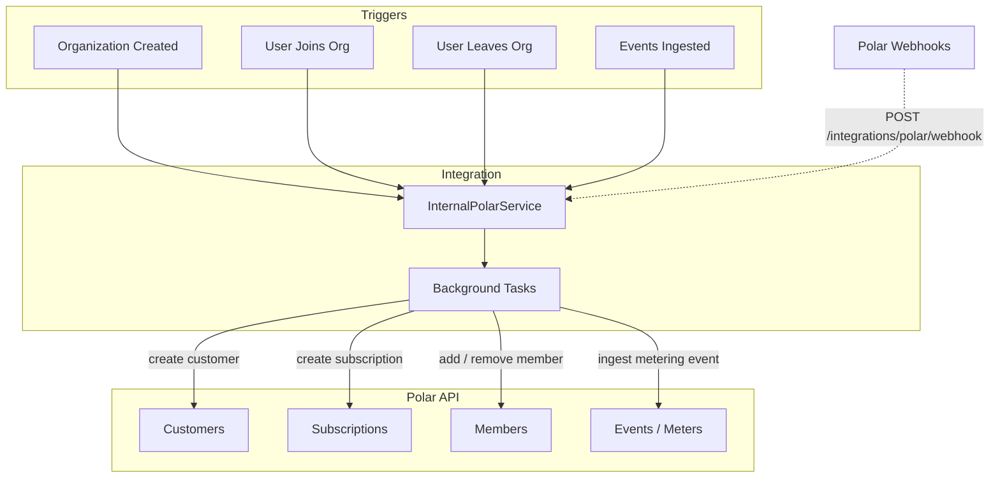
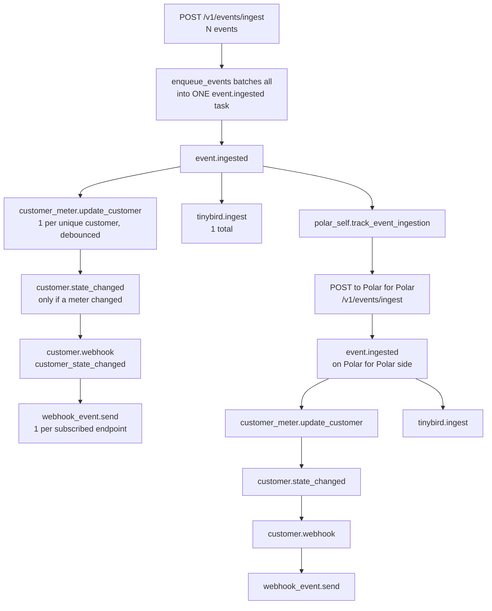
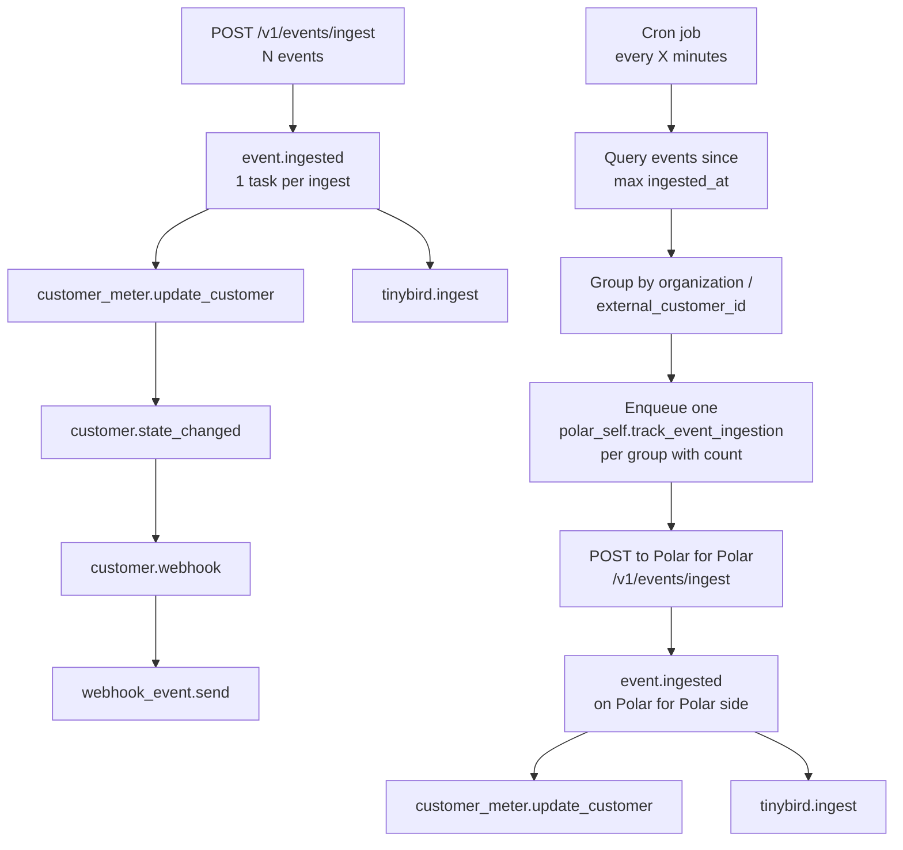

<Info>
**Status**: Draft
**Created**: March 2026
**Last Updated**: May 2026
</Info>

## Summary

We want to start using Polar as the billing platform for Polar. This will put us closer to where our customers are and make us understand our own product better.
Every Polar organization becomes a **customer** of our own Polar-for-Polar organization, organization members become **members** on those customers, and event ingestion is **metered** for usage-based billing.

## Goals

- Use Polar's own APIs (customers, subscriptions, members, events) to manage our billing relationship with organizations.
- Track organization membership via the Polar member model so members have access to the customer portal.
- Meter event ingestion per organization for future usage-based billing.
- Receive webhooks from Polar to sync state changes back.
- All changes are safe to deploy incrementally — no big bang migration.

## Non-Goals

- Implementing paid plans or actual billing. This design covers the free tier and the infrastructure to support paid plans later.
- Building a custom billing UI. Organizations will use the standard Polar customer portal.
- Replacing existing internal analytics (Tinybird, PostHog). Metering is for billing, not observability.

## Key Concepts

- **"Our Polar org"**: The Polar organization that represents us as a company. Separate orgs exist for production and sandbox.
- **`external_customer_id`**: Instead of storing a Polar customer ID on the Organization model, we use the org's UUID as the `external_customer_id` when calling the Polar API.
- **`external_id` on members**: Similarly, user UUIDs become `external_id` on Polar members.

## Architecture



## Mapping

| Polar concept | Our concept | Identifier |
|---|---|---|
| Customer | Organization | `external_id = str(org.id)` |
| Member | User in organization | `external_id = str(user.id)` |
| Subscription | Free subscription tier) | Created per organization |
| Metering event | Batch of ingested events | `external_customer_id = str(organization.id)` |

## Meter

### Initial plan

The initial plan was to act on every ingested event while still bundling them. So if an organization would ingest 200 events via POST /v1/events/ingest, we would then create a single event called `event_ingestion` with the metadata `{ "count": 24 }`. If they only ingested a single event it would be 1:1 between the ingest call and the ingest call toward Polar for Polar.

However this quickly spiraled out of control since every ingest call triggers the `event.ingested` task, which in turn triggers `customer_meter.update_customer` and `tinybird.ingest` as well as the new `polar_self.track_event_ingestion`. This meant that every event ingestion potentially triggered 14+ tasks.



### Alternative suggestion

Two alternative suggestions were raised:
* Use debounce on `polar_self.track_event_ingestion` so that we don't trigger new tracking tasks until the last one has been processed.
* Have a cron job that goes through the events ingested since last ingestion and trigger a `polar_self.track_event_ingestion` for those.

The decision was made to use the cron job for now. This ensures that there is no cascading effect independent on the number of events ingested by any single organization.



This also ensures that there is no special handling needed for the Polar-for-Polar organization. The event ingestion excludes the Polar organization, but for all of the other event tracking that we want to do it gets handled the same way in the event ingestion flow.

## Webhooks

To handle changes for the customer in Polar (e.g. purchase, cancelation, etc), the Polar application will listen to webhooks from Polar.

#### Endpoint

Create `server/polar/integrations/polar/endpoints.py`:

```python
router = APIRouter(
    prefix="/integrations/polar",
    tags=["integrations_polar"],
    include_in_schema=False,
)

@router.post("/webhook", status_code=202)
async def webhook(
    request: Request,
    session: AsyncSession = Depends(get_db_session),
) -> None:
    # Verify signature using standardwebhooks
    # Parse event type from payload
    # Enqueue via external_event_service.enqueue(
    #     session, ExternalEventSource.polar, task_name, event_id, data
    # )
```

Signature verification uses the `standardwebhooks` library (already a dependency — it's how Polar signs outbound webhooks).

#### ExternalEvent Integration

Add `polar = "polar"` to the `ExternalEventSource` enum and a polymorphic subclass:

```python
class PolarSelfEvent(ExternalEvent):
    source: Mapped[Literal[ExternalEventSource.polar]] = mapped_column(
        use_existing_column=True, default=ExternalEventSource.polar
    )
    __mapper_args__ = {
        "polymorphic_identity": ExternalEventSource.polar,
        "polymorphic_load": "inline",
    }
```

#### Webhook Handlers

Initially handle a minimal set of events, with stubs for future expansion:

```python
IMPLEMENTED_WEBHOOKS = {
    "customer.created",
    "customer.updated",
    "subscription.active",
    "subscription.canceled",
}

@actor(actor_name="polar_internal.webhook.customer.updated", priority=TaskPriority.LOW)
async def customer_updated(event_id: uuid.UUID) -> None:
    async with AsyncSessionMaker() as session:
        async with external_event_service.handle(
            session, ExternalEventSource.polar, event_id
        ) as event:
            pass  # Future: sync customer state back
```


## Implementation

The implementation will happen in multiple steps:

1. Config + Integration Module — Add POLAR_* settings, move polar-sdk to regular deps, and scaffold an InternalPolarService singleton with no-op methods that early-return when unconfigured. No behavioral change.
2. Customer + Free Subscription on Org Signup — On organization creation, enqueue a background task to create a Polar customer (keyed by org ID) and attach a free-tier subscription. Includes a backfill script for existing orgs.
3. Members — Sync UserOrganization add/remove to Polar members on the customer via background tasks. Backfill extended to cover existing
4. Metering Event Ingestion — Hook the ingested events to be bundled and ingested into into our own Polar organization with a count for the number of events ingested.
5. Receive Polar Webhooks — Add /integrations/polar/webhook endpoint with signature verification, plus a polar ExternalEventSource enum value and handlers for customer.* and subscription.* events. memberships.
