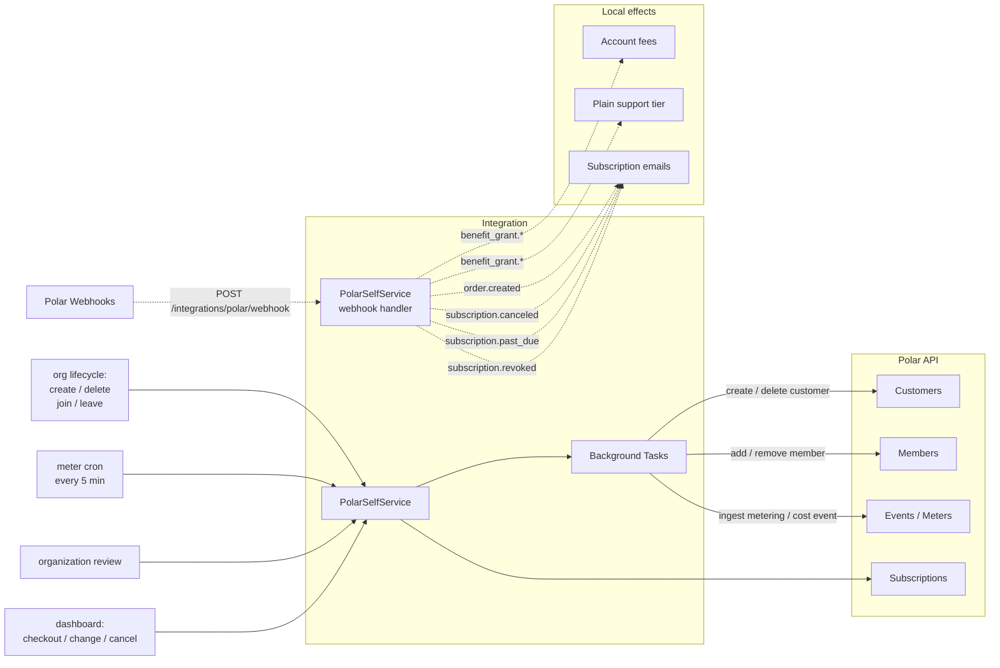
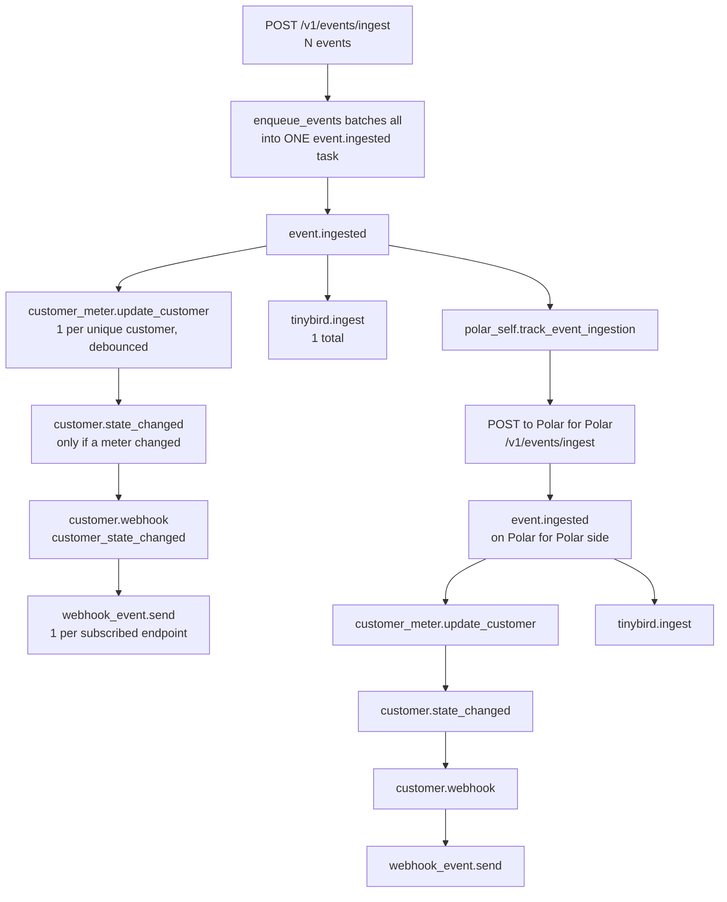
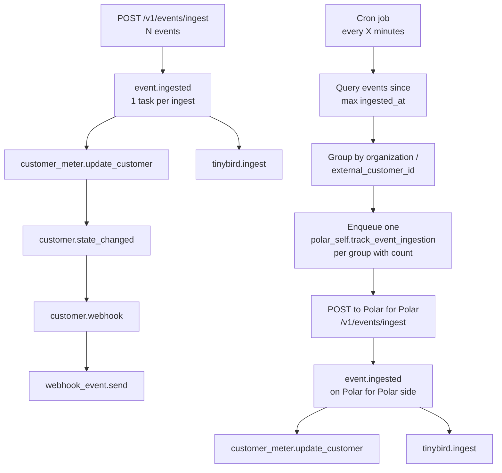

<Info>
**Status**: Active
**Created**: March 2026
**Last Updated**: May 2026
</Info>

## Summary

We want to start using Polar as the billing platform for Polar. This will put us closer to where our customers are and make us understand our own product better.
Every Polar organization becomes a **customer** of our own Polar-for-Polar organization, organization users become **members** on those customers, and event ingestion is **metered** for possible future usage-based billing.

Additionally cost events are ingested for costs incurred to Polar for example onboarding and other costs.

## Goals

- Use Polar's own APIs (customers, subscriptions, members, events) to manage our billing relationship with organizations.
- Track organization membership via the Polar member model so members have access to the customer portal.
- Meter event ingestion per organization for future usage-based billing.
- Receive webhooks from Polar to sync state changes back.
- All changes are safe to deploy incrementally — no big bang migration.
- Introduce paid plans for lower transaction fees and better support.

## Non-Goals

- Replacing existing internal analytics (Tinybird, PostHog). Metering is for billing, not observability.

## Key Concepts

- **"Our Polar org"**: The Polar organization that owns the customers, plans, and benefits we use to bill everyone else. Configured via `POLAR_ORGANIZATION_ID`.
- **`external_customer_id`**: We don't store a Polar customer ID on the Organization model. Every Polar API call and incoming webhook identifies the customer by `external_customer_id = str(org.id)`.
- **`external_id` on members**: User UUIDs become `external_id` on Polar members.
- **Recursion guard**: Two places stop the self org from billing itself — the metering cron excludes it when counting events, and `enqueue_track_organization_review_usage` short-circuits when the external customer is the self org.

## Architecture



## Mapping

| Polar concept | Our concept | Identifier |
|---|---|---|
| Customer | Organization | `external_id = str(org.id)` |
| Member | User in organization | `external_id = str(user.id)` |
| Subscription | Paid plan on the organization | Created per organization when they pick a plan. The free tier is synthesized client-side, not a real subscription. |
| Metering event | Batch of ingested events | `external_customer_id = str(organization.id)` |

## Webhooks

To handle changes for the customer in Polar (e.g. purchase, cancelation, etc), the Polar application will listen to webhooks from Polar.

#### Endpoint

Create `server/polar/integrations/polar/endpoints.py`:

```python
router = APIRouter(
    prefix="/integrations/polar",
    tags=["integrations_polar"],
    include_in_schema=False,
)

@router.post("/webhook", status_code=202)
async def webhook(
    request: Request,
    session: AsyncSession = Depends(get_db_session),
) -> None:
    # Verify signature using standardwebhooks
    # Parse event type from payload
    # Enqueue via external_event_service.enqueue(
    #     session, ExternalEventSource.polar, task_name, event_id, data
    # )
```

Signature verification uses the `standardwebhooks` library.

#### ExternalEvent Integration

Add `polar = "polar"` to the `ExternalEventSource` enum and a polymorphic subclass:

```python
class PolarSelfEvent(ExternalEvent):
    source: Mapped[Literal[ExternalEventSource.polar]] = mapped_column(
        use_existing_column=True, default=ExternalEventSource.polar
    )
    __mapper_args__ = {
        "polymorphic_identity": ExternalEventSource.polar,
        "polymorphic_load": "inline",
    }
```

#### Webhook Handlers

Initially handle a minimal set of events, with stubs for future expansion:

```python
IMPLEMENTED_WEBHOOKS = {
    "benefit_grant.created",
    "benefit_grant.updated",
    "benefit_grant.revoked",
    "order.created",
    "subscription.canceled",
    "subscription.past_due",
    "subscription.revoked",
}

@actor(actor_name="polar_self.webhook.benefit_grant.created", priority=TaskPriority.LOW)
async def webhook_benefit_grant_created(event_id: uuid.UUID) -> None:
    async with AsyncSessionMaker() as session:
        async with external_event_service.handle(
            session, ExternalEventSource.polar, event_id
        ) as event:
            payload = WebhookBenefitGrantCreatedPayload.model_validate(event.data)
            await polar_self.handle_benefit_grant_event(session, payload)
```

`benefit_grant.*` is how paid plans take effect: the benefit's `metadata.type` (`transaction_fee` or `support`) drives whether we rewrite the org's Account fees or update its Plain support tier. `order.created` is what triggers the subscription confirmation / renewal emails with the invoice PDF attached — it's enqueued with a delay so the invoice has time to generate. `subscription.canceled` sends a cancellation confirmation email (surfacing the `ends_at` date). `subscription.past_due` sends a "payment failed" notification. `subscription.revoked` sends a terminal "subscription ended" email. All subscription email handlers skip free ($0) subscriptions and those without billing contacts.

## API Surface

All endpoints are added as private endpoints (`APITag.private`) on the `/organizations` router, scoped by `{id}` and authorized against the calling user's access to that organization. They go via `PolarSelfService` to the SDK client. They are essentially thin wrappers around the external APIs that are calling Polar but in the context of the Polar-for-Polar organization and the customer session for the specific customer.

**Plans & subscription**
- `GET /organizations/{id}/plans` — list available paid plans
- `GET /organizations/{id}/subscription` — current subscription (or the synthesized free plan)
- `POST /organizations/{id}/subscription` — start a checkout for a plan
- `PATCH /organizations/{id}/subscription` — change plan, with proration depending on direction
- `DELETE /organizations/{id}/subscription` — cancel at period end

**Orders & invoices**
- `GET /organizations/{id}/orders` — list orders for the customer
- `GET /organizations/{id}/orders/{order_id}/invoice` — get an invoice download URL

**Billing details**
- `GET /organizations/{id}/billing-details`
- `PATCH /organizations/{id}/billing-details`

**Payment methods**
- `GET /organizations/{id}/payment-methods`
- `DELETE /organizations/{id}/payment-methods/{payment_method_id}`
- `POST /organizations/{id}/payment-methods/{payment_method_id}/default` — set default

**Customer portal session**
- `POST /organizations/{id}/customer-session` — short-lived token for the customer portal endpoints

The webhook endpoint (`POST /integrations/polar/webhook`) is on its own router and is excluded from the OpenAPI schema. See the Webhooks section.

## Subscriptions

The different paid plans are set up with benefits granting them lower fees, setting a support tier, or anything else that might be part of a paid plan. On the webhook of the benefit.grant that data is updated as described in the prior section.

The free plan was initially set to be a subscription as well, so that all customers were on a subscription but this was scrapped for two primary reasons:

1. We were granting a lot of benefits unnecessarily which overwhelmed the system.
2. If everyone is always on a subscription it makes it more difficult to track subscription growth and cancellations.

## Meter

### Initial plan

The initial plan was to act on every ingested event while still bundling them. So if an organization would ingest 200 events via POST /v1/events/ingest, we would then create a single event called `event_ingestion` with the metadata `{ "count": 24 }`. If they only ingested a single event it would be 1:1 between the ingest call and the ingest call toward Polar for Polar.

However this quickly spiraled out of control since every ingest call triggers the `event.ingested` task, which in turn triggers `customer_meter.update_customer` and `tinybird.ingest` as well as the new `polar_self.track_event_ingestion`. This meant that every event ingestion potentially triggered 14+ tasks.



### Alternative suggestion

Two alternative suggestions were raised:
* Use debounce on `polar_self.track_event_ingestion` so that we don't trigger new tracking tasks until the last one has been processed.
* Have a cron job that goes through the events ingested since last ingestion and trigger a `polar_self.track_event_ingestion` for those.

The decision was made to use the cron job for now. This ensures that there is no cascading effect independent on the number of events ingested by any single organization.



This also ensures that there is no special handling needed for the Polar-for-Polar organization. The event ingestion excludes the Polar organization, but for all of the other event tracking that we want to do it gets handled the same way in the event ingestion flow.

## Implementation

The implementation will happen in multiple steps:

1. Config + Integration Module — Add POLAR_* settings, move polar-sdk to regular deps, and scaffold a PolarSelfService singleton with no-op methods that early-return when unconfigured. No behavioral change.
2. Customer on Org Signup — On organization creation, enqueue a background task to create a Polar customer (keyed by org ID). Includes a backfill script for existing orgs. (We initially also created a free-tier subscription here, but dropped it — the free plan is synthesized client-side instead.)
3. Members — Sync UserOrganization add/remove to Polar members on the customer via background tasks. Backfill extended to cover existing memberships.
4. Metering Event Ingestion — Hook the ingested events to be bundled and ingested into into our own Polar organization with a count for the number of events ingested.
5. Receive Polar Webhooks — Add /integrations/polar/webhook endpoint with signature verification, plus a polar ExternalEventSource enum value and handlers for benefit_grant.*, order.created, subscription.canceled, subscription.past_due, and subscription.revoked events.
6. Paid Plans — Wire checkout, plan changes (with proration), cancellation, the customer portal proxy methods (payment methods, billing details, customer session), and order/invoice listing. Benefits drive fees and support tier via the webhook handler in step 5.
