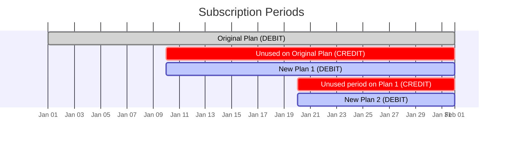

# What is a proration?

Prorations are credit and debit items on an invoice. When you switch products within a subscription cycle you’ll normally have 2 prorations applied:

- A credit proration which is what you’re owed for the unused time on the product you’re switching from
- A debit proration which is what you owe for the remaining time on the product you’re switching to

In cases where the subscription cycle is updated (e.g. switching from monthly to yearly) you’ll just have the credit proration and then the second invoice item will be a normal “full cycle” item rather than a proration.

# When does a subscription change take effect?

**Decided behavior:** Changing your subscription plan is always effectively immediately – this is different from cancelation which takes effect at the end of the cycle (but when an organization cancels on behalf of a customer they can choose to make the cancelation effective immediately)

**Alternate behaviors (not implemented):**

- Change is effective from next billing cycle
    - *If we did this we would never need prorations*
    - In the case of an upgrade this is problematic as you need e.g. the extra seats or features of the Pro subscription **now** and not at the start of the next billing cycle. Especially if the next billing cycle is in a year!
    - In the case of downgrades this is quite normal – e.g. staying on the Pro plan until next subscription cycle. This means effectively means no proration.

# When do you pay for the change in subscription?

**Decided behavior:** This is set as preference on the Organization. You can choose:

- Pay immediately
- Pay on next invoice

*BUT* we always charge immediately when switching from monthly to yearly or yearly to monthly (see the next section on cycle changes).

# What happens when you change from monthly to yearly or yearly to monthly? (cycle changes)

A cycle change is when a customer switches from a monthly to a yearly plan or a yearly to a monthly plan.

## Switching from a monthly to a yearly plan

**Decided behavior:** *Always change the billing anchor.* Start a yearly plan with a cycle starting the date of the change. The remainder of the monthly plan is credited to the customer. Charge immediately as the price increase is likely significant.

**Stripe behavior:** *Always change the billing anchor.* Starts a yearly plan with a cycle starting the date of the change. Bills immediately even if you choose  “add prorations to next invoice”. Also changes the cycle date even if you don’t enable “reset billing cycle”.

**Alternate behaviors (not implemented):**

- Keeping the “billing anchor” the same, i.e. if the current monthly cycle started on March 8th we could start the yearly cycle on March 8th.
- Allow delayed billing, having the payment for the yearly plan appear on the next invoice. This would create a rather large delayed payment the customer would pay for X months of the yearly plan + the full next year on the next invoice.

## Switching from a yearly to a monthly plan

**Decided behavior:** *Always change the billing anchor. *****Start a monthly plan with a cycle starting the date of the change. The remainder of the yearly plan is credited to the customer. This means that a number of upcoming invoices on the monthly plan could be $0 as the customer may have a lot of credit from the yearly plan.

**Stripe behavior:** *Always change the billing anchor.* Starts a monthly plan with a cycle starting the date of the change. Bills immediately even if you choose  “add prorations to next invoice”. Also changes the cycle date even if you don’t enable “reset billing cycle”.

**Alternate behaviors (not implemented):**

- Align the new “billing anchor” to the yearly cycle. The current yearly cycle started on March 8th and we switch on June 19th, would could have the monthly cycle start on June 8th.
- Allow delayed billing, having the payment for the new monthly plan on the next invoice. This doesn’t create problems, but is perhaps just more confusing if we’re changing the billing anchor anyways. The customer will likely have a lot of credit anyways.

# Tax

**Key assumptions**

- We use only 1 tax code per country for all products

**Decided behavior:** Calculate tax only once – on the total order value – not on the individual line items.

**Why?** Today (Aug 19th 2025) we only apply a single tax code (per country) across all products. This allows us to calculate the tax on the total order rather than the individual line items. With the addition of prorations we continue to do that.

**Considerations:** In theory you could switch from a product with 15% tax to one with 20% tax and therefore tax should be applied to each line item. However, given how the system works today with just a single tax code applied to all products, we simply continue that behavior until we introduce more tax codes, at which point we would have to start calculating tax on the individual items.

**Scenarios**

- Switching from a product with 15% tax to one with 20% tax
    - *Not possible right now as we only use one tax code*
- Switching from a product 20% tax to one with 20% tax
    - The prorated credit that you get “includes the tax” – as it should – similarly for the prorated debit. Note that on the order itself and any invoices the prorations will show the amount excluding tax – as we calculate the tax on the total order.

    **Example showing the equivalence of tax on individual items and tax on the total**
    1. You initially purchase a $100/month plan with 20% tax = you pay $120
    2. At the exact middle of the month you switch to a $200/month plan:
        1. You get a $60 credit ($50 + $10 tax) proration for the remaining time on the old plan.
        2. You get a $120 debit ($100 + $20 tax) proration for the new plan covering the remainder of the month.
    - Since the tax percentage is the same, the correct result is still obtained when calculating the tax on the total order rather than on the individual items.
        - From above, tax included in individual items: $120 debit - $60 credit = $60 to be paid
        - Tax excluded in individual items: $100 debit - $50 credit = $50 + $10 tax to be paid
        - Even if you include next months payment:
            - Tax on total: $50 prorations + $200 next months order = $250 + $50 tax to be paid = $300 incl. tax
            - Tax on parts: $120 debit - $60 credit + $240 next months order = $300 incl. tax
        - *One can also derive this from the distributive law of multiplication.*

# Discounts

**Key assumptions**

- As described in [Discounts](https://www.notion.so/Discounts-255ff4bc9f86803aaaf0fd4847ea7c68?pvs=21), a 1-month discount applied to a yearly plan applies the discount for the full year – not just that 1 month. This goes for any number of months.

**Decided behavior:**

- The discount applicable to the cycle you’re currently in always applies to the credit proration. For example, if you paid $15 for that cycle ($20/month full price with a $5 discount) the proration should be based on the $15 you paid – not the full amount. If you’re switching yearly to yearly or monthly to monthly the discount will also apply to the debit proration. However, if you switch from monthly to yearly or yearly to monthly we do an extra check to see if the discount has expired and only apply the discount to the debit proration if the discount has not expired.
- If you have a discount applicable only applicable to product A and you switch to product B, the proration credit for the unused time on product A will include the discount. But the proration debit for the remaining time on product B will not include the discount.
- Fixed discounts are applied to the full period amount and then prorated. This means if you switch from product A at $20/month with a $5 discount to product B at $30/month still with the $5 discount the prorations are $7.5 in credit ((20-5)/2) and $12.5 in debit ((30-5)/2).

**Scenarios**

- Fixed or % discount, applied once – switching from monthly to yearly
- Fixed or % discount, applied once – switching from yearly to monthly
- 1-month discount on yearly plan, customer switches to monthly after 3 months
    - We prorate the discounted amount
    1. Initial purchase: 50% x $240/year = $120
    2. Switch to monthly plan
        1. 9 months credit = $90 credit
        2.
- 3-month discount on yearly plan, customer switches to monthly after 2.5 months
    1. ~~Initial purchase of monthly at $240/year with 50% discount = $120~~
    2. ~~Switch to monthly plan at $24/month with 50% discount (half month left on discount)~~
        1. ~~9.5 months credit = $95 credit ($120 / 12 months x (12 - 2.5) months)~~
        2. ~~0.5 months debit = $24/month x 50% discount x 50% month = $6 debit~~
    - Cycle anchor date is updated
- 3-month discount on yearly plan, customer switches to monthly after 1 day
- 3-month discount on monthly plan, customer switches to a different monthly plan after 2.5 months

**Technical notes**

- For an e.g. 3-month discount on a yearly plan, the field `Subscription.discount` is still set after the initial checkout/purchase, but it will be removed when `subscription/service.py::cycle()` is called as `Subscription.is_repetition_expired()` will return `True` – this happens before any discount is applied and thus won’t apply twice.

*Is it possible to “cheat” by using e.g. 3-month discount on a yearly plan, you get the discount for the full year, and now you switch after 11 months. Do you still have something left on your 3-month discount? (Obviously you shouldn’t)*

# Caveats

- **FIXME:** Stripe doesn’t allow charges of less than $0.50. This can happen in the case where has set organization “prorate immediately” and the customer changes right before the upcoming cycle. E.g. switching from a $10/month plan to a $15/month plan on the last day of the month would be $0.16 and thus less than the limit.

|  | **Immediate proration** |  | **Later proration** |  |
| --- | --- | --- | --- | --- |
|  | **Stripe behavior** | **Our behavior** | **Stripe behavior** | **Our behavior** |
| **Basic to Pro (upgrade)** |  |  | Added to next invoice | Added to next invoice |
| **Pro to Basic (downgrade)** | Credits customer’s balance |  | Deducted from next invoice
Credits customer’s balance | Deducted from next invoice
 |
| **5 units to 10 units** |  |  |  |  |
| **10 units to 5 units** | Credits customer’s balance

*!! To be confirmed !!* | A) Immediately **refund money / pay money back to card on file
B) Customer credit mechanism | Credits customer’s balance | ? we need a credit mechanism

**AND** we need to display this correctly on next invoice |
| **Monthly to yearly** |  | Would be a switch of products in Polar |  | Would be a switch of products in Polar |
| **Yearly to monthly** | Sets billing anchor to “now” (when the downgrade happened) and starts the monthly subscription from then

+ adds remaining amount to customer balance | Would be a switch of products in Polar |  | Would be a switch of products in Polar |
| **Trial to paid** | Payment immediately |  | Payment immediately |  |
| *within a single subscription cycle
Downgrade from 10 to 7 units
then later
Downgrade from 7 to 2 units* |  |  | Credit -3 units x proration period A

Credit -5 units x proration period B

*!! To be confirmed !!* |  |

## What should happen when the product price changes on a `pending` proration?

A) We use the original proration amount based on the original product price (whether debit or credit)

B) We split the proration into two parts – one part up until the price changed, and the second part from the product price change to the next subscription cycle.

C) We use change the whole proration to use the new price.

*To display correctly on the next invoice we need to store:*

- *What product was switched from, and how many units*
- *What the price of the product was at the time*

## Proration timezone

Presumably a subscription cycle goes from e.g. July 17th 00:00 to August 17th 00:00 — but what timezone is the 00:00? This impacts the number of seconds the proration is based on (Stripe does per-second proration) and thus the specific proration amount.

# Data model

Use existing `BillingEntry` data model as described in [polar#6118](https://github.com/polarsource/polar/issues/6118).

All items billable in the future are stored in our data model `BillingEntry`.

The BillingEntry has a type, which can be:

- `cycle` – Created exactly at the time a new billing cycle starts, e.g. the first of the month
- `meter` – Denotes usage during the cycle, to be billed on next invoice (next cycle start)
- `proration` – Denotes a plan/product change within the cycle. A change will generally create 2 `BillingEntry`ies of the proration type:
    - 1 `.direction=BillingDirection.credit` that represents the time remaining on the product you’re switching from.
    - 1 `.direction=BillingDirection.debit` that represents the time remaining on the product you’re switching to.

An important note is that `BillingEntry.amount` **does** **not** include any discount for `cycle` entries, but **does** include discount for `proration` entries.

This is because proration entries are really using the discount from the *last* cycle – which may be expired when the new cycle starts (and thus does not apply to the `cycle` entry).

[Old proposed model](https://www.notion.so/Old-proposed-model-250ff4bc9f86802897dbc72d16139d73?pvs=21)

## Customer credit / “Invoice balance” mechanism

When making a substantial downgrade (e.g. a yearly to a monthly plan) we end up “owing” the customer money as they haven’t “spent” the full duration of that plan and so the downgrade means they get that money back in the form of “credit” or “balance”.

**Stripe behavior:** Stripe calls this “invoice balance” — this is different from Stripe’s “cash balance”.

# Things to test

- Days in month (e.g. February to March + leap years)
- Proration behavior (immediate vs. next invoice)
- Multiple subscriptions?
    - If I have two subscriptions under the same organization:
        - 1 for ListenHub and 1 for TemperateDocs then I unsubscribe ListenHub



# References

- [Stripe’s documentation on proration](https://docs.stripe.com/billing/subscriptions/prorations)

# Example

- Protation behavior: Add to next invoice
- Discount: Flat $20 off every month for 3 months
- Various meter BillingEntries
- Start on Basic at $30/month - you paid $10
- Now, middle of month switch to Pro at $60/month
- Debit BillingEntry: $5 (remaining time on Basic)
- Credit BillingEntry: $20 (remaining time on Pro)

## Fixed discount, 3-time usage limit


# Example Stripe invoices

## Invoice 1

Here’s a Stripe invoice ([in_1RtZvjDG1jUQrXwC8ECRUQmJ](https://dashboard.stripe.com/acct_1LzIVeDG1jUQrXwC/invoices/in_1RtZvjDG1jUQrXwC8ECRUQmJ)) with prorations and discounts on both the old and new product.

- Customer had a $19/month subscription going July 28th - Aug 28th with 20% off = customer was paying $15.2/month
    - Switching on Aug 7th = (31 - 10) days / 31 days = 68.7% remaining
    68.7% x $19 = $10.44 (close to the unused time above)
- **Subtotal $168.68** is the $179/year *with no discount* and then proration on $19/month *with discount already applied*
- **Discount (20% off) -$35.80** is 20% of $179/year
- *So the proration includes the discount*
- **Amount paid -$132.88** is what was withdrawn from the customer’s credit card

## Invoice 2

Here’s a Stripe invoice ([in_1RtZvzDG1jUQrXwCEKPEkA1a](https://dashboard.stripe.com/acct_1LzIVeDG1jUQrXwC/invoices/in_1RtZvzDG1jUQrXwCEKPEkA1a)) with prorations, customer balance adjustment, and discounts on both the old and new product.

- Customer had a $179/month subscription going Aug 7th 2025 - Aug 7th 2026 with 20% off = customer was paying $143.2/month
    - Switching on Aug 7th = (365 - 0) days / 31 days = 100% remaining
    100% x $179 = $143.2
- **Subtotal -$124.20** is the $19/month *with no discount* and then proration on $179/year *with discount applied*
- **Discount (20% off) -$3.80** is 20% of $19/month
- *So the proration includes the discount*
- **Applied balance $128.00** is the number added to the customer’s Stripe invoice balance

On the Stripe customer page ([cus_RrJMteZ6IDixT1](https://dashboard.stripe.com/acct_1LzIVeDG1jUQrXwC/customers/cus_RrJMteZ6IDixT1))

## JSON representation

- Data

    ```json
    {
      "id": "in_1S0dWbRkFC2HFuLWUj2VkxFR",
      "object": "invoice",
      "account_country": "US",
      "account_name": "francois@polar.sh sandbox",
      "account_tax_ids": null,
      "amount_due": 18968,
      "amount_overpaid": 0,
      "amount_paid": 18968,
      "amount_remaining": 0,
      "amount_shipping": 0,
      "application": null,
      "application_fee_amount": null,
      "applied_balance": 0,
      "attempt_count": 1,
      "attempted": true,
      "auto_advance": false,
      "automatic_tax": {
        "disabled_reason": null,
        "enabled": true,
        "liability": {
          "type": "self"
        },
        "provider": "stripe",
        "status": "complete"
      },
      "automatically_finalizes_at": null,
      "billing_reason": "subscription_cycle",
      "can_send_invoice": true,
      "can_send_receipt": true,
      "charge": "ch_3S0dWmRkFC2HFuLW0LxvbQmI",
      "closed": true,
      "closed_at": 1758780400,
      "collection_method": "charge_automatically",
      "created": 1758521200,
      "currency": "usd",
      "custom_fields": null,
      "customer": "cus_SudOncWPofJq1g",
      "customer_address": {
        "city": null,
        "country": "FR",
        "line1": null,
        "line2": null,
        "postal_code": null,
        "state": null
      },
      "customer_email": "francois+cr5@polar.sh",
      "customer_metadata": {},
      "customer_name": "FV",
      "customer_phone": null,
      "customer_shipping": null,
      "customer_tax_exempt": "none",
      "customer_tax_ids": [],
      "default_payment_method": null,
      "default_source": null,
      "default_tax_rates": [],
      "deleted": false,
      "description": null,
      "discount": {
        "id": "di_1S0Ot7RkFC2HFuLWwmG5Qi0d",
        "object": "discount",
        "checkout_session": null,
        "coupon": {
          "id": "hw2NPAyi",
          "object": "coupon",
          "amount_off": null,
          "cache_context_key": "acct_1QIUq0RkFC2HFuLW",
          "created": 1738308759,
          "currency": null,
          "duration": "forever",
          "duration_in_months": null,
          "livemode": false,
          "max_redemptions": null,
          "metadata": {
            "discount_id": "ca1412e8-a648-4077-a6db-fd3b856bf81a",
            "organization_id": "50a1b662-35a6-42f9-bc6f-4a052d58ee8b"
          },
          "name": "-50% always",
          "owning_merchant": "acct_1QIUq0RkFC2HFuLW",
          "owning_merchant_info": "acct_1QIUq0RkFC2HFuLW",
          "percent_off": 50,
          "redeem_by": null,
          "script": null,
          "times_redeemed": 3,
          "type": null,
          "valid": true
        },
        "customer": "cus_SudOncWPofJq1g",
        "end": null,
        "invoice": null,
        "invoice_item": null,
        "promotion_code": null,
        "start": 1755842800,
        "subscription": "sub_1S0Ot7RkFC2HFuLWtBOv7PLE",
        "subscription_item": null
      },
      "discount_amount": 10000,
      "discount_objects": [
        {
          "id": "di_1S0Ot7RkFC2HFuLWwmG5Qi0d",
          "object": "discount",
          "checkout_session": null,
          "coupon": {
            "id": "hw2NPAyi",
            "object": "coupon",
            "amount_off": null,
            "cache_context_key": "acct_1QIUq0RkFC2HFuLW",
            "created": 1738308759,
            "currency": null,
            "duration": "forever",
            "duration_in_months": null,
            "livemode": false,
            "max_redemptions": null,
            "metadata": {
              "discount_id": "ca1412e8-a648-4077-a6db-fd3b856bf81a",
              "organization_id": "50a1b662-35a6-42f9-bc6f-4a052d58ee8b"
            },
            "name": "-50% always",
            "owning_merchant": "acct_1QIUq0RkFC2HFuLW",
            "owning_merchant_info": "acct_1QIUq0RkFC2HFuLW",
            "percent_off": 50,
            "redeem_by": null,
            "script": null,
            "times_redeemed": 3,
            "type": null,
            "valid": true
          },
          "customer": "cus_SudOncWPofJq1g",
          "end": null,
          "invoice": null,
          "invoice_item": null,
          "promotion_code": null,
          "start": 1755842800,
          "subscription": "sub_1S0Ot7RkFC2HFuLWtBOv7PLE",
          "subscription_item": null
        }
      ],
      "discounts": [
        "di_1S0Ot7RkFC2HFuLWwmG5Qi0d"
      ],
      "draft": false,
      "due_date": null,
      "effective_at": 1758780400,
      "ending_balance": 0,
      "finalized_payment_method_types": [
        "card",
        "cashapp",
        "klarna",
        "link"
      ],
      "footer": "Polar registrations\n\nIrish OSS VAT: EU372061545",
      "forgiven": false,
      "from_invoice": null,
      "frozen": true,
      "has_paid_non_default_payment": false,
      "has_partial_payments": false,
      "hosted_invoice_url": "https://invoice.stripe.com/i/acct_1QIUq0RkFC2HFuLW/test_YWNjdF8xUUlVcTBSa0ZDMkhGdUxXLF9Td1daTnZ3YnBwOTk1OVBhRTFZTTh2U1NaYVROeDBvLDE0NjgxOTU3Ng0200R29aFXTi?s=db",
      "invoice_pdf": "https://pay.stripe.com/invoice/acct_1QIUq0RkFC2HFuLW/test_YWNjdF8xUUlVcTBSa0ZDMkhGdUxXLF9Td1daTnZ3YnBwOTk1OVBhRTFZTTh2U1NaYVROeDBvLDE0NjgxOTU3Ng0200R29aFXTi/pdf?s=db",
      "issuer": {
        "type": "self"
      },
      "last_finalization_error": null,
      "last_payment_attempt": 1758780400,
      "latest_revision": null,
      "lines": {
        "object": "list",
        "data": [
          {
            "id": "il_1S1LSORkFC2HFuLWjikHDgpn",
            "object": "line_item",
            "amount": -1935,
            "amount_excluding_tax": -1935,
            "computed_amount": -2322,
            "currency": "usd",
            "description": "Unused time on frankie567 - Clean product (with 50.0% off) after 29 Aug 2025",
            "discount_amounts": [
              {
                "amount": 0,
                "discount": "di_1S0Ot7RkFC2HFuLWwmG5Qi0d",
                "source": "group"
              }
            ],
            "discount_objects": [],
            "discountable": false,
            "discounts": [],
            "invoice": "in_1S0dWbRkFC2HFuLWUj2VkxFR",
            "invoice_item": "ii_1S0dWDRkFC2HFuLWRdqOq54V",
            "invoice_item_persisted": true,
            "livemode": false,
            "metadata": {},
            "parent": {
              "invoice_item_details": null,
              "subscription_item_details": {
                "invoice_item": "ii_1S0dWDRkFC2HFuLWRdqOq54V",
                "proration": true,
                "proration_details": {
                  "credited_items": {
                    "invoice": "in_1S0Ot8RkFC2HFuLW96jJxHOK",
                    "invoice_line_items": [
                      "il_1Ryo7YRkFC2HFuLWh3vsbJWC"
                    ]
                  }
                },
                "subscription": "sub_1S0Ot7RkFC2HFuLWtBOv7PLE",
                "subscription_item": "si_SwHSFw0h2JhG77"
              },
              "type": "subscription_item_details"
            },
            "period": {
              "end": 1758521200,
              "start": 1756447600
            },
            "plan": {
              "id": "price_1QxPjKRkFC2HFuLWVZblSFLf",
              "object": "plan",
              "active": true,
              "aggregate_usage": null,
              "amount": 5000,
              "amount_decimal": "5000",
              "billing_scheme": "per_unit",
              "created": 1740734378,
              "currency": "usd",
              "interval": "month",
              "interval_count": 1,
              "livemode": false,
              "metadata": {},
              "meter": null,
              "name": "frankie567 - Clean product",
              "nickname": null,
              "owning_merchant": "acct_1QIUq0RkFC2HFuLW",
              "owning_merchant_info": "acct_1QIUq0RkFC2HFuLW",
              "product": "prod_Rr7zuEpZE8BG8M",
              "tiers_mode": null,
              "transform_usage": null,
              "trial_period_days": null,
              "usage_type": "licensed"
            },
            "pretax_credit_amounts": [
              {
                "amount": 0,
                "discount": "di_1S0Ot7RkFC2HFuLWwmG5Qi0d",
                "type": "discount"
              }
            ],
            "price": {
              "id": "price_1QxPjKRkFC2HFuLWVZblSFLf",
              "object": "price",
              "active": true,
              "automatic_currency_conversion_eligible": false,
              "billing_scheme": "per_unit",
              "created": 1740734378,
              "currency": "usd",
              "custom_unit_amount": null,
              "livemode": false,
              "lookup_key": null,
              "metadata": {},
              "never_used": false,
              "nickname": null,
              "owning_merchant": "acct_1QIUq0RkFC2HFuLW",
              "owning_merchant_info": "acct_1QIUq0RkFC2HFuLW",
              "product": "prod_Rr7zuEpZE8BG8M",
              "recurring": {
                "aggregate_usage": null,
                "interval": "month",
                "interval_count": 1,
                "meter": null,
                "trial_period_days": null,
                "usage_type": "licensed"
              },
              "tax_behavior": "unspecified",
              "tiers_mode": null,
              "transform_quantity": null,
              "type": "recurring",
              "unit_amount": 5000,
              "unit_amount_decimal": "5000"
            },
            "price_backfilled": false,
            "pricing": {
              "price_details": {
                "price": "price_1QxPjKRkFC2HFuLWVZblSFLf",
                "product": "prod_Rr7zuEpZE8BG8M"
              },
              "type": "price_details",
              "unit_amount_decimal": null
            },
            "proration": true,
            "proration_details": {
              "credited_items": {
                "invoice": "in_1S0Ot8RkFC2HFuLW96jJxHOK",
                "invoice_line_items": [
                  "il_1Ryo7YRkFC2HFuLWh3vsbJWC"
                ]
              }
            },
            "quantity": 1,
            "rendering": null,
            "subscription": "sub_1S0Ot7RkFC2HFuLWtBOv7PLE",
            "subscription_item": "si_SwHSFw0h2JhG77",
            "tax_amounts": [
              {
                "amount": -387,
                "inclusive": false,
                "percentage_requires_explanation": false,
                "tax_rate": "txr_1QIV9NRkFC2HFuLW1NytbVMT",
                "taxability_reason": "standard_rated",
                "taxable_amount": -1935
              }
            ],
            "tax_rates": [],
            "taxes": [
              {
                "amount": -387,
                "tax_behavior": "exclusive",
                "tax_rate_details": {
                  "tax_rate": "txr_1QIV9NRkFC2HFuLW1NytbVMT"
                },
                "taxability_reason": "standard_rated",
                "taxable_amount": -1935,
                "type": "tax_rate_details"
              }
            ],
            "type": "invoiceitem",
            "unit_amount_excluding_tax": "-1935"
          },
          {
            "id": "il_1S1LSPRkFC2HFuLWWtcefTnz",
            "object": "line_item",
            "amount": 7742,
            "amount_excluding_tax": 7742,
            "computed_amount": 9290,
            "currency": "usd",
            "description": "Remaining time on frankie567 - More expensive (with 50.0% off) after 29 Aug 2025",
            "discount_amounts": [
              {
                "amount": 0,
                "discount": "di_1S0Ot7RkFC2HFuLWwmG5Qi0d",
                "source": "group"
              }
            ],
            "discount_objects": [],
            "discountable": false,
            "discounts": [],
            "invoice": "in_1S0dWbRkFC2HFuLWUj2VkxFR",
            "invoice_item": "ii_1S0dWDRkFC2HFuLWvfn4DAOU",
            "invoice_item_persisted": true,
            "livemode": false,
            "metadata": {},
            "parent": {
              "invoice_item_details": null,
              "subscription_item_details": {
                "invoice_item": "ii_1S0dWDRkFC2HFuLWvfn4DAOU",
                "proration": true,
                "proration_details": {
                  "credited_items": null
                },
                "subscription": "sub_1S0Ot7RkFC2HFuLWtBOv7PLE",
                "subscription_item": "si_SwWZksWkgQYAtu"
              },
              "type": "subscription_item_details"
            },
            "period": {
              "end": 1758521200,
              "start": 1756447600
            },
            "plan": {
              "id": "price_1RjKp0RkFC2HFuLWFWZyajjK",
              "object": "plan",
              "active": true,
              "aggregate_usage": null,
              "amount": 20000,
              "amount_decimal": "20000",
              "billing_scheme": "per_unit",
              "created": 1752155254,
              "currency": "usd",
              "interval": "month",
              "interval_count": 1,
              "livemode": false,
              "metadata": {},
              "meter": null,
              "name": "frankie567 - More expensive",
              "nickname": null,
              "owning_merchant": "acct_1QIUq0RkFC2HFuLW",
              "owning_merchant_info": "acct_1QIUq0RkFC2HFuLW",
              "product": "prod_See7jEhNw0h4au",
              "tiers_mode": null,
              "transform_usage": null,
              "trial_period_days": null,
              "usage_type": "licensed"
            },
            "pretax_credit_amounts": [
              {
                "amount": 0,
                "discount": "di_1S0Ot7RkFC2HFuLWwmG5Qi0d",
                "type": "discount"
              }
            ],
            "price": {
              "id": "price_1RjKp0RkFC2HFuLWFWZyajjK",
              "object": "price",
              "active": true,
              "automatic_currency_conversion_eligible": false,
              "billing_scheme": "per_unit",
              "created": 1752155254,
              "currency": "usd",
              "custom_unit_amount": null,
              "livemode": false,
              "lookup_key": null,
              "metadata": {},
              "never_used": false,
              "nickname": null,
              "owning_merchant": "acct_1QIUq0RkFC2HFuLW",
              "owning_merchant_info": "acct_1QIUq0RkFC2HFuLW",
              "product": "prod_See7jEhNw0h4au",
              "recurring": {
                "aggregate_usage": null,
                "interval": "month",
                "interval_count": 1,
                "meter": null,
                "trial_period_days": null,
                "usage_type": "licensed"
              },
              "tax_behavior": "unspecified",
              "tiers_mode": null,
              "transform_quantity": null,
              "type": "recurring",
              "unit_amount": 20000,
              "unit_amount_decimal": "20000"
            },
            "price_backfilled": false,
            "pricing": {
              "price_details": {
                "price": "price_1RjKp0RkFC2HFuLWFWZyajjK",
                "product": "prod_See7jEhNw0h4au"
              },
              "type": "price_details",
              "unit_amount_decimal": null
            },
            "proration": true,
            "proration_details": {
              "credited_items": null
            },
            "quantity": 1,
            "rendering": null,
            "subscription": "sub_1S0Ot7RkFC2HFuLWtBOv7PLE",
            "subscription_item": "si_SwWZksWkgQYAtu",
            "tax_amounts": [
              {
                "amount": 1548,
                "inclusive": false,
                "percentage_requires_explanation": false,
                "tax_rate": "txr_1QIV9NRkFC2HFuLW1NytbVMT",
                "taxability_reason": "standard_rated",
                "taxable_amount": 7742
              }
            ],
            "tax_rates": [],
            "taxes": [
              {
                "amount": 1548,
                "tax_behavior": "exclusive",
                "tax_rate_details": {
                  "tax_rate": "txr_1QIV9NRkFC2HFuLW1NytbVMT"
                },
                "taxability_reason": "standard_rated",
                "taxable_amount": 7742,
                "type": "tax_rate_details"
              }
            ],
            "type": "invoiceitem",
            "unit_amount_excluding_tax": "7742"
          },
          {
            "id": "il_1SA2tYRkFC2HFuLWFn1C5YYo",
            "object": "line_item",
            "amount": 20000,
            "amount_excluding_tax": 20000,
            "computed_amount": 12000,
            "currency": "usd",
            "description": "1 × frankie567 - More expensive (at $200.00 / month)",
            "discount_amounts": [
              {
                "amount": 10000,
                "discount": "di_1S0Ot7RkFC2HFuLWwmG5Qi0d",
                "source": "group"
              }
            ],
            "discount_objects": [],
            "discountable": true,
            "discounts": [],
            "invoice": "in_1S0dWbRkFC2HFuLWUj2VkxFR",
            "invoice_item_persisted": false,
            "livemode": false,
            "metadata": {},
            "parent": {
              "invoice_item_details": null,
              "subscription_item_details": {
                "invoice_item": null,
                "proration": false,
                "proration_details": {
                  "credited_items": null
                },
                "subscription": "sub_1S0Ot7RkFC2HFuLWtBOv7PLE",
                "subscription_item": "si_SwWZksWkgQYAtu"
              },
              "type": "subscription_item_details"
            },
            "period": {
              "end": 1761113200,
              "start": 1758521200
            },
            "plan": {
              "id": "price_1RjKp0RkFC2HFuLWFWZyajjK",
              "object": "plan",
              "active": true,
              "aggregate_usage": null,
              "amount": 20000,
              "amount_decimal": "20000",
              "billing_scheme": "per_unit",
              "created": 1752155254,
              "currency": "usd",
              "interval": "month",
              "interval_count": 1,
              "livemode": false,
              "metadata": {},
              "meter": null,
              "name": "frankie567 - More expensive",
              "nickname": null,
              "owning_merchant": "acct_1QIUq0RkFC2HFuLW",
              "owning_merchant_info": "acct_1QIUq0RkFC2HFuLW",
              "product": "prod_See7jEhNw0h4au",
              "tiers_mode": null,
              "transform_usage": null,
              "trial_period_days": null,
              "usage_type": "licensed"
            },
            "pretax_credit_amounts": [
              {
                "amount": 10000,
                "discount": "di_1S0Ot7RkFC2HFuLWwmG5Qi0d",
                "type": "discount"
              }
            ],
            "price": {
              "id": "price_1RjKp0RkFC2HFuLWFWZyajjK",
              "object": "price",
              "active": true,
              "automatic_currency_conversion_eligible": false,
              "billing_scheme": "per_unit",
              "created": 1752155254,
              "currency": "usd",
              "custom_unit_amount": null,
              "livemode": false,
              "lookup_key": null,
              "metadata": {},
              "never_used": false,
              "nickname": null,
              "owning_merchant": "acct_1QIUq0RkFC2HFuLW",
              "owning_merchant_info": "acct_1QIUq0RkFC2HFuLW",
              "product": "prod_See7jEhNw0h4au",
              "recurring": {
                "aggregate_usage": null,
                "interval": "month",
                "interval_count": 1,
                "meter": null,
                "trial_period_days": null,
                "usage_type": "licensed"
              },
              "tax_behavior": "unspecified",
              "tiers_mode": null,
              "transform_quantity": null,
              "type": "recurring",
              "unit_amount": 20000,
              "unit_amount_decimal": "20000"
            },
            "price_backfilled": false,
            "pricing": {
              "price_details": {
                "price": "price_1RjKp0RkFC2HFuLWFWZyajjK",
                "product": "prod_See7jEhNw0h4au"
              },
              "type": "price_details",
              "unit_amount_decimal": "20000"
            },
            "proration": false,
            "proration_details": {
              "credited_items": null
            },
            "quantity": 1,
            "rendering": null,
            "short_description": "frankie567 - More expensive",
            "subscription": "sub_1S0Ot7RkFC2HFuLWtBOv7PLE",
            "subscription_item": "si_SwWZksWkgQYAtu",
            "tax_amounts": [
              {
                "amount": 2000,
                "inclusive": false,
                "percentage_requires_explanation": false,
                "tax_rate": "txr_1QIV9NRkFC2HFuLW1NytbVMT",
                "taxability_reason": "standard_rated",
                "taxable_amount": 10000
              }
            ],
            "tax_rates": [],
            "taxes": [
              {
                "amount": 2000,
                "tax_behavior": "exclusive",
                "tax_rate_details": {
                  "tax_rate": "txr_1QIV9NRkFC2HFuLW1NytbVMT"
                },
                "taxability_reason": "standard_rated",
                "taxable_amount": 10000,
                "type": "tax_rate_details"
              }
            ],
            "type": "subscription",
            "unit_amount": 20000,
            "unit_amount_decimal": "20000",
            "unit_amount_excluding_tax": "20000"
          }
        ],
        "has_more": false,
        "total_count": 3,
        "url": "/v1/invoices/in_1S0dWbRkFC2HFuLWUj2VkxFR/lines"
      },
      "livemode": false,
      "metadata": {},
      "next_payment_attempt": null,
      "number": "ACW75YMF-0003",
      "on_behalf_of": null,
      "owning_merchant": "acct_1QIUq0RkFC2HFuLW",
      "owning_merchant_info": "acct_1QIUq0RkFC2HFuLW",
      "paid": true,
      "paid_out_of_band": false,
      "paper_checks": [],
      "parent": {
        "billing_cadence_details": null,
        "quote_details": null,
        "subscription_details": {
          "metadata": {},
          "subscription": "sub_1S0Ot7RkFC2HFuLWtBOv7PLE"
        },
        "type": "subscription_details"
      },
      "payment_intent": "pi_3S0dWmRkFC2HFuLW0RLqin7S",
      "payment_method_selection": "payment_settings",
      "payment_pending": false,
      "payment_settings": {
        "default_mandate": null,
        "payment_method_options": null,
        "payment_method_types": null
      },
      "period_end": 1758521200,
      "period_start": 1755842800,
      "post_payment_credit_notes_amount": 0,
      "pre_payment_credit_notes_amount": 0,
      "quote": null,
      "receipt_number": null,
      "redaction": null,
      "reminders_count": 0,
      "rendering": {
        "amount_tax_display": null,
        "fields": {
          "custom_fields": null,
          "description": null,
          "footer": {
            "source": "subscription_settings",
            "value": "Polar registrations\n\nIrish OSS VAT: EU372061545"
          }
        },
        "pdf": null,
        "template": null,
        "template_version": null
      },
      "rendering_pdf_page_size": "letter",
      "secret": "test_YWNjdF8xUUlVcTBSa0ZDMkhGdUxXLF9Td1daTnZ3YnBwOTk1OVBhRTFZTTh2U1NaYVROeDBvLDE0NjgxOTU3Ng0200R29aFXTi",
      "send_hosted_payment_email": true,
      "shipping_cost": null,
      "shipping_details": null,
      "starting_balance": 0,
      "statement_descriptor": null,
      "statement_records_count": 0,
      "status": "paid",
      "status_transitions": {
        "finalized_at": 1758780400,
        "marked_uncollectible_at": null,
        "paid_at": 1758780400,
        "voided_at": null
      },
      "subscription": "sub_1S0Ot7RkFC2HFuLWtBOv7PLE",
      "subscription_details": {
        "metadata": {}
      },
      "subscription_status": "active",
      "subtotal": 25807,
      "subtotal_excluding_tax": 25807,
      "supported_payment_methods": {
        "ach_credit_transfer": true,
        "acss_debit": false,
        "affirm": true,
        "amazon_pay": false,
        "card": true,
        "cashapp": true,
        "crypto": false,
        "custom": false,
        "klarna": true,
        "link": true,
        "us_bank_account": false,
        "wechat_pay": false
      },
      "tax": 3161,
      "test_clock": "clock_1Ryo7ZRkFC2HFuLWDoiLzxPw",
      "total": 18968,
      "total_discount_amounts": [
        {
          "amount": 10000,
          "discount": "di_1S0Ot7RkFC2HFuLWwmG5Qi0d",
          "source": "group"
        }
      ],
      "total_excluding_tax": 15807,
      "total_pretax_credit_amounts": [
        {
          "amount": 10000,
          "discount": "di_1S0Ot7RkFC2HFuLWwmG5Qi0d",
          "type": "discount"
        }
      ],
      "total_tax_amounts": [
        {
          "amount": 3161,
          "inclusive": false,
          "percentage_requires_explanation": false,
          "tax_rate": "txr_1QIV9NRkFC2HFuLW1NytbVMT",
          "taxability_reason": "standard_rated",
          "taxable_amount": 15807
        }
      ],
      "total_taxes": [
        {
          "amount": 3161,
          "tax_behavior": "exclusive",
          "tax_rate_details": {
            "tax_rate": "txr_1QIV9NRkFC2HFuLW1NytbVMT"
          },
          "taxability_reason": "standard_rated",
          "taxable_amount": 15807,
          "type": "tax_rate_details"
        }
      ],
      "transfer_data": null,
      "updated": 1758780400,
      "voided": false,
      "webhooks_delivered_at": null
    }
    ```


If the discount still applies on the new period, Stripe will add a discount on the global invoice; but it has a mechanism to exclude some items from it: `discountable: false`.

The proration items are excluded from it — even though they might be discounted because of previous discount, but seems to be “black-boxed” calculations.
