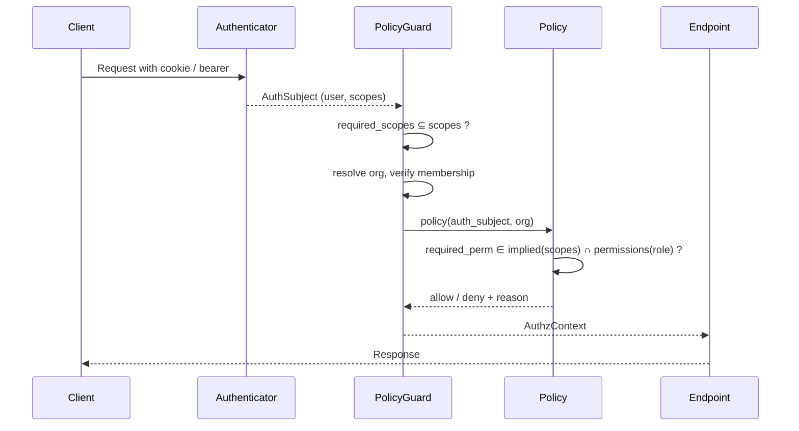

<Info>
**Status**: Draft
**Created**: April 2026
**Last Updated**: May 4, 2026
</Info>

## Summary

Introduce role-based access control for users on a Polar organization. Three roles ship in this iteration — `owner`, `admin`, and `member` — replacing today's implicit binary where org-level admin capability (member management, organization deletion, payout-account selection, Finance and payouts) is gated by `Account.admin_id`: the single user who is recorded as the admin on the org's Polar-side billing `Account`, today set at org creation.

All three roles are stored on the user–organization membership. `admin` and `member` are freely assignable; `owner` is constrained — only the user that holds `Account.admin_id` on the org's `Account` may carry the `owner` role, and that user always does (the two are kept aligned via the same `Account.admin_id` ↔ role dual-write described in [Rollout](#rollout)). There is therefore exactly one `owner` per org. What `owner` adds on top of `admin` is a small set of ownership-tied responsibilities retained for KYC/KYB / UBO reasons: the legal/billing primary contact for the org, the recipient of identity-verification notifications, the sole authority to transfer ownership of the org, and a member-removal exemption (the `owner` cannot be removed from the org without first transferring ownership).

The change is mostly additive on top of the existing two-layer authorization architecture. Role lives on the user–organization membership and drives a fine-grained permission set that policies consult. Token scopes remain a per-token capability filter; policies AND a token-scope check with a role-permission check at runtime. The Stripe-side `PayoutAccount.admin_id` is a separate concept and is unaffected by this design.

## Goals

- Introduce an `OrganizationRole` enum (`owner`, `admin`, `member`) attached to organization membership.
- Move org-level admin authorization off direct `Account.admin_id` checks and onto **role permissions** evaluated at policy time. `Account.admin_id` continues to identify the org's `owner` (legal/billing primary contact) and is kept aligned with the `owner` role via dual-write, but the runtime authorization signal becomes the role-derived permission set.
- Allow multiple admins per organization (alongside the singular `owner`).
- Enforce that an organization always has at least one user with admin capability — i.e. `role ∈ {owner, admin}`. The singular `owner` always satisfies this.
- Constrain `owner`: only the user that holds `Account.admin_id` may carry the role, and that user always does. Forbid removing the `owner` from the organization; ownership transfer remains a support/backoffice task in this iteration.
- Provide back-end and front-end utilities to answer "does this user have permission X in this org?" cleanly, plus a small `is_owner(user, org)` predicate for the few owner-keyed invariants (member-removal exemption, role-validity) that are enforced outside the permission system.
- Lay foundations for additional roles (Finance, Support, Developer, …) without re-shaping the architecture.

## Non-Goals

- Invitation/accept-link flow. Members continue to be added immediately on invite; an asynchronous invitation flow is a follow-up.
- Audit trail of role changes. Will be addressed via system events as a follow-up.
- Role-as-scope-filter at token issuance. Considered and explicitly deferred — see [Roles, scopes, and permissions](#roles-scopes-and-permissions).
- Removing or renaming `Account.admin_id`. It stays as the legal/billing primary contact for the org's `Account` and as the source of truth for who carries the `owner` role.
- Self-serve ownership transfer. Changing the `owner` of an organization remains a support/backoffice task in this iteration; a self-serve flow (current owner reassigns to a KYC-verified admin) is a follow-up.
- Modifying `PayoutAccount.admin_id` semantics. It is the legal owner of a Stripe Connect account, gates Stripe-account-level actions (onboarding link, dashboard link, delete), and is unrelated to this change. See [Relationship to `PayoutAccount.admin_id`](#relationship-to-payoutaccount-admin_id).

## Key Concepts

- **`OrganizationRole`** — new enum (`owner`, `admin`, `member`) attached to a membership. `admin` and `member` are freely assignable; `owner` is constrained to track `Account.admin_id` (see below).
- **`owner`** — the singular role per organization. The user with `OrganizationRole.owner` on a membership is, by validation, the same user as `Account.admin_id` on the org's `Account`. Carries every `admin` capability plus a small set of ownership-tied responsibilities (legal/billing primary contact, identity-verification notification recipient, sole authority for ownership transfer, exemption from member removal).
- **Membership** — the link between a user and an organization. Today it carries no role; this design adds one.
- **`Account`** — Polar's internal financial container for an organization. Holds the credit balance, fee structure, billing identity (name, address) for invoices and receipts, and a single `admin_id`. One per org. Distinct from the Stripe-side payout account.
- **`Account.admin_id`** — today, the singular authorization signal for org-level admin actions: member management, organization deletion, payout-account selection, Finance and payout reads/writes. This design moves all those gates onto role-permission checks. After the cutover, `Account.admin_id` is no longer consulted directly by policies; instead, it is the source of truth for who carries the `owner` role on their membership (the two are kept aligned via dual-write). Its real-world meaning is unchanged: legal/billing primary contact, Stripe-identity-verified, recipient of identity-verification notifications, owner-side of the Polar-for-Polar relationship.
- **`PayoutAccount`** — represents a Stripe Connect account. User-personal: each `PayoutAccount` has a single `admin_id` set at creation, immutable thereafter, representing the human whose KYC backs the Stripe account. A `PayoutAccount` can be linked to multiple organizations.
- **`PayoutAccount.admin_id`** — gates Stripe-account-level actions (onboarding link, dashboard link, delete) and the user-personal `GET /v1/payout-accounts/` listing. Unrelated to organization admin role; not changing in this design.
- **Policies** — the runtime authority for authorization decisions, organized per resource area.
- **Scopes** — describe what a *token* can do, not what a *user* can do. Sessions, personal access tokens, and organization access tokens all carry a scope set; the scope set is org-agnostic. A `scope → implied_permissions` mapping translates each scope into the fine-grained permissions it covers.
- **Permission** — fine-grained authorization unit checked at policy time. Policies require a permission; a request is allowed iff the required permission is in both `implied_permissions(token.scopes)` *and* `permissions(role_in_org)`. See [Roles, scopes, and permissions](#roles-scopes-and-permissions).

## Architecture

### Two-layer authorization (recap)

Polar's authorization model has two distinct layers:

1. **Authentication** resolves the caller into an `AuthSubject` and attaches the token's scope set.
2. **Authorization** atomically resolves the target resource, verifies org membership, and evaluates a policy function before the endpoint body runs.

Today's policies for org-level admin-only actions consult `Account.admin_id`. After this change, the same policies consult **role permissions** instead — see [Roles, scopes, and permissions](#roles-scopes-and-permissions). The shape of policies and guards does not change — only the predicate inside them.

### Roles, scopes, and permissions

Authorization at policy time consults two independent vocabularies linked by a one-way mapping:

- **Token scopes** — what *this token* is allowed to do. Org-agnostic, fixed at token issuance, the existing public capability surface (PATs, OATs, OAuth, sessions). Unchanged by this design.
- **Role permissions** — what *this user's role in this org* is allowed to do. Per-org, evaluated at runtime, internal to the RBAC layer. New in this design.
- **`scope → implied_permissions`** — a mapping in code that says: holding token scope `X` implies the fine-grained permission set that `X` covers. Bridges the two vocabularies.

Policies require a fine-grained permission. The required permission must be allowed by both vocabularies:

```
required_permission ∈ implied_permissions(auth_subject.token.scopes)
                    ∩ permissions(auth_subject.role_in(org))
```

**Bootstrapping.** Initially, the mapping is identity — for every existing scope `X`, define a same-named permission `X` and have the map send `X → {X}`. Day 1, the new layer is functionally equivalent to "use scopes directly." The first time a role-only refinement is needed, we add the fine-grained permission, list it on the role, and add it to the implied set of whichever existing scope should cover it. Existing tokens continue to imply the (now larger) permission set; they don't lose capability and don't need re-issuance.

**Why two vocabularies, not one.** Tokens are not org-qualified: a single user can be `admin` in one org and `member` in another, and one token's scope set cannot represent both states. Expressing role-as-scope at token issuance therefore either coarsens scopes to the union of roles across orgs (and policies must still gate per-org, making the scope check redundant) or churns tokens on every role change. Keeping scopes and permissions separate, and AND-ing them at policy time, is strictly stricter than either alone, with no per-request token rewriting. It also lets role permissions evolve on a different clock from token scopes — splitting a coarse permission for role purposes is a code change with no impact on existing tokens.

A defense-in-depth filter at PAT/OAT *issuance* (the issuer cannot grant scopes whose implied permissions exceed their role's) remains reasonable future work, but does not change where authorization decisions are made.

### Initial permission set and scope mapping

Most of the existing scope vocabulary is already granular enough to use as-is. The exception is `organizations:write`, which today bundles edit-settings, delete, and payout-account selection. For role purposes we split the bundle into fine-grained permissions while keeping the coarse scope intact:

| Scope (token, unchanged) | Implied permissions (new) |
|---|---|
| `organizations:write` | `organizations:edit_settings`, `organizations:delete`, `organizations:manage_payout_account` |
| `members:write` | `members:invite`, `members:remove`, `members:set_role` |
| `members:read` | `members:read` (identity) |
| `transactions:read` / `transactions:write` | identity |
| `payouts:read` / `payouts:write` | identity |
| every other scope | identity |

Initial role → permissions assignments:

| Role | Permissions |
|---|---|
| `member` | Read and write across operational resources (products, customers, subscriptions, benefits, discounts, checkout links/sessions, orders, refunds, files, events, meters, custom fields, license keys, webhooks, metrics, OATs, notifications, customer seats) and read of the member list. **Excludes** Finance (`transactions:*`, `payouts:*`, `wallets:*`, `disputes:read`), member management (`members:invite`, `members:remove`, `members:set_role`), and org management (`organizations:edit_settings`, `organizations:delete`, `organizations:manage_payout_account`). Billing-info edits on the org's `Account` (legal name, address, etc.) fall under `organizations:edit_settings` and are therefore admin-only by way of the org-management exclusion. |
| `admin` | Every `member` permission **plus** the excluded set above. |
| `owner` | Identical to `admin` in this iteration. Distinguished from admin by invariants (member-removal exemption, role-validity tied to `Account.admin_id`), not by additional permissions. The `organizations:transfer_ownership` permission, if/when self-serve transfer ships, will be owner-only. |

This keeps the day-1 footprint small: one bundle to split (`organizations:write`), one near-identity scope-to-permission map elsewhere, and three role permission sets. New permissions are added at the seam where role granularity needs to diverge from scope granularity, not preemptively.

### Where the permission check lives

A small helper inside the authorization policy layer already centralises today's `Account.admin_id` check. Three policies route through it; each gets a fine-grained permission post-cutover:

- **Member management** — invite/remove org members. Gated by `members:invite`, `members:remove`, `members:set_role` (split from the `members:write` token scope).
- **Organization deletion** — delete the org. Gated by `organizations:delete` (split from `organizations:write`).
- **Payout-account selection** — choose or change which `PayoutAccount` this org is paid out to (i.e. set `Organization.payout_account_id`). Gated by `organizations:manage_payout_account` (split from `organizations:write`). This is *not* the same as managing a Stripe Connect account; that remains gated by `PayoutAccount.admin_id`.

Replacing the body of that helper with a permission check flips all three at once. The **Finance** policies (transactions, payouts, wallets, disputes) make the same `Account.admin_id` check directly without going through the helper, and switch to the corresponding permission check too (`transactions:*`, `payouts:*`, `wallets:*`, `disputes:read` — admin-only on the role-permission side). Billing-info edits on the org's `Account` (legal name, address, etc.) are not a separate Finance gate; they piggyback on `organizations:edit_settings`, which is admin-only by role-permission assignment.

The **payout-account** policies (operations on a specific `PayoutAccount` itself: onboarding link, dashboard link, delete) check `PayoutAccount.admin_id` and **do not move**. A `PayoutAccount` can be linked to multiple organizations (a real feature), so the legal Stripe-side owner is not a per-org concept; routing those checks through org-role would let any admin of any consuming org reach into a Stripe identity that isn't theirs.

A small set of **owner-exclusive** invariants live alongside policies but aren't permissions: the member-removal exemption (the `owner` cannot be removed from the org) and the role-validity rule (only the `Account.admin_id` user may carry `owner`, and they always do). They are data-integrity rules enforced in the membership service alongside the admin-capability invariant.

No new dependency aliases are needed; existing scope-gated guards keep their names and required scopes. The role lookup remains a single helper: given a user and an organization, return their role (or `None` if not a member). The permission check is one step on top: `required ∈ implied_permissions(scopes) ∩ permissions(role)`. Both are consumed by policies and by service-layer invariants.

### Relationship to `Account.admin_id`

`Account.admin_id` continues to identify a real human responsibility on the org — the primary legal/billing contact for the Polar-side `Account`, the user expected to hold KYC for finance interactions, the recipient of identity-verification notifications, and the owner-side of the Polar-for-Polar relationship. It is no longer consulted directly by policies, but it remains the source of truth for who carries the `owner` role on their membership.

Because `owner` validity is tied to `Account.admin_id`, the two are kept aligned by dual-write — both pre- and post-cutover, permanently. Setting `Account.admin_id` (today via org creation and the backoffice `change_admin` flow) demotes the previous owner to `admin` and promotes the new admin to `owner` in the same transaction; conversely, the role-change endpoint refuses any transition that would put a user other than `Account.admin_id` into the `owner` role or move that user out of it. The two states cannot drift.

### Relationship to `PayoutAccount.admin_id`

`PayoutAccount.admin_id` is the legal owner of a Stripe Connect account. It is set at the time `POST /v1/payout-accounts/` creates the account and is not mutable through any code path afterwards. It continues to gate Stripe-account-level actions (onboarding link, dashboard link, delete) and the user-personal `GET /v1/payout-accounts/` listing.

Because a `PayoutAccount` can be linked to multiple organizations, its admin is necessarily a per-Stripe-account concept rather than a per-org one. This design does not move authorization for those actions. What the new role-permission system *does* govern in the payout space is the org-level decision of which `PayoutAccount` to use — i.e. setting `Organization.payout_account_id`, gated by the `organizations:manage_payout_account` permission. The conservative rule for that selection is that the caller can only switch to a `PayoutAccount` they themselves own (`PayoutAccount.admin_id == subject.id`), preserving Stripe-identity boundaries between orgs.

## Data Model

A new `OrganizationRole` enum with three members: `owner`, `admin`, `member`. The enum is attached to the user–organization membership row.

The new role attribute is required (non-null) and defaults to `member` for new memberships. Backfill maps each existing `Account.admin_id` user into the `owner` role on their membership of the owning org; everyone else is `member`. The `admin` role starts unused on existing data — it is opt-in promotion above `member`.

A database constraint and a service-layer validation jointly enforce that the user with role `owner` on a membership matches `Account.admin_id` on the org's `Account`, and that the `Account.admin_id` user always carries `owner`. The role-change endpoint cannot move a user into or out of `owner`; ownership transfer flows through `Account.admin_id` mutations (today: backoffice `change_admin`, which performs the role swap as a side-effect).

`Account.admin_id` stays where it is. Its real-world meaning is unchanged; after the cutover it is also the source of truth for the `owner` role. `PayoutAccount.admin_id` is unchanged.

## Authorization Flow



The diagram changes nothing structurally from today; only the *content* of the policy step changes (permission intersection check instead of `Account.admin_id` lookup).

## API Surface

Endpoints whose authorization already routes through the central authorization helper gain permission-based behaviour automatically when that helper is updated (its body switches from an `Account.admin_id` check to the permission intersection check). This covers member listing, invite, removal, organization deletion, and finance/payout endpoints.

A net-new endpoint changes a member's role: `PATCH /v1/organizations/{id}/members/{user_id}` with a `role` body, guarded by the `members:set_role` permission. Only `admin` and `member` are accepted in the body; transitions to or from `owner` go through the `Account.admin_id` mutation flow (today: backoffice `change_admin`) and are rejected by this endpoint. The members listing response gains a `role` field. The pre-existing `is_admin` boolean on that response becomes a transitional alias for `role ∈ {owner, admin}` and is removed once the dashboard has migrated.

## Frontend

The dashboard's auth context gains role information per organization, populated from the existing per-user organizations endpoint augmented to include `role`. Two small hooks live on top: one returns the user's role in a given org, and one answers a permission question (`hasPermission(perm, org)`). The permission hook reuses the same `scope → implied_permissions` and `role → permissions` tables the backend uses, generated from a single source. The backend remains the source of truth on every request.

The Settings → Members UI uses these hooks to render a role-change control on each row (gated by `members:set_role`), to disable destructive controls when the action would leave the org without anyone holding admin permissions, and to surface the policy denial message verbatim. The `owner` row renders the role-change control disabled (with a tooltip pointing to support) and its remove-member affordance disabled. Pages currently gated on the implicit "is admin" check (Finance) move to the new permission hook.

## Invariants

### Exactly one owner per org

Enforced jointly by validation and the role/`Account.admin_id` dual-write: the user with role `owner` on a membership must match `Account.admin_id` on the org's `Account`, and that user always carries `owner`. The role-change endpoint refuses transitions that would violate either direction; ownership transfer flows through `Account.admin_id` mutations, which perform the role swap as a side-effect inside the same transaction.

### Owner cannot be removed from the org

Enforced in the membership service: the `owner` is exempt from removal. To change ownership, the operator must first transfer it (today: backoffice `change_admin`); only then can the previous owner be demoted or removed. This is a data-integrity rule, not a permission.

### At least one user with admin capability per org

Enforced in the membership service: any operation that would leave an organization with zero users in `role ∈ {owner, admin}` is rejected. The check is evaluated against the post-mutation state inside the same transaction. The owner-non-removable invariant alone guarantees this for any org with a valid `Account.admin_id`; the explicit check is defence-in-depth.

### Read-only impersonation rejection

The recently-codified read-only-impersonation invariant ([#11303](https://github.com/polarsource/polar/pull/11303)) carries through: impersonation sessions hold no `_write` scope, and the role-mutation endpoint requires the `members:write` scope (which is what implies the `members:set_role` permission), so impersonation cannot mutate roles. No additional safeguards needed.

## Rollout

The change ships as a sequence of PRs. Each step preserves two invariants at every boundary:

1. During app/DB version skew, both old and new code can read and write the schema correctly.
2. At any point, all running code agrees which signal authorization decisions follow. Pre-cutover that signal is `Account.admin_id`; post-cutover it is the role-permission check. The `Account.admin_id` ↔ `owner` dual-write means the two signals never disagree on the only user they both speak about (the owner), so the cutover itself is a no-op for that user; the only decisions that change are the new ones the role attribute now expresses (additional admins, finer permissions).

### Phase 1 — Additive schema, dual-write

Add the role attribute with a default of `member`. Backfill maps each `Account.admin_id` user to the `owner` role on their membership; everyone else stays `member`. The application keeps the role aligned whenever `Account.admin_id` is set (org creation) or changed (the backoffice `change_admin` flow): the previous owner is demoted to `admin`, the new admin is promoted to `owner`, in the same transaction. The owner-validity validation that guards this dual-write — "only the `Account.admin_id` user may carry `owner`, and that user always does" — ships now too, even though no caller-facing role-change endpoint exists yet, so any future or backfill write is checked.

The role-to-permissions and scope-to-implied-permissions tables (and the fine-grained permission strings they reference) also land in this phase, in code, but are not yet consumed by any policy. Shipping them early keeps Phase 3 a pure switch-flip and lets the Phase 3 verification script reference the same tables.

Authorization code does not yet read the new role attribute. Old code that doesn't know about the new attribute continues to function because the default keeps inserts well-formed.

### Phase 2 — Tighten the schema

Once every row has a value and all running code writes one, tighten the attribute to non-null and add a database-level CHECK that the membership's role is `owner` only when the user matches `Account.admin_id` on the org's `Account` (defence-in-depth alongside the service-layer validation shipped in Phase 1). Schema-only change, no application work beyond the constraint.

### Phase 3 — Authorization cutover

Backend authorization switches from the `Account.admin_id` check to the permission intersection check (`required_perm ∈ implied(scopes) ∩ permissions(role)`), reading the role-permissions and scope-implied-permissions tables shipped in Phase 1. The new role-change endpoint, owner-non-removable invariant, and admin-capability invariant ship in this phase. The members API response gains the `role` field; the legacy `is_admin` boolean becomes a derived alias for `role ∈ {owner, admin}`. The `PayoutAccount.admin_id` policy is unchanged.

A pre-deploy verification asserts that every pre-existing `Account.admin_id` user has the `owner` role on that org, that exactly one owner exists per org, and that no organization is left without admin capability. The deploy is gated on that check.

### Phase 4 — Frontend adopts role

The dashboard reads `role` directly via the new hooks, gates UI controls on the permission helper, and displays policy denial messages from the backend. The permission tables consumed by the hook are generated from the backend source (the same Phase 1 tables) into a TypeScript artefact at build time, so the two cannot drift. The backend continues to return both `role` and the legacy `is_admin` field, so any browser tab still on the previous bundle is unaffected.

### Phase 5 — Cleanup

Remove the legacy `is_admin` field from the API. The `Account.admin_id` ↔ `owner` role dual-write is permanent — it is part of the owner-validity invariant — and stays in place; phase 5 only retires the `is_admin` boolean.

The dashboard auto-deploys on every merge but does not currently force-refresh stale tabs, so a tab from phase 3 keeps consuming `is_admin` until the user reloads. Three acceptable orderings for phase 5:

1. **Time-based** — wait long enough after phase 4 that weekly-active sessions have refreshed at least once. Cheapest path; small residual risk for very long-lived idle tabs.
2. **Bundle-mismatch prompt** — ship a "new version available — please refresh" prompt as part of phase 4. Phase 5 can then ship immediately because any stale tab self-heals.
3. **Accept the break** — ship phase 5 immediately after phase 4 and accept that any dashboard tab still on the previous bundle will see errors until the user reloads. Cheapest in engineering effort; the cost is a brief degraded experience for users with long-lived tabs.

Default to (3) — the user-visible cost is small and short-lived, and it avoids both the wait and the engineering investment in a bundle-mismatch prompt.

## Out of Scope (Follow-Ups)

### Invitation / accept-link flow

Today, inviting a user adds them to the organization immediately. A proper invitation flow (email accept-link, expiring tokens) is a separate, additive feature that does not depend on this design.

### Audit trail via system events

Role changes, member adds, and member removes should emit system events for support and admin-side audit. The system events infrastructure recently landed and is the natural transport. Layering this on requires no schema changes from this design.

### Role-as-scope-filter at token issuance

A defense-in-depth design where personal-access tokens and organization-access tokens can only be issued with scopes whose implied permissions are a subset of the issuer's role permissions. Attractive but introduces token-staleness questions on role change and a second source of truth that must stay coherent with the role-permission table. Deferred until more roles ship and the trade-off is sharper.

## Open Questions

- **Phase 5 strategy.** Time-based wait, bundle-mismatch prompt, or accept the brief break for stale tabs?
- **First-class "Finance" role.** RBAC.md anticipates Finance/Support/Developer roles. Should the enum reserve those values now (forward-compat) or add them when needed?
- **Permission-table source of truth.** The `role → permissions` and `scope → implied_permissions` tables live in code in this design, generated into a frontend artefact for the permission hook. Is that sufficient long-term, or do we need a richer config layer (YAML, DB) once customer-facing role customisation is on the roadmap?
