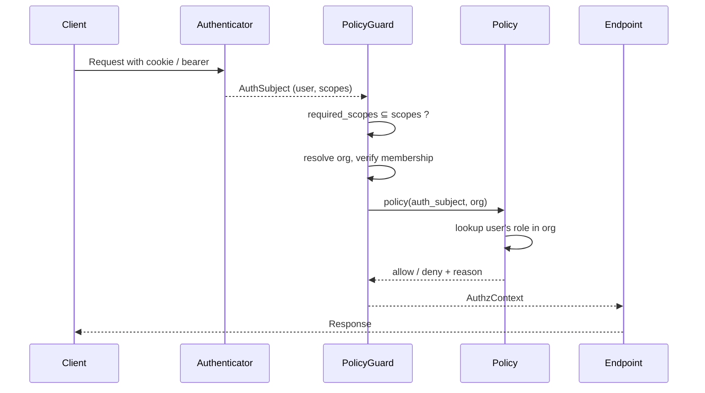

<Info>
**Status**: Draft
**Created**: April 2026
**Last Updated**: April 30, 2026
</Info>

## Summary

Introduce role-based access control for users on a Polar organization. Two roles ship in this iteration — `admin` and `member` — replacing today's implicit binary where the lone "admin" capability (Finance pages and payouts) is gated by whoever happens to own the payout account at Stripe.

The change is mostly additive on top of the existing two-layer authorization architecture. Role lives on the user–organization membership and is consulted by policies. Scopes remain a per-token capability filter and do not encode role.

## Goals

- Introduce an `OrganizationRole` (`admin`, `member`) attached to organization membership.
- Decouple "admin" from payout-account ownership. The payout-account owner remains a real, separate concept (legal owner of the Stripe account); it stops being read as an authorization signal.
- Allow multiple admins per organization.
- Enforce that an organization always has at least one admin.
- Provide back-end and front-end utilities to answer "can this user do X in this org?" cleanly.
- Lay foundations for additional roles (Finance, Support, Developer, …) without re-shaping the architecture.

## Non-Goals

- Invitation/accept-link flow. Members continue to be added immediately on invite; an asynchronous invitation flow is a follow-up.
- Audit trail of role changes. Will be addressed via system events as a follow-up.
- Role-as-scope-filter at token issuance. Considered and explicitly deferred — see [Roles vs scopes](#roles-vs-scopes).
- Removing or renaming the payout-account-owner concept. It stays as legal/billing metadata.

## Key Concepts

- **`OrganizationRole`** — new enum (`admin`, `member`) attached to a membership.
- **Membership** — the link between a user and an organization. Today it carries no role; this design adds one.
- **Payout-account owner** — the human who legally owns the Stripe payout account. Today it is the sole authorization signal for Finance and payout actions. After this change it becomes pure legal/billing metadata.
- **Policies** — the runtime authority for authorization decisions, organized per resource area.
- **Scopes** — describe what a *token* can do, not what a *user* can do. Sessions, personal access tokens, and organization access tokens all carry a scope set; the scope set is org-agnostic.

## Architecture

### Two-layer authorization (recap)

Polar's authorization model has two distinct layers:

1. **Authentication** resolves the caller into an `AuthSubject` and attaches the token's scope set.
2. **Authorization** atomically resolves the target resource, verifies org membership, and evaluates a policy function before the endpoint body runs.

Today's policies for admin-only actions consult the payout-account owner. After this change, the same policies consult the role on the membership instead. The shape of policies and guards does not change — only the predicate inside them.

### Roles vs scopes

A natural question is whether to express roles as scopes — define a scope set per role, issue tokens limited to those scopes, and let scope checks do the role enforcement.

**We are not doing that.** Tokens are not organization-qualified. A single user can be `admin` in one org and `member` in another; one token's scope set cannot represent both states. Two ways to flatten the tension exist, and both are unattractive:

- **Union of roles across orgs** — scopes become a coarse upper bound; policies must still gate per-org, so the scope check is redundant.
- **Recompute per-request from current role** — collapses back into "policies are authoritative" while introducing token-scope churn.

So **policies remain the runtime authority for role**. Scopes stay what the handbook says they are: a per-token capability filter independent of org context. A defense-in-depth filter at PAT/OAT *issuance* (the issuer cannot grant scopes their role doesn't permit) is reasonable future work, but it does not change where authorization decisions are made.

### Where role lives

A small helper inside the authorization policy layer already centralises today's "is the caller the admin?" check. Three policies route through it: member management, organization deletion, and payout-account management. Replacing the body of that helper with a role check flips all three at once. The Finance and payout-account policies make their admin checks slightly differently and switch to the role check directly. No new dependency aliases are needed; existing scope-gated guards keep their names and required scopes.

The role lookup itself is a single helper: given a user and an organization, return their role (or `None` if not a member). It is consumed by policies and by service-layer invariants.

### Relationship to the payout-account owner

The payout-account-owner attribute continues to identify the human who legally owns the Stripe payout account. It is no longer consulted for authorization. Until the cutover is complete, changes to the payout-account owner also keep the corresponding role aligned (demote the old owner, promote the new) so the two sources of truth do not drift in flight. After the cutover the two concerns are independent: payout-account ownership transfers do not modify Polar roles, and role changes do not modify payout ownership.

## Data Model

A new `OrganizationRole` enum with two members: `admin` and `member`. The enum is attached to the user–organization membership row.

The new role attribute is required (non-null) and defaults to `member` for new memberships. Backfill maps each existing payout-account-owner into the `admin` role on their membership; everyone else is `member`.

The payout-account-owner attribute stays where it is, with narrowed semantics (legal/billing metadata only).

## Authorization Flow

The diagram changes nothing structurally from today; only the *content* of the policy step changes (role lookup instead of payout-owner lookup).

## API Surface

Endpoints whose authorization already routes through the central admin-check helper gain role-based behaviour automatically when that helper is updated. This covers member listing, invite, removal, organization deletion, and finance/payout endpoints.

A net-new endpoint changes a member's role: `PATCH /v1/organizations/{id}/members/{user_id}` with a `role` body, guarded by the existing member-management authorization. The members listing response gains a `role` field. The pre-existing `is_admin` boolean on that response becomes a transitional alias for `role == 'admin'` and is removed once the dashboard has migrated.

## Frontend

The dashboard's auth context gains role information per organization, populated from the existing per-user organizations endpoint augmented to include `role`. Two small hooks live on top: one returns the user's role in a given org, and one answers a permission question (`can the user do action X in org Y`). Backed by a small client-side mapping that mirrors the backend policy structure; the backend remains the source of truth on every request.

The Settings → Members UI uses these hooks to render a role-change control on each row (admin only), to disable destructive controls when the action would leave the org without an admin, and to surface the policy denial message verbatim. Pages currently gated on the implicit "is admin" check (Finance) move to the new permission hook.

## Invariants

### At least one admin per org

Enforced in the membership service: any operation that would leave an organization with zero admins is rejected. The check is evaluated against the post-mutation state inside the same transaction. Migration backfill guarantees every org starts in a valid state.

### Read-only impersonation rejection

The recently-codified read-only-impersonation invariant ([#11303](https://github.com/polarsource/polar/pull/11303)) carries through: impersonation sessions hold no `_write` scope, and role-mutation endpoints require the organization-write scope, so impersonation cannot mutate roles. No additional safeguards needed.

## Rollout

The change ships as a sequence of PRs. Each step preserves two invariants at every boundary:

1. During app/DB version skew, both old and new code can read and write the schema correctly.
2. At any point, exactly one source of truth governs admin authorization.

### Phase 1 — Additive schema, dual-write

Add the role attribute with a default value and backfill existing admins from the payout-account-owner relationship. The application keeps the role aligned whenever the payout-account owner is set or changed, so the two sources of truth stay synchronised through the cutover. Authorization code does not yet read the new attribute.

Old code that doesn't know about the new attribute continues to function because the default keeps inserts well-formed.

### Phase 2 — Tighten the schema

Once every row has a value and all running code writes one, tighten the attribute to non-null. Schema-only change, no application work.

### Phase 3 — Authorization cutover

Backend authorization switches from the payout-owner check to the role check. The new role-change endpoint and last-admin invariant ship in this phase. The members API response gains the `role` field; the legacy `is_admin` boolean becomes a derived alias.

A pre-deploy verification asserts that every pre-existing payout-account owner has a corresponding `admin` role and that no organization is left without an admin. The deploy is gated on that check.

### Phase 4 — Frontend adopts role

The dashboard reads `role` directly via the new hooks, gates UI controls on the permission helper, and displays policy denial messages from the backend. The backend continues to return both `role` and the legacy `is_admin` field, so any browser tab still on the previous bundle is unaffected.

### Phase 5 — Cleanup

Remove the legacy `is_admin` field from the API. Stop maintaining the role-side-effect on payout-account-owner changes; payout-account ownership and Polar role become independent concerns from this point.

The dashboard auto-deploys on every merge but does not currently force-refresh stale tabs, so a tab from phase 3 keeps consuming `is_admin` until the user reloads. Two acceptable orderings for phase 5:

1. **Time-based** — wait long enough after phase 4 that weekly-active sessions have refreshed at least once. Cheapest path; small residual risk for very long-lived idle tabs.
2. **Bundle-mismatch prompt** — ship a "new version available — please refresh" prompt as part of phase 4. Phase 5 can then ship immediately because any stale tab self-heals.
3. **Accept the break** — ship phase 5 immediately after phase 4 and accept that any dashboard tab still on the previous bundle will see errors until the user reloads. Cheapest in engineering effort; the cost is a brief degraded experience for users with long-lived tabs.

Default to (3) — the user-visible cost is small and short-lived, and it avoids both the wait and the engineering investment in a bundle-mismatch prompt.

## Out of Scope (Follow-Ups)

### Invitation / accept-link flow

Today, inviting a user adds them to the organization immediately. A proper invitation flow (email accept-link, expiring tokens) is a separate, additive feature that does not depend on this design.

### Audit trail via system events

Role changes, member adds, and member removes should emit system events for support and admin-side audit. The system events infrastructure recently landed and is the natural transport. Layering this on requires no schema changes from this design.

### Role-as-scope-filter at token issuance

A defense-in-depth design where personal-access tokens and organization-access tokens can only be issued with scopes the issuer's role permits is attractive but introduces token-staleness questions on role change and a second source of truth that must stay coherent with policies. Deferred until more roles ship and the trade-off is sharper.

## Open Questions

- **Dual-write lifetime.** During phases 1–2 the dual-write keeps payout-account ownership and role aligned. Phase 5 cuts that link. Should we keep the side-effect through phase 3 (safer rollback path) or drop it the moment the cutover lands (cleaner separation)?
- **Phase 5 strategy.** Time-based wait, bundle-mismatch prompt, or accept the brief break for stale tabs?
- **First-class "Finance" role.** The original RBAC request anticipates Finance/Support/Developer roles. Should the enum reserve those values now (forward-compat) or add them when needed?
- **Front-end action vocabulary.** The initial set is small (`manage_members`, `read_finance`, `manage_finance`, `manage_payout_account`, `delete_organization`). Is the vocabulary the right shape, or should we expose role directly and let pages compose their own checks?
