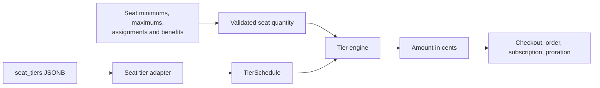

# Reusable Tier Pricing Engine

<Info>
**Status**: Draft

**Created**: August 13, 2026

**Last Updated**: August 13, 2026
</Info>

## Purpose

Seat-based pricing converts a seat quantity into an amount using either volume or graduated
tiers. Today the tier representation, tier selection, and cost calculation all live on
`ProductPriceSeatUnit`. This spec extracts the calculation into a reusable tier engine and
keeps the existing seat price behind a small adapter.

Definitions used in this document:

- **Quantity**: the number of units being priced. In this refactor, the quantity is the number
  of seats.
- **Tier**: an inclusive integer quantity range with its own per-unit amount.
- **Tier model**: the rule used to apply the tiers, either `volume` or `graduated`.
- **Volume**: the total quantity selects one tier, whose rate applies to every unit.
- **Graduated**: each tier's portion of the quantity is billed at that tier's rate, and the
  results are added.
- **Tier engine**: the pure calculation code that converts a normalized tier schedule and
  quantity into an amount.
- **Adapter**: the translation from an existing price representation into the normalized
  representation expected by the engine.

## Scope

This spec covers an internal, behavior-preserving refactor of seat tier calculation. It
introduces a generic tier representation, a pure calculation engine, and an adapter for the
existing `seat_tiers` representation.

It does not change the database, API schema, dashboard, checkout, customer portal, generated
SDKs, seat quantity validation, billing cadence, proration behavior, or seat management.

## Principles

1. **Preserve behavior exactly.** Existing seat products must produce the same amount before and
   after the refactor for every valid quantity. Existing edge cases, including a first tier whose
   `min_seats` is greater than one, remain unchanged.

2. **One place computes tiered cost.** Volume and graduated calculations live in one pure engine.
   Price models and billing services delegate to it rather than implementing tier arithmetic.

3. **Adapters isolate domain naming.** The engine uses `units` and `unit_amount`. The seat adapter
   translates `min_seats`, `max_seats`, and `price_per_seat`. The engine does not know what a seat
   is.

4. **Keep the refactor small.** The adapter is a pure function, not a hierarchy of price classes.
   The generic model supports the behavior required by seats today. Additional numeric types,
   billing policies, and price types are added only when a concrete consumer requires them.

5. **Keep public and stored data stable.** Existing `seat_tiers`, `SeatTierType`, and all
   seat-specific fields remain the API and persistence representation. The normalized model is
   internal only.

## Decisions

### Generic tier model

The engine receives an immutable normalized schedule:

```python
class TierModel(StrEnum):
    volume = "volume"
    graduated = "graduated"


@dataclass(frozen=True)
class PricingTier:
    min_units: int
    max_units: int | None
    unit_amount: int


@dataclass(frozen=True)
class TierSchedule:
    tier_model: TierModel
    tiers: tuple[PricingTier, ...]
```

The generic field names map directly to the current seat fields:

| Existing seat field | Internal field |
|---|---|
| `seat_tier_type` | `tier_model` |
| `min_seats` | `min_units` |
| `max_seats` | `max_units` |
| `price_per_seat` | `unit_amount` |

The internal model does not add an `up_to` field. `min_units` and `max_units` already represent
the tier boundaries.

The internal `TierModel` is not exposed in OpenAPI. `SeatTierType` remains unchanged and the
adapter converts it by value. Renaming the public enum is a separate API and SDK change.

### Code organization

Keep the engine independent from ORM and API modules:

- `polar/product/tiers.py` contains `TierModel`, `PricingTier`, `TierSchedule`, and the pure
  calculation functions.
- `polar/product/seat_tiers.py` contains the pure adapter from the existing seat JSON shape.
- `polar/models/product_price.py` keeps the persisted fields and delegates calculation.

The seat adapter accepts the stored mapping without importing the product price ORM model. This
keeps the dependency direction toward the engine and avoids a model-to-service import cycle.

### Tier boundaries

- Quantities and boundaries remain integers.
- Both `min_units` and `max_units` are inclusive.
- Adjacent tiers are contiguous: the next `min_units` equals the previous `max_units + 1`.
- Only the final tier can have `max_units = None`.
- Tiers are processed in ascending `min_units` order.

The existing input schema remains responsible for user-facing validation and sorting. The
engine operates on the normalized, validated schedule. It raises an internal error if no volume
tier matches, because that indicates invalid persisted data or an adapter bug.

### Minimum purchase quantity

The first seat tier's `min_seats` also acts as the minimum purchase quantity. That is a
seat-specific policy and does not become engine behavior.

`ProductPriceSeatUnit.get_minimum_seats()` and `get_maximum_seats()` remain unchanged. Checkout
and subscription services continue to call those methods before calculating an amount.

For graduated pricing, the first tier can have `min_seats > 1`, but it still prices units
starting at one. The engine preserves this behavior by measuring graduated tier capacity from
the previous tier's upper bound, beginning with zero. It does not subtract the first tier's
`min_units` from its capacity.

For example:

```python
tiers = [
    PricingTier(min_units=10, max_units=10, unit_amount=20_000),
    PricingTier(min_units=11, max_units=None, unit_amount=6_000),
]
```

The minimum valid purchase is 10. Under graduated pricing:

- 10 units cost `10 × 20_000`.
- 15 units cost `10 × 20_000 + 5 × 6_000`.

### Cost calculation

The engine exposes one entry point:

```python
def calculate_tiered_amount(
    quantity: int,
    schedule: TierSchedule,
) -> int:
    match schedule.tier_model:
        case TierModel.volume:
            return calculate_volume_amount(quantity, schedule.tiers)
        case TierModel.graduated:
            return calculate_graduated_amount(quantity, schedule.tiers)
```

Volume pricing selects the containing tier and applies its rate to the full quantity:

```python
def calculate_volume_amount(
    quantity: int,
    tiers: tuple[PricingTier, ...],
) -> int:
    for tier in tiers:
        if quantity >= tier.min_units and (
            tier.max_units is None or quantity <= tier.max_units
        ):
            return quantity * tier.unit_amount

    raise TierNotFound(quantity)
```

Graduated pricing allocates the quantity across the tiers:

```python
def calculate_graduated_amount(
    quantity: int,
    tiers: tuple[PricingTier, ...],
) -> int:
    total = 0
    remaining = quantity
    previous_max = 0

    for tier in tiers:
        if remaining <= 0:
            break

        capacity = (
            tier.max_units - previous_max
            if tier.max_units is not None
            else remaining
        )
        units_in_tier = min(remaining, capacity)
        total += units_in_tier * tier.unit_amount
        remaining -= units_in_tier

        if tier.max_units is not None:
            previous_max = tier.max_units

    return total
```

The engine returns the amount only. A structured per-tier breakdown is not required by any
current caller and is not added by this refactor.

### Seat adapter

The seat adapter is a pure translation:

```python
def adapt_seat_tiers(seat_tiers: SeatTiersData) -> TierSchedule:
    return TierSchedule(
        tier_model=TierModel(seat_tiers.get("seat_tier_type", "volume")),
        tiers=tuple(
            PricingTier(
                min_units=tier["min_seats"],
                max_units=tier.get("max_seats"),
                unit_amount=tier["price_per_seat"],
            )
            for tier in sorted(
                seat_tiers.get("tiers", []),
                key=lambda tier: tier["min_seats"],
            )
        ),
    )
```

The adapter does not mutate or rewrite `seat_tiers`. It creates an internal value for the
duration of the calculation.

### Product price integration

`ProductPriceSeatUnit.calculate_amount()` remains the stable entry point for all existing
callers:

```python
class ProductPriceSeatUnit:
    def calculate_amount(self, seats: int) -> int:
        schedule = adapt_seat_tiers(self.seat_tiers)
        return calculate_tiered_amount(seats, schedule)
```

The calculation methods currently implemented on `ProductPriceSeatUnit` move to the engine.
Seat-specific helpers remain on the model:

- `get_minimum_seats()`
- `get_maximum_seats()`
- `is_free`

Remove `get_tier_for_seats()` from the model. Repository-wide usage shows no callers, and the
engine's volume selector replaces it.

No billing call site changes are required. Checkout amounts, subscription price snapshots,
orders, recurring billing entries, and seat prorations continue to call
`ProductPriceSeatUnit.calculate_amount()`.

### Dependency direction



The tier engine imports no ORM model, service, repository, API schema, or billing code. The seat
adapter depends on the generic tier types, while the product price delegates through the
adapter.

### Errors

Invalid request tier configurations continue to produce the existing Pydantic validation
errors. This refactor does not introduce new API errors.

An impossible normalized schedule or an unmatched volume quantity is an internal invariant
violation. The engine raises a descriptive exception rather than returning `0` or selecting a
fallback tier.

### Rollout

This refactor requires no migration, backfill, feature flag, API regeneration, or customer
rollout. It ships as an internal change after the existing seat pricing tests pass unchanged.

## Frontend

There are no frontend changes. The dashboard continues to read and write `seat_tiers`, checkout
continues to display seat tiers, and the customer portal continues to use stored subscription
amounts and seat quantities.

## Testing

The refactor is complete only when the existing seat behavior is covered at both the engine and
integration boundaries.

### Tier engine unit tests

- Volume pricing with one tier.
- Volume pricing with multiple tiers.
- Volume quantities at every inclusive boundary.
- Volume pricing in the unlimited final tier.
- Graduated pricing within the first tier.
- Graduated pricing spanning two and three tiers.
- Graduated quantities at every inclusive boundary.
- Graduated pricing in the unlimited final tier.
- A zero-rate tier.
- A single-tier volume schedule and graduated schedule producing the same amount.
- A first tier with `min_units > 1` still pricing graduated units from one.
- An unmatched volume quantity raising an invariant error.

### Seat adapter unit tests

- `SeatTierType.volume` maps to `TierModel.volume`.
- `SeatTierType.graduated` maps to `TierModel.graduated`.
- A missing `seat_tier_type` preserves the current volume default.
- Seat fields map to their generic equivalents without modifying the source data.
- Tiers are normalized into ascending order.

### Seat regression tests

Keep the existing model, checkout, order, subscription, billing entry, and proration tests. In
particular, retain the regression case where the first graduated tier has `min_seats > 1`.

Run the focused backend suites for:

- `tests/models/test_product_price.py`
- `tests/product/test_price_set.py`
- `tests/checkout/test_service.py`
- `tests/order/test_service.py`
- `tests/subscription/test_service_prorations.py`
- `tests/billing_entry/test_service.py`

## Out of scope

- Metered pricing.
- A `unit_based` or other new price type.
- Renaming or deprecating `seat_tiers`.
- Renaming `SeatTierType`.
- Database migrations or backfills.
- API or SDK schema changes.
- Frontend tier editor refactors.
- Fractional quantities or sub-cent tier rates.
- Per-tier flat amounts.
- Per-tier invoice or checkout breakdowns.
- Changes to seat quantity validation, proration, invitations, claims, or benefit grants.
