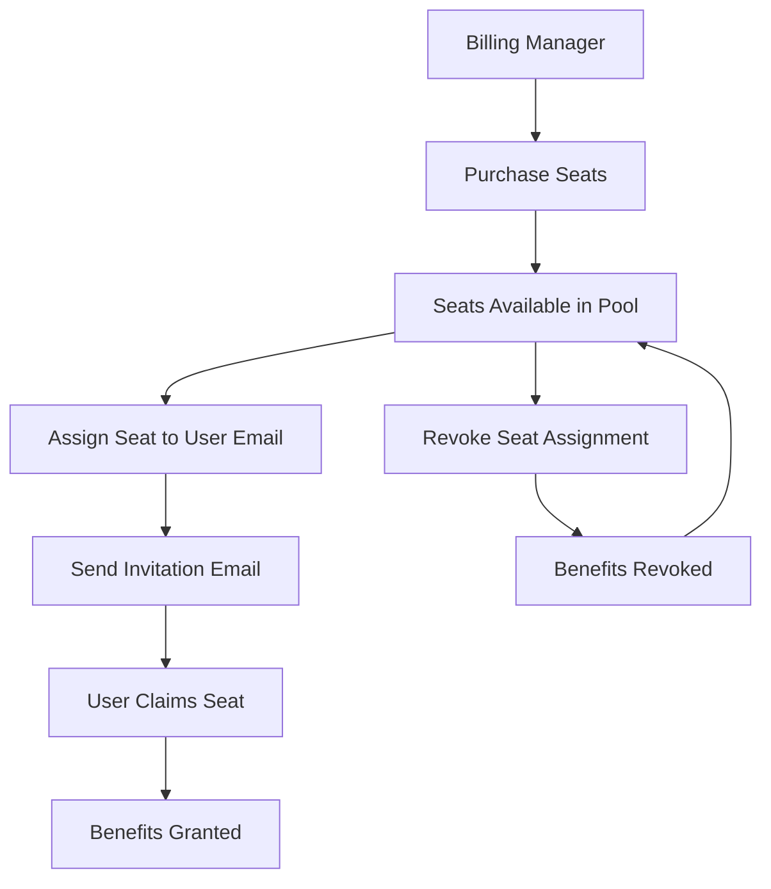
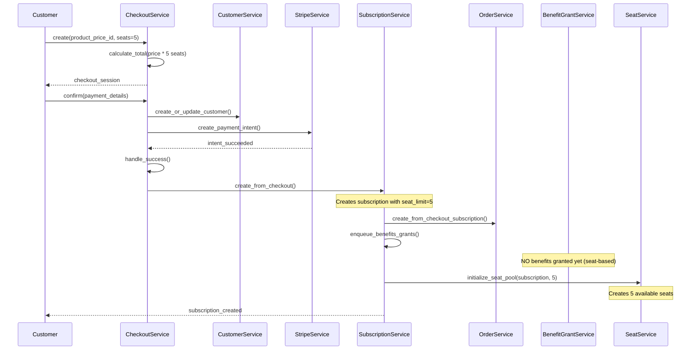
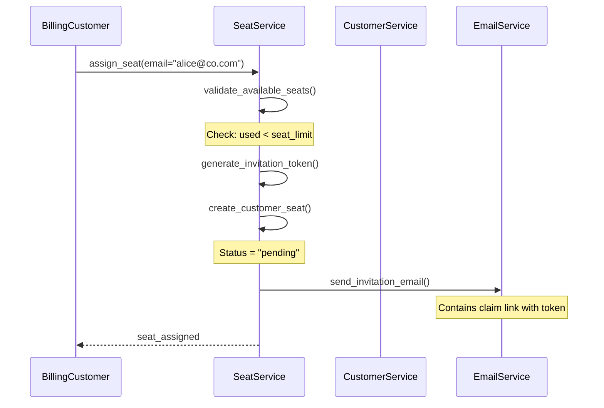
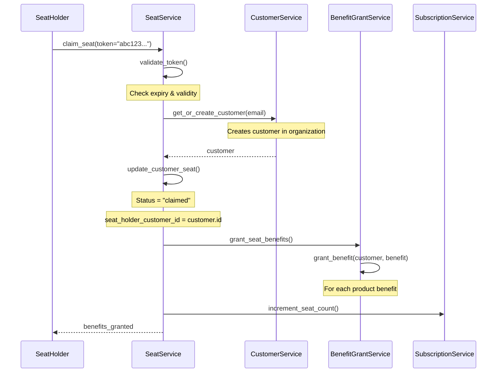
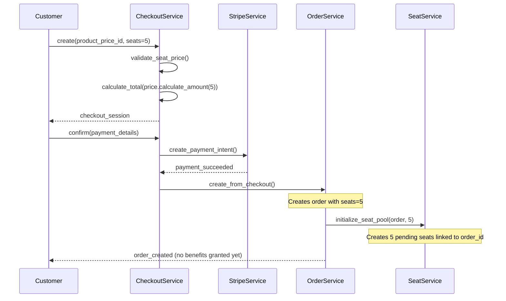
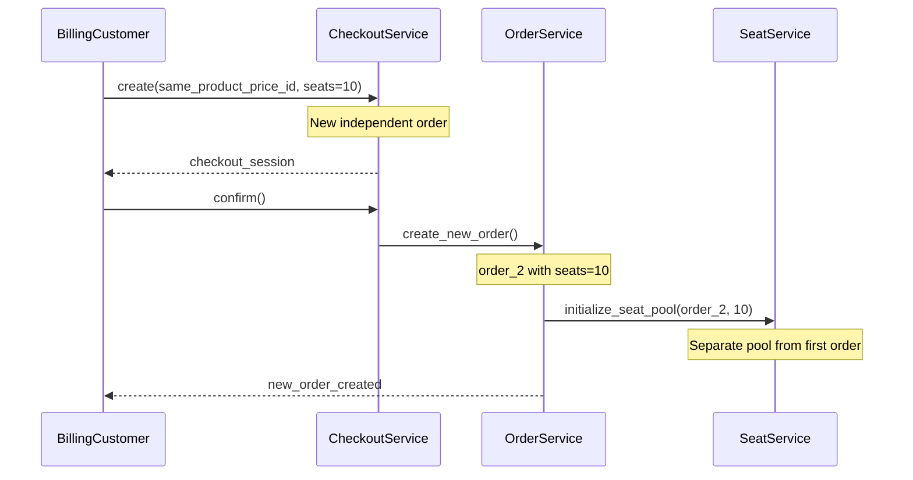

<Info>
**Status**: Active
**Created**: September 2025
**Last Updated**: October 22, 2025
</Info>

## Summary

Implement seat-based pricing with a single billing manager per company, assignable seats to customers, and support for both recurring subscriptions and one-time purchases.

**For Subscriptions**: Seats renew with the subscription cycle, and pricing can be fixed or tiered.

**For One-Time Purchases**: Seats are perpetual (never expire), each order is independent, and customers can purchase additional seats through new orders with per-order volume-based pricing.

## Goals

- One billing manager can purchase and manage seat quantities for an org.
- Billing managers can assign/unassign seats to customers (end-users) in that org.
- Support both subscription-based (recurring) and order-based (one-time) seat purchases.
- For subscriptions: Support tiered pricing and seat count changes with proration.
- For one-time purchases: Perpetual seats with per-order volume pricing and independent order management.
- Clear, testable API and data model; minimal billing complexity for app engineers.

## Non-Goals

- Complex multi-organization ownership, resellers/marketplace flows.
- Per-user usage-based charging; this is seat-quantity pricing.
- Handling taxes, refunds, dunning, and receivables beyond provider defaults.
- Merging seat pools across multiple one-time purchase orders.

## Key Concepts & Assumptions

- **Company**: Top-level account that owns subscriptions or orders.
- **Billing Manager**: Single user per org with permission to purchase/modify seats.
- **Seat**: Right to use the product, assignable to a customer record in the org.
- **Subscription Seat**: Seat linked to a recurring subscription; renews with subscription cycle.
- **Order Seat**: Seat linked to a one-time purchase order; perpetual access (never expires).
- **Seat Pool**: Collection of seats available for assignment within a subscription or order.
- **Billing Period**: Monthly/annual for subscriptions; N/A for one-time purchases.

## Seat Assignment Process



## Requirements (by priority)

1. Creating and configuring a new product with seat based pricing (subscription or one-time).
2. The customer goes to the merchant site and purchases the product.
3. Assign a seat to a customer.
4. The customer claims their benefit (like a file download or access grant).
5. The billing customer removes a seat assignment.
6. **For Subscriptions**: The billing manager upgrades to the annual plan.
7. **For Subscriptions**: The billing manager decreases/increases the seats.
8. **For One-Time Purchases**: The billing manager purchases additional seats via new order.

## Data Model

### CustomerSeat Model (Extended for Order Support)

The `CustomerSeat` model supports both subscription-based and order-based seats:

```python
class CustomerSeat(RecordModel):
    # Existing fields
    subscription_id: Mapped[UUID | None]
    status: Mapped[SeatStatus]  # pending, claimed, revoked
    customer_id: Mapped[UUID | None]  # Seat holder
    invitation_token: Mapped[str | None]
    claimed_at: Mapped[datetime | None]
    metadata: Mapped[dict]

    # NEW: Add order support
    order_id: Mapped[UUID | None] = mapped_column(
        Uuid,
        ForeignKey("orders.id", ondelete="cascade"),
        nullable=True,
        index=True,
    )

    @declared_attr
    def order(cls) -> Mapped["Order | None"]:
        return relationship("Order", lazy="raise")

    # Constraint: exactly one of subscription_id or order_id must be set
    __table_args__ = (
        CheckConstraint(
            "(subscription_id IS NOT NULL AND order_id IS NULL) OR "
            "(subscription_id IS NULL AND order_id IS NOT NULL)",
            name="seat_source_check"
        ),
    )
```

**Key Points:**
- Seats can now belong to either a subscription OR an order (mutually exclusive)
- Database constraint enforces single source per seat
- All existing subscription seats remain valid (backward compatible)

### Order Model (Extended for Seat Support)

```python
class Order(RecordModel):
    # Existing fields...

    # NEW: Add seat count for seat-based orders
    seats: Mapped[int | None] = mapped_column(Integer, nullable=True, default=None)

    @declared_attr
    def customer_seats(cls) -> Mapped[list["CustomerSeat"]]:
        return relationship(
            "CustomerSeat",
            lazy="raise",
            back_populates="order",
            cascade="all, delete-orphan",
        )
```

**Key Points:**
- `seats` field stores purchased seat count for seat-based products
- Relationship enables querying all seats for an order
- Cascade delete ensures cleanup when order is deleted

### ProductPriceSeatUnit (Existing, with Tiered Pricing)

The existing model already supports volume-based tiered pricing:

```python
class ProductPriceSeatUnit(NewProductPrice, HasPriceCurrency, ProductPrice):
    amount_type: Mapped[Literal[ProductPriceAmountType.seat_based]]
    seat_tiers: Mapped[SeatTiersData]  # JSONB with tier structure

    def calculate_amount(self, seats: int) -> int:
        """Calculate total price based on seat count and tiers"""
        return self.get_price_per_seat(seats) * seats
```

**Example Tier Structure:**
```json
{
    "tiers": [
        {"min_seats": 1, "max_seats": 10, "price_per_seat": 1000},
        {"min_seats": 11, "max_seats": 50, "price_per_seat": 900},
        {"min_seats": 51, "max_seats": null, "price_per_seat": 800}
    ]
}
```

## Implementation Flows

### Subscription-Based Seats

## Option 1 - Adding CustomerSeat

The idea is to add a new entity that is `CustomerSeat`. This entity is responsible to link the billing customer and the seat holders. So its main usage is to assign, claim, and revoke seats based on a Seat Based Pricing.

The model is the following:

```python
class CustomerSeat:
    subscription_id: int
    status: str  # pending, assigned, or claimed
    customer_id: UUID | None  # Target customer of the seat
    metadata: Dict
    # other properties like created_at, revoked_at

class Subscription:
    seats: int  # The number of seats that the customer purchased
    customer_id: UUID  # already existing, it's the billing customer
```

To store the Pricing for the Product, we will create a new type that is `seat_based` and a new price that is ProductPriceSeatUnit with the following attributes:

```python
class ProductPriceSeatUnit:
    price_per_seat: int
```

We will have a Customer, that is the Billing Manager, that purchases the Seat Based Pricing. If it's a seat based pricing product, we will not grant the benefits by default and benefits will be granted on the claim phase.

### Flows

#### Purchasing



#### Assigning seat



#### Claiming & Granting



### One-Time Purchase Seats

For one-time purchases, seats are perpetual and linked to orders instead of subscriptions. Each order is independent with its own seat pool.

#### Purchasing One-Time Seats



**Key Points:**
- Checkout validates seat count against product price tiers
- Order.seats stores the purchased quantity
- Seats are created as `pending` status with `order_id` reference
- Benefits are NOT granted at purchase (only on claim)
- Each order maintains an independent seat pool


#### Additional Purchase Flow

When a customer wants to purchase more seats:



**Key Points:**
- Each purchase creates a new independent order
- No merging of seat pools across orders
- Each order tracked separately in billing portal
- Pricing tiers apply per-order, not across orders

### API

#### Creating Subscription Product with Seat-Based Pricing

```python
# SDK Example
polar.products.create(request={
    "name": "Seat Based Subscription",
    "is_recurring": True,
    "recurring_interval": polar_sdk.SubscriptionRecurringInterval.MONTH,
    "organization_id": "org_123",
    "prices": [
        {
            "amount_type": "seat_based",
            "price_currency": "usd",
            "seat_tiers": {
                "tiers": [
                    {"min_seats": 1, "max_seats": 10, "price_per_seat": 1000},
                    {"min_seats": 11, "max_seats": 50, "price_per_seat": 900},
                    {"min_seats": 51, "max_seats": None, "price_per_seat": 800}
                ]
            }
        }
    ]
})
```

#### Creating One-Time Product with Seat-Based Pricing

```python
# SDK Example
polar.products.create({
    "name": "Enterprise License Pack",
    "is_recurring": False,  # One-time purchase
    "organization_id": "org_123",
    "prices": [{
        "amount_type": "seat_based",
        "price_currency": "usd",
        "seat_tiers": {
            "tiers": [
                {"min_seats": 1, "max_seats": 10, "price_per_seat": 1000},
                {"min_seats": 11, "max_seats": 50, "price_per_seat": 900},
                {"min_seats": 51, "max_seats": None, "price_per_seat": 800}
            ]
        }
    }]
})
```

#### Checkout with Seat Quantity

```http
POST /v1/checkouts
{
    "product_price_id": "price_xyz",
    "quantity": 10,  // Number of seats to purchase
    "customer_email": "billing@company.com"
}
```

**Response:**
```json
{
    "id": "checkout_abc",
    "url": "https://polar.sh/checkout/abc",
    "amount": 9000,  // 10 seats × $900/seat (tier pricing applied)
    "product_price": {
        "amount_type": "seat_based",
        "seat_tiers": {...}
    }
}
```

#### Assign Seat (Unified Endpoint)

Works for both subscription and order-based seats:

```python
# For subscription seats
polar.customer_seats.create({
    "subscription_id": "sub_xyz",
    "email": "alice@company.com",
    "metadata": {
        "department": "Engineering",
        "role": "Developer"
    }
})

# For order seats
polar.customer_seats.create({
    "order_id": "order_abc",
    "email": "alice@company.com",
    "metadata": {
        "department": "Engineering",
        "role": "Developer"
    }
})
```

**HTTP API:**
```http
POST /v1/customer-seats
{
    "order_id": "order_abc",  // For one-time purchases
    // OR "subscription_id": "sub_xyz",  // For subscriptions

    "email": "alice@company.com",
    "metadata": {
        "department": "Engineering",
        "role": "Developer"
    }
}
```

#### List Seats for Order

```http
GET /v1/customer-seats?order_id=order_abc
```

**Response:**
```json
{
    "items": [
        {
            "id": "seat_123",
            "order_id": "order_abc",
            "status": "claimed",
            "customer_id": "cust_456",
            "customer_email": "alice@company.com",
            "claimed_at": "2025-01-15T10:00:00Z",
            "metadata": {
                "department": "Engineering"
            }
        },
        {
            "id": "seat_124",
            "order_id": "order_abc",
            "status": "pending",
            "customer_id": null,
            "customer_email": "bob@company.com",
            "claimed_at": null
        }
    ],
    "pagination": {...},
    "summary": {
        "total_seats": 10,
        "claimed_seats": 1,
        "pending_seats": 1,
        "available_seats": 8
    }
}
```

#### Revoke Seat

```http
DELETE /v1/customer-seats/:seat_id
```

Works the same for both subscription and order seats. Benefits are revoked, and the seat returns to the available pool.

#### Claim Seat

```http
POST /v1/customer-seats/claim
{
    "token": "invitation_token_xyz"
}
```

**Response:**
```json
{
    "customer_session_token": "session_abc",
    "customer": {
        "id": "cust_456",
        "email": "alice@company.com"
    },
    "granted_benefits": [
        {
            "id": "benefit_789",
            "type": "discord",
            "description": "Access to private Discord"
        }
    ]
}
```

## Tasks

1. Create new CustomerSeat and PriceSeatUnit. Extend existing models.
2. Create new module `seats` with basic operations (assign seat, revoke, etc)
3. Add the invitation system functionality
4. Implement the claim seat functionality
5. Avoid granting benefits on checking out seat based products
6. Update the checkout to handle the seat based subscriptions
   1. Add quantity parameter
   2. Calculate the pricing
7. Implement the benefit granting and revocation functionality
8. Update Customer Portal for the Billing Manager
   1. Showing the seats with status
   2. Showing the functionality of sending invites
9. Update Customer Portal for the Customers:
   1. List the benefits
10. Update the Dashboard to allow creating seat based products
11. Update the Checkout to allow purchasing seat based
12. Update the API endpoints to allow:
    1. Creating products with seat based
    2. Assigning seats
    3. Revoking seats
13. Create metrics and alarms
14. Update the documentation

## Option 2 - Using Customer and Subscriptions model only

The main difference is that the CustomerSeat is stored inside the Subscription model, where:

- Billing customer: is the current `customer_id` from Subscription
- There is a JSONB column storing CustomerSeats.

**Pros**

- No additional model

**Cons**

- No FK constraints with customers
- Cannot index individual seats
- Complex queries

## Option 3 - Using Customer only

We can store the seats on the Customer object itself, by creating a new customer for every seat and having a parent customer who is the owner of the subscription billing.

```python
class Customer(MetadataMixin, RecordModel):
    # New fields for seat support
    parent_customer_id: UUID | None
    is_seat: bool
    seat_status: SeatStatus | None
    invitation_token: str | None
    claimed_at: datetime | None
```

**Pros**

- No need for new entities

**Cons**

- API is confusing with the concept of parent customer.
