<Info>
**Status**: Active
**Created**: August 2025
**Last Updated**: August 2025
</Info>

# Context

We are using Stripe Subscriptions, meaning that Stripe is responsible for creating the subscriptions and managing the retries of the failing methods.

At the beginning we want to mimic the Stripe retry logic to have similar recovery results.

# Solution

## Approach 1: New Dunning concept

This approach involved creating a new `DunningAttempt` model that keeps track of the failed payment attempts for subscriptions. A dedicated worker would manage the state transitions.

**Overview:**

1. **New `DunningAttempt` model**: Introduce a new class and table to process subscription failed payments. This new class will have:
    1. `id`: UUID
    2. `order_id`: foreign key to Order (unique - we should have only 1 row per order)
    3. `status`: retrying, succeeded, failed
    4. `attempt_number`: the current retry count (from 1 through 4)
    5. `next_payment_attempt_at`: date when the next retry is scheduled
    6. `last_failure_reason`: the error message that failed
    7. `started_at`: when the dunning process began
2. **Renewal Job**: A scheduled job (`subscription.cycle`) runs regularly to find subscriptions due for renewal.
3. **Payment Attempt**: For each due order subscription, it calls `PaymentService` to attempt a charge.
4. **State Transition**:
    - **On Failure**: The subscription status is changed to `past_due`, and a new DunningAttempt record is created with `attempt_number` set to 1, status `retrying`, and a `next_payment_attempt_at`. The benefits will be revoked.
    - **On Success**: The subscription is renewed, and the status remains `active`.
5. **Dunning Worker**: A new periodic worker (`subscription.dunning`) runs **hourly**.
    - It queries for `dunning_attempts` with `status = "retrying"`, and `next_payment_attempt_at` it's in the past.
    - It re-attempts payment. If it fails again, it updates `next_payment_attempt_at` for the next retry.
    - After a configured number of retries, it moves the DunningAttempt to failed and the subscription to `unpaid` or `canceled`.
6. **Recovery**: If a payment succeeds during the dunning process, the subscription status is set back to `active` and the DunningAttempt is marked to `succeeded`

### Sequence Diagram

**First payment**

```mermaid
sequenceDiagram
  participant Scheduler as SubscriptionJobStore<br/>(APScheduler)
  participant Worker as Dramatiq Worker
  participant SubscriptionService as SubscriptionService
  participant OrderService as OrderService
  participant PaymentService as PaymentService
  participant StripeWebhooks as Stripe Webhooks
  participant DunningService as <<NEW>> DunningService

  Note over Scheduler, DunningService: Phase 1: Scheduled Renewal (current flow)
  Scheduler ->> Worker: 📧 subscription.cycle<br/>(subscription_id)
  Worker ->>+ SubscriptionService: subscription_cycle(subscription_id)
  SubscriptionService ->> SubscriptionService: cycle(subscription)<br/>• Update periods<br/>• Create billing entries
  SubscriptionService ->>- Worker: 📧 enqueue "order.subscription_cycle"
  Worker ->>+ OrderService: 📧 order.subscription_cycle<br/>(subscription_id)
  OrderService ->> OrderService: create_subscription_order()<br/>• Create order from billing entries
  OrderService ->>- Worker: 📧 enqueue "order.trigger_payment"<br/>(order_id, payment_method_id)
  Worker ->> PaymentService: 📧 order.trigger_payment<br/>(order_id, payment_method_id)
  PaymentService ->> PaymentService: trigger_payment()<br/>• Create Stripe PaymentIntent
  alt Payment Succeeds
    StripeWebhooks ->> Worker: 📧 stripe.webhook.charge.succeeded
    Worker ->> PaymentService: handle_success()
    PaymentService ->> OrderService: handle_payment()
  else Payment Fails
    StripeWebhooks ->> Worker: 📧 stripe.webhook.payment_intent.payment_failed<br/>OR stripe.webhook.charge.failed
    Worker ->> PaymentService: handle_failure()
	Note over OrderService, DunningService: New logic
    PaymentService ->> OrderService: handle_failed_payment()
    OrderService ->> DunningService: start_dunning(subscription)
    DunningService ->> DunningService: Create DunningAttempt<br/>(attempt=1, next_attempt=+3d)
    DunningService ->> SubscriptionService: Set subscription status to 'past_due'
  end

```

**Dunning retries**

```mermaid
sequenceDiagram
  participant Scheduler as SubscriptionJobStore (APScheduler)
  participant Worker as Dramatiq Worker
  participant SubscriptionService as SubscriptionService
  participant OrderService as OrderService
  participant PaymentService as PaymentService
  participant StripeWebhooks as Stripe Webhooks
  participant DunningService as New DunningService

  Note over Scheduler,DunningService: Phase 2: Dunning Retries (new flow)
  Worker->>DunningService: 📧 dunning.process_attempts (hourly cron)
  DunningService->>DunningService: get_due_attempts()
  loop For each due attempt
    DunningService->>Worker: 📧 order.trigger_payment • Retry with same payment method
    Worker->>+PaymentService: trigger_payment()
    alt Payment Succeeds
      StripeWebhooks->>Worker: 📧 stripe.webhook.charge.succeeded
      Worker->>PaymentService: handle_success()
      PaymentService->>OrderService: handle_payment()
      OrderService->>DunningService: resolve_dunning()
      DunningService->>DunningService: set status to succeded
      DunningService->>SubscriptionService: Set subscription status to 'active'
    else Payment Fails
       StripeWebhooks->>Worker: 📧 stripe.webhook.charge.failed
       PaymentService->>OrderService: handle_failed_payment(order, payment)
       OrderService->>DunningService: handle_failed_payment(order)
       DunningService->>DunningService: check if DunningAttempt exists for order.
       DunningService->>DunningService: increment attempt and next_attempt (+3d, +7d, +14d)
    else Final Attempt (4th)
       StripeWebhooks->>Worker: 📧 stripe.webhook.charge.failed
       PaymentService->>OrderService: handle_failed_payment(order, payment)
       OrderService->>DunningService: handle_failed_payment(order)
       DunningService->>DunningService: check if DunningAttempt exists for order.
       DunningService->>DunningService: set DunnintAttempt to failed
       DunningService->>SubscriptionService: Set Substiption status to 'unpaid'<br> send cancellation email
    end
  end

```

**TBD: User updated payment method**

TODO

## Approach 2: Store the retries in the Subscription model

I discarded this solution as it increases the complexity of the Subscription model.

## (Recommended) Approach 3: Using Order and Payment Models

This approach relies on the existing `Order` and `Payment` models, making it a lightweight and integrated solution. It avoids a new table only needing minimal changes to the `Order` model.

**Overview:**

1. **Change `Order` Model**: Add a single, nullable timestamp field to the `Order` model:
    - `next_payment_attempt_at`: Schedules the next retry. If `NULL`, no retry is pending.
2. **Use Existing `Payment` Model**: The `Payment` model, which already has a foreign key to `Order`, will serve as the log for all payment attempts.
    - `attempt_number` can be derived by counting the `Payment` records associated with the order.
    - `last_failure_reason` can be retrieved from the most recent failed `Payment` record.
3. **Renewal and Initial Payment**: The process starts as before. A scheduled job creates an `Order` and a `Payment` is attempted.
4. **State Transition on Failure**:
    - When a payment fails, the `Payment` record is marked as `failed`.
    - The `Order` is updated by setting `next_payment_attempt_at` to schedule the first retry (e.g., 3 days from now).
    - The `Subscription` status is set to `past_due`. Benefits are revoked.
5. **Dunning Worker**: A periodic worker (`order.process_dunning`) runs hourly.
    - It queries for `Order`s where `next_payment_attempt_at` is not `NULL` and is in the past.
    - For each due order, it creates a new `Payment` record and attempts a charge.
    - **On Failure**: It reschedules `next_payment_attempt_at` for the next attempt.
    - **On Final Failure**: After the last attempt, `next_payment_attempt_at` is set to `NULL`. The `Subscription` is moved to `unpaid` or `canceled`.
6. **Recovery**:
    - If a payment succeeds, the `Payment` is marked as `succeeded`, the `Order` is marked as paid, and `next_payment_attempt_at` is set to `NULL`.
    - The `Subscription` status is set back to `active`. Benefits are re-granted.

### Comparison with Approach 1

**Pros:**

- **Maintainability**: Avoids a new table and only adds one nullable column to `Order`.
- **Leverages Existing Models**: Reuses the `Payment` model for its intended purpose, keeping the design clean and logical.
- **Clear and Explicit**: The `Order` model is only concerned with *when* the next payment is due, while the `Payment` model correctly stores the history of *what* happened.

**Cons:**

- **Complex Queries**: Retrieving the full dunning history for an order (like the attempt count or last error) requires querying the associated `Payment` records. We only expect 4 payments per order. **Mitigation:** it can be cached or denormalized if it becomes expensive.
- **Race conditions**: As before, we can have a Race condition when the retry mechanism is working and the user plans to manually pay. **Mitigation** can be prevented by locking the Order.

### Sequence Diagrams

**First Subscription Payment Failure**

This diagram shows the flow when a recurring subscription payment fails for the first time, initiating the dunning process.

**Dunning Retries**

This diagram illustrates how the periodic worker handles scheduled payment retries.

```mermaid
sequenceDiagram
  participant Scheduler as DunningCronJob
  participant Worker as Dramatiq Worker
  participant SubscriptionService as SubscriptionService
  participant OrderService as OrderService
  participant PaymentService as PaymentService
  participant StripeWebhooks as Stripe Webhooks

  Note over Scheduler, SubscriptionService: Phase 2: Dunning Retries (new flow)
  Scheduler->>Worker: 📧 order.process_dunning (hourly cron)
  Worker->>+OrderService: process_dunning_orders()
  OrderService->>OrderService: get_due_dunning_orders()<br/>(next_payment_attempt_at <= NOW())
  loop For each due order
    OrderService->>Worker: 📧 payment.create_payment_intent<br/>(order_id)
    Worker->>+PaymentService: create_payment_intent(order_id)
    alt Payment Succeeds
      StripeWebhooks->>Worker: 📧 stripe.webhook.payment_intent.succeeded
      Worker->>+PaymentService: process_payment_intent_succeeded()
      PaymentService->>OrderService: mark_order_as_paid()
      OrderService->>OrderService: order.next_payment_attempt_at = NULL
      OrderService ->> SubscriptionService: Mark subscription as 'active'
    else Payment Fails (and more retries left)
       StripeWebhooks->>Worker: 📧 stripe.webhook.payment_intent.payment_failed
       Worker->>+PaymentService: process_payment_intent_failed()
       PaymentService->>OrderService: handle_failed_dunning_payment(order)
       OrderService->>OrderService: Reschedule order.next_payment_attempt_at<br/>(e.g., +7d, +14d)
    else Final Attempt Fails
       StripeWebhooks->>Worker: 📧 stripe.webhook.payment_intent.payment_failed
       Worker->>+PaymentService: process_payment_intent_failed()
       PaymentService->>OrderService: handle_failed_dunning_payment(order)
       OrderService->>OrderService: order.next_payment_attempt_at = NULL
      OrderService ->> SubscriptionService: Mark subscription as 'unpaid'
    end
  end

```

**User Updates Payment Method**

TODO

# Questions

**How does the retry mechanism look in our Stripe account**
In Stripe we have:

- 4 retries at most.
- These 4 retries should happen before 3 weeks.
- If all retries failed, we set the status of the subscription to canceled.

**How many payments got recovered?**
Results:

- 2682 with at least 1 failed payment
- 1108 recovered orders
- Then 41% of recovery rate.

Results without Premiumize

- 1253 total
- 541 recovered
- Then 43% of recovery rate.

**What should we do with the benefits when the first payment of a subscription fails?**
The current behavior in our platform is to set the subscription status as past due and revoke the benefits. We will follow this approach as of now.

**Should we expose the retries to the API and to the user?**
Stripe shows the payment attempts under the `invoice` and `payment_intent` objects. Each payment intent can have multiple transactions associated with it. From what I see, we don't expose these payment intents in our API. I will keep this as a separate task if we want to do it.

**What happens when the customer updates the payment method?**
The customer can trigger a manual payment action. If the payment succeeds the order will be marked as paid; if it fails, it will follow the original dunning schedule.

**What is the backoff strategy of Stripe?**
Stripe has different backoffs, but based on ([t1](https://dashboard.stripe.com/payments/pi_3RTTLVDG1jUQrXwC06g5JF9W), [t2](https://dashboard.stripe.com/payments/pi_3RTTAuDG1jUQrXwC05XLsC7N), [t3](https://dashboard.stripe.com/payments/pi_3RTUoQDG1jUQrXwC1fpozXzr)) we have the following ranges:

1. (D+0) Subscription payment fails
2. (**D+2**/3) First attempt
3. (**D+7**/12) Second attempt
4. (**D+14**/17) Third attempt
5. (**D+21**) Fourth attempt.

I will go with the earliest ranges.

**If the order goes unpaid, should we move the subscription status to `unpaid` or `canceled`?**

In Stripe, we are moving it to `canceled`.
