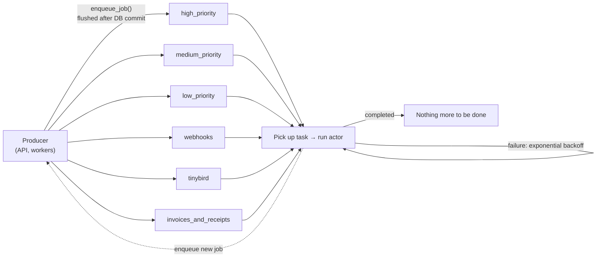
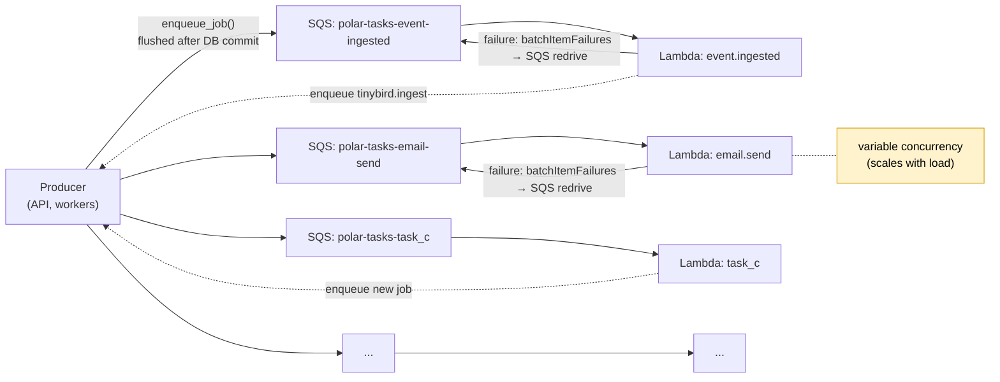

<Info>
**Status**: Draft

**Created**: 2026-06-17

</Info>

## Abstract

The async workflow that we have today relies on worker services using Dramatiq to read from one or multiple specific queues. We specify up front how many workers, how many processes and how many threads each process have.

This proposal is to migrate this workflow to instead use _n_ SQS queues and _n_ Lambda functions (one per task, n tasks). This will allow us to scale the concurrency of each task worker independently of each other. It will allow us
to automatically increase our capacity if we need to catch up on a queue we are lagging behind on.

This will change our architecture and infrastructure needs, and move us one step closer to running on AWS.

## Motivation

### Problems with Current Approach

The current approach to workers that we have works fine for stable workloads. It is very easy to add new tasks (just specify which queue they should be put on) and they will automatically get picked up. The main issues we have today is:

* When we get overwhelmed with tasks on one of the queues the other workers will not pick up and help with the tasks on the queues they are not listening to.
* We have to pre-emptively decide which queue a task should go on (high prio, medium prio, etc). This makes it tricky to give more resources to a task that has overwhelmed a queue if we realise that it was more important than previously thought.
* When the queues are empty we have a bunch of service workers that are running without doing any work.



### Desired Outcomes

We use async workers for many different things, but oftentimes we require the work to be conducted in fairly short succession from when it was scheduled. This proposal aims to ensure that we don't get overloaded by a sudden influx of tasks, self created or otherwise.
Additionally it should stay easy to reason about the code running and our infrastructure, as well as to know what code is running where.

## Proposal

The proposal is to move the worker workloads to AWS, and set up SQS with Lambda functions acting on the messages from SQS.

During roll out we will have a list of which workers run in Lambda, and which run in Dramatiq. In the enqueue_job we will use this to determine whether to enqueue the task via Dramatiq onto Redis, or onto SQS.

```python
if settings.WORKER_SQS_ENABLED and settings.WORKER_SQS_ACTORS:
    sqs_jobs = [
        job for job in self._enqueued_jobs
        if job[0] in settings.WORKER_SQS_ACTORS
    ]
    redis_jobs = [
        job for job in self._enqueued_jobs
        if job[0] not in settings.WORKER_SQS_ACTORS
    ]
else:
    sqs_jobs = []
    redis_jobs = self._enqueued_jobs
```

Each task that is handled by Lambda will get its own SQS queue. This means that the infrastructure per task is 1 Lambda, 1 SQS queue, and all other resources needed to handle this (IAM policies, etc). The logs and traces from the Lambda will be forwarded to Logfire, similar to how we handle logs today. The infrastructure will be encapsulated with a terraform module to make it easy to spin up (and down) new tasks as we add them.

The tasks will be enqueued somewhat similar to how we enqueue tasks to Dramatiq today.

Dramatiq
```python
message = fn.message_with_options(
    args=args,
    kwargs=kwargs,
    redis_message_id=redis_message_id,
    source_correlation_id=correlation_id,
)
encoded_message = message.encode()
```

SQS
```python
json.dumps(
    {
        "actor": actor,
        "args": args,
        "kwargs": kwargs,
        "correlation_id": correlation_id,
    },
    separators=(",", ":"),
    default=_json_obj_serializer,
)
```

Ending up with something like the following in SQS:
```json
{
    "messageId": "d5f8…",
    "receiptHandle": "AQEB…",
    "body": "{\"actor\":\"event.ingested\",\"args\":[[\"0f9c…\"]],\"kwargs\":{},\"correlation_id\":\"01J8…\"}",
    "attributes": {
      "ApproximateReceiveCount": "1",
      "SentTimestamp": "1718…",
      "ApproximateFirstReceiveTimestamp": "1718…"
    },
    "messageAttributes": {},
    "eventSource": "aws:sqs",
    "eventSourceARN": "arn:aws:sqs:us-east-2:…:polar-tasks-event-ingested"
  }
```



We preserve the same retry/backoff behavior, implemented through SQS visibility/redrive instead of via the `Retry` exception handler in Dramatiq.


### Local development

Local development will utilise [localstack](https://github.com/localstack/localstack) which has support for both SQS and Lambda, and will be encapsulated in the `dev` commands used by the engineering team.

### Rollout and rollback plan

Rollout will be done on a task-by-task basis. We can consider having a fall-back lambda that reads from SQS and writes to Redis to allow us to move back in the event that something does not work out with the lambda solution.

## Alternatives considered

N/A

## Open questions

### Database Connections

Given that we are aiming for scaling the concurrency per lambda instead of per queue (as we have done previously) we have the risk of running out of database connections. The number of database connections is constrained by the database type we use. Here we might need to calculate what the max scaling we can afford, as well as look into introducing something like [pgBouncer](https://planetscale.com/blog/scaling-postgres-connections-with-pgbouncer) to allow us to scale up our database connections without choking the database.
