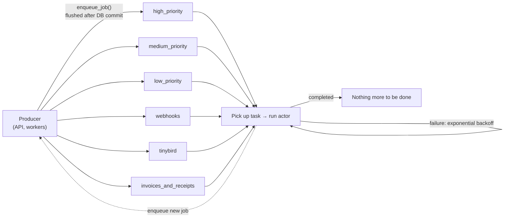
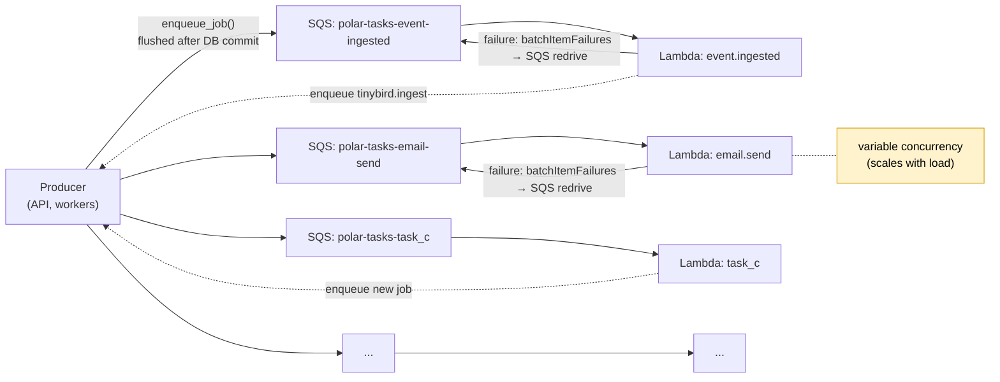

<Info>
**Status**: Draft

**Created**: 2026-06-17

</Info>

## Abstract

The async workflow that we have today relies on worker services using Dramatiq to read from one or multiple specific queues. We specify up front how many workers, how many processes and how many threads each process have.

This proposal is to migrate this workflow to instead use _n_ SQS queues and _n_ Lambda functions (one per task, n tasks). This will allow us to scale the concurrency of each task worker independently of each other. It will allow us
to automatically increase our capacity if we need to catch up on a queue we are lagging behind on.

This will change our architecture and infrastructure needs, and move us one step closer to running on AWS.

## Motivation

### Problems with Current Approach

The current approach to workers that we have works fine for stable workloads. It is very easy to add new tasks (just specify which queue they should be put on) and they will automatically get picked up. The main issues we have today is:

* When we get overwhelmed with tasks on one of the queues the other workers will not pick up and help with the tasks on the queues they are not listening to.
* We have to pre-emptively decide which queue a task should go on (high prio, medium prio, etc). This makes it tricky to give more resources to a task that has overwhelmed a queue if we realise that it was more important than previously thought.
* When the queues are empty we have a bunch of service workers that are running without doing any work.



### Desired Outcomes

We use async workers for many different things, but oftentimes we require the work to be conducted in fairly short succession from when it was scheduled. This proposal aims to ensure that we don't get overloaded by a sudden influx of tasks, self created or otherwise.
Additionally it should stay easy to reason about the code running and our infrastructure, as well as to know what code is running where.

## Proposal

The proposal is to move the worker workloads to AWS, and set up SQS with Lambda functions acting on the messages from SQS.

During roll out we will have a list of which workers run in Lambda, and which run in Dramatiq. In the enqueue_job we will use this to determine whether to enqueue the task via Dramatiq onto Redis, or onto SQS.

```python
if settings.WORKER_SQS_ENABLED and settings.WORKER_SQS_ACTORS:
    sqs_jobs = [
        job for job in self._enqueued_jobs
        if job[0] in settings.WORKER_SQS_ACTORS
    ]
    redis_jobs = [
        job for job in self._enqueued_jobs
        if job[0] not in settings.WORKER_SQS_ACTORS
    ]
else:
    sqs_jobs = []
    redis_jobs = self._enqueued_jobs
```

Each task that is handled by Lambda will get its own SQS queue. This means that the infrastructure per task is 1 Lambda, 1 SQS queue. Policies and security groups will be shared between the Lambdas to ensure that we don't have unnecessarily many resources tracked in Terraform, and that the tasks doesn't start to diverge too much. The added benefit with sharing security groups is that they will also share the same Hyperplane ENI. The logs and traces from the Lambda will be forwarded to Logfire, similar to how we handle logs today. The infrastructure will be encapsulated with a terraform module to make it easy to spin up (and down) new tasks as we add them.

The tasks will be enqueued somewhat similar to how we enqueue tasks to Dramatiq today.

Dramatiq
```python
message = fn.message_with_options(
    args=args,
    kwargs=kwargs,
    redis_message_id=redis_message_id,
    source_correlation_id=correlation_id,
)
encoded_message = message.encode()
```

SQS
```python
json.dumps(
    {
        "actor": actor,
        "args": args,
        "kwargs": kwargs,
        "correlation_id": correlation_id,
    },
    separators=(",", ":"),
    default=_json_obj_serializer,
)
```

Ending up with something like the following in SQS:
```json
{
    "messageId": "d5f8…",
    "receiptHandle": "AQEB…",
    "body": "{\"actor\":\"event.ingested\",\"args\":[[\"0f9c…\"]],\"kwargs\":{},\"correlation_id\":\"01J8…\"}",
    "attributes": {
      "ApproximateReceiveCount": "1",
      "SentTimestamp": "1718…",
      "ApproximateFirstReceiveTimestamp": "1718…"
    },
    "messageAttributes": {},
    "eventSource": "aws:sqs",
    "eventSourceARN": "arn:aws:sqs:us-east-2:…:polar-tasks-event-ingested"
  }
```



We preserve the same retry/backoff behavior, implemented through SQS visibility/redrive instead of via the `Retry` exception handler in Dramatiq.

The AWS environments will have a single static external IP per environment (production, sandbox, test). These can be used with the IP allow listing on Render to allow the Lambdas to access the database.

Redis will on the other hand be segregated into Render and AWS instances. Since there are only a few touch points in Redis (Dramatiq, Customer state cache, Metrics cache), most of the usage is fine to be non-interlinked. The main drawbacks of this is that we will not be able to share cache between non-migrated tasks and migrated tasks, and we will not be able to enqueue non-migrated tasks from AWS. Both of these are deemed as acceptable trade-offs to prevent us from going above the connection limit on Redis on Render. The AWS Redis has higher connection limits which fits the higher concurrency limits of Lambdas better.

### Potential problems and their solutions

1. We can hit ENI limits

If we reuse the same security groups and VPC subnets for all of the Lambdas, we will be able to reuse the same Hyperplane ENI. This will give us 65k connections per subnet. These will scale automatically behind the scenes, so even if we exhaust them we will get a new Hyperplane ENI. Setting up a new Hyperplane ENI has a small startup cost, which will impact the startup time of the Lambdas that are running with the new one.

2. Hard limit timeout of Lambdas is 15m

Our current p99.9 is 20.5s for the invoice generation, otherwise it's 12.5s. Overall the ambition is for the worker tasks to run fairly quickly, the default time limit is 60 seconds, with a few exceptions (10 minutes for organization member backfill, 3 minutes for organization review and 3 minutes for invoice rendering). We also have cron triggers that run every 5 or 15 minutes with the ambition is that the work should have finished before the next iteration of the same tasks are scheduled again.

15 minutes is a good target for our tasks to be below, and is not a difficult constraint today.


### Local development

Local development will utilise [localstack](https://github.com/localstack/localstack) which has support for both SQS and Lambda, and will be encapsulated in the `dev` commands used by the engineering team.

### Rollout and rollback plan

Rollout will be done on a task-by-task basis. We can consider having a fall-back Lambda that reads from SQS and writes to Redis to allow us to move back in the event that something does not work out with the Lambda solution.

## Alternatives considered

## Continue on Render

The downsides that we have today will remain, where we have to split the workers into more pieces to gain the ability to handle prioritization between tasks. We can't easily give more prioritization or increase the throughput on a specific task today, and it is overall a fairly blunt instrument to handle.

## ECS/Fargate

Running on ECS / Fargate would allow us to migrate the Dramatiq queues over to SQS, but the overall infrastructure would be the same as what is running on Render today. Management, deployments and such are very similar on ECS and Render. The positive aspects is that it will still allow us to dip our toes into the AWS ecosystem, and solve some of the pain points that we have today. The downsides are that we would still need to handle increased load manually by scaling instances, and we would not gain the fleixibility of Lambda when it comes to high concurrency and low amounts of idling systems.


## Open questions

### Cron schedule

This RFC and the initial version doesn't handle the jobs scheduled by the scheduler (i.e. the cron jobs). The initial plan is to let the scheduler continue to live in Render and that it will enqueue the jobs that are tracked by the Python code. We could move these over to something like EventBridge that will trigger events that the Lambdas can listen to. The downside to doing that is that we would move the cron definitions away from the Python code and into the infrastructure.


### Database Connections

Given that we are aiming for scaling the concurrency per Lambda instead of per queue (as we have done previously) we have the risk of running out of database connections. The number of database connections is constrained by the database type we use. Here we might need to calculate what the max scaling we can afford, as well as look into introducing something like [pgBouncer](https://planetscale.com/blog/scaling-postgres-connections-with-pgbouncer) to allow us to scale up our database connections without choking the database.
