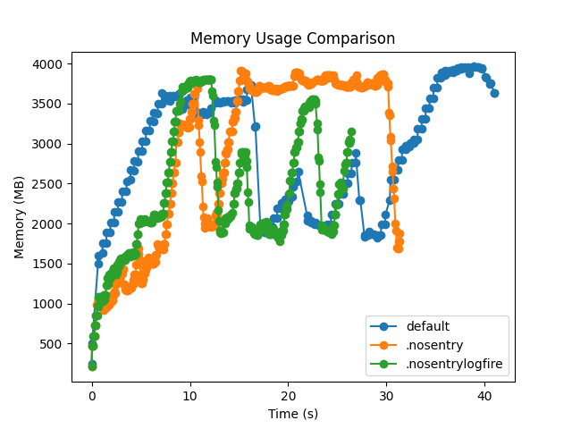
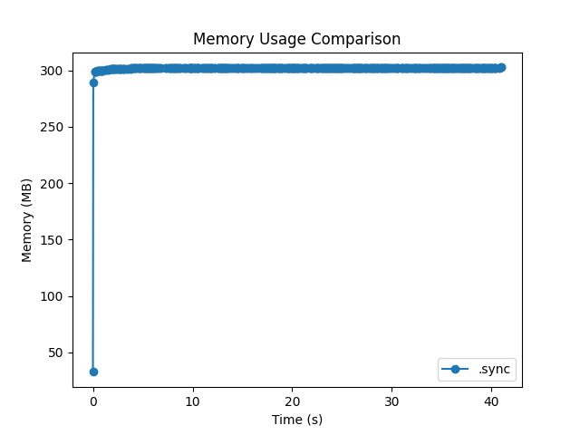
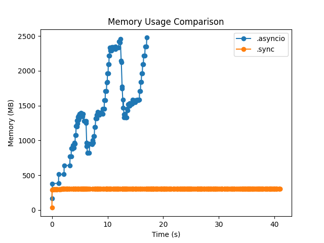

# Worker Memory Leak Act 2

<Info>**Author:** François Voron • **Published:** December 01, 2025</Info>

## Context

Some [months ago](./worker-memory-leak), Petru investigated a memory leak in our Python worker system using Dramatiq and Redis as a broker. While we didn't find the root cause, we definitely narrowed the problem around exceptions, noticing that OOM happened after bursts in task errors.

Our bet was it was probably related to the external services we use to monitor our backend, like Sentry or Logfire. This was the starting point for further investigations.

## Attempt 1: disabling Sentry and Logfire

Since we were quite certain the issue was related to exceptions, I created a new task that was generatic exceptions with a large memory footprint:

```py
MEMORY_LOG_FILE = "memory_usage.csv"

class BigException(Exception):
    def __init__(self, a: bytes) -> None:
        self.a = a
        super().__init__("Big exception")


def log_memory(label: str = "") -> None:
    process = psutil.Process()
    memory_info = process.memory_info()
    timestamp = time.time()
    memory_mb = memory_info.rss / 1024 / 1024

    file_exists = os.path.exists(MEMORY_LOG_FILE)
    with open(MEMORY_LOG_FILE, "a") as f:
        if not file_exists:
            f.write("timestamp,memory_mb,label\n")
        f.write(f"{timestamp},{memory_mb:.2f},{label}\n")


@actor(actor_name="oom_task", max_retries=1_000_000, max_backoff=100)
async def oom_task() -> None:
    log_memory("before_alloc")
    a = bytes(bytearray(128 * 1024 * 1024))
    log_memory("after_alloc")
    raise BigException(a)
```

I then enqueued that task and ran it using our existing worker setup:

1. First, with Sentry and Logfire enabled
2. Then, with Sentry disabled
3. Finally, with both Sentry and Logfire disabled

The results were not really conclusive, with memory hitting the roof in all three cases.



## Attempt 2: minimal worker

Since we lost our best candidates, I decided to create a minimal Dramatiq setup and slowly add components until the memory leak appears. First, a pure Dramatiq worker, without asyncio support:

```py
import os
import time

import dramatiq
import psutil
from dramatiq.brokers.redis import RedisBroker

broker = RedisBroker(url="redis://localhost:6379/0")
dramatiq.set_broker(broker)


class BigException(Exception):
    def __init__(self, a: bytes) -> None:
        self.a = a
        super().__init__("Big exception")


MEMORY_LOG_FILE = "memory_usage.sync.csv"


def log_memory(label: str = "") -> None:
    process = psutil.Process()
    memory_info = process.memory_info()
    timestamp = time.time()
    memory_mb = memory_info.rss / 1024 / 1024

    file_exists = os.path.exists(MEMORY_LOG_FILE)
    with open(MEMORY_LOG_FILE, "a") as f:
        if not file_exists:
            f.write("timestamp,memory_mb,label\n")
        f.write(f"{timestamp},{memory_mb:.2f},{label}\n")


@dramatiq.actor(actor_name="oom_task", max_retries=1_000_000, max_backoff=100)
def oom_task() -> None:
    log_memory("before_alloc")
    a = bytes(bytearray(128 * 1024 * 1024))
    log_memory("after_alloc")
    raise BigException(a)


if __name__ == "__main__":
    oom_task.send()
```

Running that worker, we can see that memory remains stable, even after multiple exceptions:



And now, the same thing with asyncio support:

```py
import os
import time

import dramatiq
import psutil
from dramatiq.brokers.redis import RedisBroker
from dramatiq.middleware.asyncio import AsyncIO

broker = RedisBroker(url="redis://localhost:6379/0")
dramatiq.set_broker(broker)
broker.add_middleware(AsyncIO())


class BigException(Exception):
    def __init__(self, a: bytes) -> None:
        self.a = a
        super().__init__("Big exception")


MEMORY_LOG_FILE = "memory_usage.gc.csv"


def log_memory(label: str = "") -> None:
    process = psutil.Process()
    memory_info = process.memory_info()
    timestamp = time.time()
    memory_mb = memory_info.rss / 1024 / 1024

    file_exists = os.path.exists(MEMORY_LOG_FILE)
    with open(MEMORY_LOG_FILE, "a") as f:
        if not file_exists:
            f.write("timestamp,memory_mb,label\n")
        f.write(f"{timestamp},{memory_mb:.2f},{label}\n")


@dramatiq.actor(actor_name="oom_task", max_retries=1_000_000, max_backoff=100)
async def oom_task() -> None:
    log_memory("before_alloc")
    a = bytes(bytearray(128 * 1024 * 1024))
    log_memory("after_alloc")
    raise BigException(a)


if __name__ == "__main__":
    oom_task.send()
```

And the results are now dramatic (pun intended):



So it seems that the memory leak is related to the `AsyncIO` middleware. Next step will be to investigate that middleware and see what can be the cause of the leak.

## Investigate AsyncIO middleware

With the help of LLM, I've tracked down the issue to the asyncio implementation of Dramatiq. More precisely here:

https://github.com/Bogdanp/dramatiq/blob/6f84cdb3421bc6c501774cb48fba74dbd62696d5/dramatiq/asyncio.py#L142-L161

Apparently, it's possible that `future` is still referenced somewhere, preventing it from being garbage collected, including the exception and traceback.

The fix we proposed is the following:

```py
class AsyncIO(Middleware):
    # ...
    def after_process_message(self, broker, message, *, result=None, exception=None):
        if exception is not None:
            exception.__traceback__ = None
```

Basically, after the message is processed, if there was an exception, we remove the traceback from the exception. This should break the reference cycle and allow the garbage collector to reclaim the memory. With the simple test case above, this seems to work perfectly, with memory remaining stable even after multiple exceptions.

I created a PR on Dramatiq with that change (https://github.com/Bogdanp/dramatiq/pull/802), so we'll see what the maintainers think about it. In the meantime, I've added the patched version of the middleware in our codebase and deployed it.
