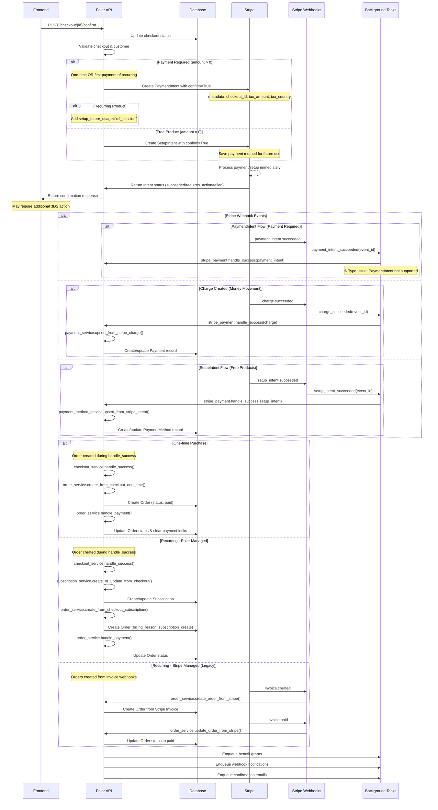
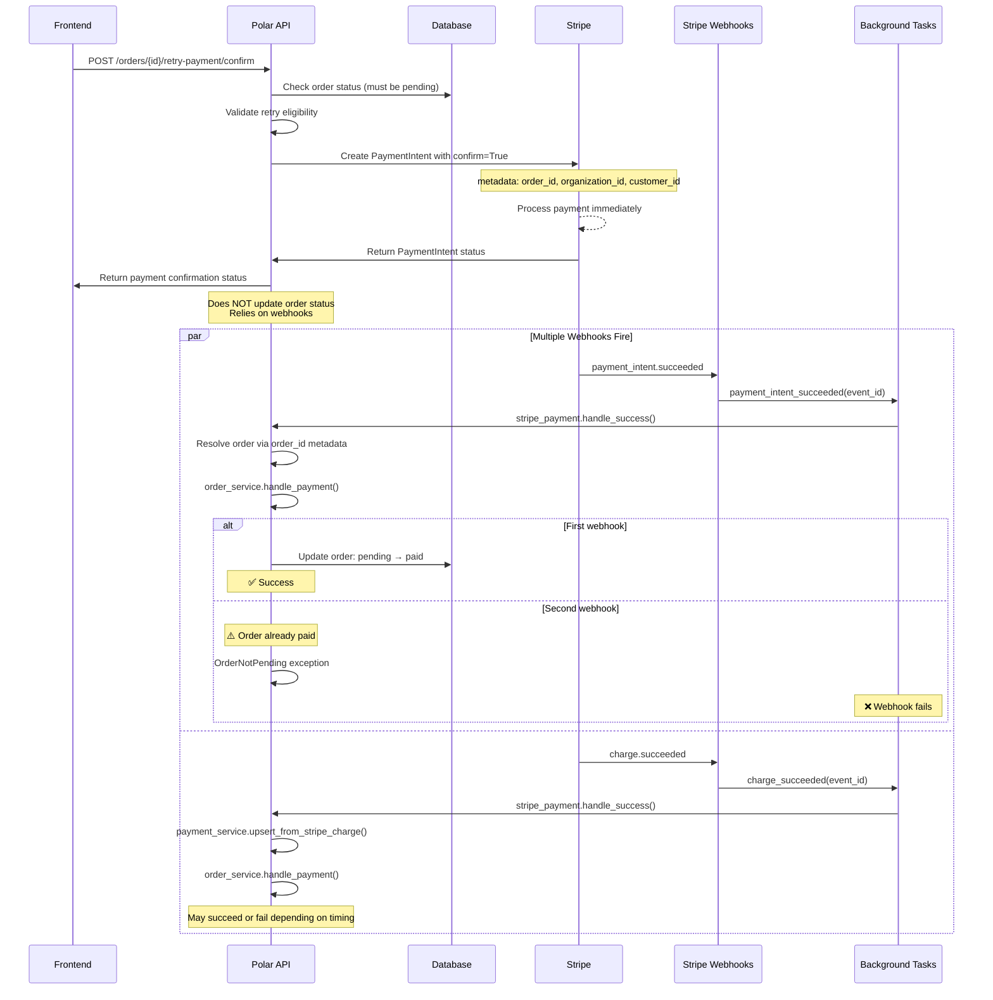
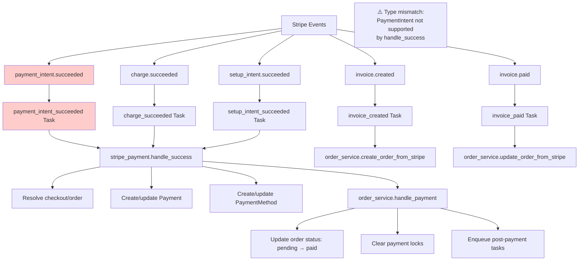

# Checkout to Order Flow and Stripe Webhook Events

## Complete Flow Diagram

## Manual Payment Retry Flow

## Key Differences: Checkout vs Manual Retry

| Aspect | Checkout Flow | Manual Retry Flow |
|--------|---------------|-------------------|
| **Order Creation** | Created during webhook processing | Order already exists |
| **Metadata** | `checkout_id` in Stripe intent | `order_id` in Stripe intent |
| **Webhook Resolution** | Resolves via checkout → order relationship | Resolves directly via order_id |
| **Status Updates** | Order created with final status | Order updated from pending → paid |
| **Duplicate Handling** | Checkout provides natural deduplication | No built-in deduplication |
| **Error Tolerance** | More resilient to race conditions | Prone to OrderNotPending errors |

## Webhook Event Types and Handlers

## Race Condition and Duplicate Webhook Issues

### Problem: Multiple Webhooks for Same Payment

1. **PaymentIntent with confirm=True** triggers multiple webhooks:
   - `payment_intent.succeeded` 
   - `charge.succeeded`

2. **Both webhooks try to process the same order:**
   - First webhook: `order.status = pending` → `paid` ✅
   - Second webhook: `order.status = paid` → `OrderNotPending` ❌

### Current Handling

- **Checkout flow**: Has natural deduplication via checkout status
- **Manual retry flow**: No protection against duplicate processing
- **webhook retry**: Built-in retry mechanism for dependency issues
- **External event service**: Handles webhook deduplication at event level

### Proposed Solutions

1. **Make `order_service.handle_payment()` idempotent**
2. **Add OrderNotPending to webhook exception handling**
3. **Use payment locks more effectively**
4. **Improve webhook event type specific processing**
