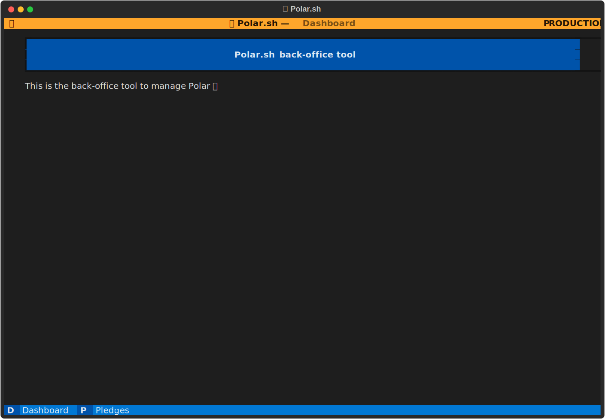

# Polar Backoffice

This is the backoffice tool for Polar team, built using [Textual framework](https://textual.textualize.io/).

> [!NOTE]
> This tool is intended to be used by the Polar team, you shouldn't expect to do much with it.
> However, this is a rather nice example of what you can build with Textual 😉

## Setup

This tool works by opening up an SSH tunnel with our backend hosting, Render. Basically, we make the PostgreSQL and Redis ports available on the local machine so the tool can access production data.

To make this work, you'll need to configure several things.

### 1. Add your SSH public key on Render

This is required so your machine can open an SSH connection to the backend server. You can find instructions here: https://docs.render.com/docs/ssh-keys

### 2. Generate a Render API key

The tool automatically pulls production environment variables from Render API. To make this work, you'll need an API key. You can find instructions here: https://docs.render.com/api

You'll be able to pass this key directly when launching the tool. For convenience, we recommend however to set it as the environment variable `POLAR_BACKOFFICE_RENDER_API_KEY` on your local machine, typically by adding it to your `.zprofile` (or `.bash_profile`):

```sh
export POLAR_BACKOFFICE_RENDER_API_KEY=XXX
```

### 3. Set the server ID

The tool will open an SSH tunnel to the backend server. You'll need to pass our server ID to the CLI or, once again, set it in shell profile:

```sh
export POLAR_BACKOFFICE_RENDER_SERVICE_ID=XXX
```

### 4. Install Python dependencies

Specific dependencies for the backoffice tool lie in the optional `backoffice` group. Make sure to install them:

```sh
poetry install --with backoffice
```

## Launch the tool

You can launch the tool by running the following command, assuming Poetry shell environment is enabled:

```sh
python -m polar_backoffice
```

The tool will automatically connect to the backend server. After a few seconds, you should see the welcome screen.



> [!WARNING]
> Notice the yellow *PRODUCTION* header. You are now interacting with production data, pay attention to what you do!

## Development

When developing the tool, you should run it with the following command:

```sh
python -m polar_backoffice.app
```

This will bypass the SSH connection script and directly launch the application on you local environment.
