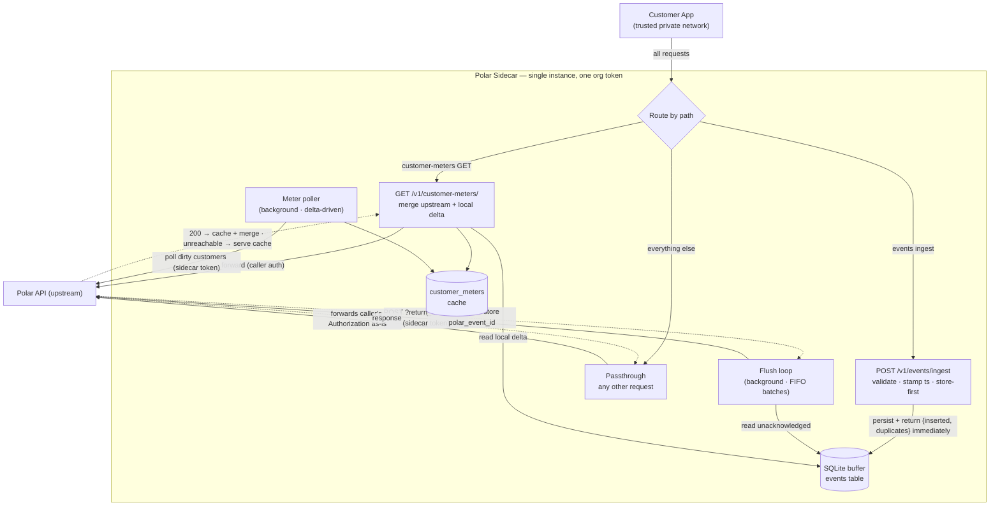
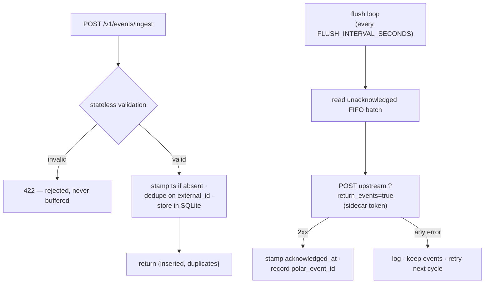
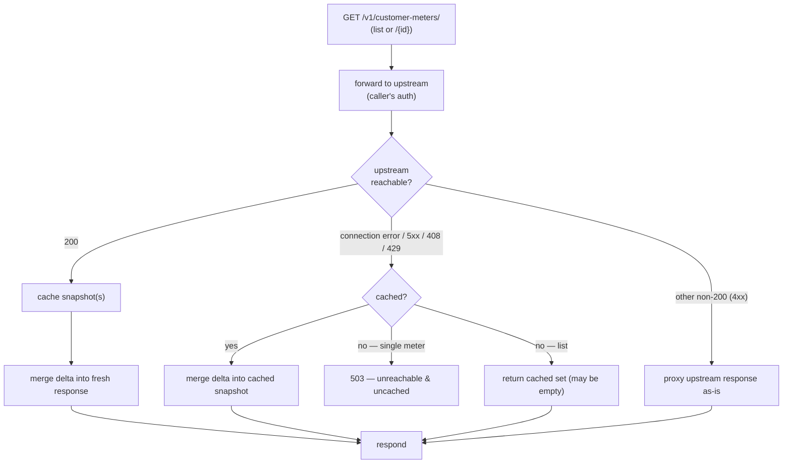
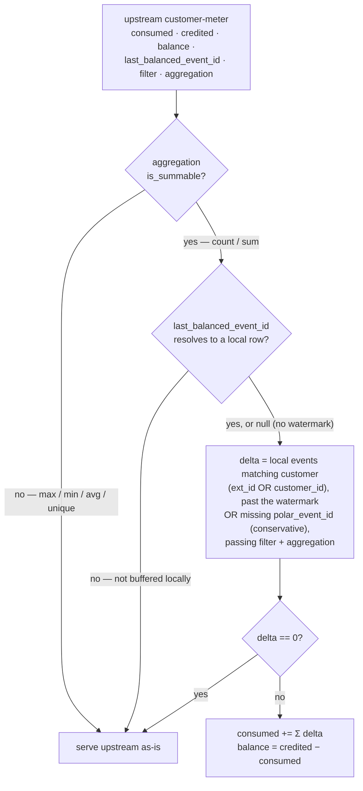
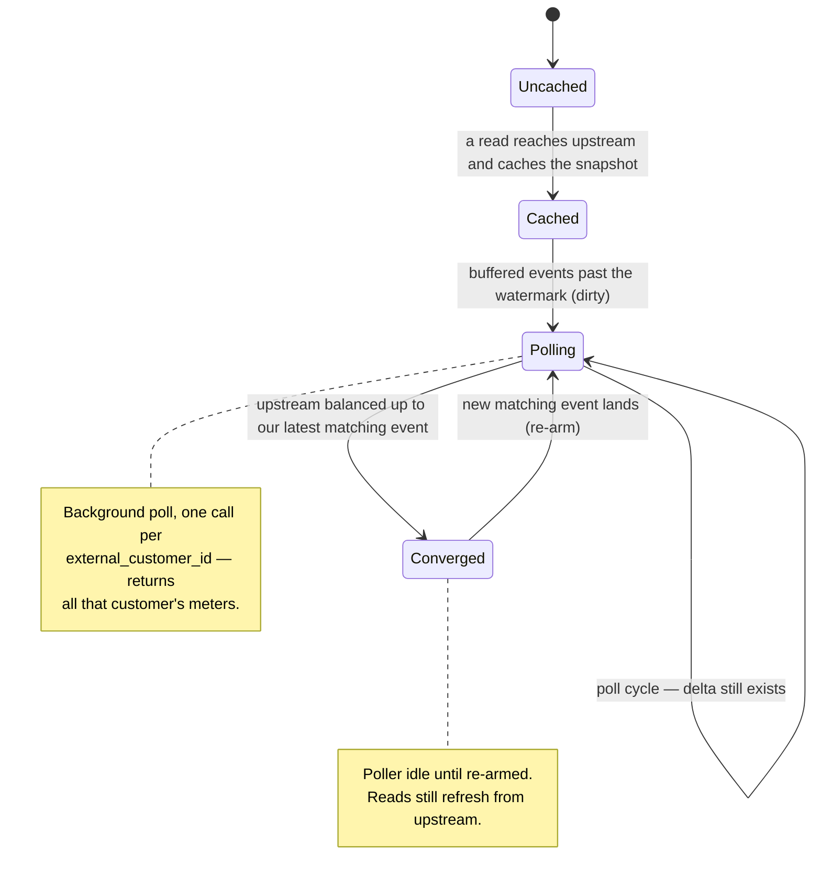

# Polar Sidecar

A small FastAPI app that sits in front of the Polar API.

- `POST /v1/events/ingest` buffers events in a local database and returns
  immediately. A background sync loop forwards unacknowledged events upstream
  and stamps `acknowledged_at` once Polar confirms them, so events survive
  upstream downtime. The event timestamp is stamped at ingest time when the
  caller doesn't supply one, preserving when the event actually happened.
- `GET /v1/customer-meters/` is intercepted: the sidecar merges locally-buffered
  events into the upstream balance and caches each meter for offline reads.
- Every other request falls through to a transparent proxy to the Polar API.

## Architecture

Ingest persists every event locally and returns immediately; a background flush
loop forwards them upstream, so ingestion never blocks on Polar. Customer-meter
reads and a background poller also talk to Polar, falling back to a local cache
when it is unreachable.



### Ingest validation & flush retries

Poison is rejected at the door: ingest mirrors Polar's stateless checks
(`external_id` required, no `organization_id`, `name` ≤ 128, timezone-aware past
`timestamp`) and returns `422` without buffering. Valid events are stamped,
deduped on `external_id`, and stored. The flush loop retries every failure with
backoff, so a Polar outage just lets the buffer grow.



> A distinct unhealthy state that returns `503` backpressure on auth failures is
> not yet implemented — the loop currently retries every failure uniformly,
> including a bad token.

## Local meters

The sidecar intercepts `GET /v1/customer-meters/` (list + get), mirrors the
upstream meters into a local cache, and merges in locally-buffered events that
upstream hasn't counted yet, so the balance reflects just-ingested usage. Only
`count` / `sum` meters are merged; everything else is served upstream as-is.

### Read path

A read forwards to upstream, caches the snapshot, and merges the local delta into
the fresh response. When upstream is unreachable it serves the cached snapshot
with the delta merged in (or `503` for an uncached single meter).



### Merge computation

`consumed_units` upstream aggregates user events (all of which flow through the
sidecar); `credited_units` comes from system events the sidecar never sees — so
only `consumed` needs a local delta. Meter resets are free: the frontier advances
to a post-reset event, so rows past it are automatically post-reset.



### Polling lifecycle

A meter enters the cache the first time a read for it reaches upstream. The
background poller then re-polls only customers whose buffered events haven't been
balanced upstream yet; once upstream catches up, the customer drops out of the
poll set until new events land.



## Configuration

| Variable                 | Default                              | Description                                            |
| ------------------------ | ------------------------------------ | ------------------------------------------------------ |
| `POLAR_SERVER`           | `production`                         | Named Polar server (`production`/`sandbox`).           |
| `POLAR_SERVER_URL`       | _(unset)_                            | Overrides `POLAR_SERVER` with a full URL.              |
| `DATABASE_URL`           | `sqlite+aiosqlite:///./sidecar.db`   | SQLAlchemy async URL for the local buffer.             |
| `POLAR_ACCESS_TOKEN`     | _(unset)_                            | Token the flush + poll loops use upstream. Unset = both idle. |
| `FLUSH_INTERVAL_SECONDS` | `5`                                  | Seconds between flush loop cycles.                     |
| `FLUSH_BATCH_SIZE`       | `100`                                | Max events forwarded per cycle.                        |
| `POLL_INTERVAL_SECONDS`  | `10`                                 | Seconds between customer-meter poll cycles.            |
| `SQLITE_BUSY_TIMEOUT_MS` | `5000`                               | SQLite busy-timeout for the WAL-mode writers.          |

## Running

```bash
uv sync
uv run task api   # http://127.0.0.1:8000
```
